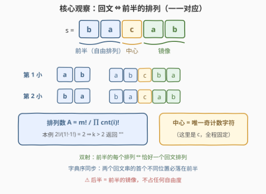
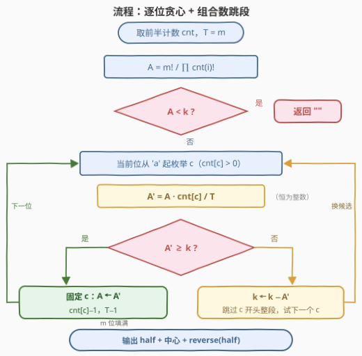

# 最小回文排列 II

- **题目名称**：最小回文排列 II
- **链接**：[3518. 最小回文排列 II](https://leetcode.cn/problems/smallest-palindromic-rearrangement-ii/)
- **难度**：困难
- **标签**：哈希表、数学、字符串、组合数学、计数

## 1. 题目概述

给你一个**回文**字符串 `s` 和一个整数 `k`。把 `s` 的字符任意重排，所有结果中**仍是回文**的那些字符串构成「回文排列」集合——**产生相同回文串的不同重排只计一次**。返回该集合中按**字典序**排列的第 $k$ 小者；若不同回文排列不足 $k$ 个，返回空字符串 `""`。

**示例 1**：

```text
输入：s = "abba", k = 2
输出："baab"
解释："abba" 的两个不同回文排列是 "abba" 和 "baab"，
      字典序上 "abba" < "baab"，第 2 小是 "baab"。
```

**示例 2**：

```text
输入：s = "aa", k = 2
输出：""
解释：只有一个回文排列 "aa"，k = 2 超过总数，返回空串。
```

**示例 3**：

```text
输入：s = "bacab", k = 1
输出："abcba"
解释：两个回文排列 "abcba" < "bacab"，第 1 小是 "abcba"。
```

**约束条件**：

- $1 \le s.length \le 10^4$
- $s$ 由小写英文字母组成，且保证是回文
- $1 \le k \le 10^6$

> 💡 **读题关键**：$n \le 10^4$、$k \le 10^6$，而回文排列数最高可达约 $10^{7000}$ 量级——两个上界都远小于排列总数，暗示正解**不是枚举排列**，而是用组合数把「第 $k$ 小」直接**算**出来。

---

## 2. 解题思路

### 2.1 暴力思路：逐个生成排列

最朴素的做法：取前半（后文会说明为什么只看前半）排序后，反复调用 `next_permutation` 跳 $k-1$ 步。每次调用 $O(m)$，最坏 $k \cdot m \approx 10^6 \times 5000 = 5 \times 10^9$ 次字符操作；而且**排列总数不足 $k$ 时要一路跳到底才能发现该返回空串**。至于「先生成全部回文排列再排序」——排列数本身可达天文数字，连存都存不下。

浪费的根源：一次只前进一个排列，而 $k$ 的信息足以让我们**按开头字符整段跳过**。以字符 $c$ 开头的排列是一段连续区间，段长可以用组合数 $O(1)$ 算出——这正是下面的解法。

### 2.2 核心观察：前半双射 + 组合数逐位定位



**观察一（结构坍缩）**：回文串 = **前半 + 中心 + 前半的镜像**。重排不改变字符的**多重集**，而多重集固定时：

- 每个字符的计数都不变 ⇒ **至多一个**字符计数为奇数（回文的必要条件）；
- 奇数长度时中心字符被**唯一确定**（就是那个奇计数字符），所有回文排列共享同一个中心；
- 后半永远被前半锁定。

于是「$s$ 的回文排列」与「**前半多重集的排列**」一一对应。更进一步：两个回文串的首个不同位置必落在前半（中心相同、后半镜像跟随前半），所以**字典序完全同步**。问题坍缩为：

> 求长度 $m = \lfloor n/2 \rfloor$、计数为 $cnt$ 的前半多重集的**第 $k$ 小排列**。

**观察二（组合数跳段）**：设某一步剩余长度 $T$、剩余计数 $cnt$，当前多重集的排列数为

$$A = \frac{T!}{\prod_i cnt_i!}$$

按字典序逐位构造：在当前位从 `'a'` 到 `'z'` 枚举字符 $c$（要求 $cnt_c > 0$），**以 $c$ 开头的排列数**为

$$A' = \frac{(T-1)!}{(cnt_c-1)! \prod_{i \ne c} cnt_i!} = \frac{T!}{\prod_i cnt_i!} \cdot \frac{cnt_c}{T} = A \cdot \frac{cnt_c}{T}$$

——贯穿全题的**增量公式**：放一个字符后，排列数只乘 $\frac{cnt_c}{T}$，无需重算任何阶乘。

- 若 $A' \ge k$：第 $k$ 小的开头就是 $c$，**固定**它，带着 $A'$、$cnt_c - 1$、$T - 1$ 进入下一位；
- 若 $A' < k$：以 $c$ 开头的整段全部排在目标之前，**跳过**——$k \gets k - A'$，试下一个字符。

由 $\sum_c A'_c = A$ 可知：只要进入该位时 $k \le A$（初始检查 $A_0 \ge k$ 后是恒成立的不变量），内层枚举**必有**一个字符被固定，不会死循环。

**观察三（数值工程）**：$m \le 5000$、26 个字母近乎均分时 $A_0 \approx 26^{5000} \approx 10^{7075}$——远超任何原生整型。两种语言策略：

- **Python**：原生大整数，$A' = A \cdot cnt_c /\!/ T$ 直接精确计算，零额外技巧；
- **C++**：**封顶计数**。算法每个决策只问「$A' \ge k\,?$」且 $k \le 10^6$，取 $CAP = 2 \times 10^6 > k_{max}$，计数函数只需返回「精确值（若 $\le CAP$）」或「超顶」——能精确时给精确值，超顶时报「大」即可，见 2.3 的两个实现细节。

### 2.3 算法流程图



C++ 封顶计数 `countArr` 的两个正确性细节：

1. **按因子分解**：$A' = \prod_i \binom{S_i}{cnt_i}$（$S_i$ 为计数前缀和）。每个因子 $\binom{S}{c}$ 用**短边** $t = \min(c, S-c)$ 逐步乘除，中间值 $r_j = \binom{S-t+j}{j}$ 单调不减、恒整除；又因**任意时刻的部分积不超过最终值**（其余因子都 $\ge 1$），一旦中途超过 $CAP$ 即可立刻宣布「超顶」提前退出；
2. **短边至多 21 步**：$t \le S/2$ 时 $\binom{S}{t} \ge 2^t$，故因子值 $\le CAP = 2\times10^6$ 时必有 $t \le 21$；因子值 $> CAP$ 时 $r_j \ge 2^j$ 会在第 22 步内撞顶退出。每次评估至多 $26 \times 22$ 次整数乘除，中间乘积 $\le CAP \times 5000 < 2^{63}$，`long long` 全程无溢出。

> ⚠️ 不要用 `double` 累计 $\log A'$ 与 $\log k$ 比较来偷懒：几十万次浮点加减的舍入误差，足以在 $A' = k$ 的边界处把「固定」误判成「跳过」。要么全程整数（封顶），要么「对数粗筛 + 边界带内精确重算」。

### 2.4 示例演算

取 $s =$ `"aabbbbaa"`（回文 ✓，前半 `"aabb"`，$A_0 = 4!/(2!\,2!) = 6$，$k = 3$）。前半的全部排列按字典序为 `aabb, abab, abba, baab, baba, bbaa`：

| 位 | 剩余 $T$ | 剩余计数 | 试 $c$ | $A' = A \cdot cnt_c / T$ | 与 $k$ 比较 | 动作 |
|----|------|----------|--------|------------------------|------------|------|
| 0 | 4 | $a{:}2,\ b{:}2$ | a | $6 \times 2/4 = 3$ | $3 \ge 3$ ✓ | 固定 a，$A \gets 3$ |
| 1 | 3 | $a{:}1,\ b{:}2$ | a | $3 \times 1/3 = 1$ | $1 < 3$ ✗ | $k \gets 3-1 = 2$，试 b |
|   |   |    | b | $3 \times 2/3 = 2$ | $2 \ge 2$ ✓ | 固定 b，$A \gets 2$ |
| 2 | 2 | $a{:}1,\ b{:}1$ | a | $2 \times 1/2 = 1$ | $1 < 2$ ✗ | $k \gets 1$，试 b |
|   |   |    | b | $2 \times 1/2 = 1$ | $1 \ge 1$ ✓ | 固定 b，$A \gets 1$ |
| 3 | 1 | $a{:}1$ | a | $1 \times 1/1 = 1$ | $1 \ge 1$ ✓ | 固定 a |

前半构造为 `abba`，答案 = `"abba" + "abba"` = **`"abbaabba"`**——正是排列列表中第 3 小的 `abba` 回文化后的结果。

> 💡 若 $k = 7 > A_0 = 6$，直接返回 `""`，一个字符都不用构造。位 1、位 2 各演示了一次「跳段」：扣掉 $A'$ 后换下一个候选字符。

---

## 3. 参考代码

### C++

```cpp
class Solution {
    static constexpr long long CAP = 2000000;  // > k 上限 1e6 即可

    // 多重集 {cnt[i]} 的排列数，返回值 <= CAP 时精确，否则 > CAP（表示“很大”）
    long long countArr(vector<int>& cnt) {
        long long prod = 1;
        int S = 0;
        for (int i = 0; i < 26 && prod <= CAP; i++) {
            int c = cnt[i];
            if (c == 0) continue;
            S += c;
            int t = min(c, S - c);          // C(S,c) 走短边计算
            long long r = 1;
            for (int j = 1; j <= t; j++) {
                r = r * (S - t + j) / j;    // r 恒等于 C(S-t+j, j)，整除
                if (r > CAP) return CAP;    // 单因子超顶 ⇒ 排列数必超顶
            }
            prod *= r;                      // 部分积 <= 终值，超顶可提前判
        }
        return prod;
    }

  public:
    string smallestPalindrome(string s, int k) {
        int n = s.size(), m = n / 2;
        vector<int> cnt(26, 0);
        for (int i = 0; i < m; i++) cnt[s[i] - 'a']++;

        if (countArr(cnt) < k) return "";   // 排列总数不足 k

        string half;
        int T = m;
        for (int pos = 0; pos < m; pos++) {
            for (int c = 0; c < 26; c++) {
                if (cnt[c] == 0) continue;
                cnt[c]--;                    // 假设当前位放 c
                long long nxt = countArr(cnt);
                cnt[c]++;
                if (nxt >= k) {              // 第 k 小以 c 开头
                    half.push_back('a' + c);
                    cnt[c]--, T--;
                    break;
                }
                k -= (int)nxt;               // 整段跳过 c 开头的排列
            }
        }
        string rev(half.rbegin(), half.rend());
        return n % 2 ? half + s[m] + rev : half + rev;
    }
};
```

### Python

```python
from math import factorial


class Solution:
    def smallestPalindrome(self, s: str, k: int) -> str:
        n = len(s)
        m = n // 2
        cnt = [0] * 26
        for ch in s[:m]:
            cnt[ord(ch) - 97] += 1

        A = factorial(m)
        for c in cnt:
            A //= factorial(c)          # A = m! / prod(cnt_i!)
        if A < k:
            return ""

        half = []
        T = m
        for _ in range(m):
            for c in range(26):
                if cnt[c] == 0:
                    continue
                nxt = A * cnt[c] // T   # 增量公式，恒为整数
                if nxt >= k:
                    half.append(chr(97 + c))
                    A, cnt[c], T = nxt, cnt[c] - 1, T - 1
                    break
                k -= nxt

        h = "".join(half)
        mid = s[m] if n % 2 else ""
        return h + mid + h[::-1]
```

> 💡 两份代码共享同一贪心骨架，差别只在计数：C++ 每次从零重算封顶值（$O(26\times22)$，与数值大小完全解耦）；Python 用增量公式维护**精确大整数** $A$。`A * cnt[c] // T` 的整除性由 $A' = A \cdot cnt_c / T$ 本身是组合数保证。

---

## 4. 复杂度分析

| 维度 | 复杂度 | 说明 |
|------|--------|------|
| 时间复杂度 | $O(26\,m)$ 次计数评估 | 每位至多枚举 26 个字符。C++ 每次评估 $O(26 \times 22)$ 次小整数乘除，总计 $\approx 7.5 \times 10^7$；Python 单次大整数乘除 $O(m)$ 位，但「评估失败（$A' < k$）只可能发生在 $A < k \cdot m$ 时」（因 $A' \ge A/T \ge A/m$），此时 $A$ 至多十位——大数评估每位至多一次，总代价仍然轻松 |
| 空间复杂度 | $O(m)$ | 前半结果数组 + 26 个计数；不计输出则 $O(26)$ |

---

## 5. 扩展：名次与排列的双向换算

本题是「**名次 → 排列**」（解码方向）。反过来的「**排列 → 名次**」是多重集版康托尔展开：逐位累加「开头比当前位小的排列数」，即本题的 $A'$ 求和——[1830. 使字符串有序的最少操作次数](https://leetcode.cn/problems/minimum-number-of-operations-to-make-string-sorted/)（[题解](../1801-1900/1830_使字符串有序的最少操作次数.md)）在模 $10^9+7$ 下考的正是这个方向。

两个方向叠加出两个变体：

- **$k$ 上界放大**：封顶值只需严格大于 $k$ 上界。若 $k \le 10^{18}$，把 $CAP$ 提到 $2 \times 10^{18}$ 仍成立，但 `prod *= r` 的中间乘积要防溢出（先做除法预判或改用 `__int128`）；
- **去掉 $k$（姊妹题 3517）**：求最小回文重排不需要计数——前半**直接排序**即字典序最小，$O(n \log n)$。本题框架在 $k = 1$ 时自然退化为它。

---

## 6. 面试要点

1. **为什么回文排列只由前半决定？**

   > 回文 = 前半 + 中心 + 前半镜像；重排不改变多重集，多重集固定 ⇒ 至多一个奇计数字符，奇长度时中心被唯一确定、所有回文排列共享；后半被前半锁定。故「回文排列 ↔ 前半多重集排列」双射，且两回文串的首个差异必落在前半，**字典序同步**。

2. **增量公式 $A' = A \cdot cnt_c / T$ 怎么来的？为什么恒为整数？**

   > $A' = \frac{(T-1)!}{(cnt_c-1)!\prod_{i \ne c} cnt_i!}$ 与 $A = \frac{T!}{\prod_i cnt_i!}$ 相除即得。$A'$ 本身是组合数（多重集排列数），自然是整数；Python 中 `A * cnt[c] // T` 因此可以放心整除。

3. **贪心为什么不会卡死在某一位？**

   > 不变量：进入每一位时 $k \le A$。以各字符开头的排列数之和 $\sum_c A'_c = A \ge k$，逐个扣减 $A'$ 后 $k$ 仍 $\ge 1$，故轮到某个候选时必有 $A' \ge k$——最后一个候选尤甚：$k \le A - \sum_{\text{其余}} A' = A'_{\text{last}}$。

4. **排列数高达 $10^{7075}$，怎么和 $k \le 10^6$ 比较？**

   > Python 原生大整数直接算。C++ 封顶计数：取 $CAP = 2\times10^6 > k_{max}$，计数函数「$\le CAP$ 给精确值、$> CAP$ 报大」——任何返回值 $< k$ 时必为精确值，减法与比较都无误差；配合 $\prod \binom{S_i}{cnt_i}$ 的短边分解（每因子 $\le 22$ 步、部分积 $\le$ 终值可提前退出），全程 `long long` 无溢出。

5. **和 60 题（第 k 个排列）的核心区别？**

   > 元素**可重**：计数从 $n!$ 变成 $\frac{m!}{\prod cnt_i!}$（60 题是其 $cnt_i \equiv 1$ 的特例）；阶乘进制逐位定候选换成「按首字符分段 + 增量公式」；另外本题要先判 $A_0 < k$ 返回空串，而 60 题保证 $k \le n!$ 无此分支。

> 💡 **一句话总结**：3518 = 前半多重集的第 $k$ 小排列——增量公式 $A' = A \cdot cnt_c / T$ 逐位「固定或跳段」，$A_0 < k$ 判空；Python 大整数直算，C++ 用 $\prod\binom{S_i}{cnt_i}$ 封顶计数驯服 $10^{7000}$。

---

## 7. 同类练习题

- [3517. 最小回文排列 I](https://leetcode.cn/problems/smallest-palindromic-rearrangement-i/)：本题去掉 $k$ 的版本——前半排序即最小回文重排，体会「$k=1$ 特例」的退化
- [60. 第 k 个排列](https://leetcode.cn/problems/permutation-sequence/)（[题解](../0001-0100/60_第k个排列.md)）：元素互异的第 $k$ 小排列（阶乘进制/康托尔展开），本题是其「字符可重」推广
- [1643. 第 K 条最小指令](https://leetcode.cn/problems/kth-smallest-instructions/)（[题解](../1601-1700/1643_第K条最小指令.md)）：H/V 两种字符的多重集第 $k$ 小——逐位贪心 + $\binom{h+v}{v}$ 计数，与本题同一把钥匙
- [1830. 使字符串有序的最少操作次数](https://leetcode.cn/problems/minimum-number-of-operations-to-make-string-sorted/)（[题解](../1801-1900/1830_使字符串有序的最少操作次数.md)）：逆向「排列 → 名次」，多重集康托尔展开 + 模逆元，与本题互为正反两面
- [3272. 统计好整数的数目](https://leetcode.cn/problems/find-the-count-of-good-integers/)（[题解](../3201-3300/3272_统计好整数的数目.md)）：回文 + $\frac{m!}{\prod cnt_i!}$ 排列计数的直接应用（枚举回文一半去重后数排列）
