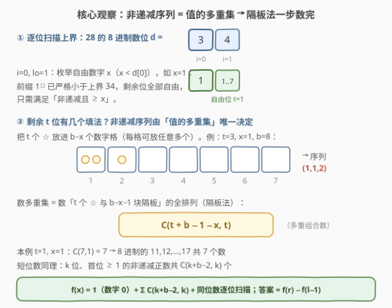
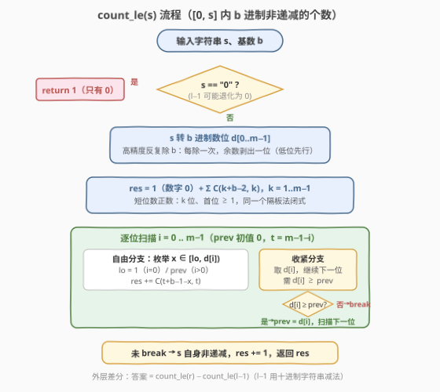

# 统计逐位非递减的整数

- **题目名称**：统计逐位非递减的整数
- **链接**：[3519. 统计逐位非递减的整数](https://leetcode.cn/problems/count-numbers-with-non-decreasing-digits/)
- **难度**：困难
- **标签**：数学、字符串、动态规划

## 1. 题目概述

给你两个以字符串表示的整数 `l` 和 `r`，以及一个整数 `b`。返回闭区间 $[l, r]$ 内，以 **$b$ 进制**表示时其每一位数字呈**非递减**顺序的整数个数。

整数**逐位非递减**：从最高有效位到最低有效位依次读取时，每一位数字都大于或等于前一位数字。由于答案可能非常大，请返回对 $10^9 + 7$ **取余**后的结果。

**示例 1**：

```text
输入：l = "23", r = "28", b = 8
输出：3
解释：23 到 28 的数字在 8 进制下为：27、30、31、32、33、34。
      其中 27、33、34 的数字非递减，因此输出 3。
```

**示例 2**：

```text
输入：l = "2", r = "7", b = 2
输出：2
解释：2 到 7 的数字在 2 进制下为：10、11、100、101、110、111。
      其中 11 和 111 的数字非递减，因此输出 2。
```

**约束条件**：

- $1 \le \text{l.length} \le \text{r.length} \le 100$
- $2 \le b \le 10$
- `l` 和 `r` 仅由数字 `0-9` 组成，不含前导零，且数值上 $l \le r$

> 💡 **读题关键**：数值可达 $10^{100}$，远超整型范围——必须**全程字符串操作**；而且要看的不是十进制数位，而是 **$b$ 进制**下的数位，所以第一步还得做一次**高精度进制转换**。数位层面的约束天然适合**数位 DP**；与 [2801. 统计范围内的步进数字数目](https://leetcode.cn/problems/count-stepping-numbers-in-range/)（相邻差恰为 1）同框架，但「非递减」的单调性会让计数进一步坍缩成**组合闭式**。

---

## 2. 解题思路

### 2.1 暴力思路

最直白地，从 $l$ 枚举到 $r$，逐个数转 $b$ 进制再检查数位是否非递减。但数值高达 $10^{100}$，连「用整型表示」都做不到，枚举 $10^{100}$ 个数更是天方夜谭。

突破口仍是计数类问题的标准两问：① 如何**快速统计** $\le$ 某上界的合法数总数（而非逐个检查）；② 如何把**区间计数**化成**前缀计数之差**。

### 2.2 核心观察：差分 + 数位扫描 + 隔板法闭式



**第一步：差分**。定义 $f(x)$ 为 $[0, x]$ 内「$b$ 进制数位非递减」的整数个数（含 $0$），则

$$\text{answer} = f(r) - f(l - 1)$$

$l - 1$ 用**十进制字符串减法**实现（借位 + 去前导零），$l = $ `"1"` 时退化为 `"0"`。

**第二步：进制转换**。$x$ 是最多 100 位的十进制字符串，先要变成 $b$ 进制数位——**高精度除低精度**：整个十进制数位串反复除以 $b$，每除一次的**余数**就剥出一位（从低位到高位）。$10^{100}$ 在 $2$ 进制下也只有约 $333$ 位，总代价约 $O(L \cdot m)$（$L \le 100$ 为十进制位数，$m \le 333$ 为 $b$ 进制位数）。

**第三步：数位扫描 + 闭式计数**。设 $x$ 的 $b$ 进制表示有 $m$ 位 $d[0..m-1]$（$d[0] \ge 1$），则

$$f(x) = \underbrace{1}_{\text{数字 } 0} \;+\; \underbrace{\sum_{k=1}^{m-1} \binom{k + b - 2}{k}}_{\text{位数} < m \text{ 的正数}} \;+\; \underbrace{C_m(x)}_{\text{位数} = m \text{ 且} \le x}$$

- **短位数部分**：$k$ 位、首位 $\ge 1$、非递减 $\iff$ 从 $\{1, \dots, b-1\}$ 中**可重复地**选 $k$ 个数（多重集），由隔板法得 $\binom{k + b - 2}{k}$。
- **同位数部分** $C_m(x)$：从高到低扫描，维护已收紧前缀的末位 $\text{prev}$（初始 $0$；位置 $i$ 的填数下界 $\text{lo} = 1$ 若 $i = 0$，否则 $\text{lo} = \text{prev}$）：
  - **自由分支**：枚举 $x' \in [\text{lo},\ d[i] - 1]$。放上 $x'$ 后前缀已**严格小于**上界，剩余 $t = m - 1 - i$ 位只需「非递减且 $\ge x'$」，由隔板法一步数完：$\binom{t + b - 1 - x'}{t}$；
  - **收紧分支**：若 $d[i] \ge \text{prev}$ 则取 $d[i]$ 继续下一位；若 $d[i] < \text{prev}$，说明上界自身前缀已经递减，`break`（与上界同前缀的路已非法，更小的分支刚在自由分支里数完了，不会遗漏）；
  - 扫描全程未 `break` $\Rightarrow$ $x$ 自身非递减，$+1$。

**隔板法（多重组合数）**：长为 $t$、取值在 $[x',\, b-1]$ 内的非递减序列，与它取值的**多重集**一一对应（多重集排序方式唯一）；从 $b - x'$ 种数字里可重复地取 $t$ 个，方案数为

$$\binom{t + (b - x') - 1}{t} = \binom{t + b - 1 - x'}{t}$$

> 💡 **与 2801 的关键差异**：步进数字的约束是**链式**的（相邻差恰为 1），剩余位的合法填法必须靠 DP 表 $\text{dp}[L][d]$ 递推；本题的约束是**单调性**，「剩余 $t$ 位、每一位 $\ge x'$」的合法填法数只依赖 $(t, x')$ 二元组，整张 DP 表坍缩成一行组合数——**约束的形状决定计数的形态**。

### 2.3 算法流程图



流程要点：

1. **特判 $s = $ `"0"`**：$f(0) = 1$（只有数字 $0$ 自己），对应 $l - 1$ 退化的情形；
2. **进制转换**用反复除 $b$，$O(L \cdot m)$；
3. **组合数预处理**到约 $350$：$m \le 333$、$b \le 10$，组合数上参数 $\le t + b - 1 - x' \le 341$，阶乘 + 逆元即可；
4. 扫描循环里自由分支是每位 $O(b)$ 枚举 + $O(1)$ 查组合数，共 $O(m \cdot b)$。

### 2.4 示例演算

以示例 1（$l =$ `"23"`，$r =$ `"28"`，$b = 8$）走全流程。先算 $l - 1 = $ `"22"`。

**$f(28)$**：$28 = $ `[3, 4]`（8 进制，$m = 2$）：

| 步骤 | 贡献 | 说明 |
|------|------|------|
| 数字 0 | $+1$ | `0` 平凡非递减 |
| 短位数 $k=1$ | $+\binom{7}{1} = 7$ | 8 进制的 `1`..`7` |
| $i=0$，lo=1，$x' \in \{1,2\}$ | $+\binom{7}{1} + \binom{6}{1} = 7 + 6$ | `11`..`17`、`22`..`27` |
| 收紧 $d[0]=3$，$i=1$，lo=3，$x' \in \{3\}$ | $+\binom{4}{0} = 1$ | `33` |
| 收紧 $d[1]=4$，全程未 break | $+1$ | `34` 自身 |

$f(28) = 1 + 7 + 7 + 6 + 1 + 1 = 23$。

**$f(22)$**：$22 = $ `[2, 6]`（8 进制）：

| 步骤 | 贡献 | 说明 |
|------|------|------|
| 数字 0 + 短位数 | $1 + 7$ | 同上 |
| $i=0$，lo=1，$x' \in \{1\}$ | $+7$ | `11`..`17` |
| 收紧 $d[0]=2$，$i=1$，lo=2，$x' \in \{2,3,4,5\}$ | $+4 \times \binom{4}{0} = 4$ | `22`..`25` |
| 收紧 $d[1]=6$，全程未 break | $+1$ | `26` 自身 |

$f(22) = 1 + 7 + 7 + 4 + 1 = 20$。

**答案** $= 23 - 20 = 3$ ✓（对应 8 进制的 `27`、`33`、`34`，即十进制 $23, 27, 28$）。

---

## 3. 参考代码

### C++

```cpp
class Solution {
  public:
    int countNumbers(string l, string r, int b) {
        const long long MOD = 1000000007;
        const int N = 410;  // m <= 333，组合数上参 <= 341，留足余量
        // 预处理阶乘与逆元
        vector<long long> fact(N), invFact(N);
        fact[0] = 1;
        for (int i = 1; i < N; i++) fact[i] = fact[i - 1] * i % MOD;
        auto power = [&](long long a, long long e) {
            long long res = 1;
            while (e) {
                if (e & 1) res = res * a % MOD;
                a = a * a % MOD;
                e >>= 1;
            }
            return res;
        };
        invFact[N - 1] = power(fact[N - 1], MOD - 2);
        for (int i = N - 1; i > 0; i--) invFact[i - 1] = invFact[i] * i % MOD;
        auto comb = [&](int n, int k) -> long long {
            if (k < 0 || k > n) return 0;
            return fact[n] * invFact[k] % MOD * invFact[n - k] % MOD;
        };

        // 十进制字符串 -> b 进制数位（高位在前），高精度除低精度
        auto toBase = [&](const string& s) -> vector<int> {
            vector<int> cur(s.size());
            for (int i = 0; i < (int)s.size(); i++) cur[i] = s[i] - '0';
            vector<int> out;
            while (!cur.empty()) {
                int rem = 0;
                for (int i = 0; i < (int)cur.size(); i++) {
                    int v = rem * 10 + cur[i];
                    cur[i] = v / b;
                    rem = v % b;
                }
                out.push_back(rem);          // 剥出一位（低位先行）
                int st = 0;
                while (st < (int)cur.size() && cur[st] == 0) st++;
                if (st == (int)cur.size()) cur.clear();
                else cur.erase(cur.begin(), cur.begin() + st);  // 去前导零
            }
            if (out.empty()) out.push_back(0);
            reverse(out.begin(), out.end());
            return out;
        };

        // f(s) = [0, s] 内 b 进制数位非递减的整数个数
        auto countLE = [&](const string& s) -> long long {
            vector<int> d = toBase(s);
            if (d.size() == 1 && d[0] == 0) return 1;
            int m = d.size();
            long long res = 1;  // 数字 0
            for (int k = 1; k < m; k++)  // 短位数正数
                res = (res + comb(k + b - 2, k)) % MOD;
            int prev = 0;
            bool ok = true;
            for (int i = 0; i < m; i++) {  // 位数 = m 且 <= s
                int lo = (i == 0) ? 1 : prev;
                int t = m - 1 - i;
                for (int x = lo; x < d[i]; x++)  // 自由分支
                    res = (res + comb(t + b - 1 - x, t)) % MOD;
                if (d[i] < prev) {  // 上界前缀已递减
                    ok = false;
                    break;
                }
                prev = d[i];  // 收紧分支
            }
            if (ok) res = (res + 1) % MOD;  // s 自身非递减
            return res;
        };

        // 十进制字符串减 1（借位 + 去前导零）
        auto dec1 = [](string s) -> string {
            int i = s.size() - 1;
            while (i >= 0 && s[i] == '0') {
                s[i] = '9';
                i--;
            }
            if (i < 0) return "0";
            s[i]--;
            int st = 0;
            while (st < (int)s.size() && s[st] == '0') st++;
            return st == (int)s.size() ? "0" : s.substr(st);
        };

        return (int)((countLE(r) - countLE(dec1(l)) + MOD) % MOD);
    }
};
```

### Python

```python
class Solution:
    def countNumbers(self, l: str, r: str, b: int) -> int:
        MOD = 10 ** 9 + 7
        N = 410  # m <= 333，组合数上参 <= 341，留足余量
        fact = [1] * N
        for i in range(1, N):
            fact[i] = fact[i - 1] * i % MOD
        inv_fact = [1] * N
        inv_fact[-1] = pow(fact[-1], MOD - 2, MOD)
        for i in range(N - 1, 0, -1):
            inv_fact[i - 1] = inv_fact[i] * i % MOD

        def comb(n: int, k: int) -> int:
            if k < 0 or k > n:
                return 0
            return fact[n] * inv_fact[k] % MOD * inv_fact[n - k] % MOD

        def to_base(s: str) -> list:  # 十进制串 -> b 进制数位（高位在前）
            cur = [ord(c) - 48 for c in s]
            out = []
            while cur:
                rem = 0
                for i, d in enumerate(cur):
                    cur[i], rem = divmod(rem * 10 + d, b)
                out.append(rem)          # 剥出一位（低位先行）
                j = 0
                while j < len(cur) and cur[j] == 0:
                    j += 1
                cur = cur[j:]            # 去前导零；全零则变空，循环结束
            return out[::-1] if out else [0]

        def count_le(s: str) -> int:    # f(s) = [0, s] 内合法个数
            d = to_base(s)
            if d == [0]:
                return 1
            m = len(d)
            res = 1                      # 数字 0
            for k in range(1, m):        # 短位数正数
                res += comb(k + b - 2, k)
            prev = 0
            for i in range(m):           # 位数 = m 且 <= s
                lo = 1 if i == 0 else prev
                t = m - 1 - i
                for x in range(lo, d[i]):        # 自由分支
                    res += comb(t + b - 1 - x, t)
                if d[i] < prev:                  # 上界前缀已递减
                    break
                prev = d[i]                      # 收紧分支
            else:
                res += 1                # s 自身非递减
            return res % MOD

        def dec1(s: str) -> str:        # 十进制字符串减 1
            ds = list(s)
            i = len(ds) - 1
            while ds[i] == '0':
                ds[i] = '9'
                i -= 1
            ds[i] = str(int(ds[i]) - 1)
            res = ''.join(ds).lstrip('0')
            return res if res else '0'

        return (count_le(r) - count_le(dec1(l))) % MOD
```

> 💡 三处工程细节：① `toBase` 每轮除法后必须去掉商的**前导零**（全零则清空），否则 `while` 永不终止；② `dec1` 借位后去前导零（`"100"`→`"99"`），`"1"`→`"0"` 时由 `count_le` 开头特判接住；③ C++ 里 `(hi - lo + MOD) % MOD` 防止差为负，Python 的 `%` 对负数天然非负但写法保持一致。

---

## 4. 复杂度分析

| 维度 | 复杂度 | 说明 |
|------|--------|------|
| 时间复杂度 | $O(L \cdot m + m \cdot b)$ | 进制转换反复除法 $O(L \cdot m)$（$L \le 100$ 十进制位，$m \le 333$ 为 $b$ 进制位）；数位扫描每位 $O(b)$ 枚举自由数字；组合数预处理 $O(N)$，$N \approx 350$。总计约 $10^4$ 量级 |
| 空间复杂度 | $O(L + m + N)$ | 十进制数位、$b$ 进制数位与阶乘表 |

> ⚠️ 本题的瓶颈同样不在循环层数而在**数值表示**：$10^{100}$ 无法用整型承接，$l-1$ 与进制转换全程字符串/数组操作；好在 $b \le 10$、$m \le 333$，组合数只需预处理到 $350$ 左右，两个 `count_le` 调用加起来瞬息完成。

---

## 5. 扩展：约束的「形状」决定计数的形态

同样是「字符串大数区间计数」，约束不同，计数工具随之升级：

- **单调约束（本题：非递减）**：剩余位合法填法只依赖 $(\text{剩余长度}, \text{数值下界})$ → **闭式** $\binom{t + b - 1 - x}{t}$；若改成**严格递增**，则是从 $[x, b-1]$ 中不重复地选 $t$ 个 → $\binom{b - x}{t}$，闭式依然成立。
- **链式约束（[2801](https://leetcode.cn/problems/count-stepping-numbers-in-range/)：相邻差恰为 1）**：第 $i$ 位的合法集依赖第 $i-1$ 位的具体取值 → 必须 DP 表 $\text{dp}[L][d]$。
- **累计量约束（[2719. 统计整数数目](https://leetcode.cn/problems/count-of-integers/)：数位和介于区间）**：状态需加一维「数位和」。
- **前缀禁串（[1397. 找到所有好字符串](https://leetcode.cn/problems/find-all-good-strings/)）**：状态需并入 **KMP 自动机**的匹配进度。

另一个可挖掘的维度是**进制转换的效率**：反复除 $b$ 的 $O(L \cdot m)$ 对本题绰绰有余；若规模更大，可一次除 $b^k$ 剥出 $k$ 位（分治除法）进一步加速。此外贪心视角的近亲是 [738. 单调递增的数字](https://leetcode.cn/problems/monotone-increasing-digits/)——求 $\le n$ 的最大单调递增数，不需要计数只要贪心降位。

---

## 6. 面试要点

1. **为什么用差分而不是直接统计区间？**

   > 同时维护 $l$ 与 $r$ 两个上界会让「合法前缀」的状态组合爆炸。差分把问题归约为「统计 $\le$ 某上界的合法数」这一单上界问题，再用 $f(r) - f(l-1)$ 还原，是计数型数位 DP 的标准起手式。$l - 1$ 用十进制字符串减法实现，$l = $ `"1"` 时退化为 `"0"`，由 $f(0) = 1$ 特判接住。

2. **100 位十进制怎么转成 $b$ 进制？**

   > 高精度除低精度：把十进制数位当数组，整体反复除以 $b$，每轮的**余数**就是从低位剥出的一位，商去掉前导零后继续除，直到商为空；最后把剥出的位**逆序**。每轮除法 $O(L)$、共 $m$ 轮，$10^{100}$ 在 $2$ 进制下也只有 $333$ 位，总代价约 $3 \times 10^4$。**坑**：不去前导零会死循环。

3. **隔板法公式 $\binom{t + b - 1 - x}{t}$ 是怎么来的？**

   > 长 $t$、取值 $[x, b-1]$ 的**非递减**序列与它的值**多重集**一一对应——多重集从小到大排序即唯一还原序列。从 $b - x$ 种数字里可重复地取 $t$ 个，等价于 $t$ 个星与 $b - x - 1$ 块隔板的排列，共 $\binom{t + b - x - 1}{t}$ 种。短位数部分是同一公式取 $x = 1$ 的特例（$\binom{k + b - 2}{k}$）。

4. **本题为什么不需要 2801 那样的 DP 表？**

   > 「非递减」是**单调约束**：一旦固定当前位置填 $x'$，剩余位的合法条件只是「$\ge x'$ 且非递减」，计数只依赖 $(t, x')$ 两个数，直接闭式可算；而「相邻差恰为 1」是**链式约束**，剩余位合法填法与前面每一位的具体取值耦合，只能递推建表。识别约束形状可以直接决定实现路径。

5. **前导零、数字 0 与 `break` 条件分别怎么处理？**

   > 前导零：同位数部分首位下界取 $1$（首位为 $0$ 的串代表更短的数，已在短位数部分按真实位数数过，不重不漏）；数字 $0$ 在 $f(x)$ 里单独 $+1$，两次调用相减时自动消去。`break` 条件 $d[i] < \text{prev}$：与上界同前缀的路已非法，而严格更小的分支恰好在自由分支里数完，`break` 不漏不重——同时它还保证走到「全程未 break」时 $x$ 自身必然非递减，$+1$ 有据。

> 💡 **一句话总结**：3519 = 差分 + 高精度进制转换 + 数位扫描；「非递减 ⟺ 多重集」让剩余位的计数坍缩成一行隔板法闭式 $\binom{t+b-1-x}{t}$，连 DP 表都不用建。

---

## 7. 同类练习题

- [2801. 统计范围内的步进数字数目](https://leetcode.cn/problems/count-stepping-numbers-in-range/)（[题解](../2801-2900/2801_统计范围内的步进数字数目.md)）：同款差分 + 数位扫描框架，但「相邻差恰为 1」是链式约束，自由分支要查 DP 表——与本题的闭式计数对照着看最有效
- [2719. 统计整数数目](https://leetcode.cn/problems/count-of-integers/)（[题解](../2701-2800/2719_统计整数数目.md)）：同样是 100 位字符串区间的数位 DP，约束挂在「数位和」上，状态需加一维
- [902. 最大为 N 的数字组合](https://leetcode.cn/problems/numbers-at-most-n-given-digit-set/)（[题解](../0901-1000/902_最大为N的数字组合.md)）：数位受限集合的计数，自由/收紧分支的入门版
- [600. 不含连续 1 的非负整数](https://leetcode.cn/problems/non-negative-integers-without-consecutive-ones/)（[题解](../0201-0300/600_不含连续1的非负整数.md)）：相邻位约束的经典数位 DP，状态含「上一位」
- [233. 数字 1 的个数](https://leetcode.cn/problems/number-of-digit-one/)（[题解](../0201-0300/233_数字1的个数.md)）：数位统计母题，逐位分类讨论的祖师爷
