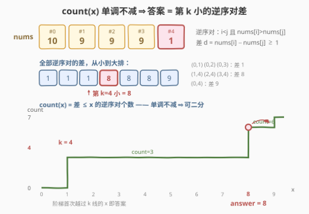
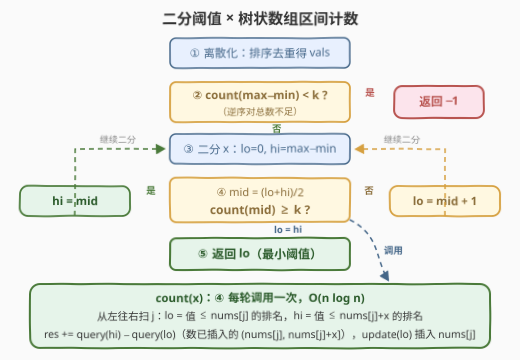

# 逆序对计数的最小阈值

- **题目名称**：逆序对计数的最小阈值
- **链接**：[3520. 逆序对计数的最小阈值](https://leetcode.cn/problems/minimum-threshold-for-inversion-pairs-count/)
- **难度**：中等
- **标签**：树状数组、二分查找、线段树、归并排序、分治、数组

> ⚠️ 本题为 LeetCode **付费题**（`isPaidOnly`）。下方题意描述、示例与约束依据官方样例与题目规则整理还原，如有出入请以官方为准；算法与示例输出已用自洽代码验证。

## 1. 题目概述

给定一个整数数组 `nums` 和一个整数 `k`。

**阈值**为 `x` 的逆序对是一对下标 `(i, j)`，满足：

- `i < j`；
- `nums[i] > nums[j]`；
- 两数之差**最多为** `x`（即 `nums[i] - nums[j] <= x`）。

你的任务是确定最小的整数 `min_threshold`，使得**至少**有 `k` 个逆序对的阈值是 `min_threshold`。如果不存在这样的整数，返回 `-1`。

**示例 1**：

```text
输入：nums = [1,2,3,4,3,2,1], k = 7
输出：2
解释：对于阈值 x = 2，满足条件的逆序对有 8 个（≥ 7）：
      (3,4),(2,5),(3,5),(4,5),(1,6),(2,6),(4,6),(5,6)；
      而任何小于 2 的阈值，逆序对都不足 7 个。
```

**示例 2**：

```text
输入：nums = [10,9,9,9,1], k = 4
输出：8
解释：对于阈值 x = 8，满足条件的逆序对有 6 个（≥ 4）：
      (0,1),(0,2),(0,3),(1,4),(2,4),(3,4)；
      而任何小于 8 的阈值，逆序对都不足 4 个。
```

**约束条件**：

- `1 <= nums.length <= 10^4`
- `1 <= nums[i] <= 10^9`
- `1 <= k <= 10^9`

> 💡 **读题关键**：「阈值为 x」是对逆序对差的**过滤条件**——差不超过 `x` 的才算数。`x` 越大入围的逆序对越多，这股单调性就是全题的突破口；同时注意 `k` 上限 `10^9` 远大于 `n = 10^4` 时的逆序对总数上限 $\binom{10^4}{2} \approx 5 \times 10^7$，`-1` 是常态分支而非边界情况。

---

## 2. 解题思路

### 2.1 暴力思路：枚举所有下标对

最直接的做法是两重循环枚举全部 $O(n^2)$ 个下标对，把每个逆序对的差收进数组，排序后取**第 `k` 小**（不足 `k` 个则 `-1`）。

$n = 10^4$ 时下标对最多约 $5 \times 10^7$ 个：仅存储这些差值就需要数百 MB，时间上也必然超限。换一种暴力——从小到大枚举 `x`、每个 `x` 用 $O(n^2)$ 重新计数——同样是平方量级的灾难。两条路都堵死在「**不能显式枚举对**」上，必须找到一个不展开所有对也能计数的手段。

### 2.2 核心观察：答案 = 第 k 小的逆序对差，count(x) 单调可二分



定义 $\text{count}(x)$ = 差不超过 $x$ 的逆序对个数。三条观察拼出解法：

1. **单调性**：`x` 增大只会放宽「差 $\le x$」的过滤条件，绝不会赶走已入围的对，所以 $\text{count}(x)$ 关于 `x` **单调不减**——这是**二分答案**的完整合法性。
2. **答案即第 k 小的差**：把所有逆序对的差排成有序序列 $d_1 \le d_2 \le \cdots$，则 $\text{count}(x) \ge k \iff d_k \le x$。于是「最小的可行 `x`」恰好就是**第 `k` 小的逆序对差** $d_k$；逆序对总数（即 $\text{count}(\max - \min)$，因为任何逆序对的差都不会超过全局极差）小于 `k` 时返回 `-1`。
3. **不枚举对的计数**：从左往右扫到下标 `j` 时，「以 `j` 结尾、阈值 $\le x$ 的逆序对」就是**之前已出现**的、值落在开区间 $(\text{nums}[j],\ \text{nums}[j] + x]$ 内的元素个数——一个「单点插入 + 区间计数」问题，用**值域离散化 + 树状数组**单次 $O(\log n)$ 完成，整轮计数 $O(n \log n)$。

> ⚠️ **方向别搞反**：逆序对要求 $i < j$ 且 $\text{nums}[i] > \text{nums}[j]$，所以处理 `j` 时查询的是**左边已插入**的、比 $\text{nums}[j]$ **大**（但大得不超过 `x`）的数，区间是 $(\text{nums}[j],\ \text{nums}[j]+x]$。等价写法是从右往左扫、查询 $[\text{nums}[i] - x,\ \text{nums}[i])$，两者互为镜像。

> 💡 **为什么必须离散化**：$1 \le \text{nums}[i] \le 10^9$，按值域开树状数组开不下；但不同值至多 $n = 10^4$ 个，排序去重后以「排名」为下标建树即可。查询时用两次二分把值区间 $(\text{nums}[j],\ \text{nums}[j]+x]$ 翻译成排名区间 $(lo, hi]$，$\text{query}(hi) - \text{query}(lo)$ 就是命中个数。

### 2.3 算法流程图



落实到步骤：

1. **离散化**：`vals = sorted(set(nums))`，树状数组按排名建在 `vals` 上；
2. **判 `-1`**：先算 $\text{count}(\max - \min)$（极差是差的上界），小于 `k` 直接返回 `-1`；
3. **二分**：`x` 的可行域是 $[0,\ \max - \min]$（其实 $\ge 1$，因为逆序对差至少为 1），标准「找第一个满足条件」的二分；
4. **每轮计数**：从左往右扫，对每个 `j` 先查后插，累加得到 $\text{count}(mid)$；
5. 收敛后 `lo` 即最小阈值。

### 2.4 示例演算

用示例 2 走一遍 $\text{count}(8)$ 的扫描过程（`已插入`指 `j` 之前出现过的元素）：

| j | nums[j] | 查询区间 (nums[j], nums[j]+8] | 命中的已插入值 | 计数 | 插入后集合 |
|---|---------|------------------------------|----------------|------|-----------|
| 0 | 10 | (10, 18] | （空） | 0 | {10} |
| 1 | 9 | (9, 17] | {10} | 1 | {10, 9} |
| 2 | 9 | (9, 17] | {10} | 1 | {10, 9, 9} |
| 3 | 9 | (9, 17] | {10} | 1 | {10, 9, 9, 9} |
| 4 | 1 | (1, 9] | {9, 9, 9} | 3 | {10, 9, 9, 9, 1} |

$\text{count}(8) = 6 \ge 4$，而 $\text{count}(7) = 3 < 4$（`10` 落不进 `(1, 8]`），所以最小阈值是 **8**。从「第 k 小」视角看：全部逆序对的差排序为 $[1,1,1,8,8,8,9]$，第 4 小正是 8，两条路完全吻合。

示例 1 同理：差排序为 $[1,1,1,1,1,2,2,2,3]$，第 7 小是 **2**。

---

## 3. 参考代码

### C++

```cpp
class Solution {
  public:
    int minThreshold(vector<int>& nums, int k) {
        vector<int> vals(nums);
        sort(vals.begin(), vals.end());
        vals.erase(unique(vals.begin(), vals.end()), vals.end());
        int m = vals.size();
        vector<int> tree(m + 1);

        auto update = [&](int i) {
            for (; i <= m; i += i & -i) tree[i]++;
        };
        auto query = [&](int i) {  // 排名 1..i 的累计插入个数
            int s = 0;
            for (; i > 0; i -= i & -i) s += tree[i];
            return s;
        };
        // 差 <= x 的逆序对个数：O(n log n)
        auto count = [&](long long x) {
            fill(tree.begin(), tree.end(), 0);
            long long res = 0;
            for (int v : nums) {
                int lo = upper_bound(vals.begin(), vals.end(), v) - vals.begin();
                int hi = upper_bound(vals.begin(), vals.end(), x + v) - vals.begin();
                if (hi > lo) res += query(hi) - query(lo);
                update(lo);  // v 在 vals 中，lo 恰是 v 的排名
            }
            return res;
        };

        int lo = 0, hi = *max_element(nums.begin(), nums.end()) -
                         *min_element(nums.begin(), nums.end());
        if (count(hi) < k) return -1;
        while (lo < hi) {
            int mid = lo + (hi - lo) / 2;
            if (count(mid) >= k) hi = mid;
            else lo = mid + 1;
        }
        return lo;
    }
};
```

### Python

```python
from bisect import bisect_right

class Solution:
    def minThreshold(self, nums: List[int], k: int) -> int:
        vals = sorted(set(nums))
        m = len(vals)

        def count(x: int) -> int:
            tree = [0] * (m + 1)
            res = 0
            for v in nums:
                lo = bisect_right(vals, v)      # 值 <= v 的个数 = v 的排名
                hi = bisect_right(vals, v + x)  # 值 <= v+x 的个数
                if hi > lo:
                    s = 0
                    i = hi
                    while i:
                        s += tree[i]
                        i &= i - 1
                    i = lo
                    while i:
                        s -= tree[i]
                        i &= i - 1
                    res += s
                i = lo
                while i <= m:
                    tree[i] += 1
                    i += i & -i
            return res

        hi = max(nums) - min(nums)
        if count(hi) < k:
            return -1
        lo = 0
        while lo < hi:
            mid = (lo + hi) // 2
            if count(mid) >= k:
                hi = mid
            else:
                lo = mid + 1
        return lo
```

> 💡 **实现细节**：① `v` 必然在 `vals` 中，所以 `upper_bound(vals, v)`（值 `> v` 的首个位置）恰好就是 `v` 的 1-based 排名，`lo` 复用两次，省一次二分；② C++ 里 `x + v` 最大约 $2 \times 10^9$ 超出 `int`，把 `x` 声明为 `long long` 再与 `int` 元素比较即可（隐式提升安全）；③ 每轮二分都要**清空**树状数组重新计数，`fill` 一遍 $O(m)$ 可忽略。

---

## 4. 复杂度分析

| 维度 | 复杂度 | 说明 |
|------|--------|------|
| 时间复杂度 | $O(n \log n \cdot \log V)$ | 二分 $O(\log V)$ 轮（$V = \max - \min < 10^9$，约 30 轮），每轮 `count` 做 $n$ 次「查询 + 插入」，离散化后每次 $O(\log n)$；总量约 $10^4 \times 14 \times 30 \approx 4 \times 10^6$ 次树状数组基本操作 |
| 空间复杂度 | $O(n)$ | 离散化数组 `vals` 与树状数组，均不超过 $n + 1$ |

---

## 5. 扩展：换一套计数引擎，换一类近亲题

- **归并排序版 count(x)**：把 tags 里的「归并排序 / 分治」落实——分治到每个合并步，对左半的每个元素 `v` 统计右半落在 $[v - x,\ v)$ 内的个数（两半各自有序，双指针滑窗即可），跨半累加就是差 $\le x$ 的跨半逆序对，加上左右两半的递归结果。同样是每轮 $O(n \log n)$，与树状数组版等价可替换。
- **对照 719（所有数对的第 k 小差）**：没有下标方向约束时可以先排序，再用「固定左端点、右端点单调右移」的滑窗每轮 $O(n)$ 计数。本题多了「$i < j$ 且 $\text{nums}[i] > \text{nums}[j]$」这个**方向性**条件，排序会摧毁下标顺序，滑窗失效，只能回到树状数组 / 归并。
- **变体「差恰好等于 x 才算」**：过滤条件不再是「$\le$」，$\text{count}$ 失去整体单调性，不能直接套本题的二分；但 $\text{count}_{=}(x) = \text{count}(x) - \text{count}(x-1)$，仍可用本题的计数函数做差求出。
- **k 大于逆序对总数**：$k \le 10^9$ 而 $\binom{n}{2} \approx 5 \times 10^7$，此时必为 `-1`——第 2 步的预先检查（$\text{count}(\max - \min) < k$）把它挡在了二分之前。

---

## 6. 面试要点

1. **为什么可以对答案二分？**

   > $\text{count}(x)$（差 $\le x$ 的逆序对数）关于 `x` 单调不减：`x` 变大只放宽过滤条件。于是「最小的 `x` 使 $\text{count}(x) \ge k$」是标准的二分答案结构，可行域为 $[0, \max - \min]$。

2. **答案和「第 k 小的逆序对差」是什么关系？**

   > 完全等价。$\text{count}(x) \ge k \iff$ 至少 `k` 个差 $\le x \iff$ 第 `k` 小的差 $d_k \le x$，故最小可行 `x` 就是 $d_k$。这也解释了 `-1` 的判据：逆序对总数（$= \text{count}(\max - \min)$，极差是差的上界）小于 `k`。

3. **count(x) 如何做到不枚举对、单轮 O(n log n)？**

   > 从左往右扫 `j`，「以 `j` 结尾的合法逆序对」= 之前出现过的、值在 $(\text{nums}[j],\ \text{nums}[j]+x]$ 内的元素个数。值域离散化后用树状数组维护「已插入值的排名计数」，先 `query(hi) - query(lo)` 再 `update(rank)`，单次 $O(\log n)$。镜像写法是从右往左查 $[\text{nums}[i]-x,\ \text{nums}[i])$。

4. **为什么必须离散化？有什么坑？**

   > 值域 $10^9$ 开不下桶，但不同值至多 $10^4$ 个，按排名建树即可。两个坑：查询上界 `nums[j] + x` 可达 $2 \times 10^9$，C++ 需用 `long long` 参与比较防溢出；每轮二分后要清空树状数组，别带着上一轮的残留计数。

5. **二分的边界怎么定？`x = 0` 会出现吗？**

   > 上界取全局极差 $\max - \min$（任何逆序对的差不超过它，取再大也没新对入围）。逆序对差至少为 1（严格大于），所以 $\text{count}(0) = 0$，而 $k \ge 1$，答案至少是 1——从 `lo = 0` 起二分也无妨，单调性保证不会误停在 0。

> 💡 **一句话总结**：3520 = 「逆序对版第 k 小数对距离」——count(x) 单调可二分，树状数组离散化区间计数单轮 $O(n \log n)$，答案是第 `k` 小的逆序对差，总数不足 `k` 则 `-1`。

---

## 7. 同类练习题

- [719. 找出第 K 小的数对距离](https://leetcode.cn/problems/find-k-th-smallest-pair-distance/)（[题解](../0701-0800/719_找出第K小的数对距离.md)）：无方向约束的「所有数对第 k 小差」，二分答案 + 排序滑窗计数，对照本题看「下标方向」如何逼出树状数组
- [315. 计算右侧小于当前元素的个数](https://leetcode.cn/problems/count-of-smaller-numbers-after-self/)（[题解](../0301-0400/315_计算右侧小于当前元素的个数.md)）：树状数组数逆序的逐位置版，本题 count(x) 的基础件
- [493. 翻转对](https://leetcode.cn/problems/reverse-pairs/)（[题解](../0401-0500/493_翻转对.md)）：数「$i<j$ 且 $\text{nums}[i] > 2\,\text{nums}[j]$」的对，同样是离散化 + 树状数组区间计数
- [327. 区间和的个数](https://leetcode.cn/problems/count-of-range-sum/)（[题解](../0301-0400/327_区间和的个数.md)）：把「区间计数」从值域搬到前缀和域，离散化 + 树状数组数落在 $[\text{lower}, \text{upper}]$ 的对数
- [378. 有序矩阵中第 K 小的元素](https://leetcode.cn/problems/kth-smallest-element-in-a-sorted-matrix/)（[题解](../0301-0400/378_有序矩阵中第K小的元素.md)）：值域二分 + 计数判定的另一经典形态，训练「二分答案」的通用手感
