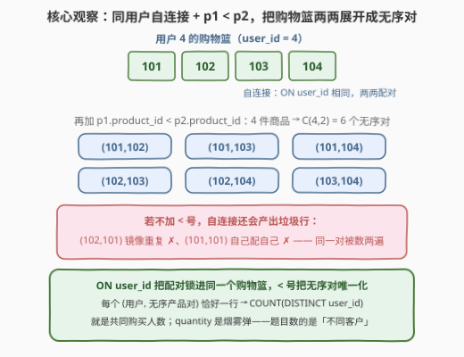
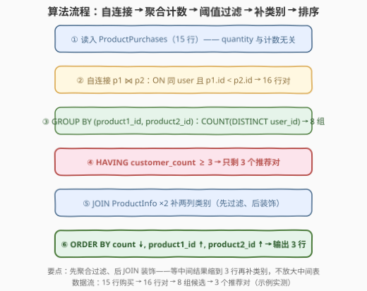
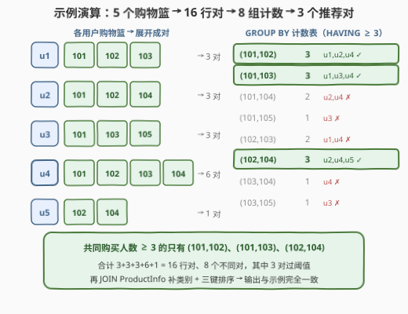

# LeetCode 查找推荐产品对 题解

## 1. 题目概述

- **标题 / 题号**：查找推荐产品对（#3521，medium）
- **链接**：https://leetcode.cn/problems/find-product-recommendation-pairs/
- **难度**：中等
- **标签**：数据库、SQL、自连接、GROUP BY / HAVING、购物篮分析、pandas

**表结构**：两张表

```sql
CREATE TABLE ProductPurchases (
    user_id     INT,
    product_id  INT,
    quantity    INT,
    PRIMARY KEY (user_id, product_id)   -- 一个用户对同一产品只有一行
);

CREATE TABLE ProductInfo (
    product_id  INT PRIMARY KEY,
    category    VARCHAR(30),
    price       DECIMAL
);
```

`ProductPurchases` 每行代表某用户以特定数量购买某产品；`ProductInfo` 每行给出一个产品的类别与价格。

**目标**：实现亚马逊式的「购买此商品的用户还购买了……」——

1. 识别被**同一客户一起购买**的**不同**产品对（要求 `product1_id < product2_id`）；
2. 对每个产品对统计**多少不同客户**同时购买了这两种产品；
3. 只保留**至少 3 位**不同客户共同购买的产品对（适合推荐）。

返回 `product1_id, product2_id, product1_category, product2_category, customer_count`，按 **`customer_count` 降序 → `product1_id` 升序 → `product2_id` 升序** 排序。

**示例 1**：

```text
输入：ProductPurchases 表
+---------+------------+----------+
| user_id | product_id | quantity |
+---------+------------+----------+
| 1       | 101        | 2        |   ← 用户1买了 101、102、103
| 1       | 102        | 1        |
| 1       | 103        | 3        |
| 2       | 101        | 1        |   ← 用户2买了 101、102、104
| 2       | 102        | 5        |
| 2       | 104        | 1        |
| 3       | 101        | 2        |   ← 用户3买了 101、103、105
| 3       | 103        | 1        |
| 3       | 105        | 4        |
| 4       | 101        | 1        |   ← 用户4买了 101、102、103、104
| 4       | 102        | 1        |
| 4       | 103        | 2        |
| 4       | 104        | 3        |
| 5       | 102        | 2        |   ← 用户5买了 102、104
| 5       | 104        | 1        |
+---------+------------+----------+

ProductInfo 表
+------------+-------------+-------+
| product_id | category    | price |
+------------+-------------+-------+
| 101        | Electronics | 100   |
| 102        | Books       | 20    |
| 103        | Clothing    | 35    |
| 104        | Kitchen     | 50    |
| 105        | Sports      | 75    |
+------------+-------------+-------+

输出：
+-------------+-------------+-------------------+-------------------+----------------+
| product1_id | product2_id | product1_category | product2_category | customer_count |
+-------------+-------------+-------------------+-------------------+----------------+
| 101         | 102         | Electronics       | Books             | 3              |
| 101         | 103         | Electronics       | Clothing          | 3              |
| 102         | 104         | Books             | Kitchen           | 3              |
+-------------+-------------+-------------------+-------------------+----------------+

解释：
- (101, 102) 被用户 1、2、4 共同购买（3 人）→ 推荐对；
- (101, 103) 被用户 1、3、4 共同购买（3 人）→ 推荐对；
- (102, 104) 被用户 2、4、5 共同购买（3 人）→ 推荐对；
- 其余产品对（如 (101,104) 只有用户 2、4 两人）共同购买人数 < 3，全部淘汰。
```

> 💡 **审题关键**：这是 SQL 里经典的「**购物篮分析 / 共现对计数**」母题。三个关键词决定解法形态：**「同一客户一起购买」** ⟹ 配对必须发生在**同一个 `user_id` 的购物篮内部**（自连接 `ON user_id`），绝不能跨用户配对；**「不同产品对且 `product1_id < product2_id`」** ⟹ 无序对要**唯一化**（`<` 号半化）；**「多少客户」** ⟹ 按**对**分组后数**不同 `user_id`**（`COUNT(DISTINCT)`）。而 `quantity` 与 `price` 两列从头到尾都是**烟雾弹**。

## 2. 解题思路

### 2.1 暴力思路：枚举产品对 × 逐用户检查

最直觉的做法是把「对」当作外层循环、把「用户」当作内层检查：

```text
for a in 所有产品:                      # 枚举较小者
    for b in 所有产品 (b > a):          # 枚举较大者
        cnt = 0
        for u in 所有用户:              # 逐个用户检查是否两者都买过
            if bought(u, a) and bought(u, b):
                cnt += 1
        if cnt >= 3: 收集 (a, b, cnt)
```

对应到 SQL 就是「产品笛卡尔积 + 两个相关子查询」——每个产品对都要回表扫一遍购买记录，复杂度 $O(P^2 \cdot U)$；绝大多数对只被 0~1 个用户共同购买，却照样付出全额检查成本。引擎层面，相关子查询也几乎无法利用索引合并优化。

> ⚠️ 暴力的启示：枚举方向反了。**绝大多数「候选对」根本不存在**——只有真正出现在某个用户购物篮里的对才值得数。正确姿势是把「对」**从购物篮里长出来**（自连接一次），而不是「从全产品空间里猜出来再验证」。

### 2.2 核心观察：同用户自连接 + `<` 号半化配对



关键观察有四条：

| 观察 | 内容 | 带来的做法 |
|------|------|-----------|
| **配对只发生在购物篮内部** | 「一起购买」= 同一个 `user_id` 的两行购买记录。`ProductPurchases p1 JOIN ProductPurchases p2 ON p2.user_id = p1.user_id` 只在**同一用户**的记录间配对，天然杜绝跨用户假对 | 自连接 `ON user_id` 相等 |
| **`<` 号一刀三用** | 裸自连接会产出三种行：`(a,b)`、镜像 `(b,a)`、自配 `(a,a)`。加上 `p1.product_id < p2.product_id`：自配对（不满足 `<`）和镜像（只保留小者在前的那一半）同时消失 | **每个 (用户, 无序对) 恰好一行**，`GROUP BY` 后 `COUNT` 即共同购买人数，不重不漏 |
| **`quantity` / `price` 是烟雾弹** | 题目数的是「**不同客户**数」，买 1 件和买 5 件贡献相同；类别才需要 `ProductInfo`，价格根本用不上 | 计数用 `COUNT(DISTINCT p1.user_id)`；`(user_id, product_id)` 是主键 ⟹ 同用户同产品至多一行，本题里它甚至等价于 `COUNT(*)`（但写 `DISTINCT` 更稳、更表意） |
| **先聚合过滤、后 JOIN 装饰** | 类别列只是最终输出的「装饰」。若先 JOIN `ProductInfo` 再 GROUP BY，16 行中间结果被类别列放大后才过滤；先聚合 + `HAVING` 缩到 3 行再补类别，中间表最小 | `ProductInfo` 的两次 JOIN 挂在 CTE 之后 |

四条观察合起来，整道题坍缩成「**一次同用户自连接 + 一轮 GROUP BY/HAVING + 两次主键 JOIN 装饰 + 三键排序**」：

```sql
WITH pairs AS (                       -- ①② 同用户自连接 + < 半化 + 聚合
    SELECT p1.product_id AS product1_id,
           p2.product_id AS product2_id,
           COUNT(DISTINCT p1.user_id) AS customer_count
    FROM ProductPurchases p1
    JOIN ProductPurchases p2
      ON p2.user_id = p1.user_id
     AND p2.product_id > p1.product_id
    GROUP BY p1.product_id, p2.product_id
    HAVING COUNT(DISTINCT p1.user_id) >= 3
)
SELECT pairs.product1_id, pairs.product2_id,        -- ③ 装饰 + 排序
       i1.category AS product1_category,
       i2.category AS product2_category,
       pairs.customer_count
FROM pairs
JOIN ProductInfo i1 ON i1.product_id = pairs.product1_id
JOIN ProductInfo i2 ON i2.product_id = pairs.product2_id
ORDER BY pairs.customer_count DESC, pairs.product1_id, pairs.product2_id;
```

> 💡 注意 `ON` 子句里写的是 `p2.product_id > p1.product_id`——「p1 是较小者」与「p2 是较大者」是同一件事的两种说法，等价于 `p1.product_id < p2.product_id`，落进 JOIN 条件还能让引擎在连接时就过滤，比连完再 `WHERE` 更省。

### 2.3 算法流程图



| 步骤 | SQL 片段 | 作用 | 示例数据流 |
|------|----------|------|-----------|
| ① 行源 | `FROM ProductPurchases p1` | 读入 15 行购买记录 | 15 行（`quantity` 全程不用） |
| ② 自连接 | `JOIN p2 ON 同 user 且 p2.id > p1.id` | 每个购物篮内部两两配对、`<` 半化 | 16 行 `(user_id, p1, p2)` |
| ③ 聚合 | `GROUP BY (p1, p2)` + `COUNT(DISTINCT user_id)` | 每个无序对一行 + 共同购买人数 | 8 个候选对 |
| ④ 过滤 | `HAVING customer_count >= 3` | 阈值筛推荐对 | 3 个推荐对 |
| ⑤ 装饰 | `JOIN ProductInfo i1 / i2`（主键等值） | 补两列类别 | 3 行 × 5 列 |
| ⑥ 排序 | `ORDER BY count DESC, p1 ASC, p2 ASC` | 三键定序 | 示例输出顺序 |

### 2.4 示例演算



对示例数据逐步走一遍。每个用户的购物篮先两两展开（`<` 半化后每篮 $\binom{b_u}{2}$ 行）：

| 用户 | 购物篮 | 展开的产品对 |
|------|--------|-------------|
| u1 | {101, 102, 103} | (101,102)、(101,103)、(102,103) |
| u2 | {101, 102, 104} | (101,102)、(101,104)、(102,104) |
| u3 | {101, 103, 105} | (101,103)、(101,105)、(103,105) |
| u4 | {101, 102, 103, 104} | (101,102)、(101,103)、(101,104)、(102,103)、(102,104)、(103,104) |
| u5 | {102, 104} | (102,104) |

共 $3+3+3+6+1 = 16$ 行中间对；`GROUP BY` 合并成 8 个不同对并计数：

| 产品对 | 共同购买的用户 | customer_count | ≥ 3？ |
|--------|---------------|----------------|-------|
| **(101,102)** | u1, u2, u4 | **3** | ✓ |
| **(101,103)** | u1, u3, u4 | **3** | ✓ |
| (101,104) | u2, u4 | 2 | ✗ |
| (101,105) | u3 | 1 | ✗ |
| (102,103) | u1, u4 | 2 | ✗ |
| **(102,104)** | u2, u4, u5 | **3** | ✓ |
| (103,104) | u4 | 1 | ✗ |
| (103,105) | u3 | 1 | ✗ |

3 个对过阈值；三对计数持平（都是 3），按 `product1_id` 升序落座为 (101,102)、(101,103)、(102,104)；再各 JOIN 一次 `ProductInfo` 补出 Electronics/Books、Electronics/Clothing、Books/Kitchen——与示例输出逐行一致。

## 3. 参考代码

### SQL（解法 A：CTE 先聚合后装饰，推荐）

```sql
# Write your MySQL query statement below
WITH pairs AS (
    SELECT p1.product_id AS product1_id,
           p2.product_id AS product2_id,
           COUNT(DISTINCT p1.user_id) AS customer_count
    FROM ProductPurchases p1
    JOIN ProductPurchases p2
      ON p2.user_id = p1.user_id
     AND p2.product_id > p1.product_id
    GROUP BY p1.product_id, p2.product_id
    HAVING COUNT(DISTINCT p1.user_id) >= 3
)
SELECT pairs.product1_id, pairs.product2_id,
       i1.category AS product1_category,
       i2.category AS product2_category,
       pairs.customer_count
FROM pairs
JOIN ProductInfo i1 ON i1.product_id = pairs.product1_id
JOIN ProductInfo i2 ON i2.product_id = pairs.product2_id
ORDER BY pairs.customer_count DESC, pairs.product1_id, pairs.product2_id;
```

> 💡 **写法要点**：
> - **聚合与装饰分离**：CTE 里只做「对 + 计数 + 过滤」，中间结果缩到 3 行后才 JOIN `ProductInfo`——连接行数最小，且 GROUP BY 列里不用背上类别；
> - `COUNT(DISTINCT p1.user_id)` 里的 `DISTINCT` 在本题主键保证下可以省（见 2.2 观察三），但保留它是对「**不同**客户」这一定义的直接翻译，语义自洽、面试不易被追问倒；
> - `ORDER BY` 引用 SELECT 别名（`customer_count` 等）在 MySQL 合法。

### SQL（解法 B：JOIN 链一条龙）

```sql
# Write your MySQL query statement below
SELECT p1.product_id AS product1_id,
       p2.product_id AS product2_id,
       i1.category   AS product1_category,
       i2.category   AS product2_category,
       COUNT(DISTINCT p1.user_id) AS customer_count
FROM ProductPurchases p1
JOIN ProductPurchases p2
  ON p2.user_id = p1.user_id
 AND p2.product_id > p1.product_id
JOIN ProductInfo i1 ON i1.product_id = p1.product_id
JOIN ProductInfo i2 ON i2.product_id = p2.product_id
GROUP BY p1.product_id, p2.product_id, i1.category, i2.category
HAVING COUNT(DISTINCT p1.user_id) >= 3
ORDER BY customer_count DESC, product1_id, product2_id;
```

> 💡 **解法 B 的取舍**：
> - 一条语句到底，不需要 CTE，代码更短；
> - 代价是 `ProductInfo` 的 JOIN 发生在**聚合之前**：中间对先被类别列装饰一遍（本题里类别不改变行数，因为都是主键等值一对一连接；但「先装饰后聚合」的习惯在多对一连接里会**放大行数**导致计数失真，是危险肌肉记忆）；
> - `GROUP BY` 必须把 `i1.category, i2.category` 一并写上（或依赖引擎的函数依赖检测）——它们经主键等值连接函数依赖于分组列，`ONLY_FULL_GROUP_BY` 模式下多数版本能自动识别，但显式写出最稳。

### Python（pandas）

```python
import pandas as pd


def find_product_recommendation_pairs(
    product_purchases: pd.DataFrame, product_info: pd.DataFrame
) -> pd.DataFrame:
    # ①② 同用户自连接 + "<" 半化：ON user_id 相同，只留 product_id1 < product_id2
    pairs = product_purchases.merge(
        product_purchases, on="user_id", suffixes=("1", "2")
    )
    pairs = pairs[pairs["product_id1"] < pairs["product_id2"]]

    # ③④ 按对聚合计数（nunique = COUNT DISTINCT），再按阈值过滤
    cnt = (
        pairs.groupby(["product_id1", "product_id2"], as_index=False)["user_id"]
        .nunique()
        .rename(columns={"user_id": "customer_count"})
    )
    cnt = cnt[cnt["customer_count"] >= 3]

    # ⑤ 装饰：类别列重命名成 product1/2_category 后两次主键 merge
    info1 = product_info.rename(
        columns={"product_id": "product1_id", "category": "product1_category"}
    )[["product1_id", "product1_category"]]
    info2 = product_info.rename(
        columns={"product_id": "product2_id", "category": "product2_category"}
    )[["product2_id", "product2_category"]]

    res = (
        cnt.rename(
            columns={"product_id1": "product1_id", "product_id2": "product2_id"}
        )
        .merge(info1, on="product1_id")
        .merge(info2, on="product2_id")
    )

    # ⑥ 三键排序：计数降序，p1、p2 升序
    return res.sort_values(
        ["customer_count", "product1_id", "product2_id"],
        ascending=[False, True, True],
    )[
        [
            "product1_id",
            "product2_id",
            "product1_category",
            "product2_category",
            "customer_count",
        ]
    ].reset_index(drop=True)
```

> 💡 **pandas 对照**（函数签名 `find_product_recommendation_pairs(product_purchases, product_info)` 取自官方代码骨架）：
> - `merge` 自连接就是 SQL 的 `p1 ⋈ p2 ON user_id`；`suffixes=("1","2")` 造出 `product_id1/product_id2`，随后布尔切片承担 `<` 半化；
> - `nunique()` = `COUNT(DISTINCT)`——即使数据里同一 `(user, product)` 意外出现多行也不会数重；
> - 与 SQL 的「先过滤后装饰」完全同构：`merge(info*)` 放在阈值过滤之后。

> ⚠️ **易错点**：① `<` 写成 `!=`——镜像对 `(a,b)`、`(b,a)` 全保留，计数翻倍，全盘皆错；② 忘了 `DISTINCT`——本题主键保证下侥幸正确，但同构题（无主键保证、或同用户多行购买记录）会重复计数，养成写 `COUNT(DISTINCT)` 的习惯；③ 拿 `quantity` 做加法（`SUM(quantity)`）——题目数的是「客户数」不是「件数」；④ 阈值过滤写进 `WHERE`——聚合前的 `WHERE` 看不见聚合值，必须用 `HAVING`；⑤ 排序只写一个键——持平的计数必须靠 `product1_id`、`product2_id` 升序破平。

## 4. 复杂度分析

设 $n$ 为 `ProductPurchases` 行数，$b_u$ 为用户 $u$ 购买的不同产品数（购物篮大小），$P$ 为产品总数（$P = $ `ProductInfo` 行数），$G$ 为不同产品对数（$G \le \binom{P}{2}$），$k$ 为过阈值的对数。

| 维度 | 复杂度 | 说明 |
|------|--------|------|
| 自连接产出 | $\sum_u \binom{b_u}{2}$ 行 | 配对被 `ON user_id` 锁在篮内，平方的对象是**篮子大小**而非全表；最坏单用户买齐全部产品时 $O(P^2)$，整体上界 $O(n \cdot P)$ |
| 聚合（③） | $O\!\left(\sum_u \binom{b_u}{2}\right)$ | 哈希聚合一趟扫描；排序聚合再加 $\log$ 因子 |
| 过滤 + 装饰 + 排序（④⑤⑥） | $O(k)$ / $O(k \log k)$ | `ProductInfo` 是主键等值 JOIN（一对一，不放大行数）；最终只对 $k$ 行排序 |
| 空间 | $O\!\left(\sum_u \binom{b_u}{2}\right)$ | 中间对表物化的开销；pandas 版同样由 `merge` 的中间 DataFrame 主导 |
| 对比暴力 | — | 产品空间枚举 $O(P^2 \cdot U)$ 且大量空对白白付费；自连接只为「真实存在的对」付费 |

> ⚠️ 真实数据里购物篮大小分布高度长尾（绝大多数用户只买 1~3 件），$\sum \binom{b_u}{2}$ 远小于理论上界——这正是「从购物篮长出对」优于「从产品空间猜对」的统计根源，也是频繁项集挖掘（见第 5 节）在工业界可行的前提。

## 5. 扩展：本题是购物篮分析（Market Basket Analysis）的最小样例

「买了 X 的人还买 Y」在数据挖掘里叫**购物篮分析**，本题是它的 2-项集最小样例：

- **支持度（Support）**：某个产品对被多少**不同客户**共同购买——正是本题的 `customer_count`；`HAVING >= 3` 就是**支持度阈值**；
- **频繁项集**：支持度 ≥ 阈值的集合。本题求的是**频繁 2-项集**；若要推荐「买 101、102 的人还买 103」就需要**频繁 3-项集**——SQL 上得再自连接一次（三路同用户连接 + 两个 `<`），中间行数继续膨胀；
- **Apriori 反单调性**：频繁集合的**任何子集必频繁**。(101,102,103) 频繁 ⟹ (101,102)、(101,103)、(102,103) 全部频繁。所以挖 3-项集前可先用本题的结果（频繁 2-项集）剪枝——绝大多数三路组合根本不必生成。这是经典 Apriori 算法的核心，也解释了为什么「先算小的、再长出大的」永远优于「直接枚举大的」；
- **工业实践**：真实 SKU 上百万、对数平方爆炸，做法是**倒排索引**（产品 → 购买它的用户集合）后对候选对求交集大小，或 FP-Growth 压缩前缀树——思路仍是本题的「只为真实共现付费」。

回到 SQL 面试：如果面试官追问「阈值从 3 改成动态参数 / 改成『共同购买金额 ≥ X』怎么办」——前者改 `HAVING` 常数即可；后者把 `COUNT(DISTINCT user_id)` 换成 `SUM(LEAST(p1.quantity, p2.quantity) * ...)` 之类的聚合口径，**骨架（自连接 + 半化 + 聚合过滤 + 装饰排序）一个字都不用动**——这正是把它当母题记的价值。

## 6. 面试要点

1. **为什么 `p1.product_id < p2.product_id` 是整道题的题眼？去掉会怎样？**

   > 裸自连接会产出三类行：正序 `(a,b)`、镜像 `(b,a)`、自配 `(a,a)`。`<` 号一刀三用：自配不满足严格小于被删、镜像只保留小者在前的一半——**每个 (用户, 无序对) 恰好一行**，之后 `GROUP BY` + `COUNT` 才不重不漏。若只写 `!=`，每对被数两遍，所有 `customer_count` 整体翻倍，`HAVING >= 3` 会放进大量假推荐对。

2. **`COUNT(*)` 和 `COUNT(DISTINCT user_id)` 在本题等价吗？什么场景下必须用后者？**

   > 本题等价：`(user_id, product_id)` 是主键，同一用户同一产品至多一行，配对行数 = 不同用户数。但一旦去掉这层保证（无主键、或按订单号记录同一用户多次购买同一产品），`COUNT(*)` 会把同一用户数多次——「不同客户」的定义就被破坏了。`COUNT(DISTINCT)` 是对题意的直接翻译，在任何变体下都稳。

3. **为什么建议先聚合过滤、再 JOIN `ProductInfo`？反过来行不行？**

   > 行（解法 B 就行），但代价不同：先 JOIN 后聚合时，中间对表先被类别列装饰（本题是一对一连接不放大行数，但多对一连接会放大，导致 `COUNT` 失真——这是更危险的坑）；且 `GROUP BY` 要多背类别列。先聚合把 16 行缩到 3 行再装饰，连接成本最小、聚合语义最干净。「先过滤、后装饰」是 SQL 优化的通用直觉。

4. **中间对表最坏能有多大？什么时候这套自连接方案会崩？**

   > 行数 = $\sum_u \binom{b_u}{2}$，最坏单个用户买齐 $P$ 件产品贡献 $O(P^2)$。真实电商数据购物篮高度长尾（多数 1~3 件），自连接完全可行；但若场景是「同一张表里全量商品两两强相关」（如交叉销售报表对 $P=10^5$ 的 SKU 求全量对），$O(P^2) = 10^{10}$ 行会爆——此时应转向倒排索引（产品 → 用户集合）对**候选对**求交集，或用 Apriori/FP-Growth 做剪枝，即第 5 节的频繁项集挖掘。

5. **这题和经典「共现对」题目（如好友申请 II、等价多米诺骨牌对）在「无序对唯一化」上有什么联系？**

   > 同一个思想的三种落地：本题用**连接条件里的 `<`** 半化（行还没生成就砍掉一半）；602 好友申请用 **UNION 把两个方向折成一列**再 GROUP BY（先生成再合并）；1128 多米诺骨牌用 **min/max 归一化**（`(a,b)` 与 `(b,a)` 都改写成 `(min,max)` 后计数）。共同本质：**把「无序对」映射到规范代表元，让等价类恰好聚合到一组**——识别出这一点，一族「对计数」题全部通杀。

## 同类练习题

| # | 题目 | 与本题的关联 |
|---|------|-------------|
| 1045 | [买下所有产品的客户](https://leetcode.cn/problems/customers-who-bought-all-products/)（[站内题解](../1001-1100/1045_买下所有产品的客户.md)） | 同款购买表，`HAVING COUNT(DISTINCT product_id) = (子查询总数)` 做集合包含判断——聚合方向从「按对」换成「按用户」 |
| 1398 | [购买了产品 A 和 B 但没有购买 C 的顾客](https://leetcode.cn/problems/customers-who-bought-products-a-and-b-but-not-c/)（[站内题解](../1301-1400/1398_购买了产品A和产品B却没有购买产品C的顾客.md)） | 聚合 + 条件计数判断「买了谁、没买谁」，与本题共享 `COUNT(DISTINCT ...)` 的口径意识 |
| 602 | [好友申请 II ：谁有最多的好友](https://leetcode.cn/problems/friend-requests-ii-who-has-the-most-friends/)（[站内题解](../0601-0700/602_好友申请II谁有最多的好友.md)） | 同表配对计数的近亲——用 UNION 展开 `(requester, accepter)` 双方向，与本题 `<` 号半化形成对照 |
| 1128 | [等价多米诺骨牌对的数量](https://leetcode.cn/problems/number-of-equivalent-domino-pairs/)（[站内题解](../1101-1200/1128_等价多米诺骨牌对的数量.md)） | 非 SQL，但「(min, max) 归一化无序对再计数」的思想与本题 `p1 < p2` 完全同源 |
| 1264 | [页面推荐](https://leetcode.cn/problems/page-recommendations/)（[站内题解](../1201-1300/1264_页面推荐.md)） | 另一种「推荐」的 SQL 落地——好友的好友喜欢而自己不喜欢的页面，练习多层排除语义 |
