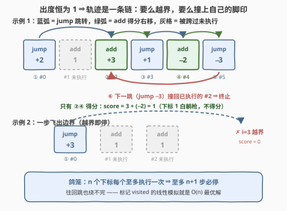
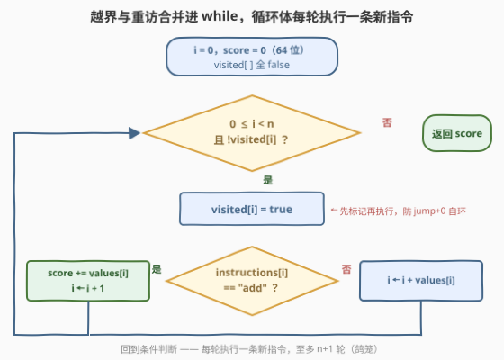

# LeetCode 执行指令后的得分 题解

## 1. 题目概述

- **标题 / 题号**：执行指令后的得分（#3522，medium）
- **链接**：https://leetcode.cn/problems/calculate-score-after-performing-instructions/
- **难度**：中等
- **标签**：数组、哈希表、字符串、模拟

**题意**：给定两个长度均为 $n$ 的数组 `instructions` 与 `values`，按以下规则模拟一个过程：

- 从下标 $i = 0$ 出发，初始得分 $0$；
- 若 `instructions[i] == "add"`：把 `values[i]` 加进得分，移动到 $i+1$；
- 若 `instructions[i] == "jump"`：不得分，移动到 $i + \text{values}[i]$（`values[i]` 可为负，即可以往回跳）。

过程在以下任一情况发生时**终止**：

1. **越界**：$i < 0$ 或 $i \ge n$；
2. **重访**：试图再次执行一条已经执行过的指令（被重复访问的指令不会再次执行）。

返回过程结束时的得分。

**示例 1**：

```text
输入：instructions = ["jump","add","add","jump","add","jump"], values = [2,1,3,1,-2,-3]
输出：1
解释：0 --jump+2--> 2 --add(+3)--> 3 --jump+1--> 4 --add(-2)--> 5 --jump-3--> 2(重访，停)
      得分 = 3 + (-2) = 1。注意下标 1 被跳过，从未执行、不得分。
```

**示例 2**：

```text
输入：instructions = ["jump","add","add"], values = [3,1,1]
输出：0
解释：下标 0 是 jump，跳到 0 + 3 = 3，越界，过程立即结束，得分 0。
```

**示例 3**：

```text
输入：instructions = ["jump"], values = [0]
输出：0
解释：jump + 0 = 原地自环，下一步重访自身，立即终止，得分 0。
```

**约束**：

- $n = \text{instructions.length} = \text{values.length}$
- $1 \le n \le 10^5$
- `instructions[i]` 只能是 `"add"` 或 `"jump"`
- $-10^5 \le \text{values[i]} \le 10^5$

> 💡 **读题关键**：① `jump` 的目标由 $i + \text{values}[i]$ 给出，负值意味着**往回跳**，所以轨迹不是单调向右的；② 终止的两种情况（越界 / 重访）**恰好覆盖所有可能**——这是下文证明模拟必然停机的根基；③ 被 `jump` **跨过**的指令永远不执行、不得分（示例 1 的下标 1）；④ ⚠️ 得分上界：全 `add` 时得分 $= \sum \text{values}[i]$，最大约 $10^5 \times 10^5 = 10^{10}$，**超出 32 位 int 范围**，C++ 必须用 `long long`。

## 2. 解题思路

### 2.1 暴力思路

最直接的想法是照题面逐步模拟。但有两个绕不开的问题：

**问题一：怎么判"重访"？** 如果不记录任何状态，示例 3（`["jump"]`, `[0]`）就是原地自环，直接**死循环**。朴素的判重是每走一步，就在"已访问下标列表"里线性扫一遍——单步 $O(n)$、总体 $O(n^2)$，$n = 10^5$ 时约 $10^{10}$ 次比较，必然超时。改用**哈希表**（`unordered_set` / `set`）判重，单步降到均摊 $O(1)$。

**问题二：模拟到底会走多少步？** 直觉上往回跳可能让轨迹"绕来绕去"，步数似乎没有上界。这个疑虑不解决，即使写对了也不敢保证不 TLE——答案见下面的核心观察。

### 2.2 核心观察：函数图上的一条链——每条指令至多执行一次



**观察一（出度恒为 1）**：站在下标 $i$，无论指令是 `add` 还是 `jump`，下一位置都**唯一确定**——$\text{next}(i) = i+1$ 或 $i + \text{values}[i]$。整个系统构成一张**函数图**（每个节点出度恰为 1），从 $0$ 出发的轨迹是一条**链**，没有任何分叉。

**观察二（轨迹只有两种命运）**：链要么中途**越界**飞出 $[0, n)$（示例 2），要么在有限步后**撞上自己的脚印**——首次重访的节点正是环的入口，轨迹呈"希腊字母 ρ"形：一条尾巴 + 一个环（示例 1 的尾巴 $0 \to 2$，环 $2 \to 3 \to 4 \to 5 \to 2$）。

**观察三（鸽笼 ⇒ 步数上界）**：重访即终止 ⇒ $n$ 个下标**每个至多被执行一次** ⇒ 模拟的总步数 $\le n + 1$。于是"往回跳会不会绕不完"的疑虑一扫而空——**线性模拟本身就是 $O(n)$ 的**，不存在死循环，也不存在超时。

**观察四（判重结构的选型）**：要记录的键是**下标**，值域恰为 $[0, n)$ 的整数——天然可以直接做数组下标。用 `bool visited[n]` 替代哈希表，判重从"哈希 + 探测"退化为一次数组读写，常数更小、缓存更友好（这也是本题标签带"哈希表"但实际**不必**用哈希表的原因：键值域太规整了）。

### 2.3 算法流程图



| 步骤 | 动作 | 说明 |
|------|------|------|
| ① 初始化 | `i = 0`，`score = 0`，`visited` 全 `false` | `score` 用 64 位，上界 $10^{10}$ |
| ② 循环条件 | `0 <= i < n && !visited[i]` | 把两种终止条件（越界 / 重访）**合并**进 `while`，代码零特判 |
| ③ 标记 | `visited[i] = true` | **先标记再执行**，自环（`jump +0`）在下一轮被条件拦下 |
| ④ 执行 | `add`：`score += values[i]`，`i++`；`jump`：`i += values[i]` | 只有 `add` 影响得分 |
| ⑤ 返回 | `score` | 循环每轮执行一条新指令，至多 $n+1$ 轮 |

### 2.4 示例演算

用**示例 1**（`instructions = ["jump","add","add","jump","add","jump"]`，`values = [2,1,3,1,-2,-3]`）逐步走一遍：

| 轮次 | 当前 $i$ | 指令 | 动作 | 得分变化 | 下一 $i$ | 是否继续 |
|------|---------|------|------|---------|---------|---------|
| 1 | 0 | `jump` +2 | 跳转，不得分 | $0$ | $2$ | ✓ |
| 2 | 2 | `add` +3 | 累加，右移 | $0 \to 3$ | $3$ | ✓ |
| 3 | 3 | `jump` +1 | 跳转，不得分 | $3$ | $4$ | ✓ |
| 4 | 4 | `add` −2 | 累加，右移 | $3 \to 1$ | $5$ | ✓ |
| 5 | 5 | `jump` −3 | 跳转，不得分 | $1$ | $2$ | ✗ 重访，停 |

最终得分 $\boxed{1}$。全程共执行 5 条指令，下标 1 被 `jump` 跨过、从未执行——它**不贡献得分**。

**示例 3**（自环）：第 1 轮在 $i=0$ 先标记 `visited[0] = true`，`jump + 0` 使 $i$ 仍为 $0$；第 2 轮 `while` 条件发现 `visited[0]` 为真，立即退出，得分 $0$。**"先标记再执行"** 的顺序在这里天然防住死循环。

## 3. 参考代码

### C++

```cpp
class Solution {
  public:
    long long calculateScore(vector<string>& instructions, vector<int>& values) {
        int n = instructions.size();
        vector<char> visited(n, 0);          // 下标值域 [0,n)，数组判重比哈希表更快
        long long score = 0;                 // 上界 10^10，必须 64 位
        int i = 0;
        while (i >= 0 && i < n && !visited[i]) {   // 越界与重访合并进循环条件
            visited[i] = 1;                  // 先标记再执行（防 jump+0 自环）
            if (instructions[i] == "add") {
                score += values[i];
                i += 1;
            } else {
                i += values[i];              // 可正可负，可前跳可回跳
            }
        }
        return score;
    }
};
```

### Python

```python
class Solution:
    def calculateScore(self, instructions: List[str], values: List[int]) -> int:
        n = len(instructions)
        visited = [False] * n
        score, i = 0, 0
        while 0 <= i < n and not visited[i]:     # 越界与重访合并进循环条件
            visited[i] = True                    # 先标记再执行（防 jump+0 自环）
            if instructions[i] == "add":
                score += values[i]
                i += 1
            else:
                i += values[i]                   # 可正可负，可前跳可回跳
        return score
```

> ⚠️ **易错点**：① **溢出**——全 `add` 时得分约 $10^{10}$，C++ `int` 必炸，用 `long long`（Python 天然大整数无此坑）；② **`while` 条件顺序**——`0 <= i < n` 必须在 `visited[i]` 之前短路，否则负下标先访问 `visited[-1]`（C++ 越界 UB，Python 负索引静默回绕到队尾，更隐蔽）；③ **先标记再执行**——若先执行后标记，`jump +0` 的自环情形会在标记前就原地打转；④ 被 `jump` 跨过的指令**不得分**，不要顺手把区间内的 `add` 都累加进去。

## 4. 复杂度分析

| 维度 | 复杂度 | 说明 |
|------|--------|------|
| 时间复杂度 | $O(n)$ | 循环每轮执行一条**新**指令（重访即停），总轮数 $\le n + 1$（鸽笼） |
| 空间复杂度 | $O(n)$ | `visited` 布尔数组；相比哈希表判重省去哈希计算与冲突处理 |
| 数据范围验证 | — | $n \le 10^5$：至多 $10^5$ 轮循环、每轮 $O(1)$，远低于时限 |
| 得分范围 | — | $\lvert \text{score} \rvert \le n \cdot \max \lvert \text{values}[i] \rvert \approx 10^{10}$，64 位必带 |

## 5. 扩展：Floyd 判圈——O(1) 额外空间

`visited` 数组能省掉吗？能。轨迹是"ρ 形（尾巴 + 环）或越界"，而 **Floyd 龟兔判圈**（[202. 快乐数](https://leetcode.cn/problems/happy-number/) 同款）恰好能在 $O(1)$ 空间下定位环：

1. **判圈**：龟每步走 1 格、兔每步走 2 格；任一方越界 ⇒ 无环，直接单趟累加到越界为止；相遇 ⇒ 有环；
2. **找环入口**：龟回到起点 $0$，龟兔同速前进，再次相遇处即环入口——它正是**首个被重访的下标**。从 $0$ 走到入口的步数记为尾长 $\mu$；
3. **数环长**：从入口转一圈回到入口，得环长 $\lambda$；
4. **重取得分**：会被执行的指令恰是链上前 $\mu + \lambda$ 个节点，从 $0$ 重走 $\mu + \lambda$ 步、累加沿途 `add` 即答案。

```python
class Solution:
    def calculateScore(self, instructions: List[str], values: List[int]) -> int:
        n = len(instructions)

        def f(i: int) -> int:                  # 转移函数：出度恒为 1，越界统一映射到 -1
            if not (0 <= i < n):
                return -1
            j = i + 1 if instructions[i] == "add" else i + values[i]
            return j if 0 <= j < n else -1

        def gain(i: int) -> int:               # 执行下标 i 的得分增量
            return values[i] if instructions[i] == "add" else 0

        t, h = f(0), f(f(0))                   # ① 龟兔判圈
        while t != -1 and h != -1 and t != h:
            t, h = f(t), f(f(h))
        if t == -1 or h == -1:                 # 无环：单趟走到越界
            i, s = 0, 0
            while 0 <= i < n:
                s += gain(i)
                i = f(i)
            return s

        t2, mu = 0, 0                          # ② 回起点找环入口，顺便数出尾长 μ
        while t2 != h:
            t2, h = f(t2), f(h)
            mu += 1
        lam, i = 1, f(t2)                      # ③ 转一圈数环长 λ
        while i != t2:
            lam += 1
            i = f(i)

        i, s = 0, 0                            # ④ 重走 μ+λ 步累加得分
        for _ in range(mu + lam):
            s += gain(i)
            i = f(i)
        return s
```

时间仍为 $O(n)$（龟兔各走 $O(\mu + \lambda)$ 步，共三趟），额外空间降到 $O(1)$。实战中它**并不划算**——代码长、常数大、边界多（本文版本已与 `visited` 解法对拍 10 万组随机数据一致），面试时作为"能否 $O(1)$ 空间"的追问答案正合适：先说结论（ρ 形轨迹 + Floyd），再补一句"工程上选数组判重"。

## 6. 面试要点

1. **为什么直接模拟不会超时？往回跳不会绕不完吗？**

   - 每个下标出度恒为 1，轨迹是一条链；而"重访即终止"保证每个下标至多执行一次。鸽笼原理：$n$ 个下标至多贡献 $n$ 次有效执行，第 $n+1$ 步前必撞重复或越界。所以总步数 $\le n+1$，线性模拟就是 $O(n)$。

2. **判重为什么用数组而不用哈希表？什么时候必须用哈希表？**

   - 判重的键是下标，值域恰是 $[0, n)$ 的连续整数，可直接做数组下标——一次内存访问，无哈希计算与冲突开销。若键是字符串、任意整数或坐标对（如 874 题的障碍物坐标），值域不规整，才轮到哈希表。

3. **这个"轨迹"结构本质上是什么？和环形链表什么关系？**

   - 函数图（出度 1 的有向图）上从固定起点出发的游走，形态必为"尾巴 + 环"（ρ 形）或中途离开定义域。141 环形链表判的是同一个结构；202 快乐数的"每位平方和下一数"也是一个转移函数，本题的 $\text{next}(i)$ 只是换了个马甲。

4. **有哪些一写就错的坑？**

   - 三大坑：得分用 32 位会溢出（上界 $10^{10}$）；`while` 里 `visited[i]` 放在越界检查**前面**，负下标会 UB 或被 Python 负索引静默回绕；`jump` 跨过的指令不执行、不得分，别按区间求和。

5. **如果面试官追问 O(1) 空间呢？**

   - Floyd 龟兔判圈：先判有无环（有环则兔龟必相遇，越界则无环），再找环入口（= 首个重访点）与环长，执行序列就是链上前"尾长 + 环长"个节点，重走一遍累加即可。$O(n)$ 时间、$O(1)$ 空间，代价是三趟代码复杂度。

## 同类练习题

| # | 题目 | 与本题的关联 |
|---|------|-------------|
| 202 | [快乐数](https://leetcode.cn/problems/happy-number/)（[站内题解](../0201-0300/202_快乐数.md)） | 函数图走步 + 环检测的原型题，`visited` 集合 / 快慢双指针两种写法的教科书 |
| 141 | [环形链表](https://leetcode.cn/problems/linked-list-cycle/) | 链表版的"重访即终止"，龟兔判圈的出处 |
| 874 | [模拟行走机器人](https://leetcode.cn/problems/walking-robot-simulation/)（[站内题解](../0801-0900/874_模拟行走机器人.md)） | 纯模拟 + 哈希集合存障碍物，对照本题体会"键值域规整 ⇒ 数组替代哈希" |
| 1503 | [所有蚂蚁掉下来前的最后一刻](https://leetcode.cn/problems/last-moment-before-all-ants-fall-out-of-a-plank/)（[站内题解](../1501-1600/1503_所有蚂蚁掉下来前的最后一刻.md)） | 识破模拟表象后一行取 max，训练"先看穿结构再动手"的题感 |
| 287 | [寻找重复数](https://leetcode.cn/problems/find-the-duplicate-number/)（[站内题解](../0201-0300/287_寻找重复数.md)） | 函数图 $i \to \text{nums}[i]$ + 鸽笼必有环，Floyd 判圈 $O(1)$ 空间的登峰之作 |
