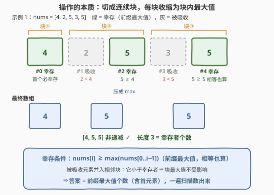
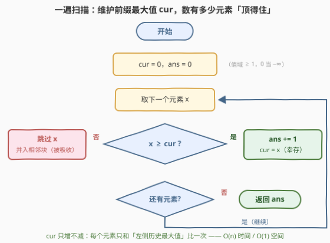

# 非递减数组的最大长度

- **题目名称**：非递减数组的最大长度
- **链接**：[3523. Make Array Non-decreasing](https://leetcode.cn/problems/make-array-non-decreasing/)
- **难度**：中等
- **标签**：数组、贪心、栈、单调栈

## 1. 题目概述

给你一个整数数组 `nums`。一次操作中，你可以选择一个**子数组**（连续非空段），把它替换成**一个**等于该子数组**最大值**的元素。返回经过零次或多次操作后，数组仍保持**非递减**的前提下，数组长度的**最大值**。

**示例 1**：

```text
输入：nums = [4,2,5,3,5]
输出：3
解释：把子数组 nums[1..2] = [2,5] 替换为 5 → [4,5,3,5]；
      再把子数组 nums[2..3] = [3,5] 替换为 5 → [4,5,5]。
      最终数组 [4,5,5] 非递减，长度为 3。
```

**示例 2**：

```text
输入：nums = [1,2,3]
输出：3
解释：数组本身已非递减，一次操作都不用做。
```

**约束条件**：

- $1 \le \text{nums.length} \le 2 \times 10^5$
- $1 \le \text{nums[i]} \le 2 \times 10^5$

> 💡 **读题关键**：① 操作只能**缩短**数组——把一段压成一个数，且这个数是该段的**最大值**，所以任何操作都造不出比原有值更大的数；② 问的是长度**最大**能保多少（注意方向：不少同类题问"最少几次操作"，本题反过来）；③ 换个说法：我们要决定"哪些元素**幸存**、哪些元素被**并进**旁边的块"。

---

## 2. 解题思路

### 2.1 暴力思路

最朴素的模拟：从原数组出发，枚举每一步操作选哪个子数组（每步有 $O(n^2)$ 种选法），BFS 所有可达的数组状态，在其中挑非递减的最长者。状态空间指数级膨胀，$n$ 稍大即不可行。

退一步，先想清楚"操作的结果长什么样"：若干次操作把原数组切成了若干**连续块**，每块被压成块内最大值。于是问题等价于：

> 把 `nums` 划分成尽可能多的连续块，使各块最大值从左到右**非递减**。

按这个模型做 DP：状态必须记录"前缀结尾下标 + 最后一块的最大值"（后者是转移约束——新块的最大值不能比它小），转移还要枚举新块起点，复杂度至少 $O(n^2)$；$n = 2\times10^5$ 时约 $4\times10^{10}$，依旧超时。必须看穿结构。

### 2.2 核心观察：块最大值必是前缀最大值——答案是"数"出来的



**观察一（操作的封闭性）**：一次操作把连续段替换成段内最大值；对相邻两段 $A$、$B$ 分别操作，与对 $A \cup B$ 一次操作，结果相同（$\max$ 满足结合律）。归纳可得：**任意操作序列的最终效果 = 把原数组划分成连续块、每块收缩为块最大值**；反之任何划分都能逐块操作实现。二者一一对应。问题即：最多分多少块，使块最大值序列非递减。

**观察二（块最大值必为前缀最大值 ⇒ 上界）**：设某块的最大值在位置 $t$ 取得。该块左侧的每个元素 ≤ 所在块的最大值 ≤ 本块最大值 $= \text{nums}[t]$（非递减），本块内 $t$ 之前的元素也 ≤ $\text{nums}[t]$。于是 **$t$ 之前的所有元素都不超过 $\text{nums}[t]$**——这正是**前缀最大值**的定义：$\text{nums}[t] \ge \max(\text{nums}[0..t-1])$。各块互不重叠，取最大值的位置严格递增且互不相同，故：

$$\text{块数} \le \text{前缀最大值的个数}$$

**观察三（前缀最大值恰好可行 ⇒ 取等）**：让每个前缀最大值单独"幸存"：第 $j$ 块 = 第 $j$ 个幸存者到下一个幸存者之前。两个幸存者之间的元素都不是前缀最大值，即都**严格小于**左侧最近的前缀最大值，所以每块的最大值恰好等于幸存者本身的值；而幸存者的值随下标非递减（定义使然）。$k$ 块的块最大值非递减——恰好取到上界。

**结论**：**答案 = 前缀最大值的个数**（首元素天然计数）。一遍扫描即可：

- 维护前缀最大值 $\text{cur}$；
- 若 $\text{nums}[i] \ge \text{cur}$：它"顶得住"左侧所有人，**幸存**，$\text{ans}{+}{+}$，更新 $\text{cur}$；
- 否则：左侧有人比它大，它**必然**被并进某块（包含它的块的最大值会变成那个更大的数），跳过。

> ⚠️ **对照官方 hint**：「删除数组中最大的元素有帮助吗？」——永远没有。全局最大值的**每次出现**都是前缀最大值，必然幸存；真正"被消失"的只有前面有更大数压着的元素。「倒序思考」则对应第 5 节的另一种构造。

### 2.3 算法流程图



| 步骤 | 动作 | 说明 |
|------|------|------|
| ① 初始化 | `cur = 0, ans = 0` | 值域 $\ge 1$，`cur = 0` 相当于 $-\infty$，首元素必幸存 |
| ② 取元素 | `x = nums[i]` | 单趟从左到右 |
| ③ 判定 | `x >= cur ?` | 与"左侧出现过的最大值"比较 |
| ④ 幸存分支 | `ans++, cur = x` | 前缀最大值，单独成块 |
| ⑤ 吸收分支 | 跳过 | 并入相邻块，块最大值不受影响 |
| ⑥ 返回 | `ans` | 幸存者个数即最大长度 |

### 2.4 示例演算

用**示例 1**（`nums = [4,2,5,3,5]`）走一遍：

| $i$ | $\text{nums}[i]$ | 扫描前的 cur | 判定 | 动作 | ans |
|-----|-----------------|--------------|------|------|-----|
| 0 | 4 | 0（视作 $-\infty$） | $4 \ge 0$ ✓ | 幸存，cur = 4 | 1 |
| 1 | 2 | 4 | $2 < 4$ ✗ | 被吸收 | 1 |
| 2 | 5 | 4 | $5 \ge 4$ ✓ | 幸存，cur = 5 | 2 |
| 3 | 3 | 5 | $3 < 5$ ✗ | 被吸收 | 2 |
| 4 | 5 | 5 | $5 \ge 5$ ✓ | 相等也算，幸存，cur = 5 | 3 |

幸存者为下标 0、2、4，对应划分 $[4]\,|\,[2,5]\,|\,[3,5]$，与官方解释的两步操作完全一致，收缩成 $[4,5,5]$，长度 $\boxed{3}$。

**示例 2**（`[1,2,3]`）：每个元素都是前缀最大值，全部幸存，答案 3，零操作。

---

## 3. 参考代码

### C++

```cpp
class Solution {
  public:
    int maximumPossibleSize(vector<int>& nums) {
        int ans = 0, cur = 0;              // 值域 >= 1，cur = 0 视作 -inf
        for (int x : nums) {
            if (x >= cur) {                // 不被左侧任何人压制 ⇒ 幸存
                ans++;
                cur = x;                   // 更新前缀最大值
            }                              // 否则被吸收：并入相邻块即可，无需模拟
        }
        return ans;
    }
};
```

### Python

```python
class Solution:
    def maximumPossibleSize(self, nums: List[int]) -> int:
        ans, cur = 0, 0
        for x in nums:
            if x >= cur:       # 前缀最大值 ⇒ 幸存
                ans += 1
                cur = x        # 否则被吸收，直接跳过
        return ans
```

> ⚠️ **易错点**：① 判定必须是 `>=` 而非 `>`——非递减允许相等，平台段（连续相等）应全部幸存（示例 1 末尾的 5 靠 `>=` 活下来）；② `cur` 是"左侧历史最大值"，不能偷懒拿 `nums[i-1]` 代替——反例 `[3,1,2]`：正确答案 1（3 之后谁都顶不住 3），拿前一个元素比会误判 2 幸存得 2；③ 别把本题当"最长非递减子序列"（见面试要点第 3 问）——块必须**连续**且覆盖全部元素，中间的大数丢不掉。

---

## 4. 复杂度分析

| 维度 | 复杂度 | 说明 |
|------|--------|------|
| 时间复杂度 | $O(n)$ | 单趟扫描，每个元素一次比较 |
| 空间复杂度 | $O(1)$ | 只有两个标量 `cur` / `ans` |
| 数据范围验证 | — | $n \le 2\times10^5$：线性扫描毫秒级完成；值域 $2\times10^5$、答案 $\le n$，`int` 无溢出风险 |

---

## 5. 扩展：倒序切块——官方 hint 的另一种构造

前文的构造让每个幸存者"带走"**右侧**的被吸收者（$[4]\,|\,[2,5]\,|\,[3,5]$）。官方 hint「倒序思考」给出对称的构造，出发点是：**最后一块的最大值必为全局最大值 $M$**——$M$ 所在块的块最大值就是 $M$，而非递减要求其右侧每块的最大值 $\ge M$，又不能超过 $M$。于是从右往左：

1. 在当前段中找 $M_{\text{段}}$（段内最大值）的**最后一次出现** $s$，切出最后一块 $[s, \text{段尾}]$；
2. 对剩余前缀递归重复。

对示例 1：$[4,2,5,3,5] \to$ 切 $[5]$（$s=4$）$\to$ 剩 $[4,2,5,3]$ 切 $[5,3]$（$s=2$）$\to$ 剩 $[4,2]$ 切 $[4,2]$。得到另一种划分 $[4,2]\,|\,[5,3]\,|\,[5]$，同样 3 块——可归纳证明**切点与前缀最大值位置完全一致**，只是被吸收者改为跟着左边的幸存者，殊途同归。

标签里的「单调栈」可以这么理解：幸存者序列天然非递减，把它看作一个**只进不出**的栈——新元素 $\ge$ 栈顶则入栈（幸存），否则被吸收丢弃；栈的最终大小就是答案。

此外，$\text{nums}[i] \ge \max(\text{nums}[0..i-1])$ 等价于 $\text{nums}[i] = \max(\text{nums}[0..i])$，于是有一行流写法：

```python
from itertools import accumulate

class Solution:
    def maximumPossibleSize(self, nums: List[int]) -> int:
        return sum(x == m for x, m in zip(nums, accumulate(nums, max)))
```

---

## 6. 面试要点

1. **为什么任意操作序列都等价于"划分成连续块取块最大值"？**

   一次操作 = 把一段连续元素压成它们的 $\max$。$\max$ 满足结合律：先压 $A$、$B$ 再拼接，与一次压 $A \cup B$ 结果相同。归纳可得任意操作序列的净效果 = 原数组的一个连续划分、每块收缩为块最大值；反过来，任何划分都能按块逐个操作实现。二者一一对应，因此可以在"划分"的世界里做等价推理。

2. **怎么证明答案恰是前缀最大值个数？**

   双向夹逼。上界：任一合法划分中，每块的最大值在某位置 $t$ 取得，而 $t$ 之前所有元素（左侧各块的全部元素 + 本块前缀）都不超过它，故 $t$ 是前缀最大值位置；各块取最大值的位置严格递增、互不相同，块数 ≤ 前缀最大值个数。构造：让每个前缀最大值单独成块并带走右侧直到下一个幸存者的元素，块最大值恰为幸存者值且非递减，取等。

3. **这题和"最长非递减子序列"（LIS）有什么区别？**

   子序列可以**跳过**中间元素；本题的块必须**连续**且覆盖全部元素——中间的大数丢不掉，只能并进某块并把该块最大值抬高。反例 `[1,5,2,3]`：最长非递减子序列是 `[1,2,3]`（长 3），但本题答案是 2——5 无法消失，包含它的块最大值至少为 5，其后的 2、3 无论怎么分块都压不过 5。

4. **为什么判定用 `>=` 而不是 `>`？**

   非递减允许相等：`[4,5,5]` 合法。$\text{nums}[i] = \text{cur}$ 时它本身就是新的前缀最大值（示例 1 末尾的 5），照常幸存。写成 `>` 会把平台段误杀到只剩一个。

5. **为什么被吸收的元素不需要真的模拟合并？**

   吸收没有副作用：元素 $x$ 并入某块后，块最大值 $= \max(\text{原块最大值}, x)$，而 $x < $ 幸存者值 $=$ 原块最大值，块最大值不变。所以我们只数幸存者、完全不关心被吸收者并给谁——这正是贪心能退化成一次比较的原因。

---

## 7. 同类练习题

- [665. 非递减数列](https://leetcode.cn/problems/non-decreasing-array/)（[站内题解](../0601-0700/665_非递减数组.md)）：同判非递减 + 贪心局部修正，"改一个元素"与本题"压一段"对照着看
- [674. 最长连续递增序列](https://leetcode.cn/problems/longest-continuous-increasing-subsequence/)（[站内题解](../0601-0700/674_最长连续递增序列.md)）：一遍扫描维护"当前段何时断"的最简模板
- [739. 每日温度](https://leetcode.cn/problems/daily-temperatures/)（[站内题解](../0701-0800/739_每日温度.md)）：单调栈入门，体会本题标签中"栈"的另一种用法
- [962. 最大宽度坡](https://leetcode.cn/problems/maximum-width-ramp/)（[站内题解](../0901-1000/962_最大宽度坡.md)）：单调栈 + 倒序扫描，呼应官方 hint「iterate backwards」
- [300. 最长递增子序列](https://leetcode.cn/problems/longest-increasing-subsequence/)（[站内题解](../0201-0300/300_最长递增子序列.md)）：务必与本题对比——子序列可跳过 vs 块必须连续，`[1,5,2,3]` 一测便知
