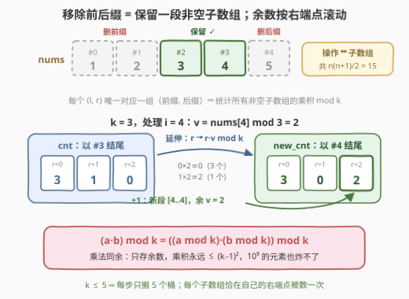
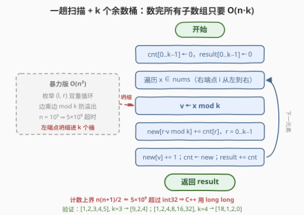

# LeetCode 求出数组的 X 值 I 题解

## 1. 题目概述

- **标题 / 题号**：求出数组的 X 值 I（#3524，medium）
- **链接**：https://leetcode.cn/problems/find-x-value-of-array-i/
- **难度**：中等
- **标签**：数组、数学、动态规划

**题意**：给你一个由**正整数**组成的数组 `nums`，以及一个**正整数** `k`。

你可以对 `nums` 执行**一次**操作：移除任意**不重叠**的前缀和后缀（两者都可以为空），使得 `nums` 仍然**非空**。

你需要找出 `nums` 的 **x 值**：在执行操作后，剩余元素的**乘积**除以 `k` 的**余数**恰好为 `x` 的操作数量。

返回长度为 `k` 的数组 `result`，其中 `result[x]`（`0 <= x <= k-1`）即 `nums` 的 x 值。

**示例 1**：

```text
输入：nums = [1,2,3,4,5], k = 3
输出：[9,2,4]
解释：
  x = 0：所有不会移除 nums[2] == 3 的前后缀移除方式，共 9 种。
  x = 1：如移除后缀 [2,3,4,5] 剩 [1]；移除前缀 [1,2,3] 与后缀 [5] 剩 [4]。
  x = 2：如移除后缀 [3,4,5] 剩 [1,2]；移除前缀 [1] 与后缀 [3,4,5] 剩 [2] 等。
```

**示例 2**：

```text
输入：nums = [1,2,4,8,16,32], k = 4
输出：[18,1,2,0]
解释：全数组乘积含大量因子 2，跨过 [4,8,16,32] 的段余数几乎全为 0；
  余 1 仅 [1] 一段，余 2 为 [1,2] 与 [2] 两段。
```

**示例 3**：

```text
输入：nums = [1,1,2,1,1], k = 2
输出：[9,6]
```

**约束**：

- `1 <= nums.length <= 10^5`
- `1 <= nums[i] <= 10^9`
- `1 <= k <= 5`

> 💡 **读题关键**：「移除一段前缀 + 一段后缀」与「保留中间那段」是同一件事的两种说法——剩下的一定是 `nums[l..r]`（`l <= r`）这段**非空连续子数组**，且每个子数组恰好对应唯一的一组（前缀，后缀）。所以本题本质是：**数一数每个余数 `x` 各有多少个非空子数组，其元素乘积模 `k` 等于 `x`**。总操作数 = 子数组数 = $\frac{n(n+1)}{2}$（示例 1：$15 = 9+2+4$，正好对账）。

## 2. 解题思路

### 2.1 暴力思路：枚举所有子数组

双重循环枚举子数组，右端点固定、左端点向左扩，边乘边取模：

```text
for r = 0 .. n-1:
    p = 1
    for l = r .. 0:            # 往左扩一格
        p = p * nums[l] % k    # p = product(nums[l..r]) mod k
        result[p] += 1
```

复杂度 $O(n^2)$：$n = 10^5$ 时约 $5 \times 10^9$ 次乘法取模，超时。注意**必须边乘边取模**——否则乘积会瞬间溢出（$10^9$ 自乘上百次是天文数字）；而「乘法取模可以随时做」这一点，恰恰埋着正解的种子。

### 2.2 核心观察：按右端点分桶的余数 DP



两个观察联手把 $O(n^2)$ 压到 $O(n \cdot k)$：

**观察一（同余可乘）**：$(a \cdot b) \bmod k = \big((a \bmod k) \cdot (b \bmod k)\big) \bmod k$。子数组 `nums[l..r]` 的乘积余数只依赖「`nums[l..r-1]` 的余数」和 `nums[r] mod k`——**不需要知道真实乘积，也不需要知道左端点在哪**，只需要余数。

**观察二（按右端点去重）**：每个子数组恰有一个右端点。定义

$$\text{cnt}_i[r] = \text{以 } i \text{ 结尾、乘积} \bmod k = r \text{ 的子数组个数}$$

则以 `i` 结尾的全部子数组被压进 $k$ 个桶（$k \le 5$，最多 5 个数）。转移到 `i+1` 时，记 $v = \text{nums}[i+1] \bmod k$：

$$\text{cnt}_{i+1}\big[(r \cdot v) \bmod k\big] \mathrel{+}= \text{cnt}_i[r] \quad (\forall r), \qquad \text{cnt}_{i+1}[v] \mathrel{+}= 1$$

第一项是「旧子数组**延长一格**」（余数从 $r$ 变为 $r \cdot v \bmod k$），第二项是「以 $i+1$ **新起一段**」的单元素子数组。最终

$$\text{result}[x] = \sum_{i=0}^{n-1} \text{cnt}_i[x]$$

每个子数组在且仅在自己的右端点处被数一次——**不重不漏**。2.1 暴力里那层「左端点向左扩」的循环，整体被坍缩成一次 $O(k)$ 的桶迁移。

> ⚠️ **常见坑**：计数可达 $\frac{n(n+1)}{2} \approx 5 \times 10^9$，超过 `int32` 上限（$\approx 2.1 \times 10^9$），C++ 必须用 `long long`；Python 天然大整数无感。

### 2.3 算法流程图



一趟扫描，每个元素做一次 $O(k)$ 的桶迁移；$k \le 5$ 使内层循环是常数级。

### 2.4 示例演算

以示例 1（`nums = [1,2,3,4,5]`，`k = 3`）为例，逐步跟踪 `cnt` 与 `result`：

| $i$ | $x$ | $v = x \bmod 3$ | 延伸：旧桶 → 新桶 | 新段 $[i..i]$ | `cnt`（处理后） | `result`（累加后） |
|-----|-----|-----------------|-------------------|---------------|-----------------|--------------------|
| 0 | 1 | 1 | —（旧桶全空） | 余 1 | $[0,1,0]$ | $[0,1,0]$ |
| 1 | 2 | 2 | $r{=}1$（1 个）→ 2 | 余 2 | $[0,0,2]$ | $[0,1,2]$ |
| 2 | 3 | 0 | $r{=}2$（2 个）→ 0 | 余 0 | $[3,0,0]$ | $[3,1,2]$ |
| 3 | 4 | 1 | $r{=}0$（3 个）→ 0 | 余 1 | $[3,1,0]$ | $[6,2,2]$ |
| 4 | 5 | 2 | $r{=}0$（3 个）→ 0；$r{=}1$（1 个）→ 2 | 余 2 | $[3,0,2]$ | $\mathbf{[9,2,4]}$ |

与期望输出 $[9,2,4]$ 完全一致。注意 $i=2$ 出现 $v = 0$ 后，**所有跨越 `nums[2]=3` 的子数组余数被钉死在 0**——起点 3 种 × 终点 3 种 = 9 个，正是 `result[0] = 9` 的全部来源（$k=3$ 是素数，余数 1、2 相乘永不归零）。

## 3. 参考代码

### C++

```cpp
class Solution {
  public:
    vector<long long> resultArray(vector<int>& nums, int k) {
        vector<long long> result(k, 0);
        vector<long long> cnt(k, 0);
        for (int x : nums) {
            int v = x % k;
            vector<long long> nxt(k, 0);
            for (int r = 0; r < k; r++) {
                nxt[r * v % k] += cnt[r];
            }
            nxt[v] += 1;
            cnt = move(nxt);
            for (int r = 0; r < k; r++) result[r] += cnt[r];
        }
        return result;
    }
};
```

### Python

```python
class Solution:
    def resultArray(self, nums: List[int], k: int) -> List[int]:
        result = [0] * k
        cnt = [0] * k
        for x in nums:
            v = x % k
            nxt = [0] * k
            for r in range(k):
                nxt[r * v % k] += cnt[r]
            nxt[v] += 1
            cnt = nxt
            for r in range(k):
                result[r] += cnt[r]
        return result
```

> 💡 `r * v` 最大 $(k-1)^2 \le 16$，中间值毫无压力；真正要小心的是**计数**——`cnt`、`result` 与 C++ 返回值都必须是 `long long`（官方签名即 `vector<long long>`）。$k = 1$ 时所有余数塌缩为 0，`result[0] = n(n+1)/2`，代码无需特判。

## 4. 复杂度分析

| 维度 | 复杂度 | 说明 |
|------|--------|------|
| 时间复杂度 | $O(n \cdot k)$ | 每个元素一次 $O(k)$ 桶迁移；$k \le 5$，实际是 $\le 5n$ 的线性扫描（对照暴力 $O(n^2)$） |
| 空间复杂度 | $O(k)$ | 仅两层余数桶 `cnt`/`nxt` 与结果数组，与 $n$ 无关 |

## 5. 扩展：带单点修改与查询的 II 版

- **[3525. 求出数组的 X 值 II](https://leetcode.cn/problems/find-x-value-of-array-ii/)**（困难）把同一套计数搬进在线场景：操作改为「移除任意**后缀**」，且每次查询前先执行**单点赋值** `nums[index] = value`（持久生效）并移除前缀 `[0, start-1]`，问从 `start` 出发的每段剩余前缀里乘积余数为 `x` 的方案数——即「以 `start` 为**起点**的后缀乘积余数分布」。朴素重算是 $O(nq)$，正解是把「区间前缀乘积余数分布」放进**线段树**：每个节点存自己区间的余数分布与整段乘积余数，合并两段 = 左段分布 ⊕（右段分布整体乘上左段总余数），$O(k^2)$ 一次；单点更新只重建 $O(\log n)$ 条路径，总复杂度 $O\big((n + q\log n)\cdot k^2\big)$。本题的一趟滚动数组正是它「无修改、只查一次」的退化形态。
- **为什么 $k \le 5$ 是题眼**：桶迁移 $O(k)$、线段树合并 $O(k^2)$、查询拼接 $O(k \log n)$——整条解法链路的可行性都建立在小 $k$ 上。若 $k$ 放大到 $10^9$，只能转向数论性质（如统计余数为 0 所需的质因子个数）另起炉灶。

## 6. 面试要点

1. **「移除不重叠的前缀和后缀」为什么等价于「选一个非空子数组」？**

   > 剩余部分必然形如 `nums[l..r]`（`l <= r`）；反之每个 `nums[l..r]` 唯一对应被删的前缀 `nums[0..l-1]` 与后缀 `nums[r+1..n-1]`，`l <= r` 自动保证两者不重叠。这是一组双射，所以「操作数」=「非空子数组数」= $n(n+1)/2$。

2. **为什么可以全程只存余数、不存乘积？**

   > 乘法同余：$(a \cdot b) \bmod k = \big((a \bmod k)(b \bmod k)\big) \bmod k$。子数组乘积的余数由「去掉最后一个元素后的余数」与「最后一个元素的余数」完全决定，状态压缩进 $[0, k)$，彻底绕开大数乘积与溢出。

3. **DP 状态为什么定义在「以 i 结尾」而不是 (l, r) 二维？**

   > 每个子数组恰有一个右端点，按右端点分桶天然**不重不漏**；且右端点右移一格时，所有旧子数组整体延长，转移只需 $O(k)$。(l, r) 二维状态有 $O(n^2)$ 个，就是暴力。按「以 i 开头」对称定义亦可，但 II 版（固定起点查询）更偏爱按起点组织的可拼接结构。

4. **转移里的 `+1` 和逐步累加 `result` 各自防什么错？**

   > `nxt[v] += 1` 计入单元素子数组 `[i..i]`——漏掉它 `cnt` 永远无法从全零激活，`result` 恒为全零。而 `result[r] += cnt[r]` 必须每步做：只返回最终 `cnt` 会漏掉所有不以 $n-1$ 结尾的子数组（示例 1 将得 $[3,0,2]$ 而非 $[9,2,4]$）。最快的自检手段：$\sum_x \text{result}[x] = n(n+1)/2$。

5. **出现 `nums[i] mod k == 0` 之后，余数分布会怎样？**

   > 所有**跨越** `i` 的子数组余数立刻归 0。示例 1 中跨越 `nums[2]=3` 的子数组恰 $3 \times 3 = 9$ 个，即 `result[0]=9` 的全部来源。可作常数优化：$v=0$ 时 `nxt` 只有 `nxt[0]` 非零。⚠️ 注意这依赖 $k=3$ 为素数；$k$ 为合数时非零余数也可能乘出 0（如 $\bmod\ 4$ 下 $2 \times 2 \equiv 0$）。

## 同类练习题

| # | 题目 | 与本题的关联 |
|---|------|-------------|
| 3525 | [求出数组的 X 值 II](https://leetcode.cn/problems/find-x-value-of-array-ii/) | 姊妹题，单点修改 + 固定起点查询，把本题滚动数组升级为「余数分布线段树」 |
| 152 | [乘积最大子数组](https://leetcode.cn/problems/maximum-product-subarray/)（[题解](../0101-0200/152_乘积最大子数组.md)） | 同样的「以 i 结尾 + 乘积」结构，求最值而非计数，还需为负数与 0 维护双状态 |
| 713 | [乘积小于 K 的子数组](https://leetcode.cn/problems/subarray-product-less-than-k/)（[题解](../0701-0800/713_乘积小于K的子数组.md)） | 正数乘积的单调性让滑动窗口可解——若把本题改成「乘积 < K 的段数」时的对照打法 |
| 974 | [和可被 K 整除的子数组](https://leetcode.cn/problems/subarray-sums-divisible-by-k/)（[题解](../0901-1000/974_和可被K整除的子数组.md)） | 加法版同余计数，前缀和 + 哈希；对照「加法可前缀和、乘法须 DP 桶」的差异根源在于加法有逆元消去、乘法没有 |
| 3448 | [统计可以被最后一个数位整除的子字符串数目](https://leetcode.cn/problems/count-substrings-divisible-by-last-digit/)（[题解](../3401-3500/3448_统计可以被最后一个数位整除的子字符串数目.md)） | 同款「数值只存余数、按右端点滚动」的余数分布 DP |
