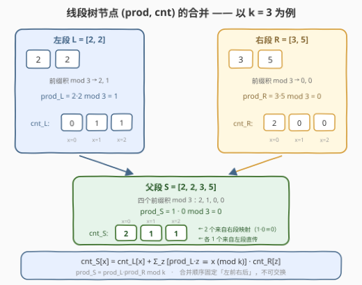
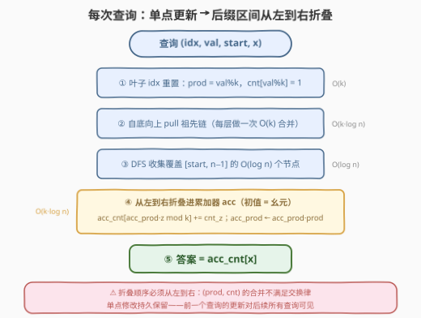

# LeetCode 求出数组的 X 值 II 题解

## 1. 题目概述

- **标题 / 题号**：求出数组的 X 值 II（#3525，hard）
- **链接**：https://leetcode.cn/problems/find-x-value-of-array-ii/
- **难度**：困难
- **标签**：线段树、数组、数学

**题意**：给定一个由**正整数**组成的数组 `nums` 和一个**正整数** `k`，再给定二维数组 `queries`，其中 `queries[i] = [index_i, value_i, start_i, x_i]`。

可以对 `nums` 执行**一次**操作：移除 `nums` 的任意**后缀**（可以是空后缀），使得 `nums` 仍然**非空**。

给定 `x`，`nums` 的 **x 值**定义为：执行以上操作后，剩余元素的**乘积**除以 `k` 的**余数**为 `x` 的方案数。

对 `queries` 中的每个查询依次执行，然后求 `x_i` 对应的 x 值：

1. 将 `nums[index_i]` 更新为 `value_i`（这个更改在**接下来的所有查询中保留**）；
2. 移除前缀 `nums[0..(start_i - 1)]`（`start_i = 0` 表示移空前缀）；
3. 返回一个长度为 `queries.length` 的数组 `result`，`result[i]` 即第 `i` 个查询的答案。

**示例 1**：

```text
输入：nums = [1,2,3,4,5], k = 3, queries = [[2,2,0,2],[3,3,3,0],[0,1,0,1]]
输出：[2,2,2]
解释：
查询 0：nums 变为 [1,2,2,4,5]，移除空前缀。不移除后缀时乘积 80 ≡ 2 (mod 3)；
       移除后缀 [4,5] 后乘积 4 ≡ 1，移除 [2,4,5] 后乘积 2 ≡ 2 —— 共 2 种余数为 2。
查询 1：nums 变为 [1,2,2,3,5]，移除前缀 [1,2,2]。保留 [3]（≡0）或 [3,5]（15≡0）—— 共 2 种。
查询 2：nums 保持 [1,2,2,3,5]，移除空前缀。保留 [1]（≡1）或 [1,2,2]（≡1）—— 共 2 种。
```

**示例 2**：

```text
输入：nums = [1,2,4,8,16,32], k = 4, queries = [[0,2,0,2],[0,2,0,1]]
输出：[1,0]
解释：查询 0 后 nums = [2,2,4,8,16,32]，前缀积 mod 4 为 [2,0,0,0,0,0]，余数 2 仅 1 种；
      查询 1 中没有任何前缀积 ≡ 1 (mod 4)，答案 0。
```

**示例 3**：

```text
输入：nums = [1,1,2,1,1], k = 2, queries = [[2,1,0,1]]
输出：[5]
解释：更新后 nums = [1,1,1,1,1]，5 个非空前缀的乘积全 ≡ 1 (mod 2)。
```

**约束**：

- `1 <= nums.length <= 10^5`
- `1 <= nums[i] <= 10^9`
- `1 <= k <= 5`
- `1 <= queries.length <= 2 * 10^4`
- `0 <= index_i <= nums.length - 1`，`1 <= value_i <= 10^9`
- `0 <= start_i <= nums.length - 1`，`0 <= x_i <= k - 1`

> 💡 **读题关键**：把操作翻译成下标语言——「移除任意后缀且保持非空」⟺ **保留一个非空前缀**。于是第 `i` 个查询的答案就是：满足 $j \in [\text{start}_i,\ n-1]$ 且 $\big(\prod_{t=\text{start}_i}^{j} \text{nums}[t]\big) \bmod k = x_i$ 的下标 `j` 的个数。三个约束决定了数据结构选型：**修改持久化**（不能离线预处理）、**每次起点不同**（不是固定全局前缀）、$k \le 5$（余数只有 $k$ 个，信息可按余数压成计数向量）。

## 2. 解题思路

### 2.1 暴力思路：每个查询重扫后缀

最直接的做法：每个查询先改数组，再从 `start` 开始 $O(n)$ 地累乘统计前缀积余数的命中次数。总量 $O(q \cdot n) = 2 \times 10^4 \times 10^5 = 2 \times 10^9$，必然超时。

注意与第 I 题（3524）的区别：I 题没有修改、一次性统计全部 `x`，一遍扫描即可；本题「**单点修改 + 任意起点后缀的前缀积统计**」的组合，是教科书级的「支持修改的区间聚合」信号——**线段树**。

### 2.2 核心观察：节点维护「前缀乘积余数计数向量」，k ≤ 5 让信息可压缩



每个线段树节点（覆盖区间 $[l, r]$）维护一个二元组：

- **prod**：整段乘积 $\bmod\ k$；
- **cnt[0..k-1]**：$\text{cnt}[x]$ = 区间内**非空前缀**（$\text{nums}[l..j]$，$l \le j \le r$）乘积 $\bmod\ k$ 等于 $x$ 的个数。

**合并**（左段 $L$、右段 $R$，顺序固定左前右后）：

$$\text{prod}_S = \text{prod}_L \cdot \text{prod}_R \bmod k$$

$$\text{cnt}_S[x] = \text{cnt}_L[x] + \sum_{z:\ \text{prod}_L \cdot z \equiv x \ (\mathrm{mod}\ k)} \text{cnt}_R[z]$$

**正确性**：$S$ 的前缀分两族——完全落在 $L$ 内的，直接贡献 $\text{cnt}_L[x]$；跨过中点的，等于「完整左段 × $R$ 的某个前缀」，其乘积 $\equiv \text{prod}_L \cdot z \pmod k$，于是把 $\text{cnt}_R[z]$ 整体搬进桶 $(\text{prod}_L \cdot z) \bmod k$。实现上只需一次 $z = 0 \ldots k-1$ 的循环，**单次合并 $O(k)$**。

> ⚠️ **不能用「除以 prod_L」反解**：模 $k$ 乘法有零因子（如 $k=4$ 时元素 $2$ 不可逆），右段桶只能**正向映射** $z \mapsto \text{prod}_L \cdot z \bmod k$；且左右信息**不可交换**——交换后映射的发起方变了，结果完全不同。这正是 2.3 节查询必须「从左到右」折叠的原因。

> 💡 **为什么 k ≤ 5 是命门**：计数向量长度只有 $k \le 5$，单节点信息 $O(k)$、合并 $O(k)$。若 $k$ 大到 $10^9$，桶根本开不下，这套「按余数分类」的压缩立即失效——数据结构题的「小值域」约束往往就是出题人留的门。

**查询** $[\text{start}, n-1]$：把它分解成 $O(\log n)$ 个节点后**从左到右**折叠进累加器 `acc`（初始为幺元：$\text{prod} = 1 \bmod k$、cnt 全 0）：每并入一个节点，先 `acc_cnt[(acc_prod·z) mod k] += cnt_z`（把节点桶搬进全局余数域），再 `acc_prod ← acc_prod · prod mod k`。最终 `acc_cnt[x]` 即答案。

### 2.3 算法流程图



落实到步骤：

1. **建树** $O(nk)$：叶子为 $(\text{nums}[i] \bmod k,\ \text{单桶} = 1)$，内部节点自底向上合并；不足 $2$ 的幂的**补位叶子取幺元** $(1 \bmod k,\ \text{全 } 0)$；
2. **单点更新**：重置叶子为 $(\text{val} \bmod k,\ \text{单桶} = 1)$，沿祖先链逐层 `pull`，$O(k \log n)$；
3. **后缀查询**：DFS 收集覆盖 $[\text{start}, n-1]$ 的 $O(\log n)$ 个节点（递归先左后右，保证从左到右的顺序），依次折叠进 `acc`，$O(k \log n)$；
4. 输出 `acc_cnt[x]`。

### 2.4 示例演算

用示例 1 的查询 0 走一遍（更新 `nums[2] = 2` 后 `nums = [1,2,2,4,5]`，$k = 3$，`start = 0`，$x = 2$）：

| j | nums[j] | 前缀积 mod 3 | 命中 x = 2 |
|---|---------|--------------|-----------|
| 0 | 1 | 1 | |
| 1 | 2 | 2 | ✓ |
| 2 | 2 | 2·2 = 4 ≡ 1 | |
| 3 | 4 | 1·4 ≡ 1 | |
| 4 | 5 | 1·5 ≡ 2 | ✓ |

答案 **2** ✓。查询 1（`start = 3`，$x = 0$）：前缀积 $3 \equiv 0$、$15 \equiv 0$，命中 2 个 ✓；查询 2（$x = 1$）：前缀积序列 $[1,2,1,0,0]$ 中 $j = 0, 2$ 命中，答案 2 ✓。

再验证一次节点合并（与 2.2 插图同数据，$k = 3$）：

- 段 $[2,2]$：前缀积 $2, 1$ → $\text{prod} = 1$，$\text{cnt} = [0,1,1]$；
- 段 $[3,5]$：前缀积 $0, 0$ → $\text{prod} = 0$，$\text{cnt} = [2,0,0]$；
- 合并 $[2,2,3,5]$：$\text{cnt}$ 初值取左段 $[0,1,1]$，再把右段桶按 $z \mapsto 1 \cdot z$ 映射：$z=0$ → 桶 0 加 2 → $[2,1,1]$；$\text{prod} = 1 \cdot 0 = 0$。
- 实际前缀积 $2, 1, 0, 0$ → $\{0{:}2,\ 1{:}1,\ 2{:}1\}$，与合并结果完全一致 ✓。

## 3. 参考代码

### C++

```cpp
class Solution {
  public:
    vector<int> resultArray(vector<int>& nums, int k, vector<vector<int>>& queries) {
        int n = nums.size();
        int size = 1;
        while (size < n) size <<= 1;
        // prod[p]：节点整段乘积 mod k；cnt[p][x]：段内非空前缀乘积 ≡ x 的个数
        vector<int> prod(2 * size, 1 % k);       // 补位叶子取幺元 1%k
        vector<array<int, 5>> cnt(2 * size);     // k ≤ 5，开 5 格即可
        for (int i = 0; i < n; i++) {
            int r = nums[i] % k;
            prod[size + i] = r;
            cnt[size + i][r] = 1;
        }
        auto pull = [&](int p) {                 // 左段直传 + 右段按 prod_L 正向映射
            int l = 2 * p, r = 2 * p + 1;
            prod[p] = (long long)prod[l] * prod[r] % k;
            cnt[p] = cnt[l];
            for (int z = 0; z < k; z++)
                if (cnt[r][z]) cnt[p][(long long)prod[l] * z % k] += cnt[r][z];
        };
        for (int p = size - 1; p >= 1; p--) pull(p);

        vector<int> ans;
        ans.reserve(queries.size());
        for (auto& q : queries) {
            int idx = q[0], val = q[1], start = q[2], x = q[3];
            int p = size + idx;                  // ① 单点更新叶子
            int r = val % k;
            prod[p] = r;
            cnt[p].fill(0);
            cnt[p][r] = 1;
            for (p >>= 1; p >= 1; p >>= 1) pull(p);   // ② 祖先链逐层重算
            int accProd = 1 % k;                 // ③ 幺元起步，从左到右折叠 [start, size-1]
            array<int, 5> accCnt{};
            function<void(int, int, int)> fold = [&](int p, int nl, int nr) {
                if (nr < start) return;
                if (start <= nl) {               // 整段纳入：桶按 acc_prod 映射后累加
                    for (int z = 0; z < k; z++)
                        if (cnt[p][z]) accCnt[(long long)accProd * z % k] += cnt[p][z];
                    accProd = (long long)accProd * prod[p] % k;
                    return;
                }
                int m = (nl + nr) / 2;           // 部分覆盖：先左后右
                fold(2 * p, nl, m);
                fold(2 * p + 1, m + 1, nr);
            };
            fold(1, 0, size - 1);
            ans.push_back(accCnt[x]);            // ⑤ 答案即折叠后 x 桶的计数
        }
        return ans;
    }
};
```

### Python

```python
class Solution:
    def resultArray(self, nums: List[int], k: int, queries: List[List[int]]) -> List[int]:
        n = len(nums)
        size = 1
        while size < n:
            size <<= 1
        prod = [1 % k] * (2 * size)               # 补位叶子取幺元 1%k
        cnt = [[0] * k for _ in range(2 * size)]  # cnt[p][x]：段内前缀积 ≡ x 的个数
        for i, v in enumerate(nums):
            r = v % k
            prod[size + i] = r
            cnt[size + i][r] = 1

        def pull(p):                              # 左段直传 + 右段按 prod_l 正向映射
            l, r = 2 * p, 2 * p + 1
            prod[p] = prod[l] * prod[r] % k
            c = cnt[l][:]
            pl = prod[l]
            for z in range(k):
                if cnt[r][z]:
                    c[pl * z % k] += cnt[r][z]
            cnt[p] = c

        for p in range(size - 1, 0, -1):
            pull(p)

        ans = []
        for idx, val, start, x in queries:
            p = size + idx                        # ① 单点更新叶子
            r = val % k
            prod[p] = r
            cnt[p] = [0] * k
            cnt[p][r] = 1
            p >>= 1
            while p:                              # ② 祖先链逐层重算
                pull(p)
                p >>= 1

            acc_prod, acc_cnt = 1 % k, [0] * k    # ③ 幺元起步
            stack = [(1, 0, size - 1)]            # DFS 收集 [start, size-1] 的分解节点
            order = []
            while stack:
                p, nl, nr = stack.pop()
                if nr < start:
                    continue
                if start <= nl:
                    order.append(p)
                    continue
                m = (nl + nr) // 2                # 先压右后压左 ⇒ 弹出时左在前
                stack.append((2 * p + 1, m + 1, nr))
                stack.append((2 * p, nl, m))
            for p in order:                       # ④ 从左到右折叠
                for z in range(k):
                    if cnt[p][z]:
                        acc_cnt[acc_prod * z % k] += cnt[p][z]
                acc_prod = acc_prod * prod[p] % k
            ans.append(acc_cnt[x])
        return ans
```

> 💡 **实现细节**：① 补位叶子与累加器初值统一取幺元 $(1 \bmod k,\ \text{全 } 0)$——$k = 1$ 时 $1 \bmod 1 = 0$ 也自洽（一切数 $\bmod\ 1$ 均为 0，答案退化为后缀长度，无需特判）；② 查询区间实际是 $[\text{start}, n-1]$，但补位叶子是幺元、折叠时不改变 `acc`，直接算到 $[\text{start}, \text{size}-1]$ 结果相同，省掉右边界判断；③ Python 版用显式栈「先压右后压左」，弹出顺序天然是从左到右，与 C++ 递归「先左后右」等价。

## 4. 复杂度分析

| 维度 | 复杂度 | 说明 |
|------|--------|------|
| 时间复杂度 | $O\big((n + q \log n) \cdot k\big)$ | 建树 $O(nk)$（每节点一次 $O(k)$ 合并）；每个查询更新链 $O(k \log n)$ + 折叠 $O(k \log n)$；$n = 10^5,\ q = 2 \times 10^4,\ k \le 5$ 时总量约 $4 \times 10^6$ 次基本运算 |
| 空间复杂度 | $O(nk)$ | 线段树 $2 \cdot \text{size}$ 个节点，每节点一个乘积值 + $k$ 维计数向量，$k \le 5$ |

## 5. 扩展

- **无修改版（3524 第 I 题）**：第 I 题允许同时移除不重叠的前缀和后缀，等价于**任选一段非空连续子数组**，对每个 $x$ 统计乘积 $\equiv x$ 的子数组个数。不需要线段树——按右端点扫描，维护「以当前元素结尾」的余数桶 $g$，右移时 $g'[(v \cdot z) \bmod k] \mathrel{+}= g[z]$ 再补上单元素子数组，一遍 $O(nk)$ 出全部答案。
- **信息论视角看 (prod, cnt)**：二元组本质是一个**幺半群**元素——幺元 $(1 \bmod k,\ \text{全 } 0)$，乘法即 2.2 的合并。任何「整体信息 + 前缀信息可按左右拼接」的聚合（区间和、2213 的连续同字符段）都能套同一模板，只要合并满足结合律，线段树就成立（交换律并非必需，本题正是非交换的例子）。
- **若 k 与所有元素互质**：模 $k$ 乘法可逆，理论上能用 $\text{cnt}_R[z] = \text{cnt}_S[\text{prod}_L^{-1} x]$ 反解，但正向 $O(k)$ 映射已经足够，逆元反而引入扩展欧几里得的复杂度——「能正着算就别反着算」。
- **k 变大怎么办**：若 $k$ 的质因数结构简单（如仅含 $2, 3, 5$），可把余数换成「各质因子的指数截断向量」做状态，状态数可能远小于 $k$；一般的 $k$ 则没有普适压缩手段，这正是本题把 $k$ 卡在 5 以内的原因。

## 6. 面试要点

1. **为什么这题是线段树？**

   > 查询 = **持久化**的单点修改 + **任意起点**后缀的「前缀积余数计数」。修改会保留到后续查询，离线预处理失效；每次起点又不同，全局前缀积数组也失效。需要支持修改的动态区间聚合 → 线段树。$k \le 5$ 保证聚合信息能压成 $O(k)$ 的计数向量。

2. **节点为什么必须同时维护 prod 和 cnt？少了 prod 行吗？**

   > 不行。折叠时跨节点前缀 = 「已折叠部分的整体积 × 新节点的某个前缀积」，没有 `prod` 就无法把新节点的桶从「局部余数域」搬移到「全局余数域」。`cnt` 提供计数、`prod` 提供映射规则，缺一不可。

3. **合并为什么不可交换？能用逆元简化吗？**

   > 模 $k$ 乘法有零因子（$k=4$ 时 $2$ 无逆元），右段桶只能正向映射 $z \mapsto \text{prod}_L \cdot z \bmod k$，无法反解。交换左右后映射的发起方变成 `prod_R`，语义完全不同——所以查询折叠、节点合并都必须固定「左前右后」。

4. **后缀查询的折叠顺序怎么保证？初始累加器是什么？**

   > 递归「先左后右」或显式栈「先压右后压左」，使 $O(\log n)$ 个分解节点按从左到右的顺序并入。累加器初值取幺元 $(1 \bmod k,\ \text{全 } 0)$：先并入的桶直传，之后每个节点都要先按当前 `acc_prod` 映射再累加。

5. **k = 1 有什么坑？补位叶子怎么处理？**

   > $k = 1$ 时一切余数为 0，幺元的 `prod` 是 $1 \bmod 1 = 0$ 而不是 1——只要统一用 $1 \bmod k$ 生成幺元（补位叶子、累加器初值），模板无需任何特判，答案自然退化为后缀长度。

> 💡 **一句话总结**：3525 = 3524 加上「单点修改 + 任意起点」——用线段树把「前缀乘积余数桶」做成 $O(k)$ 可合并的节点信息 $(\text{prod}, \text{cnt})$，修改与查询各 $O(k \log n)$，折叠时切记从左到右。

## 同类练习题

| # | 题目 | 与本题的关联 |
|---|------|-------------|
| 3524 | [求出数组的 X 值 I](https://leetcode.cn/problems/find-x-value-of-array-i/) | 无修改的弱化前奏，移除前后缀 ⟺ 任选子数组，一遍扫描维护「以右端点结尾」的余数桶 $O(nk)$ |
| 307 | [区域和检索 - 数组可变](https://leetcode.cn/problems/range-sum-query-mutable/)（[题解](../0301-0400/307_区域和检索 - 数组可变.md)） | 最基础的单点改 + 区间查线段树，本题的骨架模板 |
| 2213 | [由单个字符重复的最长子字符串](https://leetcode.cn/problems/longest-substring-of-one-repeating-character/)（[题解](../2201-2300/2213_由单个字符重复的最长子字符串.md)） | 节点信息（前后缀同字符段）合并非交换、必须左右有序的区间合并型线段树代表 |
| 2569 | [更新数组后处理求和查询](https://leetcode.cn/problems/handling-sum-queries-after-update/)（[题解](../2501-2600/2569_更新数组后处理求和查询.md)） | 节点同时维护多个聚合量（1 的个数 / 总和）并配合懒更新标志，训练「信息怎么设计才能合并」 |
