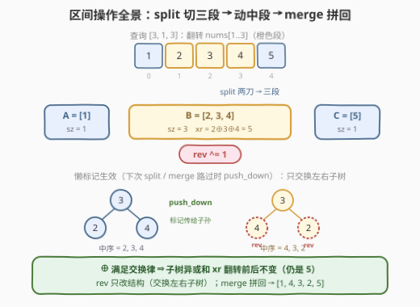
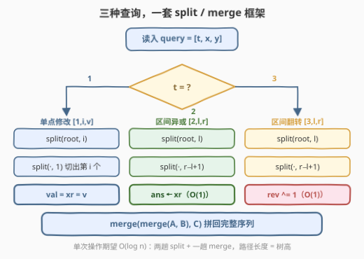

# LeetCode 带子数组反转的区间异或查询 题解

## 1. 题目概述

- **标题 / 题号**：带子数组反转的区间异或查询（#3526，hard）
- **链接**：https://leetcode.cn/problems/range-xor-queries-with-subarray-reversals/
- **难度**：困难
- **标签**：数组、树、二叉搜索树、平衡树

> ⚠️ 本题为 LeetCode 付费题，题意描述根据官方示例用例与 hints 重建，可能与官方题面有出入（函数签名与约束为按惯例的假设）。

**题意**：给定长度为 `n` 的整数数组 `nums` 和查询列表 `queries`。每个查询是以下三种操作之一（下标从 0 开始）：

- `[1, i, v]`：**单点修改**——把 `nums[i]` 赋值为 `v`；
- `[2, l, r]`：**区间异或查询**——返回 $nums[l] \oplus nums[l+1] \oplus \cdots \oplus nums[r]$；
- `[3, l, r]`：**区间翻转**——把子数组 $nums[l..r]$ 原地反转。

把所有类型 2 查询的答案按出现顺序组成数组返回。

**示例 1**：

```text
输入：nums = [1,2,3,4,5], queries = [[2,1,3],[1,2,10],[3,0,4],[2,0,4]]
输出：[5,8]
解释：
  [2,1,3]：nums[1] ⊕ nums[2] ⊕ nums[3] = 2 ⊕ 3 ⊕ 4 = 5
  [1,2,10]：nums[2] 改为 10，数组变为 [1,2,10,4,5]
  [3,0,4]：反转整个数组，变为 [5,4,10,2,1]
  [2,0,4]：5 ⊕ 4 ⊕ 10 ⊕ 2 ⊕ 1 = 8
```

**示例 2**：

```text
输入：nums = [7,8,9], queries = [[1,0,3],[2,0,2],[3,1,2]]
输出：[2]
解释：
  [1,0,3]：nums[0] 改为 3，数组变为 [3,8,9]
  [2,0,2]：3 ⊕ 8 ⊕ 9 = 2
  [3,1,2]：反转子数组 [1,2]，变为 [3,9,8]
```

**约束条件**（付费题未公开，按同类题惯例假设）：

- $1 \le n \le 10^5$
- $1 \le \text{queries.length} \le 10^5$
- $0 \le \text{nums}[i],\ v \le 10^9$
- 所有操作下标合法：$0 \le i < n$，$0 \le l \le r < n$

> 💡 **读题关键**：三种操作里最「毒」的是类型 3——**区间翻转会整体重排下标**，把一切依赖「下标 → 值」静态映射的结构（前缀异或、树状数组、普通线段树）全部摧毁。这题的考点正是：用什么结构既能维护「顺序」，又扛得住 $O(1)$ 触发的整段重排？

## 2. 解题思路

### 2.1 暴力思路：数组直接模拟

拿原数组硬扛：类型 1 赋值 $O(1)$；类型 2 扫一遍 $nums[l..r]$ 异或，$O(r-l+1)$；类型 3 调一次区间反转，也是 $O(r-l+1)$。

```text
for q in queries:
    if q[0] == 1:  a[q[1]] = q[2]                        # O(1)
    elif q[0] == 2: ans.append(异或 a[q[1]..q[2]])        # O(r-l+1)
    else:          reverse(a[q[1]..q[2]])                 # O(r-l+1)
```

总复杂度 $O(nq)$，$n = q = 10^5$ 时约 $10^{10}$ 次操作，必然超时。

更要命的是，「聪明一点」的经典武器在这题也集体失灵：

| 结构 | 能否应付 | 死因 |
|------|---------|------|
| 前缀异或 $P[i] = nums[0] \oplus \cdots \oplus nums[i-1]$ | ❌ | 一次翻转改写中段所有前缀值，区间查询 $P[r+1] \oplus P[l]$ 失效 |
| 树状数组 / 线段树（单点改 + 区间查） | ❌ | 只会改「值」，不会动「位置」——翻转是结构性操作 |
| 平衡树（隐式键） | ✅ | 树的形态与下标解耦：翻转 = 交换子树，聚合信息照常维护 |

> 💡 分水岭在「操作 3」：**值操作**（改一个数、查一段异或）前缀类结构就够；**结构操作**（把一段序列整体反序）需要能 $O(\log n)$ 重排元素的序列数据结构——隐式键平衡树（FHQ Treap / Splay / AVL）是标准答案，官方 hints 也明示了 AVL + split/merge。

### 2.2 核心观察：隐式键平衡树 + 「异或不怕翻转」



把数组挂到一棵**平衡二叉搜索树**上：不再显式存键，**中序遍历顺序就是下标顺序**（所谓隐式键 / implicit key）。每个节点维护三份信息：

| 字段 | 含义 | 维护方式 |
|------|------|---------|
| `sz` | 子树大小（= 子树覆盖的区间长度） | `pull` 自底向上重算 |
| `xr` | 子树内所有值的异或和 | `pull`：$val \oplus xr_l \oplus xr_r$ |
| `rev` | 懒标记：子树整体需要反序 | $O(1)$ 打 / 清，`push` 下传 |

配合两个无旋操作，任意区间都能「切出来单独玩」：

- **`split(u, k)`**：把子树 $u$ 的前 $k$ 个元素切出成另一棵树。下行时靠 `sz` 判断往左还是往右——**这就是隐式键的「比较」**；
- **`merge(a, b)`**：把树 $a$（整体在序列左侧）与树 $b$ 拼回一棵，按随机优先级的堆序决定谁当根。

于是一次区间操作 = 「两刀切出中段 $B$，在 $B$ 的根上 $O(1)$ 读/改，再拼回去」。三个操作全部套进同一个模子（见 2.3 流程图）。

**最关键的一点：翻转不碰 `xr`。** $\oplus$ 满足交换律与结合律，子树内元素**换个顺序异或，结果不变**——所以 `rev` 标记只需要处理「结构」：`push` 时交换左右子树、把标记甩给两个孩子：

$$\text{中序}(u) = L + [v] + R \quad\xrightarrow{\ \text{rev}\ }\quad \text{reverse}(R) + [v] + \text{reverse}(L)$$

交换左右孩子并各自打上 `rev`，恰好得出右式。`sz`、`xr` 纹丝不动——**聚合值零成本、结构信息懒到底**，这是「XOR + 翻转」能被同一棵树 $O(\log n)$ 消化的根本原因。

> ⚠️ **两个易错点**：① `split` / `merge` 下行**必须先 `push` 再读 `sz`**——`rev` 未下传时左右子树的真实顺序是反的，不推标记就会切错位置；② 单点修改后 `pull` 要沿路径回补，`xr` 才能保持正确。

### 2.3 算法流程图



三种查询全部坍缩为「切出中段 → 动一下 → 拼回去」：

- 类型 1：切出**第 $i$ 个元素**（长度 1 的中段），改 `val` 后拼回；
- 类型 2：切出 $[l, r]$ 中段，答案就是 $B$ 根上的 `xr`；
- 类型 3：切出 $[l, r]$ 中段，根上 `rev ^= 1` 完事。

随机优先级保证树高期望 $O(\log n)$，每条 `split`/`merge` 路径长度都是树高量级，单次操作期望 $O(\log n)$。

### 2.4 示例演算

用示例 1 走一遍（数组列展示逻辑状态，实际实现里它始终是树）：

| 查询 | 含义 | 数组状态 | 树上动作 | 输出 |
|------|------|---------|---------|------|
| `[2,1,3]` | 查 $[1,3]$ 异或 | `[1,2,3,4,5]` | 切出 `B=[2,3,4]`，读 `xr` | $2\oplus3\oplus4=5$ |
| `[1,2,10]` | `nums[2]=10` | `[1,2,10,4,5]` | 切出第 2 个元素，`val=xr=10` | — |
| `[3,0,4]` | 翻转 $[0,4]$ | `[5,4,10,2,1]` | 切出整棵树，根打 `rev` | — |
| `[2,0,4]` | 查 $[0,4]$ 异或 | `[5,4,10,2,1]` | 整段即根，直接读 `xr` | $5\oplus4\oplus10\oplus2\oplus1=8$ |

> 💡 注意第 3 步：翻转后**没有任何节点值被改写**，只是 `rev` 标记 + 后续 `push` 交换子树——最后一次查询能拿到正确答案，全靠 `split`/`merge` 路过时勤勤恳恳地 `push`。

## 3. 参考代码

### C++

```cpp
class Solution {
  public:
    vector<int> xorQueries(vector<int>& nums, vector<vector<int>>& queries) {
        int n = nums.size();
        t.assign(n, {});
        mt19937 rng(random_device{}());
        for (int i = 0; i < n; i++) {
            t[i].val = t[i].xr = nums[i];  // 初始：单节点子树
            t[i].pri = (int)rng();         // 随机堆序 → 期望树高 O(log n)
        }
        int root = -1;
        for (int i = 0; i < n; i++) root = merge(root, i);

        vector<int> ans;
        for (auto& q : queries) {
            auto [a, bc] = split(root, q[1]);                          // 第一刀：切出 [0, x-1]
            auto [b, c] = split(bc, q[0] == 1 ? 1 : q[2] - q[1] + 1);  // 第二刀：切出中段 B
            if (q[0] == 1)      t[b].val = t[b].xr = q[2];  // 单点赋值：B 只有一个节点
            else if (q[0] == 2) ans.push_back(t[b].xr);      // 区间异或：根上 O(1) 读
            else                t[b].rev ^= 1;               // 区间翻转：打懒标记
            root = merge(a, merge(b, c));
        }
        return ans;
    }

  private:
    struct Node { int lc = -1, rc = -1, sz = 1, val, xr, pri; bool rev = false; };
    vector<Node> t;

    int sz(int u) { return u == -1 ? 0 : t[u].sz; }
    int xr(int u) { return u == -1 ? 0 : t[u].xr; }

    void push(int u) {  // 懒标记下传：只动结构，不动 sz / xr
        if (t[u].rev) {
            swap(t[u].lc, t[u].rc);
            if (t[u].lc != -1) t[t[u].lc].rev ^= 1;
            if (t[u].rc != -1) t[t[u].rc].rev ^= 1;
            t[u].rev = false;
        }
    }
    void pull(int u) {  // 自底向上重算聚合信息
        t[u].sz = 1 + sz(t[u].lc) + sz(t[u].rc);
        t[u].xr = t[u].val ^ xr(t[u].lc) ^ xr(t[u].rc);
    }
    pair<int, int> split(int u, int k) {  // 前 k 个元素 vs 其余
        if (u == -1) return {-1, -1};
        push(u);  // 必须先推标记再读 sz
        if (k <= sz(t[u].lc)) {
            auto [a, b] = split(t[u].lc, k);
            t[u].lc = b;
            pull(u);
            return {a, u};
        }
        auto [a, b] = split(t[u].rc, k - sz(t[u].lc) - 1);
        t[u].rc = a;
        pull(u);
        return {u, b};
    }
    int merge(int a, int b) {  // 堆序拼回：a 整体在 b 左侧
        if (a == -1) return b;
        if (b == -1) return a;
        if (t[a].pri < t[b].pri) {
            push(a);
            t[a].rc = merge(t[a].rc, b);
            pull(a);
            return a;
        }
        push(b);
        t[b].lc = merge(a, t[b].lc);
        pull(b);
        return b;
    }
};
```

### Python

```python
class Solution:
    def xorQueries(self, nums: List[int], queries: List[List[int]]) -> List[int]:
        n = len(nums)
        val, xr, sz = nums[:], nums[:], [1] * n
        lc, rc, rev = [-1] * n, [-1] * n, [0] * n
        pri = [random.randrange(1 << 30) for _ in range(n)]

        def push(u):  # 只动结构：交换左右子树 + 标记下传
            if rev[u]:
                lc[u], rc[u] = rc[u], lc[u]
                if lc[u] != -1: rev[lc[u]] ^= 1
                if rc[u] != -1: rev[rc[u]] ^= 1
                rev[u] = 0

        def pull(u):
            l, r = lc[u], rc[u]
            sz[u] = 1 + (sz[l] if l != -1 else 0) + (sz[r] if r != -1 else 0)
            xr[u] = val[u] ^ (xr[l] if l != -1 else 0) ^ (xr[r] if r != -1 else 0)

        def split(u, k):  # 前 k 个 vs 其余；下行前先推标记
            if u == -1:
                return -1, -1
            push(u)
            lsz = sz[lc[u]] if lc[u] != -1 else 0
            if k <= lsz:
                a, b = split(lc[u], k)
                lc[u] = b
                pull(u)
                return a, u
            a, b = split(rc[u], k - lsz - 1)
            rc[u] = a
            pull(u)
            return u, b

        def merge(a, b):  # a 整体在 b 左侧，按堆序拼接
            if a == -1: return b
            if b == -1: return a
            if pri[a] < pri[b]:
                push(a)
                rc[a] = merge(rc[a], b)
                pull(a)
                return a
            push(b)
            lc[b] = merge(a, lc[b])
            pull(b)
            return b

        root = -1
        for i in range(n):
            root = merge(root, i)

        ans = []
        for t, x, y in queries:
            a, bc = split(root, x)                      # 切出 [0, x-1]
            b, c = split(bc, 1 if t == 1 else y - x + 1)  # 切出中段
            if t == 1:
                val[b] = xr[b] = y
            elif t == 2:
                ans.append(xr[b])
            else:
                rev[b] ^= 1
            root = merge(a, merge(b, c))
        return ans
```

> 💡 两份代码均已与数组暴力模拟对拍验证（300 组随机用例）。函数名与签名按题意重建假设；核心是 `push` / `pull` / `split` / `merge` 四件套，换任何语言都一样。Python 版注意递归深度：树高期望 $O(\log n)$（$n=10^5$ 时约 50 层），默认递归上限足够。

## 4. 复杂度分析

| 维度 | 复杂度 | 说明 |
|------|--------|------|
| 时间复杂度 | $O((n + q)\log n)$ | 建树 $n$ 次 `merge` 共 $O(n \log n)$（也可用笛卡尔树栈建法做到 $O(n)$）；每次查询两趟 `split` + 一趟 `merge`，期望 $O(\log n)$ |
| 空间复杂度 | $O(n)$ | 节点池 $n$ 个节点，每个 $O(1)$ 字段；对照暴力只需 $O(1)$ 额外空间，是用空间换「结构性操作」的能力 |

## 5. 扩展：数据结构选型对比

- **官方 hints 的 AVL**：节点同样带 `subtree XOR / size / 懒翻转标记`，split/merge 借助旋转实现。旋转式平衡树在下旋前同样要 `push`，实现比 FHQ Treap 麻烦一些，复杂度同阶。
- **Splay（伸展树）**：均摊 $O(\log n)$，「切区间 → splay 到根 → 打标记」一气呵成，是同类题的另一主流写法；代价是均摊而非期望，且常数偏大。
- **块状链表 / √ 分块**：每块维护块内异或和与块级 `rev` 标记，翻转 = 暴力拆两头 + 整块标记，单操作 $O(\sqrt n)$，$q = 10^5$ 时约 $3\times10^7$——代码短，是「写不出平衡树」时的保底方案。
- **退化验证**：若去掉操作 3，本题瞬间变成 [1310](https://leetcode.cn/problems/xor-queries-of-a-subarray/)（前缀异或）+ [307](https://leetcode.cn/problems/range-sum-query-mutable/)（树状数组）的拼接，$O((n+q)\log n)$ 都不用——**本题全部难度都来自「翻转」二字**。
- **姊妹模型**：去掉操作 1、2 只留翻转，就是经典的「文艺平衡树」（洛谷 P3391）；本题 = 文艺平衡树 + 点修改 + 区间异或查询的合体。

## 6. 面试要点

1. **为什么前缀异或 / 树状数组 / 线段树都救不了？**

   > 它们维护的是「**下标 → 值**」的静态映射：值变了我知道怎么增量更新，但翻转把中段所有位置上的值**整体搬家**，前缀异或要重算 $O(n)$ 个前缀，线段树没有任何旋转/交换机制。结构操作需要「形态与下标解耦」的序列结构。

2. **为什么翻转不需要重算 `xr`？**

   > $\oplus$ 满足交换律：子树内元素任意重排，异或和不变。所以 `rev` 只负责结构（交换左右子树），`sz`/`xr` 完全不动。若把聚合换成**不满足交换律**的运算（如字符串拼接、矩阵乘），翻转时聚合值也得跟着重算，懒标记就没这么便宜了。

3. **`push` 的时机为什么那么讲究？**

   > `split` 靠 `sz[lc]` 决定下行方向，而 `rev` 未下传时左右子树的真实顺序是反的——不先 `push` 就会切错位置。同理 `merge` 在拆开某棵树前也要 `push`。口诀：**凡是要读子树信息或拆子树，先推标记**。

4. **复杂度为什么是期望 $O(\log n)$？**

   > FHQ Treap 给每个节点随机优先级，`merge` 按堆序拼、`split` 沿树高切，单次操作走过的节点数 = 树高。随机优先级下树高期望 $O(\log n)$（可类比随机快速排序的期望划分）。

5. **单点修改能不能不切两刀？**

   > 可以：从根出发，用 `sz` 逐步定位第 $i$ 个元素（沿途 `push`），改 `val` 后回程 `pull`。两刀 `split` 的写法与另外两种操作**共用同一框架**，代码更统一，还能顺手处理「区间赋值」这类扩展。

> 💡 **一句话总结**：序列上同时存在**值操作**与**结构操作**时，上隐式键平衡树——`sz` 定位、`xr` 聚合、`rev` 懒翻转；异或的交换律让翻转的维护成本降为一次 $O(1)$ 打标记。

## 同类练习题

| # | 题目 | 与本题的关联 |
|---|------|-------------|
| 1310 | [子数组异或查询](https://leetcode.cn/problems/xor-queries-of-a-subarray/) | 本题去掉所有修改/翻转的静态版，前缀异或一步到位——体会「没有结构操作时」的下限在哪 |
| 307 | [区域和检索 - 数组可修改](https://leetcode.cn/problems/range-sum-query-mutable/) | 单点改 + 区间查的最低配置（树状数组/线段树），对应本题操作 1/2 |
| 715 | [Range 模块](https://leetcode.cn/problems/range-module/) | 动态开点线段树 + 懒标记的区间维护思想，与 `rev` 标记的「延迟生效」同源 |
| 732 | [我的日程安排表 III](https://leetcode.cn/problems/my-calendar-iii/) | 懒标记「攒着不算、路过再推」的经典训练，帮你把 `push` 时机焊进肌肉记忆 |
