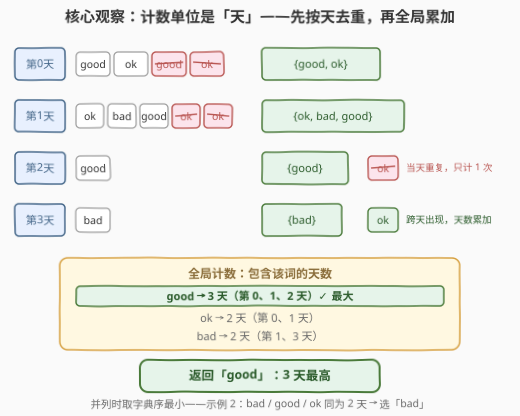
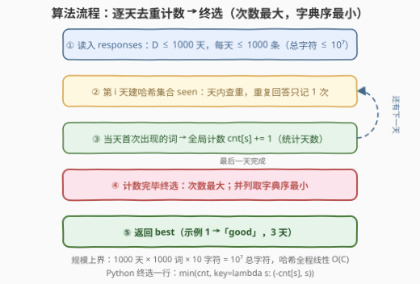

# LeetCode 找到最常见的回答 题解

## 1. 题目概述

- **标题 / 题号**：找到最常见的回答（#3527，medium）
- **链接**：https://leetcode.cn/problems/find-the-most-common-response/
- **难度**：中等
- **标签**：数组、哈希表、字符串、计数

**题意**：给你一个二维字符串数组 `responses`，其中 `responses[i]` 是一个字符串数组，表示第 $i$ 天调查的回答结果。请返回在对每个 `responses[i]` 中的回答**去重**后，所有天数中**最常见**的回答。如果有多个回答出现频率相同，则返回**字典序最小**的那个回答。

**示例 1**：

```text
输入：responses = [["good","ok","good","ok"],["ok","bad","good","ok","ok"],["good"],["bad"]]
输出："good"
解释：每个列表去重后，responses = [["good","ok"], ["ok","bad","good"], ["good"], ["bad"]]。
      "good" 出现了 3 次，"ok" 出现了 2 次，"bad" 也出现了 2 次。
      返回 "good"，因为它出现的频率最高。
```

**示例 2**：

```text
输入：responses = [["good","ok","good"],["ok","bad"],["bad","notsure"],["great","good"]]
输出："bad"
解释：每个列表去重后，responses = [["good","ok"], ["ok","bad"], ["bad","notsure"], ["great","good"]]。
      "bad"、"good"、"ok" 都出现了 2 次。
      返回 "bad"，因为它在这些最高频率的词中字典序最小。
```

**约束**：

- $1 \le \text{responses.length} \le 1000$（天数 $D$）
- $1 \le \text{responses}[i].length \le 1000$（每天回答数 $L_i$）
- $1 \le \text{responses}[i][j].length \le 10$（单词长度）
- `responses[i][j]` 仅由小写英文字母组成

> 💡 **读题关键**：① 去重的口径是**天内**——同一个词在同一天出现 5 次只算 1 次，但跨天每次都算，所以统计量的真实定义是「**包含该词的天数**」，不是「出现总次数」；② 并列时取**字典序最小**，比较方向是「次数降序 + 单词升序」的复合最优；③ 规模上界：总词数 $\le 10^6$、总字符数 $C \le 1000 \times 1000 \times 10 = 10^7$，任何基于逐词哈希的线性做法都绰绰有余。

## 2. 解题思路

### 2.1 暴力思路

最直觉的写法反而是个**陷阱**：把二维数组摊平，直接 `Counter` 数每个词的总出现次数。用示例 1 一验就穿帮——`ok` 原始出现 5 次（第 0 天 2 次 + 第 1 天 3 次），`good` 只出现 4 次，摊平计数会误判 `ok` 是答案；但按「天数」口径，`good` 占 3 天、`ok` 只占 2 天，正确答案是 `good`。**不去重的计数口径从根上就是错的**。

正确的暴力版：对每个候选词 $s$、每一天线性扫一遍 `responses[i]` 判断 $s$ 是否出现，是则该词天数 +1。代价是 $O(\text{不同词数} \times \sum L_i)$，最坏 $10^6 \times 10^6 = 10^{12}$ 次字符串比较，不可行。退一步，每天先用列表线性查重去重（$O(L_i^2)$），再对去重结果计数，总量 $O(\sum L_i^2) = 10^9$，仍然偏慢。把「查重」和「计数」都换成哈希结构，就是下面的最优解。

### 2.2 核心观察：两级哈希——当天集合去重 + 全局计数器



**观察一（统计量的本质）**：答案要的是 $\text{cnt}(s) = \left| \{\, i : s \in \text{responses}[i] \,\} \right|$——「包含 $s$ 的天数」。这解释了为什么必须按天去重：天内的重复是**同一份**贡献，跨天的出现才是**不同份**。

**观察二（两套哈希恰好对应两级）**：第 1 级是**当天的哈希集合** `seen`，负责回答「这个词今天是不是第一次见」；第 2 级是**全局的哈希表** `cnt`，负责累加「第几天首次见到它」。每个词的每次出现至多触发一次集合插入 + 一次计数自增，全程均摊 $O(1)$ 次哈希操作。

**观察三（终选必须在计数完毕后做）**：计数过程中任何中间「冠军」都可能被后续天数反超或并列替换（`good` 在第 0 天后领先，第 1 天就被 `ok` 追平），所以**不能边计数边定答案**，只能等所有天处理完，再对 `cnt` 做一次线性扫描，按「次数更大，或次数相同且字典序更小」更新最优。

**观察四（规模账）**：总字符数 $C \le 10^7$，字符串哈希与比较的代价正比于词长，整体 $O(C)$，线性扫一遍毫无压力。

### 2.3 算法流程图



| 步骤 | 动作 | 说明 |
|------|------|------|
| ① 初始化 | `cnt` 为空哈希表 | 键为单词，值为「出现天数」 |
| ② 逐天处理 | 对第 $i$ 天建哈希集合 `seen` | 天内查重，均摊 $O(1)$ |
| ③ 计数 | `seen.insert(s)` 成功 ⇒ `cnt[s]++` | 「今天首次见到」才累计一天 |
| ④ 循环 | $i \to i+1$，回到 ② | 共 $D$ 轮；最后一天完成后进入终选 |
| ⑤ 终选 | 扫描 `cnt`，取（次数最大，字典序最小） | Python 一行：`min(cnt, key=lambda s: (-cnt[s], s))` |

### 2.4 示例演算

用**示例 1**（`responses = [["good","ok","good","ok"],["ok","bad","good","ok","ok"],["good"],["bad"]]`）逐步走一遍：

| 天 | 原始回答 | 去重后集合 | 当天新词 | 累计计数（词 → 天数） |
|----|---------|-----------|---------|----------------------|
| 0 | good, ok, good, ok | {good, ok} | good, ok | good=1, ok=1 |
| 1 | ok, bad, good, ok, ok | {ok, bad, good} | ok, bad, good | good=2, ok=2, bad=1 |
| 2 | good | {good} | good | good=3 |
| 3 | bad | {bad} | bad | bad=2 |

计数完毕：`good=3, ok=2, bad=2`。`good` 以 3 天独占鳌头，返回 $\boxed{\text{"good"}}$。注意第 1 天的 `ok` 出现了 3 次，但只贡献 1 天——这正是去重口径的意义。

再看**示例 2**（tie-break 生效）：去重后四天的集合为 `{good,ok}`、`{ok,bad}`、`{bad,notsure}`、`{great,good}`，计数为 `good=2, ok=2, bad=2, notsure=1, great=1`。三个词并列 2 天，按字典序 `bad < good < ok`，返回 $\boxed{\text{"bad"}}$。

## 3. 参考代码

### C++

```cpp
class Solution {
  public:
    string findCommonResponse(vector<vector<string>>& responses) {
        unordered_map<string, int> cnt;          // 单词 -> 出现的天数
        for (auto& day : responses) {
            unordered_set<string> seen;          // 当天集合：天内查重
            for (auto& s : day) {
                if (seen.insert(s).second) {     // insert 成功 = 今天首次见到
                    cnt[s]++;                    // 才给全局天数 +1
                }
            }
        }
        string best;
        int bestCnt = 0;
        for (auto& [s, c] : cnt) {               // 终选：次数最大，并列取字典序最小
            if (c > bestCnt || (c == bestCnt && s < best)) {
                best = s;
                bestCnt = c;
            }
        }
        return best;
    }
};
```

### Python

```python
class Solution:
    def findCommonResponse(self, responses: List[List[str]]) -> str:
        cnt = Counter()
        for day in responses:
            cnt.update(set(day))                 # set(day) 按天去重，当天只算一次
        return min(cnt, key=lambda s: (-cnt[s], s))   # 次数降序 + 字典序升序
```

> ⚠️ **易错点**：① **不去重直接摊平计数**——口径错误，示例 1 会输出 `ok`；② **边计数边维护答案**——计数未完成时 `cnt` 单调变化，中间冠军不可信，必须终选；③ C++ 终选的初始 `best` 为空串、`bestCnt = 0` 是安全的：`cnt` 中任何词的天数 $\ge 1 > 0$，首个条目必然触发更新；④ **字典序比较方向**——是取**最小**不是最大（与 692 题「前 K 个高频单词」的并列规则方向相反，容易肌肉记忆写反）。

## 4. 复杂度分析

| 维度 | 复杂度 | 说明 |
|------|--------|------|
| 时间复杂度 | $O(C)$ | $C = \sum_{i,j} \lvert \text{responses}[i][j] \rvert \le 10^7$；每次出现至多 1 次集合插入 + 1 次计数自增，字符串哈希/比较 $O(\lvert s \rvert)$，终选再扫一遍不同词 |
| 空间复杂度 | $O(C')$ | $C'$ 为去重后所有不同单词的总字符数，上界同样 $10^7$；`seen` 是逐天复用的临时集合，峰值不超过当天词数 |
| 数据范围验证 | — | $1000 \text{ 天} \times 1000 \text{ 词} \times 10 \text{ 字符} = 10^7$ 总字符，线性做法远低于时限 |
| 输出确定性 | — | 「次数最大 + 字典序最小」的复合最优在 `cnt` 上唯一确定，与哈希表遍历顺序无关 |

## 5. 扩展：单哈希表去重——lastDay 标记法

「当天集合 + 全局计数」要维护两套结构，且每天都要新建一个 `set`。其实可以**合并成一张表**：全局 `map<string, (lastDay, cnt)>`，扫到单词 $s$ 时看它的 `lastDay` 是否等于今天——不等才说明「今天首次见到」，更新 `lastDay` 并把天数 +1：

```cpp
class Solution {
  public:
    string findCommonResponse(vector<vector<string>>& responses) {
        unordered_map<string, pair<int, int>> info;    // s -> (lastDay, 天数)
        for (int i = 0; i < (int)responses.size(); ++i) {
            for (auto& s : responses[i]) {
                auto it = info.try_emplace(s, -1, 0).first;  // lastDay 初始化为 -1！
                if (it->second.first != i) {
                    it->second.first = i;
                    ++it->second.second;
                }
            }
        }
        string best;
        int bestCnt = 0;
        for (auto& [s, kv] : info) {
            if (kv.second > bestCnt || (kv.second == bestCnt && s < best)) {
                best = s;
                bestCnt = kv.second;
            }
        }
        return best;
    }
};
```

> ⚠️ 这个写法最经典的坑：**新插入条目的 `lastDay` 必须初始化为 $-1$**（`try_emplace(s, -1, 0)`），不能依赖默认构造的 $0$——否则第 0 天的每个词都会被误判为「今天已见过」而漏计一天。这与「滑动窗口内用 last 下标去重」是同一个套路。

两点补充：

1. **确定性替代**：若担心哈希最坏情形（对抗性数据卡 `unordered_map`），可对每天 `sort` 后只统计「相邻不同」的词，去重与计数都不经哈希，代价 $O(\sum L_i \log L_i)$ 次字符串比较；
2. **Python 的 `Counter.update(set(day))`** 本质就是「先集合去重、再逐个计数」的两级结构，语义与本节单表写法等价，且 `set(day)` 的构造本身是 $O(\sum \lvert s \rvert)$ 的，不会改变复杂度量级。

## 6. 面试要点

1. **为什么直接数总出现次数是错的？**

   - 题目定义的频率是「包含该词的**天数**」，不是出现次数。示例 1 中 `ok` 出现 5 次、`good` 出现 4 次，但按天数 `good` 占 3 天、`ok` 只占 2 天，答案恰好相反——天内重复是同一份贡献，必须先按天去重。

2. **并列时怎么选？能否在计数过程中顺便维护答案？**

   - 取「次数降序 + 单词升序」的复合最优，即 Python 的 `min(cnt, key=lambda s: (-cnt[s], s))`。不能边计数边定答案：计数未完成时任何中间冠军都可能被后续天数反超或并列替换，必须全部处理完再做一次终选扫描。

3. **两套哈希结构能否合并成一张表？**

   - 能：全局表记 `(lastDay, cnt)`，扫到词时比较 `lastDay` 与当前天下标，不同才累加。注意新插入条目的 `lastDay` 要初始化为 $-1$，否则第 0 天漏计。这与滑动窗口去重、求「每个元素最后出现位置」是同款 last-seen 技巧。

4. **复杂度瓶颈在哪？字符串哈希会被卡吗？**

   - 时间 $O(C)$、$C \le 10^7$ 总字符，瓶颈在字符串哈希与比较本身。日常提交完全够用；若追求确定性，可按天排序后统计相邻不同（$O(\sum L_i \log L_i)$），彻底绕开哈希最坏情形。

5. **如果题目从 top-1 推广到 top-K 呢？**

   - 计数阶段不变，终选换成「按 $(-\text{cnt}, s)$ 排序取前 K」或维护大小为 K 的堆——正是 [692. 前 K 个高频单词](https://leetcode.cn/problems/top-k-frequent-words/) 的考法，也是桶排序优化到 $O(n \log k)$ 的入口（见 [347. 前 K 个高频元素](https://leetcode.cn/problems/top-k-frequent-elements/)）。

## 同类练习题

| # | 题目 | 与本题的关联 |
|---|------|-------------|
| 819 | [最常见的单词](https://leetcode.cn/problems/most-common-word/)（[站内题解](../0801-0900/819_最常见的单词.md)） | 同款「统计最高频单词」，多了禁用词过滤与标点清洗的预处理 |
| 692 | [前 K 个高频单词](https://leetcode.cn/problems/top-k-frequent-words/)（[站内题解](../0601-0700/692_前K个高频单词.md)） | 哈希计数 + 字典序并列规则从 top-1 推广到 top-K，注意并列方向与本题相反 |
| 2085 | [统计出现过一次的公共字符串](https://leetcode.cn/problems/count-common-words-with-one-occurrence/)（[站内题解](../2001-2100/2085_统计出现过一次的公共字符串.md)） | 两个数组各建计数器再组合查询，训练「先计数后判定」的两段式 |
| 2053 | [数组中第 K 个独一无二的字符串](https://leetcode.cn/problems/kth-distinct-string-in-an-array/)（[站内题解](../2001-2100/2053_数组中第K个独一无二的字符串.md)） | `Counter` 一遍统计出现次数，再线性找第 k 个只出现一次的词 |
| 347 | [前 K 个高频元素](https://leetcode.cn/problems/top-k-frequent-elements/)（[站内题解](../0301-0400/347_前K个高频元素.md)） | 哈希计数 + 桶排序取 top-K 的经典，可与本题的终选策略对照 |
