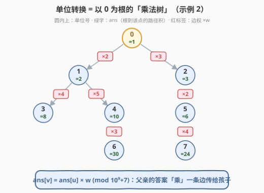
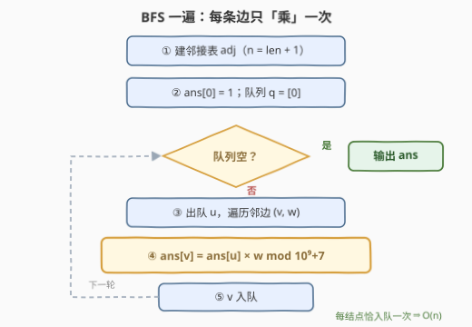

# LeetCode 单位转换 I 题解

## 1. 题目概述

- **标题 / 题号**：单位转换 I（#3528，medium）
- **链接**：https://leetcode.cn/problems/unit-conversion-i/
- **难度**：中等
- **标签**：图、广度优先搜索、深度优先搜索、树

**题意**：有 $n$ 种单位，编号 $0$ 到 $n-1$。给定长度为 $n-1$ 的二维整数数组 `conversions`，其中 `conversions[i] = [sourceUnit_i, targetUnit_i, conversionFactor_i]`，表示 **1 个 `sourceUnit_i` 类型的单位等于 `conversionFactor_i` 个 `targetUnit_i` 类型的单位**。

请返回长度为 $n$ 的数组 `baseUnitConversion`，其中 `baseUnitConversion[i]` 表示 **1 个 0 类型单位等于多少个 i 类型单位**。结果可能很大，每个值对 $10^9+7$ 取模后返回。

**示例 1**：

```text
输入：conversions = [[0,1,2],[1,2,3]]
输出：[1,2,6]
解释：由 conversions[0]，1 个 0 型单位 = 2 个 1 型单位；
     再由 conversions[1]，1 个 0 型单位 = 2×3 = 6 个 2 型单位。
```

**示例 2**：

```text
输入：conversions = [[0,1,2],[0,2,3],[1,3,4],[1,4,5],[2,5,2],[4,6,3],[5,7,4]]
输出：[1,2,3,8,10,6,30,24]
```

**约束**：

- $2 \le n \le 10^5$
- `conversions.length == n - 1`
- $0 \le \text{sourceUnit}_i, \text{targetUnit}_i < n$
- $1 \le \text{conversionFactor}_i \le 10^9$
- 保证单位 0 可以通过**唯一**的转换路径（不需要反向转换）转换为任何其他单位

> 💡 最后一条约束是解题钥匙：$n-1$ 条边 +「根到每个结点路径唯一」⇒ 转换关系是一棵**以 0 为根的有向树**——无环、每个非根结点恰有一条入边。这个结构性质决定了整道题的解法形态。

## 2. 解题思路

### 2.1 暴力思路：对每个结点单独找路径

最直接的做法：对每个 $i$，从结点 0 出发做一次 DFS/BFS 搜索到 $i$，沿途把边权全部乘起来。单次搜索 $O(n)$，$n$ 个结点总计 $O(n^2)$——$n = 10^5$ 时约 $10^{10}$ 次操作，必然超时。

也可以倒着来：对每个 $i$ 反复扫描 `conversions` 找「谁是 $i$ 的父亲」，沿父亲链一路乘回根——同样是平方级。两种写法的瓶颈一模一样：**根到某个结点的那段路径，被成千上万次查询重复行走**。

### 2.2 核心观察：乘法沿树边自顶向下传播



把每条转换看成一条有向边 $u \xrightarrow{\times w} v$，整个输入就是一棵以 0 为根的树（见上图，节点圆内下方的绿字即为答案）。设 $\text{ans}[u]$ 表示「1 个 0 型单位等于多少个 u 型单位」，则：

$$\text{ans}[v] \;=\; \text{ans}[u] \times w \pmod{10^9+7}$$

- **根**：$\text{ans}[0] = 1$（单位与自身相等）；
- **任意结点**的答案 = 根到它的路径上所有边权之积。而这条路径**唯一**，且必然先经过它的父亲——所以父亲的答案一旦确定，儿子只差「再乘一条边」。

于是从根出发做一次 BFS（或迭代 DFS），按「父先于子」的顺序访问，每条边只乘一次，$n$ 个答案一遍全部出炉：

- **同余性质**保证边乘边取模不改变结果：$(a \times b) \bmod M = ((a \bmod M) \times (b \bmod M)) \bmod M$；
- **树上每个非根结点恰有一条入边**，BFS 中每个结点只会被自己的父亲「发现」一次——连 `visited` 数组都不需要；
- 题目保证「不需要反向转换」，邻接表只存 父 → 子 的**单向边**即可。

> ⚠️ **C++ 溢出提醒**：`ans[u]` 与 `w` 都是 `int` 时直接相乘会溢出（乘积可达约 $10^{18}$）。先转 `long long` 再乘是安全的——$(10^9+6) \times 10^9 \approx 10^{18} < 2^{63} \approx 9.2 \times 10^{18}$，一次 64 位乘法后立刻取模即可。

### 2.3 算法流程图



| 步骤 | 动作 | 说明 |
|------|------|------|
| ① | 建邻接表 | $n = \text{len(conversions)} + 1$；只存 父 → 子 单向边 |
| ② | 初始化 | $\text{ans}[0] = 1$（自己换自己），根入队 |
| ③ | 出队 $u$ | BFS 顺序天然保证父先于子 |
| ④ | 松弛每条邻边 | $\text{ans}[v] = \text{ans}[u] \cdot w \bmod M$ |
| ⑤ | $v$ 入队 | 队列空时，全部 $n$ 个答案就绪 |

### 2.4 示例演算

以示例 2 的树（2.2 插图）走一遍 BFS：

| 出队 $u$ | 松弛的边 $(v, w)$ | 新写入 | ans 快照 |
|---|---|---|---|
| 0 | $(1,2),\ (2,3)$ | $\text{ans}[1]=1{\times}2,\ \text{ans}[2]=1{\times}3$ | $[1,2,3,-,-,-,-,-]$ |
| 1 | $(3,4),\ (4,5)$ | $\text{ans}[3]=2{\times}4,\ \text{ans}[4]=2{\times}5$ | $[1,2,3,8,10,-,-,-]$ |
| 2 | $(5,2)$ | $\text{ans}[5]=3{\times}2$ | $[1,2,3,8,10,6,-,-]$ |
| 3 | —（叶） | — | 不变 |
| 4 | $(6,3)$ | $\text{ans}[6]=10{\times}3$ | $[1,2,3,8,10,6,30,-]$ |
| 5 | $(7,4)$ | $\text{ans}[7]=6{\times}4$ | $[1,2,3,8,10,6,30,24]$ ✓ |
| 6、7 | —（叶） | — | 输出 $[1,2,3,8,10,6,30,24]$ |

与官方输出完全一致。注意答案写入的时机是「$v$ 入队时」——此后 $v$ 出队前答案不会再变，因为树上没有第二条指向 $v$ 的边。

## 3. 参考代码

### C++

```cpp
class Solution {
  public:
    vector<int> baseUnitConversions(vector<vector<int>>& conversions) {
        const long long MOD = 1'000'000'007;
        int n = conversions.size() + 1;
        vector<vector<pair<int, int>>> adj(n);
        for (auto& c : conversions) {
            adj[c[0]].emplace_back(c[1], c[2]);      // 只存 父 → 子 单向边
        }

        vector<int> ans(n);
        ans[0] = 1;                                   // 1 个 0 型 = 1 个 0 型
        queue<int> q;
        q.push(0);
        while (!q.empty()) {
            int u = q.front();
            q.pop();
            for (auto [v, w] : adj[u]) {
                ans[v] = (long long)ans[u] * w % MOD; // 父答案 × 边权，先转 64 位再乘
                q.push(v);
            }
        }
        return ans;
    }
};
```

### Python

```python
class Solution:
    def baseUnitConversions(self, conversions: List[List[int]]) -> List[int]:
        MOD = 10**9 + 7
        n = len(conversions) + 1
        adj = [[] for _ in range(n)]
        for s, t, w in conversions:
            adj[s].append((t, w))            # 只存 父 → 子 单向边

        ans = [0] * n
        ans[0] = 1                           # 1 个 0 型 = 1 个 0 型
        q = deque([0])
        while q:
            u = q.popleft()
            for v, w in adj[u]:
                ans[v] = ans[u] * w % MOD    # 父答案 × 边权
                q.append(v)
        return ans
```

> 💡 **写法要点**：① $n$ 没有直接给出，由 `len(conversions) + 1` 反推；② Python 原生大整数不怕溢出，取模纯为满足输出要求；③ 若改写递归 DFS，$n = 10^5$ 的链形树递归深度可达 $10^5$，Python 默认递归上限 1000 直接 `RecursionError`、C++ 默认栈也悬——**队列 BFS 或显式栈 DFS 才稳**。

## 4. 复杂度分析

| 维度 | 复杂度 | 说明 |
|------|--------|------|
| **时间复杂度** | $O(n)$ | 建邻接表 $O(n)$；BFS 每个结点恰出队一次、每条边恰松弛一次 |
| **空间复杂度** | $O(n)$ | 邻接表 $O(n)$ + 队列 $O(n)$（最坏链形树全在队里）+ 答案数组 $O(n)$ |

> 💡 对照暴力：$O(n^2) = 10^{10}$ → $O(n) = 10^5$，快五个数量级。提升的来源不是数据结构技巧，而是**结构洞察**——「路径唯一」让 $n$ 条路径共享 $n-1$ 条边的乘积，每条边只需算一次。

## 5. 扩展：Unit Conversion II——当查询变成任意单位对

> ⚠️ [3535. 单位转换 II](https://leetcode.cn/problems/unit-conversion-ii/) 为 LeetCode 付费题，本节题意根据官方示例用例与 hints 重建，可能与官方题面有出入。

II 版在同一棵转换树上给出若干**查询对** $(a, b)$，询问「1 个 $a$ 型单位等于多少个 $b$ 型单位」。预处理与本题一模一样（一次 BFS 得到 `fromRoot[·]`），关键在查询的处理——「1 个 $a$ 型」先换算回 0 型再换到 $b$ 型：

$$\text{answer}(a, b) \;=\; \frac{\text{fromRoot}[b]}{\text{fromRoot}[a]} \pmod{10^9+7}$$

模素数意义下的「除法」没有直接运算，需要**模逆元**：由费马小定理 $x^{M-1} \equiv 1 \pmod M$（$M$ 为素数且 $x \not\equiv 0$），得 $x^{-1} \equiv x^{M-2} \pmod M$。于是每个查询 $O(\log M)$：

$$\text{answer}(a, b) = \text{fromRoot}[b] \times \text{pow}(\text{fromRoot}[a],\, M-2,\, M) \bmod M$$

以官方首例验证：`conversions = [[0,1,2],[0,2,6]]`，则 `fromRoot = [1, 2, 6]`；查询 $(1, 0)$ 的答案是 $1/2 \bmod M = 500000004$——模世界里的「一半」。本题正是 II 版的预处理子过程。

## 6. 面试要点

1. **为什么 BFS 不需要 `visited` 数组？**

   > 约束保证根到每个结点路径唯一，$n-1$ 条边构成以 0 为根的树：每个非根结点恰有一条入边，只会被自己的父亲发现一次，不可能重复入队。若输入是一般图（如允许反向转换），就必须加 `visited` 防止环上死循环。

2. **为什么可以边乘边取模？**

   > 同余性质：$(a \times b) \bmod M = ((a \bmod M) \times (b \bmod M)) \bmod M$。路径乘积在模意义下逐步计算，结果与「先乘完再取模」一致，且中间量始终不超过 $M \cdot 10^9 < 2^{63}$。

3. **C++ 里直接写 `ans[u] * w` 会发生什么？**

   > 两个 `int` 相乘先按 `int` 求值，乘积可达约 $10^{18}$，有符号溢出是未定义行为。必须先把 `ans[u]` 转成 `long long` 再乘；转换后单次乘积上界 $(10^9+6) \times 10^9 \approx 10^{18} < 2^{63}$，一次 64 位乘法后立即取模是安全的。

4. **递归 DFS 为什么不行（或要小心）？**

   > $n = 10^5$ 的链形树递归深度达 $10^5$：Python 默认递归上限 1000 直接 `RecursionError`，C++ 默认栈空间也可能爆栈。队列 BFS 或显式栈的迭代 DFS 与递归版本复杂度相同，但没有深度限制。

5. **如果把问题反过来——问「1 个 i 型单位等于多少个 0 型单位」呢？**

   > 即求 $\text{ans}[i]^{-1}$（模逆元）：$1$ 个 $i$ 型 = $1/\text{ans}[i]$ 个 0 型。用费马小定理 $\text{pow}(\text{ans}[i], M-2, M)$ 逐个求逆，或在建树时自根向叶维护「父 = 子 ÷ 边权」的逆向传播。这正是 Unit Conversion II 的核心考点。

## 同类练习题

| # | 题目 | 与本题的关联 |
|---|------|-------------|
| 3535 | [单位转换 II](https://leetcode.cn/problems/unit-conversion-ii/) | 本题续作（付费）——任意单位对换算 = `fromRoot[b] × inv(fromRoot[a])`，练模逆元 + 费马小定理 |
| 1971 | [寻找图中是否存在路径](https://leetcode.cn/problems/find-if-path-exists-in-graph/) | 一般图上的 BFS 可达性，对照体会「树天然每点一条入边、连 visited 都省了」的结构差异 |
| 1448 | [统计二叉树中好节点的数目](https://leetcode.cn/problems/count-good-nodes-in-binary-tree/) | 同为「根的信息沿边下传」，下传的是路径最大值而非路径乘积 |
| 1519 | [子树中标签相同的节点数](https://leetcode.cn/problems/number-of-nodes-in-the-sub-tree-with-the-same-label/) | 树上信息流的反方向——自底向上合并子树计数，与本题自顶向下传播互为镜像 |
| 797 | [所有可能的路径](https://leetcode.cn/problems/all-paths-from-source-to-target/) | DAG 上 DFS 枚举全部起点到终点路径——树的「路径唯一」让这种枚举坍缩成一次线性传播 |
