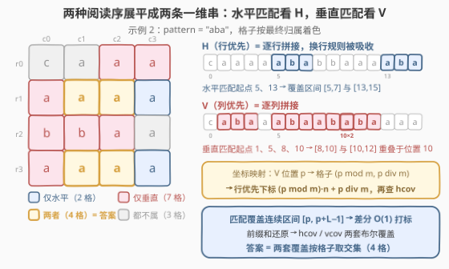
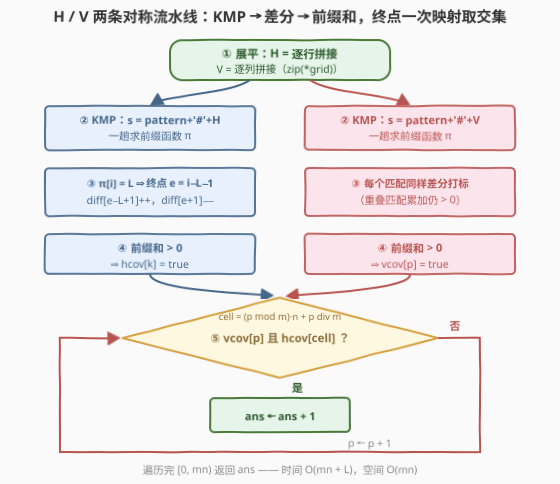

# LeetCode 统计水平子串和垂直子串重叠格子的数目 题解

## 1. 题目概述

- **标题 / 题号**：统计水平子串和垂直子串重叠格子的数目（#3529，medium）
- **链接**：https://leetcode.cn/problems/count-cells-in-overlapping-horizontal-and-vertical-substrings/
- **难度**：中等
- **标签**：数组、字符串、矩阵、字符串匹配、哈希函数、滚动哈希

**题意**：给定一个 $m \times n$ 的字符矩阵 `grid` 和一个字符串 `pattern`：

- **水平子串**：从左到右的一段连续字符序列；若到达某行末尾，则**换行**到下一行的第一个字符继续（不会从最后一行绕回第一行）；
- **垂直子串**：从上到下的一段连续字符序列；若到达某列底部，则**换列**到下一列的第一个字符继续（不会从最后一列绕回第一列）。

请统计同时满足以下条件的格子数量：该格子属于**至少一个**等于 `pattern` 的水平子串，**且**属于**至少一个**等于 `pattern` 的垂直子串。

**示例 1**：

```text
输入：grid = [["a","a","c","c"],["b","b","b","c"],["a","a","b","a"],["c","a","a","c"],["a","a","b","a"]], pattern = "abaca"
输出：1
解释："abaca" 作为水平子串（蓝色）和垂直子串（红色）各出现一次，交于一个格子。
```

**示例 2**：

```text
输入：grid = [["c","a","a","a"],["a","a","b","a"],["b","b","a","a"],["a","a","b","a"]], pattern = "aba"
输出：4
解释：被标记的 4 个格子同时属于至少一个 "aba" 的水平子串与垂直子串。
```

**示例 3**：

```text
输入：grid = [["a"]], pattern = "a"
输出：1
```

**约束**：

- $m = \text{grid.length}$，$n = \text{grid}[i].\text{length}$
- $1 \le m, n \le 1000$
- $1 \le m \cdot n \le 10^5$
- $1 \le \text{pattern.length} \le m \cdot n$
- `grid` 与 `pattern` 仅由小写英文字母组成

> 💡 **读题关键**：① 水平子串本质就是**行优先展平串的子串**——"行末换行接下一行行首"这条规则，在把矩阵逐行拼成一维串时被天然吸收，不需要任何特判；垂直子串同理是**列优先展平串的子串**；② ⚠️ 陷阱在标记开销：`grid` 全 `'a'`、`pattern` 为长度 $mn/2$ 的全 `'a'` 串时，匹配多达 $O(mn)$ 个、每个覆盖 $L$ 格，若对每个匹配逐格置 `true`，标记总量 $O(mn \cdot L) \approx 10^{10}$ 必然超时——**必须用差分**。

## 2. 解题思路

### 2.1 暴力思路

两个朴素方向都撞在同一堵墙上：

**方向一：逐格判断**。枚举每个格子 $(r, c)$，分别检查"以它为起点的水平阅读序能否拼出 `pattern`"（跨行时 $r{+}1$、$c$ 归零）与垂直方向同理。单次检查 $O(L)$，总体 $O(mn \cdot L) \approx 10^{10}$。

**方向二：先找匹配、再逐格标记**。先用字符串匹配找出所有匹配，再把每个匹配覆盖的 $L$ 个格子逐一置 `true`。匹配数最坏 $O(mn)$ 个（见读题关键的反例），逐格标记又是 $O(mn \cdot L)$。

病根相同：**把"区间覆盖"拆成了"单点操作"**。解药是差分数组——这正是 2.2 的观察二。

### 2.2 核心观察：展平降维 + 差分标记 + 坐标映射



**观察一（展平降维）**：把 `grid` 按两种顺序各拼成一条一维串：

- $H$ = 逐行拼接，$|H| = mn$。**水平子串 = $H$ 的子串**（跨行由拼接天然实现）；
- $V$ = 逐列拼接，$|V| = mn$。**垂直子串 = $V$ 的子串**。

于是"二维匹配"裂解成**两个独立的一维串匹配**，KMP 各跑一趟线性完成，"换行/换列"规则零特判。

**观察二（覆盖是区间，区间用差分）**：一个起点为 $p$、长度为 $L$ 的匹配，覆盖的是一维串上的**连续区间** $[p,\, p+L-1]$。对每个匹配只做两次 $O(1)$ 写入：$\text{diff}[p] \mathrel{+}= 1$、$\text{diff}[p+L] \mathrel{-}= 1$；最后前缀和一遍，累加值 $> 0$ 的位置即被覆盖。总代价从 $O(\text{匹配数} \times L)$ 坍缩到 $O(mn)$。**重叠匹配也天然正确**——示例 2 的 $V$ 串中 $[8,10]$ 与 $[10,12]$ 共享位置 10，差分累加后该位置仍 $> 0$。

**观察三（两套坐标系用映射对齐）**：`hcov` 按行优先下标存储，`vcov` 按列优先下标存储，坐标系不同。列优先位置 $p$ 对应格子 $(p \bmod m,\; p \,\text{div}\, m)$，其行优先下标为 $(p \bmod m) \cdot n + p \,\text{div}\, m$。于是答案为：

$$
\text{ans} = \sum_{p=0}^{mn-1} \text{vcov}[p] \;\wedge\; \text{hcov}\!\left[(p \bmod m)\cdot n + p \,\text{div}\, m\right]
$$

### 2.3 算法流程图



| 步骤 | 动作 | 说明 |
|------|------|------|
| ① 展平 | $H$ = 逐行拼接；$V$ = 逐列拼接 | Python 里 `zip(*grid)` 一步转置 |
| ② KMP | $s = \text{pattern} + \text{'\#'} + H$，求前缀函数 $\pi$ | 分隔符保证 $\pi \le L$，$\pi[i] = L$ 处即匹配终点 |
| ③ 差分 | $\pi[i] = L \Rightarrow$ 终点 $e = i - L - 1$，$\text{diff}[e{-}L{+}1]{+}{+}$、$\text{diff}[e{+}1]{-}{-}$ | 每个匹配 $O(1)$，重叠匹配无痛处理 |
| ④ 前缀和 | 累加 `diff`，$> 0$ 即被覆盖 $\Rightarrow$ `hcov` | 对 $V$ 同样执行 ②~④ $\Rightarrow$ `vcov` |
| ⑤ 汇总 | 遍历 $p \in [0, mn)$：`vcov[p]` 且 `hcov[(p mod m)·n + p div m]` 则计数 | 坐标映射把两套下标对齐到同一格子 |

### 2.4 示例演算

用**示例 2**（$4 \times 4$ 网格，`pattern = "aba"`）逐步走一遍。

**水平方向**：$H = $ `caaaaababbaaaaba`（长度 $mn = 16$，逐行拼接）：

- 匹配起点 5：$H[5..7] = $ `aba`，覆盖格子 $(1,1)(1,2)(1,3)$；
- 匹配起点 13：$H[13..15] = $ `aba`，覆盖格子 $(3,1)(3,2)(3,3)$。

**垂直方向**：$V = $ `cabaaabaababaaaa`（逐列拼接）：

- 匹配起点 1、5、8、10，覆盖区间 $[1,3]$、$[5,7]$、$[8,10]$、$[10,12]$——**后两个在位置 10 重叠**（对应格子 $(2,2)$）；
- 映射到格子：$(1,0)(2,0)(3,0)$、$(1,1)(2,1)(3,1)$、$(0,2)(1,2)(2,2)$、$(2,2)(3,2)(0,3)$。

**取交集**：水平覆盖 $\{(1,1)(1,2)(1,3)(3,1)(3,2)(3,3)\}$ $\cap$ 垂直覆盖 11 格 $= \{(1,1),(1,2),(3,1),(3,2)\}$，答案 $\boxed{4}$。

> 💡 **示例 1 对照**：$H$ 仅一个匹配（起点 9），$V$ 仅一个匹配（起点 0），二者只交于格子 $(3,0)$，答案 1。**交集格子数与匹配次数无关**——一条水平匹配与一条垂直匹配至多交出 $\min(L, \ldots)$ 个格子，统计时逐格判定即可，不要试图按"匹配对"去枚举（那又是 $O(\text{水平数} \times \text{垂直数})$ 的坑）。

## 3. 参考代码

### C++

```cpp
class Solution {
  public:
    int countCells(vector<vector<char>>& grid, string pattern) {
        int m = grid.size(), n = grid[0].size();
        int L = pattern.size();
        string H, V;
        H.reserve(m * n);
        V.reserve(m * n);
        for (int r = 0; r < m; ++r)
            for (int c = 0; c < n; ++c) H += grid[r][c];   // 行优先展平
        for (int c = 0; c < n; ++c)
            for (int r = 0; r < m; ++r) V += grid[r][c];   // 列优先展平

        auto cover = [&](const string& t) {                // t 每个位置是否被匹配覆盖
            string s = pattern + '#' + t;                  // '#' 不在小写字母集，安全分隔
            int sn = s.size();
            vector<int> pi(sn), diff(t.size() + 1);
            for (int i = 1; i < sn; ++i) {                 // 前缀函数
                int j = pi[i - 1];
                while (j && s[i] != s[j]) j = pi[j - 1];
                if (s[i] == s[j]) ++j;
                pi[i] = j;
            }
            for (int i = L + 1; i < sn; ++i)
                if (pi[i] == L) {                          // 匹配终点 e（t 中下标）
                    int e = i - L - 1;
                    ++diff[e - L + 1];                     // 区间 [e-L+1, e] 差分打标
                    --diff[e + 1];
                }
            vector<char> cov(t.size());
            int cur = 0;
            for (int k = 0; k < (int)t.size(); ++k) {      // 前缀和还原覆盖
                cur += diff[k];
                cov[k] = cur > 0;
            }
            return cov;
        };

        vector<char> hcov = cover(H), vcov = cover(V);
        int ans = 0;
        for (int p = 0; p < m * n; ++p)                    // 列序位置 p → 行序格子
            if (vcov[p] && hcov[(p % m) * n + p / m]) ++ans;
        return ans;
    }
};
```

### Python

```python
class Solution:
    def countCells(self, grid: List[List[str]], pattern: str) -> int:
        m, n = len(grid), len(grid[0])
        L = len(pattern)
        H = ''.join(''.join(row) for row in grid)          # 行优先展平
        V = ''.join(''.join(col) for col in zip(*grid))    # 列优先展平（zip 转置）

        def cover(text: str) -> List[bool]:
            s = pattern + '#' + text                       # '#' 不在小写字母集，安全分隔
            pi = [0] * len(s)
            for i in range(1, len(s)):                     # 前缀函数
                j = pi[i - 1]
                while j and s[i] != s[j]:
                    j = pi[j - 1]
                if s[i] == s[j]:
                    j += 1
                pi[i] = j
            diff = [0] * (len(text) + 1)
            for i in range(L + 1, len(s)):
                if pi[i] == L:                             # 匹配终点 e（text 下标）
                    e = i - L - 1
                    diff[e - L + 1] += 1                   # 区间 [e-L+1, e] 差分打标
                    diff[e + 1] -= 1
            cov, cur = [], 0
            for k in range(len(text)):                     # 前缀和还原覆盖
                cur += diff[k]
                cov.append(cur > 0)
            return cov

        hcov, vcov = cover(H), cover(V)
        return sum(vcov[p] and hcov[(p % m) * n + p // m]  # 列序 p → 行序格子
                   for p in range(m * n))
```

> ⚠️ **易错点**：① 匹配可以**重叠**（示例 2 的 $V$ 串），不能"找到一个匹配就跳过 $L$ 格再找下一个"——前缀函数天然支持重叠匹配；② 分隔符 `'#'` 的安全性依赖"字符集仅为小写字母"这一约束，若字符集扩大需换哨兵字符（或改用显式边界判断）；③ 坐标映射是 $(p \bmod m)\cdot n + p \,\text{div}\, m$——**$m$、$n$ 别写反**（列优先串里一列恰有 $m$ 个字符，故列号是 $p \,\text{div}\, m$、行内偏移是 $p \bmod m$）；④ 差分下标 $e+1$ 可达 $mn$，`diff` 数组必须开到 $\text{len}+1$；⑤ `pattern` 可能比 $mn$ 长，此时自然无匹配，两套循环都不会误触发，无需特判。

## 4. 复杂度分析

| 维度 | 复杂度 | 说明 |
|------|--------|------|
| 时间复杂度 | $O(mn + L)$ | 两次展平 $O(mn)$；两次 KMP 各 $O(mn + L)$；两次前缀和 $O(mn)$；汇总遍历 $O(mn)$ |
| 空间复杂度 | $O(mn)$ | 两条展平串 + 两套差分/覆盖数组 |
| 数据范围验证 | — | $mn \le 10^5$：全程线性，远低于时限 |
| 标记量对比 | — | 朴素逐格标记最坏 $O(mn \cdot L) \approx 10^{10}$；差分打标 $O(mn)$，快约 $10^5$ 倍 |

## 5. 扩展：滚动哈希（Rabin-Karp）版本

题目标签里的 Hash Function / Rolling Hash 暗示了另一条路：预处理 `pattern` 的多项式哈希，对 `text` 维护长为 $L$ 的**滚动窗口**哈希，滑一步 $O(1)$ 比对。单模数有理论碰撞风险，取大梅森素数 $2^{61}-1$ 作模、$10^5$ 次比对的冲突概率约 $10^{10}/2^{61} \approx 10^{-9}$，可放心单模数；对抗数据场景再上双模数。KMP 是**确定性**算法，零碰撞，两者本题都过；滚动哈希胜在思路直白、可推广（二维哈希、多模式），KMP 胜在最坏保证。

```python
class Solution:
    def countCells(self, grid: List[List[str]], pattern: str) -> int:
        m, n = len(grid), len(grid[0])
        L = len(pattern)
        MOD, B = (1 << 61) - 1, 131

        def cover(text: str) -> List[bool]:
            ph = 0
            for ch in pattern:                             # pattern 的哈希
                ph = (ph * B + ord(ch)) % MOD
            pw, th = pow(B, L, MOD), 0
            diff = [0] * (len(text) + 1)
            for p, ch in enumerate(text):                  # 滚动窗口右端 p
                th = (th * B + ord(ch)) % MOD
                if p >= L:                                 # 滚出左端 text[p-L]
                    th = (th - ord(text[p - L]) * pw) % MOD
                if p >= L - 1 and th == ph:                # 窗口 [p-L+1, p] 命中
                    diff[p - L + 1] += 1
                    diff[p + 1] -= 1
            cov, cur = [], 0
            for k in range(len(text)):
                cur += diff[k]
                cov.append(cur > 0)
            return cov

        H = ''.join(''.join(row) for row in grid)
        V = ''.join(''.join(col) for col in zip(*grid))
        hcov, vcov = cover(H), cover(V)
        return sum(vcov[p] and hcov[(p % m) * n + p // m]
                   for p in range(m * n))
```

> ⚠️ 滚动时"先乘 $B$ 再减去左端 $\times B^L$"的顺序别写反；Python 的 `%` 恒返回非负值，C++ 版需在相减后补一次 `((x % MOD) + MOD) % MOD`。

## 6. 面试要点

1. **换行/换列规则为什么不用特判？**

   - 水平子串按定义就是"行优先阅读序"里的连续段：把矩阵逐行拼成 $H$ 后，$H$ 中相邻两位置恰好就是"行末接下一行行首"。跨行匹配、跨列匹配都被展平操作整体吸收，二维约束降成一维。

2. **为什么逐格标记会超时？差分怎么救？**

   - 全 `'a'` 数据下匹配约 $mn/2$ 个、每个覆盖 $L$ 格，标记总量 $O(mn \cdot L) \approx 10^{10}$。匹配覆盖的是连续区间 $[p, p+L-1]$，区间问题配差分：两端 $O(1)$ 打标、一遍前缀和还原，总代价 $O(mn)$；重叠区间累加后仍 $> 0$，天然正确。

3. **KMP 里为什么拼 `pattern + '#' + text`？**

   - 前缀函数 $\pi[i]$ 是"$s[0..i]$ 最长相等前后缀"的长度。加分隔符后 $\pi$ 值不会越过 $L$，于是 $\pi[i] = L$ 当且仅当 `pattern` 在 `text` 中以 $i - L - 1$ 结尾完整出现——一趟扫描拿到**全部（含重叠）匹配**。`'#'` 不属于小写字母集，是安全哨兵。

4. **两套覆盖数组的坐标系怎么对齐？**

   - `hcov` 用行优先下标、`vcov` 用列优先下标。列优先位置 $p$ 的格子是 $(p \bmod m,\, p \,\text{div}\, m)$，换成行优先下标 $(p \bmod m)\cdot n + p \,\text{div}\, m$ 后即可查询 `hcov`。遍历任取一套数组做主循环均可。

5. **滚动哈希与 KMP 如何取舍？**

   - 滚动哈希代码短、好推广（二维、多模式），但有可控的碰撞概率，对抗场景需双模数；KMP 确定性、最坏 $O(n)$。面试先讲 KMP 版，被追问哈希再展开滚动窗口写法。

## 同类练习题

| # | 题目 | 与本题的关联 |
|---|------|-------------|
| 28 | [找出字符串中第一个匹配项的下标](https://leetcode.cn/problems/find-the-index-of-the-first-occurrence-in-a-string/)（[站内题解](../0001-0100/28_找出字符串中第一个匹配项的下标.md)） | KMP 原型题，本题把"找一个"升级成"找所有 + 区间标记" |
| 459 | [重复的子字符串](https://leetcode.cn/problems/repeated-substring-pattern/)（[站内题解](../0401-0500/459_重复的子字符串.md)） | 前缀函数与周期性的经典联动，巩固 $\pi$ 数组直觉 |
| 1109 | [航班预订统计](https://leetcode.cn/problems/corporate-flight-bookings/)（[站内题解](../1101-1200/1109_航班预订统计.md)） | 差分数组标记区间的教科书，本题观察二的原型 |
| 3008 | [找出数组中的美丽下标 II](https://leetcode.cn/problems/find-beautiful-indices-in-the-given-array-ii/) | 同样"KMP 找出全部匹配位置"再加工，训练把匹配当集合使用的思维 |
| 1392 | [最长快乐前缀](https://leetcode.cn/problems/longest-happy-prefix/) | 前缀函数定义的直球应用，$\pi[n-1]$ 即答案 |
