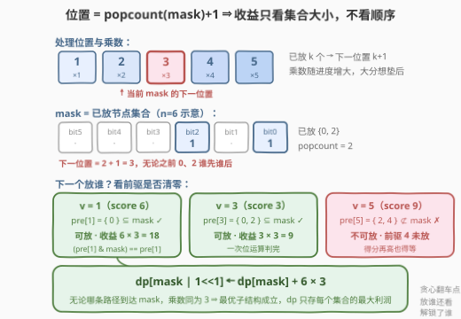
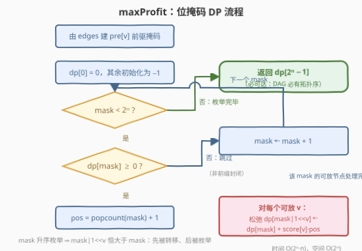

# 有向无环图中合法拓扑排序的最大利润

- **题目名称**：有向无环图中合法拓扑排序的最大利润
- **链接**：[3530. 有向无环图中合法拓扑排序的最大利润](https://leetcode.cn/problems/maximum-profit-from-valid-topological-order-in-dag/)
- **难度**：困难
- **标签**：位运算、图、拓扑排序、动态规划、状态压缩、数组

## 1. 题目概述

给定 $n$ 个节点组成的**有向无环图（DAG）**，节点编号 $0$ 到 $n-1$，边由二维数组 `edges` 给出，`edges[i] = [u_i, v_i]` 表示一条 $u_i \to v_i$ 的有向边。每个节点有得分 `score[i]`。

需要按**合法拓扑排序**的顺序处理节点（每条边 $u \to v$ 中 $u$ 必须出现在 $v$ 之前），第 $k$ 个被处理的节点位置编号为 $k$（从 1 开始）。**利润**定义为：

$$\text{profit} = \sum_{v} \text{score}[v] \times \text{pos}(v)$$

返回所有合法拓扑排序中可获得的**最大利润**。

**示例 1**：

```text
输入：n = 2, edges = [[0,1]], score = [2,3]
输出：8
解释：节点 1 依赖节点 0，唯一合法顺序 [0,1]：2×1 + 3×2 = 8。
```

**示例 2**：

```text
输入：n = 3, edges = [[0,1],[0,2]], score = [1,6,3]
输出：25
解释：最优顺序 [0,2,1]：1×1 + 3×2 + 6×3 = 25（把大分节点 1 留给乘数 3）。
```

**约束条件**：

- $1 \le n = \text{score.length} \le 22$
- $1 \le \text{score}[i] \le 10^5$
- $0 \le \text{edges.length} \le \frac{n(n-1)}{2}$，无重复边，保证是 DAG

> 💡 **读题关键**：$n \le 22$ 这个卡得极死的上限是**状压 DP 的信号灯**——一个整数就能装下全部节点的子集，$2^{22} \approx 4 \times 10^6$ 个状态刚好可枚举。乘数从 1 递增到 $n$，直觉上「小分先走、大分垫后」，但拓扑约束会拦路（下文给出 4 节点反例）。

---

## 2. 解题思路

### 2.1 暴力思路：枚举拓扑序，以及两个「想当然」的贪心

**暴力**：DFS 回溯枚举所有合法拓扑序，逐个计算利润。DAG 的拓扑序最坏有 $n!$ 级别（无边图），$22! \approx 10^{21}$，直接爆炸。

**贪心 A（前向）**：每一步在当前可放节点（前驱已全部处理）中挑得分最小的放下一个位置。

**贪心 B（反向）**：从位置 $n$ 往前填，每步在当前可放节点（后继已全部放置）中挑得分最大的放最靠后的空位。

两种贪心在无边图上都是对的（等价于按 `score` 排序，由重排不等式即最优）。可一旦有约束就翻车，**最小反例需要 4 个节点**（$n \le 3$ 时已穷举验证贪心总与最优一致）：

```text
n = 4, edges = [[0,1]], score = [4,1,2,3]
贪心：[2,3,0,1] → 2×1 + 3×2 + 4×3 + 1×4 = 24
最优：[2,0,1,3] → 2×1 + 4×2 + 1×3 + 3×4 = 25
```

最优解的妙处：**故意把大分节点 0 提前到位置 2**，立刻解锁小分节点 1 让它「吃掉」位置 3，从而把次大分节点 3 留给位置 4 的大乘数。放谁不只看眼前得分，还要看**它解锁了谁**——局部贪心无法衡量这种跨步影响。

> ⚠️ 这不是实现细节问题，而是本质困难：本题等价于调度理论中的经典 NP-hard 问题 **`1|prec|Σw_jC_j`**（单机、前置约束、最小化加权完成时间之和）。「最大化 $\sum \text{score} \times \text{pos}$」与「最小化 $\sum \text{score}_v \cdot C_v$」只差一个常数（$\text{pos}(v) = n - \text{“放在 v 之后的位置数”}$ 的换算），而后者无多项式最优算法。$n \le 22$ 的范围设定就是明示「指数算法可接受」。

### 2.2 核心观察：位置只由集合大小决定 → 位掩码 DP



把「已处理节点集合」编码为一个 $n$ 位二进制数 `mask`（第 $v$ 位为 1 ⟺ 节点 $v$ 已放置）。两条观察拼出解法：

1. **收益只看集合，不看顺序**：若已放 $\text{popcount(mask)} = k$ 个节点，下一个放置的节点 $v$ 的位置恰为 $k+1$，收益是 $\text{score}[v] \times (k+1)$——乘数**只依赖集合大小**，与之前 $k$ 个节点的内部顺序无关。这正是**最优子结构**。
2. **可放条件一位判断**：预处理 $\text{pre}[v]$ = $v$ 的全部前驱组成的位掩码，则「$v$ 现在可放」⟺ $v \notin \text{mask}$ 且 $(\text{pre}[v] \,\&\, \text{mask}) = \text{pre}[v]$，两次位运算搞定。

于是定义状态：

$$dp[\text{mask}] = \text{已放置集合恰为 mask 时，已取得的最大利润}$$

转移方程（在位置 $\text{popcount(mask)}+1$ 放入可放节点 $v$）：

$$dp[\text{mask} \mid 2^v] = \max\big(dp[\text{mask} \mid 2^v],\ \ dp[\text{mask}] + \text{score}[v] \times (\text{popcount}(\text{mask})+1)\big)$$

初始 $dp[0] = 0$，答案 $dp[2^n - 1]$。

**不可达状态**：若 `mask` 中存在节点 $v$ 但 $\text{pre}[v] \not\subseteq \text{mask}$，说明该集合不是任何拓扑序的前缀（放了 $v$ 却没放它的前驱），$dp[\text{mask}]$ 保持不可达标记，枚举到时直接跳过。由于利润恒正（$\text{score} \ge 1$、乘数 $\ge 1$），用 $-1$ 当哨兵是安全的。

### 2.3 算法流程图



落实到步骤：

1. 由 `edges` 构建 $\text{pre}[v]$ 掩码数组，$O(m)$；
2. `dp` 数组初始化为 $-1$，$dp[0] = 0$；
3. `mask` 从 $0$ 到 $2^n - 1$ **升序枚举**——转移目标 $\text{mask} \mid 2^v$ 严格大于 `mask`，升序保证每个状态在被枚举前已收敛；
4. 跳过 $dp[\text{mask}] = -1$ 的不可达状态；
5. 令 $pos = \text{popcount(mask)} + 1$，枚举每个可放节点 $v$ 做松弛；
6. 返回 $dp[2^n - 1]$。

### 2.4 示例演算

用示例 2（`n=3, edges=[[0,1],[0,2]], score=[1,6,3]`）走一遍。$\text{pre}[0]=000,\ \text{pre}[1]=001,\ \text{pre}[2]=001$（bit 从低到高对应节点 0/1/2）：

| mask（二进制） | 已放集合 | popcount | 下一位置 pos | 可放节点 | 松弛 |
|---|---|---|---|---|---|
| `000` | $\varnothing$ | 0 | 1 | 0 | $dp[001] = 0 + 1 \times 1 = 1$ |
| `001` | {0} | 1 | 2 | 1, 2 | $dp[011] = 1 + 6 \times 2 = 13$；$dp[101] = 1 + 3 \times 2 = 7$ |
| `011` | {0,1} | 2 | 3 | 2 | $dp[111] = 13 + 3 \times 3 = 22$ |
| `101` | {0,2} | 2 | 3 | 1 | $dp[111] = \max(22,\ 7 + 6 \times 3) = \mathbf{25}$ |
| `111` | {0,1,2} | 3 | — | — | 答案 |

（`010`、`100`、`110` 不是前缀封闭集合，$dp$ 保持 $-1$ 被跳过。）沿 $111 \leftarrow 101 \leftarrow 001 \leftarrow 000$ 回溯转移，即得最优顺序 $[0, 2, 1]$。

---

## 3. 参考代码

### C++

```cpp
class Solution {
  public:
    long long maxProfit(int n, vector<vector<int>>& edges, vector<int>& score) {
        vector<int> pre(n);                          // pre[v]：v 的全部前驱位掩码
        for (auto& e : edges) pre[e[1]] |= 1 << e[0];

        int full = 1 << n;
        vector<long long> dp(full, -1);              // -1 = 不可达（非前缀封闭集合）
        dp[0] = 0;
        for (int mask = 0; mask < full; mask++) {
            if (dp[mask] < 0) continue;
            long long base = dp[mask];
            int pos = __builtin_popcount(mask) + 1;  // 下一位置 = 已放个数 + 1
            for (int v = 0; v < n; v++) {
                if (mask >> v & 1) continue;                 // v 已放
                if ((pre[v] & mask) != pre[v]) continue;     // 前驱未清零
                long long cand = base + 1LL * score[v] * pos;
                if (cand > dp[mask | 1 << v]) dp[mask | 1 << v] = cand;
            }
        }
        return dp[full - 1];
    }
};
```

### Python

```python
class Solution:
    def maxProfit(self, n: int, edges: List[List[int]], score: List[int]) -> int:
        pre = [0] * n
        for u, v in edges:
            pre[v] |= 1 << u

        full = 1 << n
        dp = [-1] * full                    # -1 = 不可达
        dp[0] = 0
        for mask in range(full):
            base = dp[mask]
            if base < 0:
                continue
            pos = bin(mask).count("1") + 1  # 下一位置
            for v in range(n):
                if mask >> v & 1:
                    continue
                if pre[v] & mask != pre[v]:
                    continue
                nxt = mask | 1 << v
                cand = base + score[v] * pos
                if cand > dp[nxt]:
                    dp[nxt] = cand
        return dp[full - 1]
```

> 💡 **实现细节**：① `mask` 升序枚举天然满足 DP 拓扑序——转移目标 `mask | 1<<v` 严格大于 `mask`，一定在之后才被枚举；② 利润上界 $\sum_{p=1}^{22} 10^5 \cdot p = 10^5 \times 253 \approx 2.5 \times 10^7$，`int` 也装得下，C++ 用 `long long` 求稳、Python 天然大整数；③ Python 版最坏情形（$n=22$ 稀疏图）内层约 $9 \times 10^7$ 次迭代，若超时可先把内层改成「一次 O(n) 扫描拼出可放节点位集合，再用 `lowbit` 逐位枚举」，或直接提交 C++ 版（实测 $n=22$ 最坏数据约 0.3 s）。

---

## 4. 复杂度分析

| 维度 | 复杂度 | 说明 |
|------|--------|------|
| 时间复杂度 | $O(2^n \cdot n)$ | $2^{22}$ 个状态，每状态 $O(n)$ 枚举可放节点，约 $9 \times 10^7$ 次位运算（C++ 实测约 0.3 s） |
| 空间复杂度 | $O(2^n)$ | `dp` 数组 $2^{22}$ 项（`long long` 约 32 MB，改 `int` 可减半） |

---

## 5. 扩展：贪心的边界、记忆化写法与方案还原

- **贪心的正确边界**：无边图上「`score` 升序放置」即最优（重排不等式，等价于调度论无约束情形的 Smith 比率规则 / WSPT）；一旦有前置约束，问题归约到 NP-hard 的 `1|prec|ΣwC`，任何多项式贪心必有反例——2.1 节的 4 节点反例是规模最小的之一。
- **记忆化 + 度数维护（官方 hint）**：把迭代 DP 换成自顶向下的记忆化搜索，把每个节点的「剩余前驱数」作为参数沿递归传递：放入 $v$ 后只对其后继做减法，「可放」判断从掩码比较退化为 `deg[v] == 0`，更贴近拓扑排序的 Kahn 直觉，常数也更小；复杂度仍是 $O(2^n \cdot n)$。
- **反向视角**：等价地从位置 $n$ 往 $1$ 填，维护「后继已全部放置」的节点集合，转移乘数变为 $n - \text{popcount(mask)}$。「大分垫后」的启发式在这个视角下更直观，也是尝试证明贪心时的自然出发点。
- **输出具体方案**：额外开 `choice` 数组记录每个 `mask` 取到最优时的转移节点，从 $dp[2^n-1]$ 一路回溯即得最优拓扑序，代价不变。

---

## 6. 面试要点

1. **为什么想到位掩码 DP？**

   > 两个信号叠加：$n \le 22$（子集可编码进一个整数，$2^{22} \approx 4 \times 10^6$ 个状态可承受）；收益结构只依赖「已放集合大小」——乘数 = popcount(mask)+1，与到达该集合的顺序无关，天然具备最优子结构。

2. **状态怎么定义？转移的合法性条件是什么？**

   > $dp[\text{mask}]$ = 已放置集合为 `mask` 的最大利润。节点 $v$ 能放在位置 $\text{popcount(mask)}+1$ 当且仅当 $v \notin \text{mask}$ 且 $\text{pre}[v] \,\&\, \text{mask} = \text{pre}[v]$（前驱掩码被完全覆盖）；`pre[v]` 由 `edges` 以 $O(m)$ 预处理。

3. **为什么贪心不成立？能给个反例吗？**

   > `n=4, edges=[[0,1]], score=[4,1,2,3]`：贪心得 24（序 `[2,3,0,1]`），最优 25（序 `[2,0,1,3]`）——提前放大分节点 0 解锁 1 分节点去占位置 3，把 3 分节点留给位置 4。深层原因：本题等价于 NP-hard 的调度问题 `1|prec|ΣwC`，多项式贪心不可能总对。

4. **dp 初始化为什么用 -1？哪些状态不可达？**

   > 利润恒正，`-1` 可安全充当「不可达」哨兵。不可达集合 = 非「前缀封闭」的集合：存在 $v \in \text{mask}$ 但 $\text{pre}[v] \not\subseteq \text{mask}$（放了 $v$ 却没放其前驱），它们不是任何拓扑序的前缀，枚举到时跳过即可。

5. **内存与溢出怎么评估？**

   > 状态数 $2^{22}$；利润上界 $10^5 \times \sum_{p=1}^{22} p \approx 2.5 \times 10^7$，`int` 足够，`long long` 的 `dp` 约 32 MB 也在限制内；C++ 中 `1LL * score[v] * pos` 的显式提升是好习惯。

> 💡 **一句话总结**：3530 = 「拓扑约束下的加权调度」——乘数只看集合大小（popcount+1），前驱掩码一位判断可放性，$O(2^n \cdot n)$ 状压 DP 收割全部合法拓扑序中的最大利润。

---

## 7. 同类练习题

- [1494. 并行课程 II](https://leetcode.cn/problems/parallel-courses-ii/)（[题解](../1401-1500/1494_并行课程II.md)）：同款「pre[v] ⊆ mask 才能选 v」的状压 DP，只是每步可批量选一组无依赖的课
- [847. 访问所有节点的最短路径](https://leetcode.cn/problems/shortest-path-visiting-all-nodes/)（[题解](../0801-0900/847_访问所有节点的最短路径.md)）：(mask, node) 二维状态的状压 BFS，训练「集合入状态」的手感
- [1125. 最小的必要团队](https://leetcode.cn/problems/smallest-sufficient-team/)（[题解](../1101-1200/1125_最小的必要团队.md)）：把技能编码成位掩码，覆盖型状压 DP 的代表
- [1799. N 次操作后的最大分数和](https://leetcode.cn/problems/maximize-score-after-n-operations/)（[题解](../1701-1800/1799_N次操作后的最大分数和.md)）：每轮从集合中挑一对数，枚举子集型状压 DP 的经典形态
