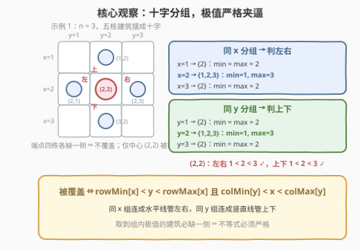
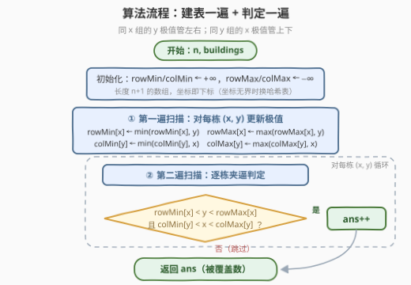

# 统计被覆盖的建筑

- **题目名称**：统计被覆盖的建筑
- **链接**：[3531. 统计被覆盖的建筑](https://leetcode.cn/problems/count-covered-buildings/)
- **难度**：中等
- **标签**：数组、哈希表、排序

## 1. 题目概述

给你一个正整数 $n$，表示一个 $n \times n$ 的城市；再给定二维数组 $buildings$，其中 $buildings[i] = [x, y]$ 表示位于坐标 $[x, y]$ 的一栋**唯一**建筑。

如果一个建筑在**四个方向（左、右、上、下）中每个方向上都至少存在一栋建筑**，则称该建筑**被覆盖**。返回被覆盖的建筑数量。

**示例 1**：

```text
输入: n = 3, buildings = [[1,2],[2,2],[3,2],[2,1],[2,3]]
输出: 1
解释: 只有建筑 [2,2] 被覆盖——上方 [1,2]、下方 [3,2]、左方 [2,1]、右方 [2,3]。
```

**示例 2**：

```text
输入: n = 3, buildings = [[1,1],[1,2],[2,1],[2,2]]
输出: 0
解释: 没有任何一个建筑在四个方向上都有至少一个建筑。
```

**示例 3**：

```text
输入: n = 5, buildings = [[1,3],[3,2],[3,3],[3,5],[5,3]]
输出: 1
解释: 只有建筑 [3,3] 被覆盖——上方 [1,3]、下方 [5,3]、左方 [3,2]、右方 [3,5]。
```

**约束条件**：

- $2 \le n \le 10^5$
- $1 \le buildings.length \le 10^5$
- $buildings[i] = [x, y]$ 且 $1 \le x, y \le n$，所有坐标互不相同

> 💡 **审题关键**：其一，「某方向上存在建筑」**不要求相邻**——示例 3 中 [3,3] 的上方邻居 [1,3] 距离为 2，只要在同一条线上即可；其二，由示例可读出坐标语义：$y$ 相同、$x$ 更小者为「上方」，$x$ 相同、$y$ 更小者为「左方」。于是**同 $x$ 的建筑连成一条水平线，决定左右；同 $y$ 的建筑连成一条竖直线，决定上下**。

## 2. 解题思路

### 2.1 暴力思路：逐建筑全量扫描

对每栋建筑 $(x, y)$，扫描全部 $m$ 栋建筑，用四个标记分别记录左、右、上、下是否出现过邻居：

```text
for (x, y) in buildings:
    hasL = hasR = hasU = hasD = false
    for (x2, y2) in buildings:
        if x2 == x and y2 < y: hasL = true   # 同 x，y 更小 → 左
        if x2 == x and y2 > y: hasR = true   # 同 x，y 更大 → 右
        if y2 == y and x2 < x: hasU = true   # 同 y，x 更小 → 上
        if y2 == y and x2 > x: hasD = true   # 同 y，x 更大 → 下
    if hasL and hasR and hasU and hasD: ans++
```

时间复杂度 $O(m^2)$，在 $m = 10^5$ 时约 $10^{10}$ 次比较，必然超时。

> ⚠️ 暴力的浪费在于：判定「该侧有没有建筑」时把**同线上的所有建筑**都比了一遍，但答案只取决于该侧**是否存在**建筑——是谁、有几个、距离多远都无关紧要。这个存在性判定可以被每组里的两个数——最小值与最大值——完全吸收。

### 2.2 核心观察：分组极值 + 严格夹逼



把建筑按坐标分成两组十字交叉的桶：

- **同 $x$ 组**（$x$ 相同的建筑连成一条水平线）：决定**左右**。$(x, y)$ 有左邻居 $\iff$ 组内存在 $y' < y$，有右邻居 $\iff$ 组内存在 $y' > y$，两者同时成立 $\iff \text{rowMin}[x] < y < \text{rowMax}[x]$；
- **同 $y$ 组**（$y$ 相同的建筑连成一条竖直线）：决定**上下**。$(x, y)$ 同时有上、下邻居 $\iff \text{colMin}[y] < x < \text{colMax}[y]$。

| 观察 | 内容 | 带来的做法 |
|------|------|-----------|
| **方向判定坍缩成极值** | 「左方有建筑」= 同 $x$ 组内存在更小的 $y$，至于是谁、有几个都无所谓 | 每组只需维护 $\min$ / $\max$ 两个数，第一遍扫描即可建好 |
| **两组条件正交** | 左右只看同 $x$ 组的 $y$ 极值，上下只看同 $y$ 组的 $x$ 极值，互不干扰 | 覆盖 $\iff$ 两个严格夹逼**同时**成立，逐建筑 AND 判定 |
| **端点永不合格** | 组内取到 $\min$ 或 $\max$ 的建筑必然缺一侧（自己就是该方向上最远的） | 不等式必须**严格**；单栋成组时 $\min = \max =$ 自己，天然落选 |
| **$n$ 是烟雾弹** | 算法只依赖 $m$ 栋建筑的相对位置；$n$ 仅保证 $1 \le x, y \le n$ | 坐标有界 ⇒ 用长度 $n+1$ 的数组当桶；换哈希表连 $n$ 都不需要 |

两遍扫描即得答案：第一遍为每个 $x$ 维护 $y$ 的极值、为每个 $y$ 维护 $x$ 的极值；第二遍对每栋建筑检查「双重严格夹逼」是否同时成立。

> 💡 官方标签里的 **Sorting** 来自另一种等价做法——把每组坐标排序后，「不在首尾」的建筑即在该轴向被覆盖（$O(m \log m)$，见第 5 节）。极值法是它的进一步坍缩：判「是否存在更小 / 更大」根本不需要顺序信息，连排序都省了。

### 2.3 算法流程图



| 步骤 | 操作 | 说明 |
|------|------|------|
| ① 初始化 | $\text{rowMin}, \text{colMin} \leftarrow +\infty$，$\text{rowMax}, \text{colMax} \leftarrow -\infty$ | 长度 $n+1$ 的数组，坐标即下标，$O(n)$ |
| ② 第一遍扫描 | 对每栋 $(x, y)$ 更新 $\text{rowMin}[x], \text{rowMax}[x]$ 与 $\text{colMin}[y], \text{colMax}[y]$ | 一栋建筑同时喂给「行桶」和「列桶」 |
| ③ 第二遍扫描 | 检查 $\text{rowMin}[x] < y < \text{rowMax}[x]$ **且** $\text{colMin}[y] < x < \text{colMax}[y]$ | 四个严格不等式同时成立才计数 |
| ④ 返回 | 累计计数即答案 | — |

### 2.4 示例演算

以示例 1（$n = 3$，五栋建筑摆成十字）走一遍。

**第一遍扫描建立极值表**：

| 分组 | 成员坐标 | min | max |
|------|----------|-----|-----|
| 同 $x$：$x=1$ | $\{2\}$ | 2 | 2 |
| 同 $x$：$x=2$ | $\{1,2,3\}$ | **1** | **3** |
| 同 $x$：$x=3$ | $\{2\}$ | 2 | 2 |
| 同 $y$：$y=1$ | $\{2\}$ | 2 | 2 |
| 同 $y$：$y=2$ | $\{1,2,3\}$ | **1** | **3** |
| 同 $y$：$y=3$ | $\{2\}$ | 2 | 2 |

**第二遍扫描逐栋判定**：

| 建筑 $(x,y)$ | 左右：$\text{rowMin}[x] < y < \text{rowMax}[x]$ | 上下：$\text{colMin}[y] < x < \text{colMax}[y]$ | 被覆盖？ |
|------|------|------|------|
| (1,2) | $2 < 2$ ✗（$x=1$ 组 $\min=\max=2$，自己是端点） | $1 < 1$ ✗（同为 $y=2$ 组端点） | ✗ |
| **(2,2)** | $1 < 2 < 3$ ✓ | $1 < 2 < 3$ ✓ | **✓** |
| (3,2) | $2 < 2$ ✗ | $1 < 3$ 但 $3 < 3$ ✗ | ✗ |
| (2,1) | $1 < 1$ ✗（取到组内 $\min$） | $2 < 2$ ✗ | ✗ |
| (2,3) | $3 < 3$ ✗（取到组内 $\max$） | $2 < 2$ ✗ | ✗ |

答案 = **1**，与示例一致。示例 2 同理：$2 \times 2$ 方块中每栋建筑既是所在 $x$ 组的端点、又是所在 $y$ 组的端点，全部落选，答案 0。

## 3. 参考代码

### C++

```cpp
class Solution {
public:
    int countCoveredBuildings(int n, vector<vector<int>>& buildings) {
        // 同 x 组的 y 极值（管左右），同 y 组的 x 极值（管上下）
        vector<int> rowMin(n + 1, INT_MAX), rowMax(n + 1, INT_MIN);
        vector<int> colMin(n + 1, INT_MAX), colMax(n + 1, INT_MIN);

        for (auto& b : buildings) {            // ① 建表
            int x = b[0], y = b[1];
            rowMin[x] = min(rowMin[x], y);
            rowMax[x] = max(rowMax[x], y);
            colMin[y] = min(colMin[y], x);
            colMax[y] = max(colMax[y], x);
        }

        int ans = 0;
        for (auto& b : buildings) {            // ② 双重严格夹逼
            int x = b[0], y = b[1];
            if (rowMin[x] < y && y < rowMax[x] &&
                colMin[y] < x && x < colMax[y]) {
                ans++;
            }
        }
        return ans;
    }
};
```

### Python

```python
class Solution:
    def countCoveredBuildings(self, n: int, buildings: List[List[int]]) -> int:
        INF = float("inf")
        row_min = [INF] * (n + 1)      # 同 x 组的 y 极值 → 左右
        row_max = [-1] * (n + 1)
        col_min = [INF] * (n + 1)      # 同 y 组的 x 极值 → 上下
        col_max = [-1] * (n + 1)

        for x, y in buildings:         # ① 建表
            if y < row_min[x]: row_min[x] = y
            if y > row_max[x]: row_max[x] = y
            if x < col_min[y]: col_min[y] = x
            if x > col_max[y]: col_max[y] = x

        ans = 0
        for x, y in buildings:         # ② 双重严格夹逼
            if row_min[x] < y < row_max[x] and col_min[y] < x < col_max[y]:
                ans += 1
        return ans
```

> 💡 两版都利用了 $1 \le x, y \le n$，用**数组当哈希表**（下标即坐标），缓存友好且常数小。若坐标无上界，把四张数组换成 `unordered_map` / `dict` 即可，复杂度变为与 $n$ 无关的 $O(m)$。由于被查询的下标（每栋建筑的 $x$ 与 $y$）必然在建表时出现过，哨兵值 $\pm\infty$ 实际永远不会被读到。

## 4. 复杂度分析

设 $m = |buildings|$。

| 维度 | 复杂度 | 说明 |
|------|--------|------|
| 时间 | $O(n + m)$ | $O(n)$ 初始化四张数组 + 两遍线性扫描；哈希表版为 $O(m)$，与 $n$ 无关 |
| 空间 | $O(n)$ | 四张极值表；哈希表版 $O(m)$ |
| 对比暴力 | $O(m^2)$ | $m = 10^5$ 时约 $10^{10}$ 次比较，超时 |
| 对比排序版 | $O(m \log m)$ | 官方 hint 思路（分组排序，非首尾即通过）；极值坍缩后免排序 |

> 💡 一个有趣的组合视角：每组中至多「组大小 $- 2$」栋建筑能通过该轴向的判定（首尾端点必然落选），所以答案上界为 $\sum_{\text{组}} (\text{size} - 2)^+$——这也解释了为什么十字形（示例 1）是「最少建筑达成 1 栋覆盖」的典型形态：每条线恰好 3 栋，端点 4 栋全部报废。

## 5. 扩展：排序版、八方向与「方向极值」家族

- **排序版（官方 hint 的思路）**：把同 $x$ 组内的 $y$ 排序，排在**非首非尾**位置的建筑左右皆备；同 $y$ 组同理，$O(m \log m)$。它与极值版完全等价——「非首尾」就是「严格介于 $\min$ 与 $\max$ 之间」，而判定**存在性**根本不需要全序，两个数就够。
- **推广到八方向**：若覆盖定义改成八个方向（含对角线），水平 / 竖直方向照旧，对角线方向再加两组桶——按 $x + y$ 与 $x - y$ 分组（N 皇后同款对角线编码）各维护极值，两遍扫描的骨架不变；若改成「相邻一格才算邻居」，则改用哈希集合直接查 8 个邻格，仍是 $O(m)$。
- **「方向极值」家族**：一维版本即 42 接雨水（每列左右两侧最高柱决定水位）与 1762 海景建筑（右侧最大值决定可见性）；本题把它们**正交地**放到两个轴上。共同的肌肉记忆是：**把「某个方向上有没有东西」坍缩成每桶一对 $\min / \max$**，再用严格不等式夹逼判定。

## 6. 面试要点

1. **为什么「某方向有邻居」等价于「坐标严格介于组内极值之间」？端点建筑为什么永远不合格？**

   > 同 $x$ 组内所有 $y' < y$ 的建筑都在 $(x, y)$ 的左方，左邻居存在当且仅当组内 $\min < y$；右侧同理对 $\max$。两侧都存在 $\iff \text{rowMin}[x] < y < \text{rowMax}[x]$。取到极值本身的建筑，该侧没有任何建筑比它更远——它就是那侧的边界，所以不等式必须**严格**。

2. **官方标签含 Sorting，本题真的需要排序吗？**

   > 不需要。排序版把每组坐标排序后看「是否非首尾」，$O(m \log m)$；但判定只依赖 $\min / \max$ 两个数，一遍线性更新即可，$O(m)$。标签反映的是官方 hint 的思路路径（分组 + 排序），不是复杂度下界——能指出「排序是冗余的」反而是加分项。

3. **参数 $n$ 在算法里起什么作用？**

   > 只用来界定坐标范围 $1 \le x, y \le n$，从而能用长度 $n+1$ 的数组当桶（缓存友好、常数小）。换哈希表后 $n$ 完全多余。识别「参数是烟雾弹」本身是考点——若误以为要遍历 $n \times n$ 网格，$O(n^2) = 10^{10}$ 直接超时。

4. **如果把「四个方向都被覆盖」改成「至少 $k$ 个方向有邻居」怎么改？**

   > 把 AND 改成计票：把左右条件拆成「左」「右」各一票、上下拆成「上」「下」各一票（仍是查 $\min / \max$），票数 $\ge k$ 即计入。四张极值表完全复用，一行判定逻辑的改动。

5. **两遍扫描能否合并成一遍？**

   > 不能直接合并：判定某栋建筑需要它所在行桶、列桶的**最终**极值，而极值在建表完成前不确定——后面的建筑随时可能刷新它。若坚持单遍，需要在线维护每组的次小 / 次大值并在极值被刷新时回溯修正计数，得不偿失。「先建表、后判定」是这类需要全局信息的题目的标准两遍式写法。

## 7. 同类练习题

- [1762. 能看到海景的建筑物](https://leetcode.cn/problems/buildings-with-an-ocean-view/)（[站内题解](../1701-1800/1762_能看到海景的建筑物.md)）：单方向可见性 = 从右向左维护最大值——本题「左右夹逼」的一维退化版
- [42. 接雨水](https://leetcode.cn/problems/trapping-rain-water/)（[站内题解](../0001-0100/42_接雨水.md)）：每列蓄水 ⇔ 左右两侧都有更高柱子——同为「两侧极值夹逼」，只是夹的是高度
- [36. 有效的数独](https://leetcode.cn/problems/valid-sudoku/)（[站内题解](../0001-0100/36_有效的数独.md)）：按行 / 列 / 宫分组哈希查重——同款「按坐标分组入桶」的骨架
- [2352. 相等行列对](https://leetcode.cn/problems/equal-row-and-column-pairs/)：行 / 列元组入哈希桶计数，把 $O(n^2)$ 逐对比较坍缩成 $O(n)$——分组哈希消除平方的又一实例
