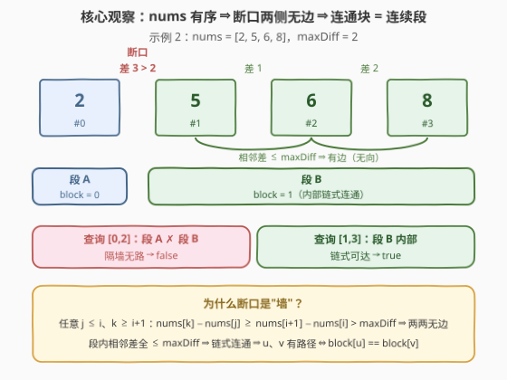
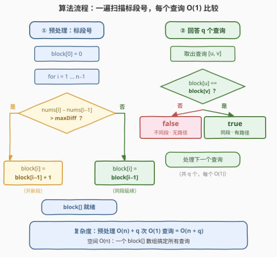

# 针对图的路径存在性查询 I

- **题目名称**：针对图的路径存在性查询 I
- **链接**：[3532. Path Existence Queries in a Graph I](https://leetcode.cn/problems/path-existence-queries-in-a-graph-i/)
- **难度**：中等
- **标签**：并查集、图、数组、哈希表、二分查找

## 1. 题目概述

给定 $n$ 个节点（编号 $0$ 到 $n-1$）、一个**非递减**整数数组 `nums` 和整数 `maxDiff`。图中的边由值决定：当且仅当 $|\text{nums}[i] - \text{nums}[j]| \le \text{maxDiff}$ 时，节点 $i$ 与 $j$ 之间存在一条**无向边**。

再给一个查询数组 `queries`，其中 $\text{queries}[i] = [u_i, v_i]$，要求判断 $u_i$ 与 $v_i$ 之间**是否存在路径**。返回布尔数组 `answer`。

**示例 1**：

```text
输入：n = 2, nums = [1,3], maxDiff = 1, queries = [[0,0],[0,1]]
输出：[true,false]
解释：|1-3| = 2 > maxDiff，节点 0 与 1 之间无边；[0,0] 到自身显然有路径。
```

**示例 2**：

```text
输入：n = 4, nums = [2,5,6,8], maxDiff = 2, queries = [[0,1],[0,2],[1,3],[2,3]]
输出：[false,false,true,true]
解释：边只有 1—2（差 1）和 2—3（差 2）；节点 0 与任何点差都超过 2，孤立成段。
      1 与 3 经由 2 连通（5 → 6 → 8，逐差 ≤ 2）。
```

**约束条件**：

- $1 \le n = \text{nums.length} \le 10^5$
- $0 \le \text{nums}[i] \le 10^5$，且 `nums` **非递减**
- $0 \le \text{maxDiff} \le 10^5$
- $1 \le \text{queries.length} \le 10^5$，$0 \le u_i, v_i < n$

> 💡 **读题关键**：① 边的判定是**基于值**而非下标，但数组**有序**这一点是破题的钥匙；② $u_i = v_i$ 时答案恒为 `true`（自己到自己有平凡路径），分段做法天然覆盖；③ $n$ 与 $q$ 都到 $10^5$，任何"每个查询都重新遍历图"的做法都不可行，必须**预处理 + O(1) 查询**。

---

## 2. 解题思路

### 2.1 暴力思路

最朴素的做法是老老实实建图：枚举所有点对 $(i, j)$，若 $|\text{nums}[i] - \text{nums}[j]| \le \text{maxDiff}$ 就加一条边，然后对每个查询做一次 BFS/DFS 判连通。

这个做法有双重灾难：

**问题一：边数爆炸。** 当所有值都挤在一个长度为 `maxDiff` 的窗口内时，图是**完全图**，边数达 $\binom{n}{2} \approx 5 \times 10^9$——内存直接爆掉，连边都存不下。即使不显式建图、改用并查集动态合并，枚举点对本身也是 $O(n^2)$ 次。

**问题二：重复劳动。** 每个查询独立跑一遍 BFS 是 $O(q \cdot n)$ 次级别，而所有查询问的其实是同一件事——"这两个点在不在同一个连通块里"。这个答案在图确定后就**固定不变**，完全可以预处理一次、处处查询。

两个问题的出路是同一个观察：这张图虽然点对意义上的边有 $O(n^2)$ 条，但它的**连通结构**简单得出人意料。

### 2.2 核心观察：有序 ⇒ 连通块是连续段



**观察一（断口是一堵墙）**：设某个相邻位置 $i$ 与 $i+1$ 满足 $\text{nums}[i+1] - \text{nums}[i] > \text{maxDiff}$（称为**断口**）。那么对**任意** $j \le i$ 与 $k \ge i+1$，由 `nums` 非递减：

$$\text{nums}[k] - \text{nums}[j] \;\ge\; \text{nums}[i+1] - \text{nums}[i] \;>\; \text{maxDiff}$$

即断口左侧的**任何**点与右侧的**任何**点之间都没有边——墙不是一扇门，是一整面严丝合缝的墙。图被断口切成了若干**互不相连的连续段**。

**观察二（段内全连通）**：相邻差 $\le \text{maxDiff}$ 的连续一段中，每对相邻节点 $(i, i+1)$ 之间都有边，形成一条**链**，于是整段任意两点可达。

**结论**：把断口两侧切开，**每个连续段恰好是一个连通块**。节点 $u, v$ 之间有路径 $\iff$ 它们落在**同一段** $\iff$ $\text{block}[u] == \text{block}[v]$（`block` 为段编号）。

> 💡 **$O(n^2)$ 条边去哪了？** 完全图里那些"隔了好几个位置的边"（如示例 2 中的 $1 \to 3$）全部是**冗余边**——它们连通的两点早已被相邻边链式连通。真正承载连通性的只有**相邻**的 $n-1$ 对关系，把边数从 $O(n^2)$ 压缩到 $O(n)$。这正是本题标签挂着"并查集"却完全不必真跑 $O(n^2)$ 合并的原因。

### 2.3 算法流程图



| 步骤 | 动作 | 说明 |
|------|------|------|
| ① 初始化 | `block[0] = 0` | 第一个节点属于第 0 段 |
| ② 扫描 | $i$ 从 $1$ 到 $n-1$ | 只看**相邻差**，不看点对 |
| ③ 判段 | $\text{nums}[i] - \text{nums}[i-1] > \text{maxDiff}$ ? | 断口则段号 $+1$，否则延续 |
| ④ 查询 | 对每个 $[u, v]$：比较 `block[u] == block[v]` | 一次数组读取 + 一次比较，$O(1)$ |

注意 `block[i]` 的语义其实就是"**前 $i$ 个相邻间隙中的断口数**"——断口每出现一次，段号加一。这也自然导出 5 节中"前缀和 / 二分"的同构视角。

### 2.4 示例演算

用**示例 2**（`nums = [2,5,6,8]`，`maxDiff = 2`）走一遍：

| $i$ | $\text{nums}[i]$ | 相邻差 $\text{nums}[i]-\text{nums}[i-1]$ | 是否断口 | $\text{block}[i]$ |
|-----|------------------|------------------------------------------|----------|-------------------|
| 0 | 2 | — | — | 0 |
| 1 | 5 | $3 > 2$ | ✅ 断口 | 1 |
| 2 | 6 | $1 \le 2$ | 否 | 1 |
| 3 | 8 | $2 \le 2$ | 否 | 1 |

得到 $\text{block} = [0, 1, 1, 1]$，逐查询比对：

| 查询 | block 值 | 结论 |
|------|----------|------|
| $[0,1]$ | $0$ vs $1$ | `false` |
| $[0,2]$ | $0$ vs $1$ | `false` |
| $[1,3]$ | $1$ vs $1$ | `true` |
| $[2,3]$ | $1$ vs $1$ | `true` |

与期望输出 `[false,false,true,true]` 完全一致。**示例 1** 同理：断口在 $0$ 与 $1$ 之间（差 $2 > 1$），$\text{block} = [0, 1]$，查询 $[0,0]$ 是 $0 == 0$ 得 `true`，$[0,1]$ 得 `false`。

---

## 3. 参考代码

### C++

```cpp
class Solution {
  public:
    vector<bool> pathExistenceQueries(int n, vector<int>& nums, int maxDiff,
                                      vector<vector<int>>& queries) {
        vector<int> block(n);
        block[0] = 0;
        for (int i = 1; i < n; i++)
            block[i] = block[i - 1] + (nums[i] - nums[i - 1] > maxDiff ? 1 : 0);

        vector<bool> answer;
        answer.reserve(queries.size());
        for (const auto& q : queries)
            answer.push_back(block[q[0]] == block[q[1]]);
        return answer;
    }
};
```

### Python

```python
class Solution:
    def pathExistenceQueries(self, n: int, nums: List[int], maxDiff: int,
                             queries: List[List[int]]) -> List[bool]:
        block = [0] * n
        for i in range(1, n):
            block[i] = block[i - 1] + (nums[i] - nums[i - 1] > maxDiff)
        return [block[u] == block[v] for u, v in queries]
```

> ⚠️ **易错点**：① 判断条件是**严格大于** `maxDiff` 才断开——恰好等于 `maxDiff` 时仍有边（示例 2 的 $6 \to 8$，差恰好为 2，输出 `true`）；② 别忘了 `nums` 非递减保证 `nums[i] - nums[i-1] >= 0`，无需取绝对值，但若改成任意数组输入就必须先排序或取 `abs`；③ $u_i = v_i$ 的查询被 `block[u] == block[v]` 天然处理为 `true`，不要额外特判反而画蛇添足；④ 本题不存在溢出问题（值域 $10^5$，差值上界 $10^5$），但若把 `block` 比较写成 `nums` 差值比较就要小心 `int` 边界习惯。

---

## 4. 复杂度分析

| 维度 | 复杂度 | 说明 |
|------|--------|------|
| 时间复杂度 | $O(n + q)$ | 预处理一趟扫描 $O(n)$；每个查询两次数组读取 + 一次比较 $O(1)$ |
| 空间复杂度 | $O(n)$ | `block` 段编号数组（输出数组不计入） |
| 数据范围验证 | — | $n, q \le 10^5$：总计约 $2 \times 10^5$ 次基本操作，远低于时限 |
| 对比暴力 | — | 建完全图 $O(n^2)$ 边 $\approx 5 \times 10^9$ 条，内存与时间双爆；本解法把边压缩到相邻 $n-1$ 对 |

---

## 5. 扩展：并查集与前缀和的两种同构写法

**写法一：并查集（标签的"正统"解法）。** 只需对**相邻**的 $(i, i+1)$ 做合并——断口则跳过：

```python
class Solution:
    def pathExistenceQueries(self, n: int, nums: List[int], maxDiff: int,
                             queries: List[List[int]]) -> List[bool]:
        parent = list(range(n))

        def find(x: int) -> int:
            while parent[x] != x:
                parent[x] = parent[parent[x]]   # 路径压缩（迭代写法防爆栈）
                x = parent[x]
            return x

        for i in range(1, n):
            if nums[i] - nums[i - 1] <= maxDiff:
                parent[find(i)] = find(i - 1)   # 只合并相邻，O(n) 次而非 O(n^2) 次

        return [find(u) == find(v) for u, v in queries]
```

复杂度 $O(n \alpha + q \alpha)$，实测比段编号慢（多一层函数调用与路径压缩），但**不依赖有序性成立与否**——若题目改成 `nums` 无序，先按值排序记录原下标即可套用。这正是它的价值：**段编号是"有序"特化的并查集**。

**写法二：前缀和 / 二分视角。** 注意 $\text{block}[i] = $ 前 $i$ 个间隙中的断口数，等价于定义 $s[i] = \sum_{j<i} [\text{nums}[j+1] - \text{nums}[j] > \text{maxDiff}]$。则

$$u, v \text{ 连通} \iff s[\max(u,v)] - s[\min(u,v)] = 0$$

即"区间内断口数为零"。这解释了本题为什么带"二分查找"标签：若不想存 `block`，也可以对每个 $u$ 用二分（在相邻差数组上找右侧第一个断口）定位它所在段的右端点 $R(u)$，查询即判断 $v \le R(u)$ 且 $v \ge L(u)$——与前缀和互为表里，本质都是"断口把序列切成段"这一结构。

三种写法的共同根：**预处理连通性信息，把每次查询降到 $O(1)$（或 $O(\log n)$）**。

---

## 6. 面试要点

1. **为什么连通块一定是连续段？如何一句话证明？**

   - 断口处 $\text{nums}[i+1] - \text{nums}[i] > \text{maxDiff}$，则任意 $j \le i < k$ 有 $\text{nums}[k] - \text{nums}[j] \ge \text{nums}[i+1] - \text{nums}[i] > \text{maxDiff}$（非递减保证传递），故墙两侧两两无边；而段内相邻差全部合格，链式连通。两件事合起来：连通块 = 连续段。

2. **图明明可能有 $O(n^2)$ 条边，为什么只处理 $n-1$ 对相邻关系就够？**

   - 非相邻的边全是**冗余边**：若 $i < j$ 有边，则 $[i, j]$ 内每一对相邻点也有边，链式地把整段连通。传递闭包意义下，$n-1$ 条相邻边与全部 $O(n^2)$ 条边生成**完全相同的连通性**。识别并丢弃冗余边是本题从 TLE 到 AC 的关键一步。

3. **段编号、并查集、前缀和三种写法怎么选？**

   - 有序输入（本题）：段编号最快最短，$O(n+q)$ 且常数极小；`nums` 无序或需要**动态加边**（如边权逐渐放开的 II 系列）：并查集更通用；只想回答"区间内有没有断口"类问题：前缀和/二分顺手。面试先给段编号，再主动提并查集的适用边界，层次感立刻出来。

4. **有哪些一写就错的坑？**

   - 断口条件写成 $\ge$（把恰好等于 `maxDiff` 的边误杀，示例 2 的 $[2,3]$ 查询即挂）；忘记有序性去写 `abs`（本题不会错但暴露没读懂条件）；对 $u = v$ 的查询画蛇添足特判；C++ 里 `vector<bool>` 的引用语义（`answer.push_back(block[u] == block[v])` 无坑，但别尝试取其元素引用做修改）。

5. **如果查询改成"是否存在长度不超过 L 的路径"呢？**

   - 那就是续作 [3534. 针对图的路径存在性查询 II](https://leetcode.cn/problems/path-existence-queries-in-a-graph-ii/) 的方向：连通性不够用了，需要在段结构上做**跳数**层面的计数/倍增。本题的段划分仍是地基——先想清楚"哪些点之间根本无路"，再谈"路有多短"。

---

## 7. 同类练习题

- [3534. 针对图的路径存在性查询 II](https://leetcode.cn/problems/path-existence-queries-in-a-graph-ii/)：本题续作，同样的图上叠加路径长度限制，段结构 + 倍增/计数的进阶版
- [547. 省份数量](https://leetcode.cn/problems/number-of-provinces/)（[站内题解](../0501-0600/547_省份数量.md)）：并查集数连通块的原型题，对照体会"本题的连通块特殊到不需要并查集"
- [1631. 最小体力消耗路径](https://leetcode.cn/problems/path-with-minimum-effort/)（[站内题解](../1601-1700/1631_最小体力消耗路径.md)）：把"边权 ≤ 阈值"的连通性问题交给并查集，与本题的 `maxDiff` 判边一脉相承
- [128. 最长连续序列](https://leetcode.cn/problems/longest-consecutive-sequence/)：同样利用"有序 + 相邻关系"把 $O(n^2)$ 的看似必要枚举压到线性，训练"只看相邻"的题感
- [1970. 你能穿过矩阵的最后一天](https://leetcode.cn/problems/last-day-where-you-can-still-cross/)（[站内题解](../1901-2000/1970_你能穿过矩阵的最后一天.md)）：动态加边 + 二分答案的连通性查询，展示连通块结构"随边变化"时的通用武器
