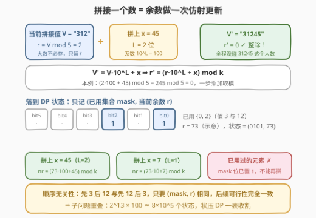
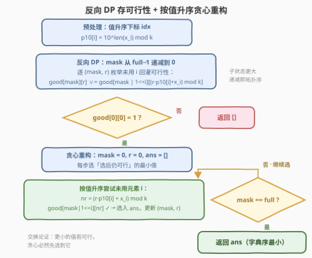

# 判断连接可整除性

- **题目名称**：判断连接可整除性
- **链接**：[3533. 判断连接可整除性](https://leetcode.cn/problems/concatenated-divisibility/)
- **难度**：困难
- **标签**：位运算、数组、动态规划、状态压缩

## 1. 题目概述

给定正整数数组 `nums` 和正整数 $k$。把 `nums` 的某个**排列**按顺序**连接十进制表示**得到一个大数，若该数能被 $k$ 整除，则称该排列形成**可整除连接**。返回能形成可整除连接且**字典序最小**的排列（以整数列表表示）；若不存在这样的排列，返回空列表。

**示例 1**：

```text
输入：nums = [3,12,45], k = 5
输出：[3,12,45]
解释：31245 能被 5 整除；另一可行排列 [12,3,45]（12345）字典序更大。
```

**示例 2**：

```text
输入：nums = [10,5], k = 10
输出：[5,10]
解释：510 能被 10 整除，105 不能。
```

**示例 3**：

```text
输入：nums = [1,2,3], k = 5
输出：[]
解释：任何排列的拼接值都不能被 5 整除。
```

**约束条件**：

- $1 \le \text{nums.length} \le 13$
- $1 \le \text{nums}[i] \le 10^5$
- $1 \le k \le 100$

> 💡 **读题关键**：三个信号叠加。① $n \le 13$——**状压 DP 的信号灯**，$2^{13} = 8192$ 个子集恰好可枚举；② $k \le 100$——拼接出的大数取模后**余数只有 100 种**，天文数字坍缩成小整数；③ 字典序按**整数列表**逐位比较——示例 1 即证据：$3 < 12$，所以 $[3,12,45] < [12,3,45]$，尽管拼接串恰好反过来（"31245" > "12345"）。因此重构时按**数值**从小到大贪心，而不是按字符串序。

---

## 2. 解题思路

### 2.1 暴力思路：枚举全部排列

最直接的做法是枚举全部 $n!$ 个排列，逐个拼接取模验证。$13! \approx 6.2 \times 10^9$，直接爆炸。更糟的是**剪枝无从下手**：整除性看的是最终大数，前缀余数非零并不意味着死路（后面拼上去的数会把余数「拉回来」），深搜必须走完整条路径才能判定。

真正的突破口是**子问题重叠**：设某个前缀已经用掉了集合 $M$、拼接值模 $k$ 的余数为 $r$。此后能否拼出整除结果，只取决于 $(M, r)$——**与这 $|M|$ 个数当初的先后顺序无关**，因为后续转移只看「还剩谁」和「当前余数」。不同顺序的前缀大量坍缩到同一 $(M, r)$，把递归参数 $(\text{mask}, r)$ 缓存起来，就是状压 DP（也正是官方 hints 的递进路线：先写递归 → 加位掩码记忆化 → 从 DP 表重构答案）。

### 2.2 核心观察：余数仿射更新 + 状态 (mask, r)



**观察 1（拼接 = 余数做一次仿射更新）**：当前拼接值为 $V$（模 $k$ 余 $r$），在末尾拼上一个 $L$ 位数 $x$，则新值为

$$V' = V \cdot 10^{L} + x$$

由同余性质立刻得到**无需大数**的转移：

$$r' = (r \cdot 10^{L} + x) \bmod k$$

其中 $10^{L} \bmod k$ 可预处理（$L \le 6$，因 $\text{nums}[i] \le 10^5$）。每拼一个数只做一次乘加取模。

**观察 2（马尔可夫性 → 状态定义）**：定义

$$\text{good}[\text{mask}][r] = \text{已用集合为 mask、当前余数为 r 时，存在一种顺序拼完剩余元素使最终余数归 0}$$

转移方程（$p_i := 10^{L_i} \bmod k$，$x_i := \text{nums}[i]$）：

$$\text{good}[\text{mask}][r] \iff \exists\, i \notin \text{mask}:\ \text{good}\big[\text{mask} \mid 2^i\big]\big[(r \cdot p_i + x_i) \bmod k\big]$$

边界：$\text{good}[\text{full}][0] = \text{true}$（全部拼完，只认余数 0），$\text{good}[\text{full}][r \ne 0] = \text{false}$。

**为什么从 `full` 反着往 0 算**：一是贪心重构需要的恰恰是「**从这个状态出发能否完成**」的后向信息，反向 DP 一步算齐；二是转移目标 $\text{mask} \mid 2^i$ 在数值上严格大于 `mask`，`mask` 递减枚举天然满足拓扑序，无需按 popcount 分层。

### 2.3 算法流程图



落实到步骤：

1. **预处理**：得到值升序的原始下标 `idx`（重构用），以及 $p_i = 10^{L_i} \bmod k$；
2. **反向 DP**：`mask` 从 `full−1` 递减到 0，对每个 $(\text{mask}, r)$ 枚举未用元素 $i$ 回灌可行性，找到一个可行后续即可 `break`；
3. 若 $\text{good}[0][0]$ 为假 → 无解，返回 `[]`；
4. **贪心重构**：$(\text{mask}, r)$ 从 $(0, 0)$ 出发，每步按**数值**从小到大尝试未用元素 $i$，第一个满足 $\text{good}[\text{mask} \mid 2^i][nr]$ 的入选；
5. `mask` 到达 `full` 时输出排列。

**字典序正确性（交换论证）**：贪心在每一步选的是「选后仍可行」的最小值。若存在可行排列 $P$ 在某位置上的数比贪心所选的 $v$ 更小，则 $P$ 与贪心前缀一致时，那个更小的数在当前状态下经 DP 判定**不可行**——矛盾。故贪心输出即字典序最小。

### 2.4 示例演算

用示例 1（`nums=[3,12,45], k=5`）走一遍。注意 $5 \mid 10$，所有 $10^L \equiv 0 \pmod 5$，于是 $r' \equiv x \pmod 5$——**末位元素决定整除性**，可行排列必须以 45 收尾。8 个 `mask` 的 `good` 表（`good` 为该 `mask` 下可行的余数集合）：

| mask | 已用 | 剩余 | good（可行余数集合） | 说明 |
|---|---|---|---|---|
| `111` | {3,12,45} | $\varnothing$ | {0} | 边界：拼完只认 $r=0$ |
| `110` | {12,45} | {3} | $\varnothing$ | 拼上 3 后 $r=3 \ne 0$ |
| `101` | {3,45} | {12} | $\varnothing$ | 拼上 12 后 $r=2 \ne 0$ |
| `011` | {3,12} | {45} | {0,1,2,3,4} | 拼上 45 恒归 0 → 全部可行 |
| `100` | {45} | {3,12} | $\varnothing$ | 两个子状态皆空 |
| `010` | {12} | {3,45} | {0,1,2,3,4} | 拼上 3 后落进 `011`（全可行） |
| `001` | {3} | {12,45} | {0,1,2,3,4} | 拼上 12 后落进 `011`（全可行） |
| `000` | $\varnothing$ | 全部 | {0,1,2,3,4} | 有解，进入重构 |

重构从 $(\text{mask}{=}\,000,\ r=0)$ 出发，每步按值升序尝试：

- **试 3**：$nr = 3 \bmod 5 = 3$，$\text{good}[001] \ni 3$ ✓ → 选 3（12、45 值更大，轮不到试）；
- **试 12**：$nr = (3 \cdot 100 + 12) \bmod 5 = 2$，$\text{good}[011] \ni 2$ ✓ → 选 12。若值更小的候选都失败才会试 45——而 $\text{good}[101] = \varnothing$，45 放第二位会把 12 留到末位（$12 \bmod 5 \ne 0$），DP 一步判死；
- **试 45**：$nr = (2 \cdot 100 + 45) \bmod 5 = 0$，$\text{good}[111] = \{0\}$ ✓ → 选 45。

得到 $[3,12,45]$，与官方输出一致。全程没有碰过 "31245" 这个五位数——余数维度就是全部信息。

---

## 3. 参考代码

### C++

```cpp
class Solution {
  public:
    vector<int> concatenatedDivisibility(vector<int>& nums, int k) {
        int n = nums.size();

        // 值升序的原始下标：重构时按值从小到大试
        vector<int> idx(n);
        iota(idx.begin(), idx.end(), 0);
        sort(idx.begin(), idx.end(), [&](int a, int b) { return nums[a] < nums[b]; });

        // p10[i] = 10^len(nums[i]) mod k：拼接 x_i 时的模乘系数
        vector<int> p10(n);
        for (int i = 0; i < n; i++) {
            p10[i] = 1;
            for (int x = nums[i]; x > 0; x /= 10) p10[i] = p10[i] * 10 % k;
        }

        int full = (1 << n) - 1;
        // good[mask][r]：已用集合为 mask、余数为 r 时能否拼完剩余元素使余数归 0
        vector<char> good((full + 1) * k, 0);
        good[full * k] = 1;
        for (int mask = full - 1; mask >= 0; mask--) {   // 子状态更大，递减即拓扑序
            for (int r = 0; r < k; r++) {
                for (int i = 0; i < n; i++) {
                    if (mask >> i & 1) continue;         // 已用过
                    int nr = (r * p10[i] + nums[i]) % k; // 仿射余数更新
                    if (good[(mask | 1 << i) * k + nr]) {
                        good[mask * k + r] = 1;
                        break;                           // 找到一个可行后续即可
                    }
                }
            }
        }

        if (!good[0]) return {};                         // 从 (空集, 0) 出发不可行

        // 贪心重构：每步选「选后仍可行」的最小值
        vector<int> ans;
        int mask = 0, r = 0;
        while (mask != full) {
            for (int t = 0; t < n; t++) {
                int i = idx[t];                          // 值升序
                if (mask >> i & 1) continue;
                int nr = (r * p10[i] + nums[i]) % k;
                if (good[(mask | 1 << i) * k + nr]) {
                    ans.push_back(nums[i]);
                    mask |= 1 << i;
                    r = nr;
                    break;
                }
            }
        }
        return ans;
    }
};
```

### Python

```python
class Solution:
    def concatenatedDivisibility(self, nums: List[int], k: int) -> List[int]:
        n = len(nums)
        order = sorted(range(n), key=lambda i: nums[i])   # 值升序的原始下标
        p10 = [pow(10, len(str(x)), k) for x in nums]     # 拼接系数 10^len mod k

        full = (1 << n) - 1
        # good[mask][r]：已用集合为 mask、余数为 r 时能否拼完剩余元素使余数归 0
        good = [[False] * k for _ in range(full + 1)]
        good[full][0] = True
        for mask in range(full - 1, -1, -1):              # 子状态更大，递减即拓扑序
            row = good[mask]
            for r in range(k):
                for i in range(n):
                    if mask >> i & 1:
                        continue                          # 已用过
                    nr = (r * p10[i] + nums[i]) % k       # 仿射余数更新
                    if good[mask | (1 << i)][nr]:
                        row[r] = True
                        break                             # 找到一个可行后续即可

        if not good[0][0]:
            return []

        # 贪心重构：每步选「选后仍可行」的最小值
        ans, mask, r = [], 0, 0
        while mask != full:
            for i in order:
                if mask >> i & 1:
                    continue
                nr = (r * p10[i] + nums[i]) % k
                if good[mask | (1 << i)][nr]:
                    ans.append(nums[i])
                    mask |= 1 << i
                    r = nr
                    break
        return ans
```

> 💡 **实现细节**：① `good` 压成一维 $(\text{full}+1) \times k$ 数组，缓存更友好；② 中间量 $r \cdot p_i + x_i \le 100 \times 100 + 10^5$，`int` 无溢出风险；③ Python 版若超时，可把每行 `good[mask]` 压成 $k$ 位整数位集（`good[mask] >> nr & 1` 判可行），重构逻辑不变，最坏情形约再快一倍（本地实测 $n{=}13$ 纯 $O(2^n \cdot n \cdot k)$ 循环约 0.5～1.3 s，位集版约 0.5 s）；④ 相等元素天然无需特判——同值的两个下标转移完全同构，贪心选哪个输出都一样。

---

## 4. 复杂度分析

| 维度 | 复杂度 | 说明 |
|------|--------|------|
| 时间复杂度 | $O(2^n \cdot n \cdot k)$ | $2^{13} \times 13 \times 100 \approx 1.1 \times 10^7$ 次转移（C++ 实测约 10 ms；Python 约 0.5～1.3 s） |
| 空间复杂度 | $O(2^n \cdot k)$ | `good` 表 $8192 \times 100 \approx 8.2 \times 10^5$ 个布尔值，约 0.8 MB |

贪心重构仅 $O(n^2)$，忽略不计。

---

## 5. 扩展：记忆化写法与变体

- **记忆化 DFS（官方 hints 路线）**：把迭代 DP 换成自顶向下的 `can(mask, r)` 递归 + 缓存，判断逻辑完全同构；重构时在递归内部按值升序试出第一个可行后继即返回。复杂度不变，但只计算从 $(0,0)$ 出发可达的状态，稀疏场景更省。
- **前向可达性为何不够**：也可前向计算 `reach[mask]`（从 $(0,0)$ 出发能到达的余数集合）判存在性，但贪心重构需要的是「**从当前状态能否完成**」的后向 `good` 表，反向 DP 一步到位。
- **比较器变体**：本题字典序按**整数列表**比较，排序键就是数值；若改成「拼接字符串字典序最小」，排序键需换成字符串比较（"10" < "9"），DP 部分不变——这是这类题最容易被偷换的陷阱。
- **哈密顿路径同构**：`good` 的转移结构与 TSP / 996 那类「枚举排列」的状压 DP 同构，只是把「上一个元素」维度换成了「余数」维度——遇到 $n \le 20$ 且涉及排列顺序的题，先想 $(\text{mask}, \cdot)$ 二维状态。

---

## 6. 面试要点

1. **怎么想到状压 DP？**

   > 两个信号叠加：$n \le 13$（$2^{13} = 8192$，子集可编码进一个整数）；拼接大数取模后**顺序信息坍缩**——前缀只留下 (已用集合, 余数)，同一 $(\text{mask}, r)$ 的后续可行性完全等价，子问题重叠是 DP 的入场券。

2. **状态与转移方程是什么？为什么不用管拼接出的大数？**

   > $\text{good}[\text{mask}][r]$ = 从该状态出发能否拼完剩余元素使余数归 0。由 $V' = V \cdot 10^L + x$ 的同余性得 $r' = (r \cdot 10^L + x) \bmod k$，全程只跟踪余数；$10^L \bmod k$ 预处理，$L \le 6$。

3. **字典序最小怎么保证？比较的是整数还是字符串？**

   > 反向 DP 算出可行性表后，每步在未用元素中按**数值**升序选「选后仍可行」的最小者，交换论证成立。注意本题按整数列表比较：示例 1 中 $[3,12,45] < [12,3,45]$（因为 $3 < 12$）；若误按拼接串比较会选出 $[12,3,45]$（"12345" < "31245"）。

4. **DP 为什么从 full 反着算？**

   > 重构需要「能否完成」的后向信息，反向 DP 直接产出该表；同时子状态 $\text{mask} \mid 2^i$ 数值严格更大，`mask` 递减枚举天然满足拓扑序，不需要按 popcount 分层。

5. **复杂度和内存上界？**

   > 时间 $O(2^n \cdot n \cdot k) \approx 1.1 \times 10^7$，空间 $O(2^n \cdot k) \approx 0.8$ MB；中间量 $r \cdot p_i + x_i$ 上界约 $10^5$，无溢出。答案不存在时 `good[0][0]` 为假，直接返回空表。

> 💡 **一句话总结**：3533 = 「拼接取模 + 排列状压 + 贪心重构」——大数坍缩成 $(\text{mask}, r)$，反向 DP 存可行性，再按值升序贪心逐位定案，字典序最小的可整除排列手到擒来。

---

## 7. 同类练习题

- [996. 平方数组的数目](https://leetcode.cn/problems/number-of-squareful-arrays/)（[题解](../0901-1000/996_平方数组的数目.md)）：同款「枚举排列」的状压 DP，状态是 (mask, 上一元素)，本题把「上一元素」换成了「余数」维度
- [526. 优美的排列](https://leetcode.cn/problems/beautiful-arrangement/)（[题解](../0501-0600/526_优美的排列.md)）：(mask, pos) 记忆化回溯，排列型状压 DP 的入门甜区
- [847. 访问所有节点的最短路径](https://leetcode.cn/problems/shortest-path-visiting-all-nodes/)（[题解](../0801-0900/847_访问所有节点的最短路径.md)）：(mask, node) 二维状态压缩的代表，训练「集合入状态」的手感
- [1494. 并行课程 II](https://leetcode.cn/problems/parallel-courses-ii/)（[题解](../1401-1500/1494_并行课程II.md)）：可行性状压 DP + 子集转移，同样是「DP 表 + 方案重构」套路
- [1799. N 次操作后的最大分数和](https://leetcode.cn/problems/maximize-score-after-n-operations/)（[题解](../1701-1800/1799_N次操作后的最大分数和.md)）：每轮从剩余集合中挑元素、mask 递进的经典形态
