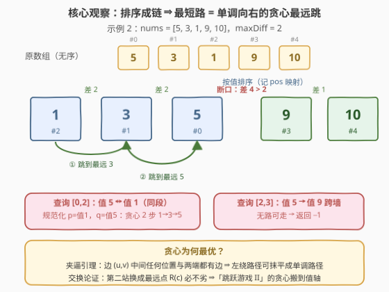
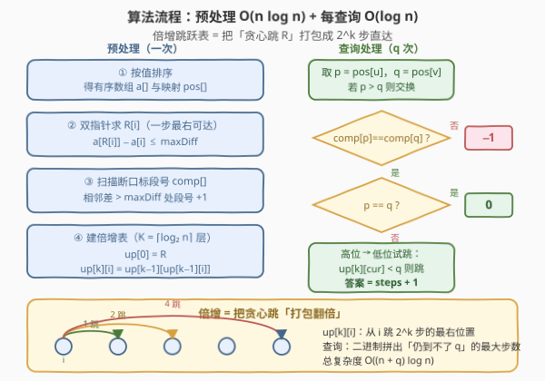

# 针对图的路径存在性查询 II

- **题目名称**：针对图的路径存在性查询 II
- **链接**：[3534. Path Existence Queries in a Graph II](https://leetcode.cn/problems/path-existence-queries-in-a-graph-ii/)
- **难度**：困难
- **标签**：贪心、位运算、图、排序、双指针、二分查找

## 1. 题目概述

给定 $n$ 个节点（编号 $0$ 到 $n-1$）、整数数组 `nums` 和整数 `maxDiff`。图中的边由**值**决定：当且仅当 $|\text{nums}[i] - \text{nums}[j]| \le \text{maxDiff}$ 时，节点 $i$ 与 $j$ 之间存在一条**无向边**。

再给一个查询数组 `queries`，其中 $\text{queries}[i] = [u_i, v_i]$，要求求出 $u_i$ 与 $v_i$ 之间的**最短距离**（边无权重，即最少边数）；若两节点之间不存在路径，返回 $-1$。

**示例 1**：

```text
输入：n = 5, nums = [1,8,3,4,2], maxDiff = 3, queries = [[0,3],[2,4]]
输出：[1,1]
解释：查询 [0,3]：1 → 4（|1-4| = 3 ≤ 3），距离 1；查询 [2,4]：3 → 2（差 1），距离 1。
```

**示例 2**：

```text
输入：n = 5, nums = [5,3,1,9,10], maxDiff = 2, queries = [[0,1],[0,2],[2,3],[4,3]]
输出：[1,2,-1,1]
解释：查询 [0,1]：5 → 3，距离 1；查询 [0,2]：5 → 3 → 1，距离 2；
      查询 [2,3]：1 与 9 之间无路，-1；查询 [4,3]：10 → 9，距离 1。
```

**示例 3**：

```text
输入：n = 3, nums = [3,6,1], maxDiff = 1, queries = [[0,0],[0,1],[1,2]]
输出：[0,-1,-1]
解释：任意两点值差均大于 1，无边；[0,0] 到自身距离为 0。
```

**约束条件**：

- $1 \le n = \text{nums.length} \le 10^5$
- $0 \le \text{nums}[i] \le 10^5$
- $0 \le \text{maxDiff} \le 10^5$
- $1 \le \text{queries.length} \le 10^5$，$\text{queries}[i] = [u_i, v_i]$，$0 \le u_i, v_i < n$

> 💡 **读题关键**：与前作 [3532. 针对图的路径存在性查询 I](../3501-3600/3532_针对图的路径存在性查询I.md) 对照有**两处关键升级**——① `nums` **不再保证有序**（I 是非递减数组），必须先按值排序；② 问的不再是"是否可达"而是**无权图最短路**（跳数）。特别地，"同段"不再意味着距离为常数：同一段内两点距离可以从 $1$ 一直大到 $O(n)$，这是与 I 的本质鸿沟。

---

## 2. 解题思路

### 2.1 暴力思路

最朴素的做法：对每个查询从 $u$ 出发跑一遍 BFS。邻居不必显式建边——把值排序后，从当前节点出发可达的恰是值落在 $[\,\text{nums}[c] - \text{maxDiff},\ \text{nums}[c] + \text{maxDiff}\,]$ 内的所有节点，二分即可定位区间。

这个做法有双重灾难：

**问题一：邻居区间爆炸。** 值全挤在一个 `maxDiff` 窗口内时图是完全图，单个节点的邻居区间就是全长。逐个入队的话，一次 BFS 的邻居扫描总量是 $O(n^2)$ 级别；即便用"未访问集合"优化到每个节点只出队一次，单次 BFS 也要 $O(n \log n)$。

**问题二：重复劳动。** $q \le 10^5$ 个查询共享同一个**静态**图，逐个 BFS 总代价 $O(q \cdot n \log n) \approx 10^{10}$，必然超时。

最短路对所有点对共有 $O(n^2)$ 个答案，不可能全部预存；出路是预处理出"**如何快速跳**"的**过程性信息**——这正是**倍增**（binary lifting）的用武之地，也是官方 hints 逐条暗示的路线：*Sort the nodes according to nums[i] → Can we use binary jumping? → Use binary jumping with a sparse table.*（按值排序 → 二进制跳跃 → 稀疏表。）

### 2.2 核心观察：排序成链 + 贪心最远跳



**观察一（排序后段结构原封不动）**：按值排序（同时记录 `pos`：原下标 ↔ 链上位置）得到非递减数组 $a$ 后，I 的结论可以照搬：相邻差 $a[i+1] - a[i] > \text{maxDiff}$ 处是**墙**——由 $a$ 有序可证墙两侧任意两点值差都超过 `maxDiff`，两两无边。墙把序列切成若干**连续段**，每段恰是一个连通块。查询第一步先比段号，异段直接 $-1$。

**观察二（最短路可以只向右走）**：设排序后 $p < q$。关键是一条**夹逼引理**：

> 若 $u \to v$ 有边（$a_u \le a_v$），则排序后落在 $[u, v]$ 内的**任意**位置 $t$ 满足 $a_u \le a_t \le a_v$，于是 $u \to t$ 与 $t \to v$ 都是边。

用它可以"抹平"任何绕路：对任意路径 $x_0 = p, x_1, \dots, x_k = q$，令 $y_i = \min(q,\ \max_{j \le i} x_j)$（走到第 $i$ 步时"至今到过最靠右、但不超过 $q$ 的位置"）。由夹逼引理逐项验证可知 $|a_{y_{i+1}} - a_{y_i}| \le \text{maxDiff}$ 仍成立，且 $y_0 = p$、$y_k = q$、$y$ 单调不减、长度不超过 $k$。**⇒ 最短路一定存在单调向右的版本**，"先往左绕再回来"永远不会更短。

**观察三（贪心：每步跳到最远）**：从链上位置 $c$ 出发，一步可达的位置恰是连续区间 $[L(c), R(c)]$，其中

$$R(c) = \max\{\, j : a_j - a_c \le \text{maxDiff} \,\}$$

贪心策略：**每一步跳到 $R(c)$**。正确性是交换论证：设最优单调路径为 $x_0 = p, x_1, \dots, x_k = q$。把第二站 $x_1$ 换成 $R(p) \ge x_1$ 后——若 $R(p) \ge x_2$，路径被缩短，与最优性矛盾（说明这种情况本来就不该发生）；否则 $x_1 \le R(p) \le x_2$，由夹逼引理 $R(p) \to x_2$ 仍是边，替换后长度不变。归纳下去，"反复跳 $R$"的步数就是最短距离。

> 💡 这就是 [45. 跳跃游戏 II](https://leetcode.cn/problems/jump-game-ii/) 的贪心从"下标轴"搬到"值轴"：每步跳最远，跳的次数 = 无权图最短路边数。

剩下的工程问题：单次查询若老老实实一步步跳，最坏 $O(n)$ 步（例如相邻差恰好压着 `maxDiff` 的长链），$q$ 次查询仍是 $O(nq) \approx 10^{10}$。需要把"跳 $2^k$ 步会到哪"预处理成表——**倍增**登场。

### 2.3 算法流程：倍增跳跃表



记 $f_t(i)$ 为从 $i$ 出发贪心跳 $t$ 步后的位置。由观察三的归纳可证：$f_t(i)$ 就是"$\le t$ 步内可达的最右位置"。于是

$$d(p, q) = \min\{\, t : f_t(p) \ge q \,\}$$

**倍增表**：$\text{up}[0][i] = R(i)$，$\text{up}[k][i] = \text{up}[k-1][\,\text{up}[k-1][i]\,]$，即 $\text{up}[k][i] = f_{2^k}(i)$，共 $K = \lceil \log_2 n \rceil$ 层（最坏距离 $n - 1 < 2^K$，层数足够）。查询时从高位到低位试跳——经典的二进制拼数：

```text
cur = p, steps = 0
for k = K-1 downto 0:
    if up[k][cur] < q:        # 跳 2^k 步仍到不了 q，才放心跳
        cur = up[k][cur]
        steps += 2^k
answer = steps + 1            # 循环结束后 up[0][cur] >= q，最后一步直达
```

**正确性**：循环结束时，对任意 $k$ 都有 $\text{up}[k][\text{cur}] \ge q$，特别地一步可达 $q$，故答案 $\le \text{steps} + 1$；而 `steps` 是"仍到不了 $q$"的最大步数（贪心跳的可达域随步数单调扩大），故 $\text{steps} + 1$ 又是下界。

**$R(i)$ 的求法**：双指针——$a$ 有序保证 $R$ 单调不减，指针 $j$ 从不回退，$O(n)$；对每个 $i$ 二分也行，$O(n \log n)$。**段号 `comp`** 一遍扫描，同 I。

### 2.4 示例演算

用**示例 2**（`nums = [5,3,1,9,10]`，`maxDiff = 2`）走一遍。按值排序得 $a = [1,3,5,9,10]$，`pos`：节点 2→0、节点 1→1、节点 0→2、节点 3→3、节点 4→4。相邻差为 $2,2,4,1$，在 $5|9$ 处断口，故 $\text{comp} = [0,0,0,1,1]$。双指针求得 $R = [1,2,2,4,4]$，于是 $\text{up}[1] = [\,R[R[0]],\ R[R[1]],\ R[R[2]],\ R[R[3]],\ R[R[4]]\,] = [2,2,2,4,4]$。

| 查询 | $p=\text{pos}[u]$，$q=\text{pos}[v]$（交换使 $p \le q$） | 试跳过程 | 答案 |
|------|------|------|------|
| $[0,1]$ | 节点 0 值 5（pos 2）、节点 1 值 3（pos 1）→ 交换得 $p=1, q=2$ | $\text{up}[0][1] = 2 \ge q$，一步直达 | $1$ |
| $[0,2]$ | 节点 0 值 5、节点 2 值 1 → $p=0, q=2$ | $\text{up}[1][0]=2$ 不小于 $q$ 跳过；$\text{up}[0][0]=1 < q$ 跳，steps=1；最后 $+1$ | $2$ |
| $[2,3]$ | $p=0$（值 1），$q=3$（值 9） | $\text{comp}[0]=0 \ne \text{comp}[3]=1$，跨墙 | $-1$ |
| $[4,3]$ | 节点 4 值 10、节点 3 值 9 → $p=3, q=4$ | $\text{up}[0][3] = 4 \ge q$，一步直达 | $1$ |

与期望输出 $[1,2,-1,1]$ 完全一致。

---

## 3. 参考代码

### C++

```cpp
class Solution {
  public:
    vector<int> pathExistenceQueries(int n, vector<int>& nums, int maxDiff,
                                     vector<vector<int>>& queries) {
        vector<int> idx(n);
        iota(idx.begin(), idx.end(), 0);
        sort(idx.begin(), idx.end(), [&](int x, int y) { return nums[x] < nums[y]; });

        vector<int> a(n), pos(n);
        for (int i = 0; i < n; i++) {
            a[i] = nums[idx[i]];
            pos[idx[i]] = i;
        }

        vector<int> R(n);
        for (int i = 0, j = 0; i < n; i++) {
            if (j < i) j = i;
            while (j + 1 < n && a[j + 1] - a[i] <= maxDiff) j++;
            R[i] = j;
        }

        vector<int> comp(n);
        for (int i = 1, c = 0; i < n; i++) {
            if (a[i] - a[i - 1] > maxDiff) c++;
            comp[i] = c;
        }

        int K = 1;
        while ((1 << K) < n) K++;
        vector<vector<int>> up(K, vector<int>(n));
        up[0] = R;
        for (int k = 1; k < K; k++)
            for (int i = 0; i < n; i++)
                up[k][i] = up[k - 1][up[k - 1][i]];

        vector<int> answer;
        answer.reserve(queries.size());
        for (const auto& qr : queries) {
            int p = pos[qr[0]], q = pos[qr[1]];
            if (p > q) swap(p, q);
            if (comp[p] != comp[q]) {
                answer.push_back(-1);
            } else if (p == q) {
                answer.push_back(0);
            } else {
                int cur = p, steps = 0;
                for (int k = K - 1; k >= 0; k--)
                    if (up[k][cur] < q) {
                        cur = up[k][cur];
                        steps += 1 << k;
                    }
                answer.push_back(steps + 1);
            }
        }
        return answer;
    }
};
```

### Python

```python
class Solution:
    def pathExistenceQueries(self, n: int, nums: List[int], maxDiff: int,
                             queries: List[List[int]]) -> List[int]:
        idx = sorted(range(n), key=lambda i: nums[i])
        a = [nums[i] for i in idx]
        pos = [0] * n
        for i, node in enumerate(idx):
            pos[node] = i

        R = [0] * n
        j = 0
        for i in range(n):
            if j < i:
                j = i
            while j + 1 < n and a[j + 1] - a[i] <= maxDiff:
                j += 1
            R[i] = j

        comp = [0] * n
        for i in range(1, n):
            comp[i] = comp[i - 1] + (a[i] - a[i - 1] > maxDiff)

        K = max(1, (n - 1).bit_length())
        up = [R]
        for _ in range(1, K):
            prev = up[-1]
            up.append([prev[prev[i]] for i in range(n)])

        answer = []
        for u, v in queries:
            p, q = pos[u], pos[v]
            if p > q:
                p, q = q, p
            if comp[p] != comp[q]:
                answer.append(-1)
            elif p == q:
                answer.append(0)
            else:
                cur, steps = p, 0
                for k in range(K - 1, -1, -1):
                    if up[k][cur] < q:
                        cur = up[k][cur]
                        steps += 1 << k
                answer.append(steps + 1)
        return answer
```

> ⚠️ **易错点**：① **先排序**——II 的 `nums` 无序，直接沿用 I 的代码会全错；② $p > q$ 必须**交换**，贪心方向固定向右；③ 试跳条件是**严格小于** $\text{up}[k][\text{cur}] < q$——等于 $q$ 时一步直达，跳过头就回不来了（贪心只向右）；④ 双指针求 $R$ 时 $j$ **不要回退**（$R$ 单调不减是双指针正确性的来源）；⑤ 层数 $K$ 要能覆盖最坏链长 $n-1$；⑥ 恰好等于 `maxDiff` 时**有边**（严格大于才是断口），示例 2 的 $9 \to 10$ 即差恰好为 2 仍可达。

---

## 4. 复杂度分析

| 维度 | 复杂度 | 说明 |
|------|--------|------|
| 时间复杂度 | $O((n + q) \log n)$ | 排序 $O(n \log n)$；双指针求 $R$ 与段号 $O(n)$；倍增表 $O(n \log n)$；每个查询试跳 $O(\log n)$ |
| 空间复杂度 | $O(n \log n)$ | 倍增表 $K \times n$：$n = 10^5$、$K = 17$ 时约 $1.7 \times 10^6$ 个 int，C++ 约 6.8 MB |
| 数据范围验证 | — | $(n + q) \log n \approx 3.4 \times 10^6$ 次数组访问级操作，远低于时限 |
| 对比暴力 | — | 逐查询 BFS $O(q\,n\log n) \approx 10^{10}$；本解法把"跳的过程"预编译成 $O(\log n)$ 可查的表 |

---

## 5. 扩展：从"最短距离"到"≤ L 步可达"

I 的题解在面试要点里埋过一个伏笔：*查询改成"是否存在长度不超过 L 的路径"怎么办？* 本节的倍增表恰好是答案。

由 $f_t(i)$（$\le t$ 步可达的最右位置）关于 $t$ 单调不减，立即有：

$$d(p, q) \le L \iff f_L(p) \ge q$$

把 $L$ 按二进制拆解、沿 `up` 表累跳即可 $O(\log L)$ 算出 $f_L(p)$——同一张表，既能二分出精确距离（本题），也能直接判定步数上限（变体题），还顺带解释了官方标签里的"动态规划"：$\text{up}[k][i] = \text{up}[k-1][\text{up}[k-1][i]]$ 本身就是以"步数翻倍"为阶段的 DP。

更广义地看，倍增表处理的是**函数迭代** $f^{(t)}(i)$ 的快速求值：本题 $f = R$（贪心一步），[1483. 树节点的第 K 个祖先](https://leetcode.cn/problems/kth-ancestor-of-a-tree-node/) 中 $f = \text{parent}$，[2836. 在传球游戏中最大化函数值](https://leetcode.cn/problems/maximize-value-of-function-in-a-ball-passing-game/) 中 $f = \text{receiver}$——同一张稀疏表，换个被迭代的目标函数而已。识别出"重复跳转可折叠"的结构，是选用倍增的信号。

---

## 6. 面试要点

1. **为什么 II 必须先排序，而 I 不用？**

   - I 的题面保证 `nums` 非递减，链式结构是现成的；II 取消了该保证。边只依赖**值差**，与节点编号无关，按值重排不改变图本身，只是把节点铺成"值轴上的链"，让相邻关系重新可见。排序时必须同步记录 `pos`（原下标 ↔ 链上位置），否则查询无法定位。

2. **为什么最短路可以只向右跳？一句话说清。**

   - 夹逼引理：边 $(u, v)$（$a_u \le a_v$）中间的任何链上位置与两端都有边；把路径每一步替换为"至今最靠右且不超过 $q$ 的位置"，得到一条长度不变、位置单调不减的路径。左绕永不获利。

3. **贪心跳 $R$ 为什么最优？怎么证明？**

   - 交换论证：最优单调路径的第二站 $x_1 \le R(p)$；若 $R(p) \ge x_2$ 路径可缩短（矛盾），否则夹逼保证 $R(p) \to x_2$ 有边、长度不变。归纳得贪心步数 = 最短距离。再配合"$f_t(p)$ 是 $\le t$ 步可达的最右位置"这一单调性，倍增试跳求 $\min\{t : f_t(p) \ge q\}$ 的正确性就齐了。

4. **倍增为什么从高位往低位试？**

   - 目标是拼出"仍到不了 $q$ 的**最大**步数"再加一，本质是 $d - 1$ 的二进制拆解。从高位开始，每层至多跳一次，保证拼出的步数唯一且最大；从低位开始则可能"低位跳了、高位跳不动"而错失更优拆法——与"求第 K 大用高位判定"是同一类套路。

5. **有哪些一写就错的坑？**

   - 忘记排序（直接沿用 I 的代码）；忘记 $p > q$ 时交换；试跳条件漏了"严格小于"；把断口写成 $\ge$（恰好等于 `maxDiff` 有边）；$u = v$ 忘了输出 $0$；双指针 $j$ 回退导致 $O(n^2)$；同值多个节点的排序次序不稳定——**无碍**，值相同则两两有边（差 0），任意次序算出的距离一致。

---

## 7. 同类练习题

- [3532. 针对图的路径存在性查询 I](https://leetcode.cn/problems/path-existence-queries-in-a-graph-i/)（[站内题解](../3501-3600/3532_针对图的路径存在性查询I.md)）：前作，只需判连通——段编号 $O(1)$ 查询；本题在其上叠加距离维度，先做它再做本题梯度极佳
- [45. 跳跃游戏 II](https://leetcode.cn/problems/jump-game-ii/)（[站内题解](../0001-0100/45_跳跃游戏 II.md)）：贪心最远跳的原型，本题是把它从下标轴搬到值轴、再升级为静态多查询
- [1483. 树节点的第 K 个祖先](https://leetcode.cn/problems/kth-ancestor-of-a-tree-node/)（[站内题解](../1401-1500/1483_树节点的第K个祖先.md)）：倍增表 $\text{up}[k][i] = \text{up}[k-1][\text{up}[k-1][i]]$ 的教科书原型，与本题的表结构完全同构
- [2836. 在传球游戏中最大化函数值](https://leetcode.cn/problems/maximize-value-of-function-in-a-ball-passing-game/)（[站内题解](../2801-2900/2836_在传球游戏中最大化函数值.md)）：函数迭代型倍增，练习"同一张表反复横跳"的查询写法
- [1697. 检查边长度限制的路径是否存在](https://leetcode.cn/problems/checking-existence-of-edge-length-limited-paths/)（[站内题解](../1601-1700/1697_检查边长度限制的路径是否存在.md)）：值域阈值决定边权的连通性查询，对照本题"阈值固定、只问距离"的差异
