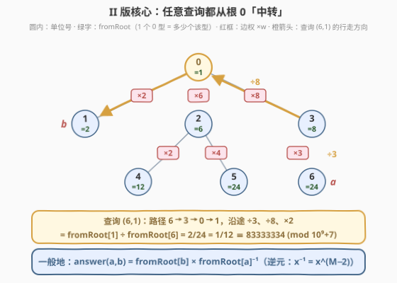
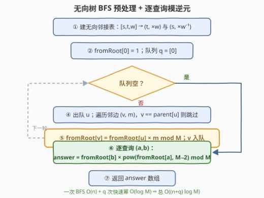

# LeetCode 单位转换 II 题解

## 1. 题目概述

- **标题 / 题号**：单位转换 II（#3535，medium）
- **链接**：https://leetcode.cn/problems/unit-conversion-ii/
- **难度**：中等
- **标签**：图、广度优先搜索、深度优先搜索、数学

> ⚠️ 本题为 LeetCode 付费题，题意描述根据官方示例用例与 hints 重建，可能与官方题面有出入。

**题意**：有 $n$ 种单位，编号 $0$ 到 $n-1$。给定长度为 $n-1$ 的二维整数数组 `conversions`，其中 `conversions[i] = [sourceUnit_i, targetUnit_i, conversionFactor_i]`，表示 **1 个 `sourceUnit_i` 类型的单位等于 `conversionFactor_i` 个 `targetUnit_i` 类型的单位**。

再给定长度为 $q$ 的二维整数数组 `queries`，其中 `queries[i] = [unitA_i, unitB_i]`。

返回长度为 $q$ 的数组 `answer`，其中 `answer[i]` 表示 **多少个 `unitB_i` 类型的单位等于 1 个 `unitA_i` 类型的单位**。答案约分后形如 $p/q$（$p$、$q$ 互质），要求返回 $p \cdot q^{-1} \bmod (10^9+7)$，其中 $q^{-1}$ 是 $q$ 在模 $10^9+7$ 意义下的乘法逆元。

**示例 1**：

```text
输入：conversions = [[0,1,2],[0,2,6]], queries = [[1,2],[1,0]]
输出：[3,500000004]
解释：查询 (1,2)：反向使用 conversions[0] 把 1 个 1 型换成 1/2 个 0 型，
     再用 conversions[1] 换成 6/2 = 3 个 2 型；
     查询 (1,0)：1 个 1 型 = 1/2 个 0 型，2 的乘法逆元是 500000004。
```

**示例 2**：

```text
输入：conversions = [[0,1,2],[0,2,6],[0,3,8],[2,4,2],[2,5,4],[3,6,3]], queries = [[1,2],[0,4],[6,5],[4,6],[6,1]]
输出：[3,12,1,2,83333334]
解释：查询 (6,1)：1 个 6 型 = 1/24 个 0 型 = 2/24 = 1/12 个 1 型，
     12 的乘法逆元是 83333334。
```

**约束**：

- $2 \le n \le 10^5$，`conversions.length == n - 1`
- $0 \le \text{sourceUnit}_i, \text{targetUnit}_i < n$
- $1 \le \text{conversionFactor}_i \le 10^9$
- $1 \le q \le 10^5$，$0 \le \text{unitA}_i, \text{unitB}_i < n$
- 保证单位 0 可以通过**正向或反向转换的组合**唯一地转换为任何其他单位

> 💡 与前传 [3528. 单位转换 I](https://leetcode.cn/problems/unit-conversion-i/) 对比，两处升级：① 所求从「根到每个点的换算值」变成「**任意单位对**之间的换算查询」；② 结构保证从「不需要反向转换」放宽为「正向或反向的组合」——$n-1$ 条转换关系是一棵**无向树**（从 0 出发视角任意），树边可以朝两个方向使用。查询两端点在树上位置任意，换算路径必然「先上后下」，于是**除法（模逆元）成为本题主角**。

## 2. 解题思路

### 2.1 暴力思路：对每个查询现走一条路径

最直接的做法：对每个查询 $(a, b)$，在无向树上从 $a$ 一路走到 $b$，沿途顺向边乘 $w$、逆向边除 $w$，把路径乘积算出来。单次查询 $O(n)$，$q$ 个查询总计 $O(nq) = 10^{10}$，必然超时。

瓶颈与 3528 一模一样：**根到某个结点的那段路径，被成千上万个查询重复行走**。此外本题多出一道坎：模世界里「除以 $w$」不能直接写，得写成「乘 $w^{-1}$」——逆元怎么求、是否总求得出，都要说清楚。

### 2.2 核心观察：所有比值都从根 0 中转



预处理一次 BFS，求出 `fromRoot[u]`：**1 个 0 型单位等于多少个 u 型单位**（这正是 3528 的输出数组）。建图时把每条转换 $[s, t, w]$ 存成**两条无向边**：$s \to t$ 乘 $w$，$t \to s$ 乘 $w^{-1}$——逆向使用一条转换就是做除法，建图时就地转成乘逆元。

有了 `fromRoot`，任意查询不必真的走树：

$$\text{answer}(a, b) \;=\; \frac{\text{fromRoot}[b]}{\text{fromRoot}[a]} \;\pmod{10^9+7}$$

道理是**裂项相消**（telescoping）：$a \to b$ 的路径 = $a \to$ 根 $\to b$，分子是「根 $\to b$」的乘积、分母是「根 $\to a$」的乘积，两段路径在「根 $\to$ 最近公共祖先」处的**公共前缀自动约掉**——中转站选根而非 LCA，连最近公共祖先都不用求。

模 $M = 10^9+7$（素数）下的除法 = 乘**模逆元**。由费马小定理 $x^{M-1} \equiv 1 \pmod M$（$M$ 素数且 $M \nmid x$），两边乘 $x^{-1}$ 得：

$$x^{-1} \equiv x^{M-2} \pmod M$$

用快速幂 $O(\log M)$ 求出。「除法总是合法」有两层保证：

- 每个边权 $w \in [1, 10^9]$，而素数 $M = 10^9+7 > w$，任何 $w$ 都不是 $M$ 的倍数 ⇒ 每条边的逆元恒存在；
- `fromRoot[u]` 是一串非零值的乘积（含逆元），模素数下非零元乘非零元仍非零 ⇒ 查询中 $\text{fromRoot}[a]^{-1}$ 也恒存在。

> 💡 **与 3528 的预处理差异**：I 版边全部由父指向子，单向建图连 `visited` 都不用；II 版按约束只保证「正向或反向的组合」，故按**无向树**建图 + `parent` 剪枝。官方示例与主流 AC 代码的数据里边恰好仍由父指向子（此时逆向边乘数被算出但从不使用），两种数据本写法都严格正确——若确信输入满足更强的单向保证，可直接退化回 3528 的单向建图。

### 2.3 算法流程图



| 步骤 | 动作 | 说明 |
|------|------|------|
| ① | 建无向邻接表 | $[s,t,w]$ 存 $(t,\,w)$ 与 $(s,\,w^{-1})$，逆向边建图时即转为「乘逆元」 |
| ② | 初始化 | $\text{fromRoot}[0] = 1$（自己换自己），根入队 |
| ③ | 出队 $u$ | 遍历邻边 $(v, m)$；$v$ 是父结点则跳过——无向边每条出现两次，不能回头 |
| ④ | 松弛 | $\text{fromRoot}[v] = \text{fromRoot}[u] \cdot m \bmod M$，$v$ 入队 |
| ⑤ | 逐查询 | $\text{answer}[i] = \text{fromRoot}[b] \times \text{pow}(\text{fromRoot}[a],\, M-2,\, M) \bmod M$ |

> ⚠️ **两个工程细节**：① 无向建图后 BFS 必须记 `parent` 防回头（3528 的单向建图连这步都省了）；② $n = 10^5$ 的链形树别用递归 DFS——Python 递归上限 1000 直接 `RecursionError`、C++ 默认栈也悬，队列 BFS 最稳。

### 2.4 示例演算

以示例 2 走一遍（`fr` 即 fromRoot）：

**BFS 预处理**：

| 出队 $u$ | 松弛的边 $(v, w)$ | 新写入 | fr 快照 |
|---|---|---|---|
| 0 | $(1,2),\ (2,6),\ (3,8)$ | $\text{fr}[1]{=}2,\ \text{fr}[2]{=}6,\ \text{fr}[3]{=}8$ | $[1,2,6,8,-,-,-]$ |
| 1 | —（叶） | — | 不变 |
| 2 | $(4,2),\ (5,4)$ | $\text{fr}[4]{=}12,\ \text{fr}[5]{=}24$ | $[1,2,6,8,12,24,-]$ |
| 3 | $(6,3)$ | $\text{fr}[6]{=}24$ | $[1,2,6,8,12,24,24]$ |

**查询处理**（$M = 10^9+7$）：

| 查询 $(a,b)$ | 计算 | 结果 |
|---|---|---|
| $(1,2)$ | $6 \times 2^{-1} = 6/2$ | $3$ |
| $(0,4)$ | $12 \times 1^{-1}$ | $12$ |
| $(6,5)$ | $24 \times 24^{-1}$ | $1$ |
| $(4,6)$ | $24 \times 12^{-1} = 24/12$ | $2$ |
| $(6,1)$ | $2 \times 24^{-1} = 1/12$ | $83333334$（$12 \times 83333334 \equiv 1 \pmod M$）✓ |

与官方输出 $[3,12,1,2,83333334]$ 完全一致。最后一条正是本题的招牌场景：答案是真分数 $1/12$，模世界里返回 $12$ 的乘法逆元。

## 3. 参考代码

### C++

```cpp
class Solution {
  public:
    vector<int> queryConversions(vector<vector<int>>& conversions,
                                 vector<vector<int>>& queries) {
        const long long MOD = 1'000'000'007;
        int n = conversions.size() + 1;

        // 无向建图：顺向边乘 w，逆向边乘 w^{-1}
        vector<vector<pair<int, long long>>> adj(n);   // (邻居, 乘数)
        for (auto& c : conversions) {
            adj[c[0]].emplace_back(c[1], c[2]);                 // 顺向：× w
            adj[c[1]].emplace_back(c[0], qpow(c[2], MOD - 2));  // 逆向：× w⁻¹
        }

        vector<int> fromRoot(n);
        vector<int> parent(n, -1);
        fromRoot[0] = 1;                        // 1 个 0 型 = 1 个 0 型
        queue<int> q;
        q.push(0);
        while (!q.empty()) {
            int u = q.front();
            q.pop();
            for (auto [v, m] : adj[u]) {
                if (v == parent[u]) continue;   // 无向边不走回头路
                parent[v] = u;
                fromRoot[v] = fromRoot[u] * m % MOD;
                q.push(v);
            }
        }

        vector<int> ans;
        ans.reserve(queries.size());
        for (auto& query : queries) {
            int a = query[0], b = query[1];
            ans.push_back(fromRoot[b] * qpow(fromRoot[a], MOD - 2) % MOD);
        }
        return ans;
    }

  private:
    static long long qpow(long long x, long long n) {   // 快速幂：费马小定理求逆元
        const long long MOD = 1'000'000'007;
        long long res = 1;
        x %= MOD;
        while (n > 0) {
            if (n & 1) res = res * x % MOD;
            x = x * x % MOD;
            n >>= 1;
        }
        return res;
    }
};
```

### Python

```python
class Solution:
    def queryConversions(self, conversions: List[List[int]], queries: List[List[int]]) -> List[int]:
        MOD = 10**9 + 7
        n = len(conversions) + 1

        adj = [[] for _ in range(n)]                  # (邻居, 乘数)
        for s, t, w in conversions:
            adj[s].append((t, w))                     # 顺向：× w
            adj[t].append((s, pow(w, MOD - 2, MOD)))  # 逆向：× w⁻¹

        from_root = [0] * n
        from_root[0] = 1                              # 1 个 0 型 = 1 个 0 型
        parent = [-1] * n
        q = deque([0])
        while q:
            u = q.popleft()
            for v, m in adj[u]:
                if v == parent[u]:                    # 无向边不走回头路
                    continue
                parent[v] = u
                from_root[v] = from_root[u] * m % MOD
                q.append(v)

        return [from_root[b] * pow(from_root[a], MOD - 2, MOD) % MOD
                for a, b in queries]
```

> 💡 **写法要点**：① 建图时就地算好 $w^{-1}$，BFS 循环里只剩乘法，顺逆向统一处理；② Python 三参数 `pow(x, e, M)` 即「快速幂 + 取模」，底层是 C 实现，比手写循环快得多；③ 若确认输入满足 3528 式的单向保证，邻接表只存 $(t, w)$、去掉 `parent` 判断即可——官方示例数据正是这种形态，本写法是按 II 的约束文字做的稳妥版。

## 4. 复杂度分析

| 维度 | 复杂度 | 说明 |
|------|--------|------|
| **时间复杂度** | $O((n+q)\log M)$ | 建图 $n$ 次逆元 + $q$ 次查询逆元，每次快速幂 $O(\log M) \approx 30$；BFS 本身 $O(n)$ |
| **空间复杂度** | $O(n+q)$ | 无向邻接表 $2(n-1)$ 条边、`fromRoot`/`parent` 数组 $O(n)$、答案数组 $O(q)$ |

> 💡 对照暴力 $O(nq) = 10^{10}$：预处理把 $n$ 条「根路径」的乘积一次算齐，每个查询只剩一次 $O(\log M)$ 的幂运算——快近三个数量级。$(n+q)\log M \approx 2\times10^5 \times 30 = 6\times10^6$ 次乘法，绰绰有余。

## 5. 扩展：一次幂算一批逆元

本题 $(n+q) \le 2\times 10^5$ 个逆元逐个快速幂已经毫无压力。若查询量级拉到 $10^7$，可换**前缀积倒推**批量求逆元：

- 把待求逆的 $k$ 个非零数 $x_1, \dots, x_k$ 排好，算前缀积 $P_i = x_1 x_2 \cdots x_i \bmod M$；
- 用**一次**快速幂求出 $P_k^{-1}$；
- 倒序扫：$x_i^{-1} = P_i^{-1} \cdot P_{i-1}$，同时更新 $P_{i-1}^{-1} = P_i^{-1} \cdot x_i$。

一个 $\log$ 换成 $k$ 次乘法，整批逆元 $O(k + \log M)$。这正是组合数预处理 $\binom{n}{k} = \frac{n!}{k!\,(n-k)!}$ 的标准姿势（阶乘表 + 阶乘逆元表），比逐个 $\binom{n}{k}$ 快一整个 $\log$。

## 6. 面试要点

1. **模意义下「除以 $q$」怎么做？什么时候合法？**

   > 乘 $q$ 的模逆元：$q^{-1} \equiv q^{M-2} \pmod M$（费马小定理，要求 $M$ 为素数）。合法前提 $\gcd(q, M) = 1$；本题 $M = 10^9+7$ 是素数且所有边权 $\le 10^9 < M$、不可能被 $M$ 整除，逆元恒存在。若模数是合数（如 $10^9$ 或 $2^{32}$），费马小定理失效，需扩展欧几里得求逆；$q$ 与模数不互素时模除法根本无定义。

2. **answer 为什么等于 fromRoot[b] × fromRoot[a]⁻¹？需要求 LCA 吗？**

   > 不需要。$a \to b$ 的路径可拆成 $a \to \text{LCA} \to b$；$\text{fromRoot}[b]$ 含「根 $\to \text{LCA} \to b$」的乘积，$\text{fromRoot}[a]$ 含「根 $\to \text{LCA} \to a$」的乘积，比值中「根 $\to \text{LCA}$」的公共前缀相消，剩下的恰好是 $a \to \text{LCA}$ 的倒数乘 $\text{LCA} \to b$。中转站选根，LCA 就被约掉了。

3. **II 的「正向或反向」保证与 I 的「不需要反向」差在哪？代码上要改什么？**

   > I 的转换全部由父指向子：单向建图、BFS 无需防回头；II 放宽为无向树，边可能逆向使用——双向建图、逆向边乘 $w^{-1}$、BFS 记 `parent` 跳过来向边。若数据恰好仍全为顺向，两版输出一致，但按 II 的约束文字写无向版才严格正确。

4. **C++ 里哪些乘法会溢出？**

   > 参与乘法的两个数都可能接近 $M \approx 10^9$：`fromRoot[u] * m` 与 `fromRoot[b] * qpow(...)`。邻接表乘数声明为 `long long` 后前者自动提升 64 位，后者是 `int * long long` 也安全；乘积上界 $(10^9+6)^2 \approx 10^{18} < 2^{63}$，一次乘法后立即取模即可。千万别把乘数存成 `int` 再裸乘——两个 `int` 相乘先按 `int` 求值，溢出是未定义行为。

5. **为什么用队列 BFS 而不是递归 DFS？**

   > $n \le 10^5$，链形树递归深度可达 $10^5$：Python 默认递归上限 1000 直接 `RecursionError`，C++ 默认栈空间也可能爆。队列 BFS 或显式栈 DFS 与递归复杂度相同，但没有深度限制——3528 踩过的坑，II 原样继承。

## 同类练习题

| # | 题目 | 与本题的关联 |
|---|------|-------------|
| 3528 | [单位转换 I](https://leetcode.cn/problems/unit-conversion-i/) | 本题前传——只需求 fromRoot 数组本身，单向树 BFS 入门 |
| 399 | [除法求值](https://leetcode.cn/problems/evaluate-division/) | 一般图版「单位换算」——除法关系 + 任意点对查询，BFS 传比值或带权并查集，体会树与图、精确分数与模值的差异 |
| 1443 | [收集树上所有苹果的最短时间](https://leetcode.cn/problems/minimum-time-to-collect-all-apples-in-a-tree/) | 无向树建图 + parent 剪枝的 BFS/DFS 模板练习 |
| 1830 | [使字符串有序的最少操作次数](https://leetcode.cn/problems/minimum-number-of-operations-to-make-the-string-sorted/) | 阶乘 + 模逆元全家桶（困难），练费马小定理的工程化使用 |
| 2400 | [恰好移动 k 步到达某一位置的方法数目](https://leetcode.cn/problems/number-of-ways-to-reach-a-position-after-exactly-k-steps/) | 组合数 $\binom{n}{k}$ 的逆元实战，第 5 节的批量逆元思想直接可用 |
