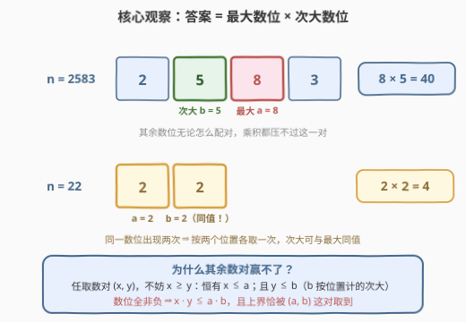
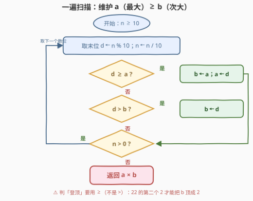

# LeetCode 两个数字的最大乘积 题解

## 1. 题目概述

- **标题 / 题号**：两个数字的最大乘积（#3536，easy）
- **链接**：https://leetcode.cn/problems/maximum-product-of-two-digits/
- **难度**：简单
- **标签**：数学、排序

**题意**：给你一个正整数 `n`，返回 `n` 中**任意两个数位**相乘所能得到的**最大**乘积。

注意：如果某个数字在 `n` 中出现多次，你可以**多次使用**该数字——即「两个数位」指两个**位置**上的数位，数值相同也可以各取一次。

**示例 1**：

```text
输入：n = 31
输出：3
解释：数位为 [3, 1]，唯一的数对 3 × 1 = 3。
```

**示例 2**：

```text
输入：n = 22
输出：4
解释：数位为 [2, 2]，两个位置上的 2 相乘：2 × 2 = 4。
```

**示例 3**：

```text
输入：n = 124
输出：8
解释：数位为 [1, 2, 4]，数对乘积为 1×2=2、1×4=4、2×4=8，最大为 8。
```

**约束**：

- $10 \le n \le 10^9$，即 `n` 有 $2 \sim 10$ 个数位

> 💡 **读题关键**：约束 $n \ge 10$ 保证至少有两个数位，答案一定存在；「出现多次可多次使用」说明这是**多重集**里选两个元素——次大数位可以与最大数位**同值**（如 `22` 的答案是 $2 \times 2$ 而不是「无解」）。

## 2. 解题思路

### 2.1 暴力思路：枚举所有数位对

把 `n` 的十进制数位拆出来存成数组 `d[0..k-1]`（$k \le 10$），双重循环枚举所有位置对 $i < j$：

```text
for i = 0 .. k-1:
    for j = i+1 .. k-1:
        best = max(best, d[i] * d[j])
```

复杂度 $O(k^2) \le \binom{10}{2} = 45$ 对，官方 hint 也直说 "Use brute force"。但平方枚举里有大量**冗余比较**：任何含有小数位的数对都不可能赢，真正有竞争力的只有「最大的两个数位」这一对。把「枚举所有对」压缩成「只盯住前两名」，就是一次线性扫描。

### 2.2 核心观察：答案 = 最大数位 × 次大数位



**结论**：把 `n` 的全部数位（含重复）降序排列为 $d_1 \ge d_2 \ge \dots \ge d_k$，则答案就是 $d_1 \times d_2$。

**证明（放缩论证）**：任取一个数对 $(x, y)$，由乘法交换律不妨设 $x \ge y$。分两种情形：

- **这对含有全局最大**（$x = d_1$）：$y$ 取自其余数位，而 $d_2$ 正是「其余数位中的最大」（按位置计，可与 $d_1$ 同值），故 $y \le d_2$；
- **这对不含全局最大**（$x < d_1$）：则 $x \le d_2$，更有 $y \le x \le d_2$。

两种情形下都有 $x \le d_1$ 且 $y \le d_2$；由于数位 $\in [0, 9]$ **全部非负**，放缩得 $x \cdot y \le d_1 \cdot d_2$。而 $(d_1, d_2)$ 本身就是合法数对，上界可以取到。$\blacksquare$

> ⚠️ **非负性是前提**：放缩 $x \le d_1,\ y \le d_2 \Rightarrow xy \le d_1 d_2$ 只在非负时成立。若元素可能为负（例如推广到任意整数数组），「两个最小负数」的乘积可能反超，必须比较 $\max(d_1 d_2,\ d_{k-1} d_k)$，见第 5 节。
>
> ⚠️ **次大按位置算**：$d_2$ 是**第二个位置**上的最大，不是「与 $d_1$ 不同的最大」——`777` 的答案是 $7 \times 7 = 49$。这正是题面那句「出现多次可多次使用」的数学落点。

### 2.3 算法流程图



一遍逐位扫描（从末位开始 `n % 10` 取数位、`n / 10` 右移），滚动维护两个变量：$a$ 为目前见过的最大数位，$b$ 为次大（$a \ge b$）。每个新数位 $d$ 只有三种归宿：登上 $a$ 的宝座（原 $a$ 退居 $b$）、顶掉 $b$、或者谁都顶不动。

**关键细节**：判断「登顶」必须用 `d >= a` 而非 `d > a`——否则 `22` 的第二个 `2` 会被判成「不大于 $a$」而无法把 $b$ 顶成 2，错算出 $2 \times 0 = 0$。

### 2.4 示例演算

以 `n = 2583` 走一遍扫描（从末位 3 开始）：

| 步 | 数位 $d$ | 判断 | $a$（最大） | $b$（次大） | 说明 |
|----|----------|------|-------------|-------------|------|
| 1 | 3 | $3 \ge 0$ | **3** | 0 | 登顶，$a \leftarrow 3$ |
| 2 | 8 | $8 \ge 3$ | **8** | **3** | 登顶，原最大 3 退居 $b$ |
| 3 | 5 | $5 < 8$，但 $5 > 3$ | 8 | **5** | 顶掉 $b$ |
| 4 | 2 | $2 < 8$ 且 $2 \le 5$ | 8 | 5 | 谁都顶不动，丢弃 |

返回 $8 \times 5 = 40$。两个边界再看一眼：

- `n = 22`：第一个 2 登顶（$a=2$）；第二个 2 因 $2 \ge 2$ **再次登顶**，原 $a$ 退居 $b$——最终 $a = b = 2$，答案 $4$。若误用严格大于，$b$ 会停留在初始哨兵 0，得 0。
- `n = 10`：数位 $[1, 0]$，唯一数对 $1 \times 0 = 0$——数位含 0 时乘积可能为 0，属正常答案。

## 3. 参考代码

### C++

```cpp
class Solution {
  public:
    int maxProduct(int n) {
        int a = 0, b = 0;
        for (; n > 0; n /= 10) {
            int d = n % 10;
            if (d >= a) {
                b = a;
                a = d;
            } else if (d > b) {
                b = d;
            }
        }
        return a * b;
    }
};
```

### Python

```python
class Solution:
    def maxProduct(self, n: int) -> int:
        a = b = 0
        for ch in str(n):
            d = int(ch)
            if d >= a:
                a, b = d, a
            elif d > b:
                b = d
        return a * b
```

> 💡 Python 排序版一行核心：`d = sorted(map(int, str(n))); return d[-1] * d[-2]`——直接兑现 2.2 的结论，$O(k \log k)$ 也毫无压力。用 0 初始化哨兵 $(a, b)$ 是安全的：数位非负，0 不会污染前两名，而 $n \ge 10$ 保证至少喂进两个真实数位。

## 4. 复杂度分析

| 维度 | 复杂度 | 说明 |
|------|--------|------|
| 时间复杂度 | $O(k)$ | $k$ 为数位个数（$n \le 10^9 \Rightarrow k \le 10$），每个数位常数次比较 |
| 空间复杂度 | $O(1)$ | 仅两个滚动变量 $a, b$；Python 走 `str(n)` 的版本另计 $O(k)$ |

## 5. 扩展：若数位可能为负 / 推广到 k 个

**含负数的数组版**：设数组升序为 $z_1 \le z_2 \le \dots \le d_2 \le d_1$，最大两数乘积为 $\max(d_1 d_2,\ z_1 z_2)$——两小负数相乘可能反超两大正数。本题数位限定 $[0,9]$ 非负，「无脑取两大」是它的特例；三数版见 [628. 三个数的最大乘积](https://leetcode.cn/problems/maximum-product-of-three-numbers/)：$\max(d_1 d_2 d_3,\ z_1 z_2 d_1)$。

**推广到选 $k$ 个数位**：非负前提下乘积最大的 $k$ 个就是**前 $k$ 大**数位，一遍扫描维护大小为 $k$ 的最小堆即可，$O(k \log k)$。

**计数排序视角**（对应标签 Sorting）：数位值域只有 $\{0, \dots, 9\}$，桶计数 `cnt[10]` 后从 9 往下扫：`cnt[d] >= 2` 直接得 $d \times d$；`cnt[d] == 1` 则找下一个非空桶 $e$ 得 $d \times e$。总复杂度 $O(k + 10)$，是值域极小时比比较排序更「数学」的写法。

## 6. 面试要点

1. **为什么答案一定是最大数位 × 次大数位？**

   > 放缩论证：任取数对 $(x, y)$ 不妨 $x \ge y$。若这对含全局最大 $d_1$，则 $y \le d_2$（次大按位置计）；若不含，则 $x \le d_2$ 更有 $y \le d_2$。结合 $x \le d_1$ 与数位非负，得 $xy \le d_1 d_2$，且该上界可达。

2. **「出现多次可多次使用」在代码里怎么体现？**

   > 判断登顶用 `d >= a` 而非 `d > a`：`22` 的第二个 2 会把原最大挤到次大，最终 $a = b = 2$。用严格大于则 $b$ 停在哨兵 0，`22` 错算为 0。多重集的「次大」允许与最大同值。

3. **把数位换成可能含负数的数组，结论还成立吗？**

   > 不成立。负负得正，答案变为 $\max(\text{两大之积}, \text{两小之积})$。本题的「取两大」依赖数位 $\in [0,9]$ 的非负性——面试里主动指出论证前提是加分项。

4. **值域只有 0~9，还能写出什么不同的版本？**

   > 计数桶：`cnt[10]` 统计频次后从 9 向下扫，`cnt[d] >= 2` 得 $d^2$，`cnt[d] == 1` 找次大非空桶。比较排序退化为值域扫描，$O(k + \sigma)$。

5. **结果会溢出吗？**

   > 不会。两个数位之积上界 $9 \times 9 = 81$，`int` 绰绰有余。但推广到任意 `int` 数组的两数之积时上界约 $2 \times 10^{18}$，需要 `long long`——边界意识比本题本身更重要。

> 💡 **一句话总结**：3536 = 非负多重集取两大——一遍扫描维护 $a \ge b$，答案 $a \times b$；`>=` 判登顶让重复数位各归其位。

## 同类练习题

| # | 题目 | 与本题的关联 |
|---|------|-------------|
| 1796 | [字符串中第二大的数字](https://leetcode.cn/problems/second-largest-digit-in-a-string/)（[题解](../1701-1800/1796_字符串中第二大的数字.md)） | 同一套「一遍扫描维护最大 + 次大」双变量模板，只是不求乘积、求次大本身 |
| 1464 | [数组中两元素的最大乘积](https://leetcode.cn/problems/maximum-product-of-two-elements-in-an-array/)（[题解](../1401-1500/1464_数组中两元素的最大乘积.md)） | 非负数组取最大两个数算 $(a-1)(b-1)$，同款「取两大」贪心 |
| 628 | [三个数的最大乘积](https://leetcode.cn/problems/maximum-product-of-three-numbers/)（[题解](../0601-0700/628_三个数的最大乘积.md)） | 含负数时「两大 vs 两小」的完整版——本题去掉负数后的特例即 3536 |
| 747 | [至少是其他数字两倍的最大数](https://leetcode.cn/problems/largest-number-at-least-twice-of-others/)（[题解](../0701-0800/747_至少是其他数字两倍的最大数.md)） | 一遍扫描维护最大与次大并做比较判定，双变量模板的又一实例 |
