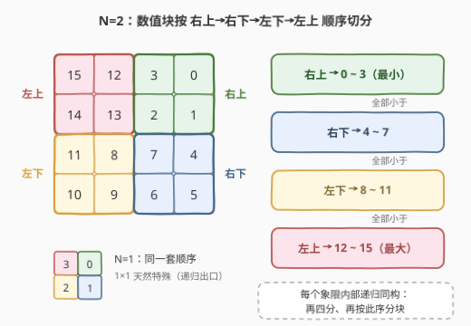
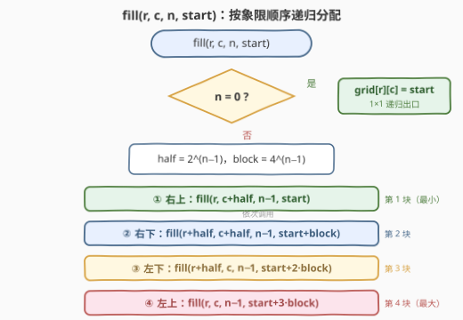

# 填充特殊网格

- **题目名称**：填充特殊网格
- **链接**：[3537. 填充特殊网格](https://leetcode.cn/problems/fill-a-special-grid/)
- **难度**：中等
- **标签**：数组、分治、矩阵

## 1. 题目概述

给你一个非负整数 $N$，表示一个 $2^N \times 2^N$ 的网格。需要用从 $0$ 到 $2^{2N} - 1$ 的**每个整数恰好一次**填充网格，使其成为**特殊**网格，当且仅当满足以下所有条件：

- 右上角象限中的所有数字都**小于**右下角象限中的所有数字；
- 右下角象限中的所有数字都**小于**左下角象限中的所有数字；
- 左下角象限中的所有数字都**小于**左上角象限中的所有数字；
- 每个象限自身也是一个特殊网格（任何 $1 \times 1$ 网格天然特殊）。

**示例 1**：

```text
输入：N = 0
输出：[[0]]
解释：唯一可以放置的数字是 0，网格中只有一个位置。
```

**示例 2**：

```text
输入：N = 1
输出：[[3,0],[2,1]]
解释：四个象限分别放 0（右上）、1（右下）、2（左下）、3（左上），0 < 1 < 2 < 3。
```

**示例 3**：

```text
输入：N = 2
输出：[[15,12,3,0],[14,13,2,1],[11,8,7,4],[10,9,6,5]]
解释：右上象限拿 0~3，右下拿 4~7，左下拿 8~11，左上拿 12~15；
      每个象限内部再按同样规则排布。
```

**约束条件**：

- $0 \le N \le 10$

> 💡 **读题关键**：三条不等式串成一条链——**右上 < 右下 < 左下 < 左上**，数值最小的家在右上角、最大的在左上角；且"每个象限也是特殊网格"说明结构**自相似**，天然指向递归。

---

## 2. 解题思路

### 2.1 暴力思路：枚举排列验证

网格共 $4^N$ 个格子、$4^N$ 个数，最朴素的做法是枚举全排列逐个验证四条约束：$N=1$ 时 $4! = 24$ 种尚可手算，$N=2$ 时 $16! \approx 2 \times 10^{13}$ 已经爆炸，$N=10$ 时是天文数字。更重要的是这种做法完全浪费了题目给的信号——**约束本身就是一份施工图**，不等式已把每个数该落在哪个区域讲得明明白白，照着摆即可，根本不需要"试错—回退"。

### 2.2 核心观察：连续值块按象限顺序切分（分治）



推理链条只有三步：

1. **不等式是全称的**：右上 < 右下 < 左下 < 左上是逐元素成立的大小关系，不是只比最大最小值。
2. **鸽笼推出连续块**：四个象限各占 $4^{N-1}$ 个数。右上的每个数都小于象限外的每个数——若某个更小的数留在象限外，它就会大于右上的某个数，与约束矛盾。故右上**必然恰好**是最小的 $4^{N-1}$ 个数 $\{0, \dots, 4^{N-1}-1\}$；同理右下、左下、左上依次领取第 2、3、4 段连续块。
3. **自相似递归**：每段都是连续区间，而"特殊网格"的定义对值域平移不变——把右下的数整体减去 $4^{N-1}$，子问题与原问题完全同构，继续四分即可。

> 💡 **答案唯一**：上述推理在每一层都被不等式强制，没有任何选择空间——特殊网格是**唯一**的，示例输出就是标准答案。两个哨兵坐标可直接自检：右上角 $(0,\ 2^N-1)$ 恒为 $0$，左上角 $(0,\ 0)$ 恒为 $4^N - 1$。

于是整个算法浓缩成四行递归：把 $[start,\ start + 4^n)$ 切成四段，按**右上 → 右下 → 左下 → 左上**顺序依次发给四个象限，各自递归。

### 2.3 算法流程图



递归函数设计为 `fill(r, c, n, start)`：用区间 $[start,\ start + 4^n)$ 填充左上角为 $(r, c)$、边长 $2^n$ 的子网格。区间终点不必传参——恒为 $start + 4^n$，少一个参数就少一处越界隐患。$n = 0$ 时落一个数收尾；否则算出 `half`（子象限边长 $2^{n-1}$）与 `block`（每象限数值块大小 $4^{n-1}$），四个递归调用的 `start` 依次偏移 $0, 1, 2, 3$ 个 `block`。四个调用**严格串行**——前一个子树完全填满才进入下一个，块与块之间天然不重不漏。

### 2.4 示例演算

$N = 2$ 的递归展开（`block = 4`）：

| 层级 | 调用 | 分到的区间 | 填出的子网格 |
|------|------|-----------|--------------|
| 0 | `fill(0, 0, 2, 0)` | $[0, 16)$ | 整个 $4 \times 4$ |
| 1 | `fill(0, 2, 1, 0)` | $[0, 4)$ | 右上 = `[[3,0],[2,1]]` |
| 1 | `fill(2, 2, 1, 4)` | $[4, 8)$ | 右下 = `[[7,4],[6,5]]` |
| 1 | `fill(2, 0, 1, 8)` | $[8, 12)$ | 左下 = `[[11,8],[10,9]]` |
| 1 | `fill(0, 0, 1, 12)` | $[12, 16)$ | 左上 = `[[15,12],[14,13]]` |

四块拼起来正是示例 3 的输出。注意每个 $2 \times 2$ 象限内部的排布与 $N=1$ 的答案**一模一样**——自相似肉眼可见。

---

## 3. 参考代码

### C++

```cpp
class Solution {
  public:
    vector<vector<int>> specialGrid(int n) {
        int size = 1 << n;
        vector<vector<int>> grid(size, vector<int>(size));
        fill(grid, 0, 0, n, 0);
        return grid;
    }

  private:
    // 用 [start, start + 4^n) 填充左上角为 (r, c)、边长 2^n 的子网格
    void fill(vector<vector<int>> &grid, int r, int c, int n, int start) {
        if (n == 0) {
            grid[r][c] = start;   // 1×1 递归出口
            return;
        }
        int half = 1 << (n - 1);            // 子象限边长 2^(n-1)
        int block = 1 << (2 * (n - 1));     // 每象限数值块大小 4^(n-1)
        fill(grid, r,        c + half, n - 1, start);             // 右上：最小块
        fill(grid, r + half, c + half, n - 1, start + block);     // 右下
        fill(grid, r + half, c,        n - 1, start + 2 * block); // 左下
        fill(grid, r,        c,        n - 1, start + 3 * block); // 左上：最大块
    }
};
```

### Python

```python
class Solution:
    def specialGrid(self, n: int) -> List[List[int]]:
        size = 1 << n
        grid = [[0] * size for _ in range(size)]

        def fill(r: int, c: int, n: int, start: int) -> None:
            if n == 0:
                grid[r][c] = start          # 1×1 递归出口
                return
            half = 1 << (n - 1)             # 子象限边长
            block = 1 << (2 * (n - 1))      # 数值块大小 4^(n-1)
            fill(r,        c + half, n - 1, start)              # 右上
            fill(r + half, c + half, n - 1, start + block)      # 右下
            fill(r + half, c,        n - 1, start + 2 * block)  # 左下
            fill(r,        c,        n - 1, start + 3 * block)  # 左上

        fill(0, 0, n, 0)
        return grid
```

> 💡 两个语言细节：① `1 << (2 * (n - 1))` 就是 $4^{n-1}$，用移位避免调用 `pow`；② 递归先写右上（`start` 不偏移），顺序与偏移量一一对应，写错顺序就会整体对不上示例——写完拿 $N=1$ 一秒自检。

---

## 4. 复杂度分析

| 维度 | 复杂度 | 说明 |
|------|--------|------|
| 时间复杂度 | $O(4^N)$ | 递归树恰有 $4^N$ 个叶子（每格只写一次），内部节点 $\frac{4^N - 1}{3}$ 个，总操作与格子数同阶；$N=10$ 时约 $10^6$ 次赋值，瞬间完成 |
| 空间复杂度 | $O(4^N)$ | 输出矩阵本身；递归栈深 $N + 1 \le 11$ 层，为常数级 |

---

## 5. 扩展：位运算闭式与 Z 序曲线

**逐格闭式**：把 $(r, c)$ 各写成 $N$ 位二进制，第 $i$ 位（从高到低）记为 $r_i, c_i$，按映射

$$\text{digit}(r_i, c_i) = 2\,(1 - c_i) + \big(1 \oplus r_i \oplus c_i\big) \quad\in \{0, 1, 2, 3\}$$

逐层累积，即得每格的值：

$$\text{val}(r, c) = \sum_{i=1}^{N} \text{digit}(r_i, c_i)\cdot 4^{\,N-i}$$

验证 $(r, c) = (1, 2), N = 2$：两位分别是 $(0,1) \to 0$、$(1,0) \to 2$，$\text{val} = 0 \times 4 + 2 = 2$ ✓。逐位计算是每格 $O(N)$ 的"伪暴力"，但用比特交错技巧可 $O(1)$ 直出——记 $\bar{c}$ 为 $c$ 的 $N$ 位按位取反，则 $\text{val}(r, c)$ 恰是把 $\bar{c}$ 的各位放在偶数权位、$r \oplus \bar{c}$ 的各位放在奇数权位的**交错编码**（Morton 码）。

**与空间填充曲线的联系**：这类"按象限层级展开"的遍历序正是**Z 序曲线（Morton order）**——标准四叉树按 左上→右上→左下→右下 展开坐标比特交错，本题只是换成了 右上→右下→左下→左上 的旋转版本，经坐标变换 $(r, c) \mapsto (\bar{c},\ r \oplus \bar{c})$ 即化为标准 Z 序。Z 序曲线在空间数据库索引、四叉树、GPU 纹理 swizzle 中都是把二维局部性压进一维的经典工具；若面试官追问"相邻格子的值能不能更连续"，可答 **Hilbert 曲线**——连续性更好的姊妹曲线。

---

## 6. 面试要点

1. **为什么每个象限分到的必然是连续数值块？**

   > 全称不等式 + 鸽笼：右上的每个数都小于象限外的每个数，若有更小的数落在象限外，它将大于右上的某个数，矛盾。故右上恰含最小的 $4^{N-1}$ 个数。同一推理逐层递推，还能顺带证明**答案唯一**。

2. **递归参数怎么设计最省心？**

   > $(r, c, n, start)$：子网格左上角 + 边长指数 + 区间起点。区间终点恒为 $start + 4^n$，无需传参；传了反而多一处越界风险。

3. **会栈溢出或溢出 int 吗？**

   > 递归深度 $N + 1 \le 11$ 层，毫无压力；数值上界 $4^{10} - 1 = 1{,}048{,}575 < 2^{31} - 1$，`int` 全程安全。若 $N$ 放宽到 20 以上才需要考虑 `long long` 与显式栈迭代。

4. **如果约束顺序改成 左上 < 右上 < 左下 < 右下，代码要大改吗？**

   > 不用——分治框架完全不变，只把四个递归调用与 `start` 偏移的对应关系重排。这正是分治模板"顺序参数化"的体现：结构归结构、顺序归顺序。

5. **这题与 427「建立四叉树」有什么共性？**

   > 同为 $2^N \times 2^N$ 网格的四象限自相似递归：427 递归判断"整块同值可合并"，本题递归分配连续值块。识别出"按象限指数级缩小"的结构后，两者代码骨架几乎可以互相抄。

> 💡 **一句话总结**：三条象限不等式就是施工图——右上→右下→左下→左上依次领取连续数值块，四行递归收工；鸽笼论证顺手证明答案唯一。

---

## 7. 同类练习题

- [427. 建立四叉树](https://leetcode.cn/problems/construct-quad-tree/)（[题解](../0401-0500/427_建立四叉树.md)）：同为 $2^N \times 2^N$ 网格四象限递归，把"分块填值"换成"分块建树"
- [558. 四叉树交集](https://leetcode.cn/problems/logical-or-of-two-binary-grids-represented-as-quad-trees/)（[题解](../0501-0600/558_四叉树交集.md)）：四叉树结构上的递归运算，加深象限自相似理解
- [59. 螺旋矩阵 II](https://leetcode.cn/problems/spiral-matrix-ii/)（[题解](../0001-0100/59_螺旋矩阵II.md)）：按给定顺序把连续整数填进矩阵，同为构造性填格
- [885. 螺旋矩阵 III](https://leetcode.cn/problems/spiral-matrix-iii/)（[题解](../0801-0900/885_螺旋矩阵III.md)）：模拟行走顺序填矩阵，考察方向与边界控制
