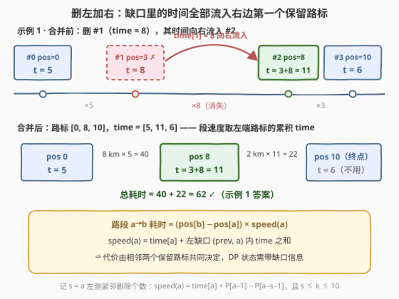

# 合并得到最小旅行时间

- **题目名称**：合并得到最小旅行时间
- **链接**：[3538. Merge Operations for Minimum Travel Time](https://leetcode.cn/problems/merge-operations-for-minimum-travel-time/)
- **难度**：困难
- **标签**：数组、动态规划、前缀和

## 1. 题目概述

给定一条长 $l$ 公里的直路、$n$ 个路标和整数 $k$。数组 `position` 严格升序列出路标位置（`position[0] = 0`，`position[n-1] = l`）；`time[i]` 表示**从 `position[i]` 开到 `position[i+1]` 这一路段**每行驶 1 公里所需的时间（分钟）。

你必须执行**恰好 $k$ 次**合并操作。一次合并选择两个**相邻**路标（下标 $i$ 和 $i+1$，要求 $i > 0$ 且 $i+1 < n$）：

1. 把 `time[i]` 加到 `time[i+1]` 上（`time[i+1] += time[i]`）；
2. 删除路标 $i$。

返回恰好 $k$ 次合并后，从 $0$ 开到 $l$ 的**最小总旅行时间**。

**示例 1**：

```text
输入：l = 10, n = 4, k = 1, position = [0,3,8,10], time = [5,8,3,6]
输出：62
解释：合并下标 1、2 的路标 —— 删除路标 1，路标 2 的 time 更新为 8 + 3 = 11。
      合并后 position = [0,8,10]，time = [5,11,6]：
      0→8：8 km × 5 = 40 分钟；8→10：2 km × 11 = 22 分钟；总计 62。
```

**示例 2**：

```text
输入：l = 5, n = 5, k = 1, position = [0,1,2,3,5], time = [8,3,9,3,3]
输出：34
解释：合并下标 1、2 的路标 —— 删除路标 1，路标 2 的 time 更新为 3 + 9 = 12。
      合并后 position = [0,2,3,5]，time = [8,12,3,3]：
      2×8 + 1×12 + 2×3 = 16 + 12 + 6 = 34。
```

**约束条件**：

- $1 \le l \le 10^5$
- $2 \le n \le \min(l+1,\ 50)$
- $0 \le k \le \min(n-2,\ 10)$
- `position` 严格升序，`position[0] = 0`，`position[n-1] = l`
- $1 \le \text{time}[i] \le 100$，且 $1 \le \sum \text{time}[i] \le 100$

> 💡 **读题关键**：① 合并方向固定为「**删左加右**」——被删路标的 time 不会消失，而是**向右转移**；且由 $i > 0$ 与「右邻必须存在」可知**首、尾两个路标永远删不掉**。② 「恰好 $k$ 次合并」⟺ 恰好删除 $k$ 个路标 ⟺ 保留集合大小恰为 $n-k$ 且必含 $0$ 与 $n-1$。③ 路段速度取决于**左端路标当前的 time**，而它又由左边缺口里删掉了谁决定——**决策代价跨两层**，这是本题需要三维 DP 状态的根源。④ 数据范围极宽裕：$\sum \text{time} \le 100$、$l \le 10^5$，总耗时上界 $10^5 \times 100 = 10^7$，`int` 不会溢出。

---

## 2. 解题思路

### 2.1 暴力思路

所有可行方案 = 从下标 $1 \dots n-2$ 中选 $k$ 个删除（$\binom{n-2}{k}$ 种，$n=50$、$k=10$ 时约 65 亿种），每种再 $O(n)$ 计算总耗时——显然不可行。若直接枚举「合并操作序列」（每一步合并哪两个）则更糟：序列数远大于集合数。

突破口在于先看清合并操作的**组合效果**：$k$ 次合并的最终结果只由「**保留集合**」决定，与合并顺序无关（下面的观察一、二）。于是问题从「操作序列」坍缩为「选保留集合」，再对这个选择问题做动态规划。

### 2.2 核心观察：时间向右流动——速度 = 自身 time + 左缺口时间和



**观察一（保留集合刻画一切）**：每次合并恰删除一个路标，且首路标（受 $i>0$ 限制）与尾路标（无右邻可合并）不可删。于是恰好 $k$ 次合并 ⟺ 保留集合 $S$ 满足 $|S| = n-k$、$0, n-1 \in S$。反过来，任取这样的 $S$ 都能实现：对每个「缺口」（相邻保留路标之间的被删段）**从左到右**依次合并即可。

**观察二（时间向右流动）**：合并「删左加右」，被删路标的 time 逐个向右传递，最终**全部汇入它右边第一个保留路标**。设相邻的保留路标为 $\dots < a < b < \dots$（$a$、$b$ 之间全是被删路标），则 $b$ 的累积时速为

$$\text{speed}(b) = \text{time}[b] + \sum_{d=a+1}^{b-1} \text{time}[d]$$

与合并顺序无关（加法交换律）。特别地 $\text{speed}(0) = \text{time}[0]$（首路标左侧没有缺口）。示例 1 中删掉路标 1 后路标 2 的时速变为 $3+8=11$，正是这个公式。

**观察三（代价跨两层）**：路段 $a \to b$ 的耗时 $= (\text{pos}[b] - \text{pos}[a]) \times \text{speed}(a)$，而 $\text{speed}(a)$ 又依赖 $a$ **左边**缺口——即 $a$ 的**前一个保留路标**。一次决策的代价由**连续两个保留路标**共同决定 ⟹ DP 状态必须额外携带「前一个保留路标」的信息。

**观察四（$s \le k$ 的惊喜）**：把「$a$ 左边的缺口」压缩成一个整数 $s$ = $a$ 左侧**紧邻**被删的路标个数，则 $\text{speed}(a) = \text{time}[a] + P[a-1] - P[a-s-1]$（$P$ 为 `time` 的前缀和）。而紧邻删除全部计入总删除数 $j$，故 $s \le j \le k \le 10$——第三维极小，**数据范围把正解的形态暗示得明明白白**。

### 2.3 算法流程图

![算法流程：三维状态 dp[i][j][s] 的松弛全过程](../images/p3538_algorithm_flow.svg)

| 步骤 | 动作 | 说明 |
|------|------|------|
| ① 前缀和 | $P[i] = \text{time}[0] + \dots + \text{time}[i]$ | 任意缺口和 $O(1)$ 化 |
| ② 初始化 | $\text{dp}[i][i-1][i-1] = \text{pos}[i] \times \text{time}[0]$，$1 \le i \le \min(n-1,\ k+1)$ | $0$ 之后第一个保留的是 $i$：删除 $1 \dots i-1$ |
| ③ 枚举状态 | 三重循环 $i, j, s$（$s \le \min(j,\ i-1)$） | 跳过不可达（INF）状态 |
| ④ 计算速度 | $\text{speed} = \text{time}[i] + P[i-1] - P[i-s-1]$ | 路标 $i$ 吸收了左缺口的时间和 |
| ⑤ 枚举后继 | 下一个保留 $m \in (i,\ n-1]$，$nj = j + m - i - 1$ | 缺口 $(i, m)$ 内全删；$nj$ 随 $m$ 单调增，越界即 `break` |
| ⑥ 松弛 | $\text{dp}[m][nj][m-i-1] \gets \min(\cdot,\ \text{dp}[i][j][s] + (\text{pos}[m]-\text{pos}[i]) \times \text{speed})$ | 新状态的 $s' = m-i-1$，新 $j' = nj$ |
| ⑦ 收答案 | $\text{ans} = \min_s \text{dp}[n-1][k][s]$ | 尾路标必保留；总删除数**恰好**为 $k$ |

### 2.4 示例演算

用**示例 1**（`pos = [0,3,8,10]`，`time = [5,8,3,6]`，$k=1$，$P = [5,13,16,22]$）逐步演算：

| 状态 | 含义 | 值 | 来源 |
|------|------|-----|------|
| dp[1][0][0] | 保留 1，零删除 | $3 \times 5 = 15$ | 基例 |
| dp[2][1][1] | 保留 2，删 1（紧邻删 1 个） | $8 \times 5 = 40$ | 基例 |
| dp[2][0][0] | 保留 1、2 相邻 | $15 + 5 \times 8 = 55$ | dp[1][0][0]，speed = time[1] = 8 |
| dp[3][1][1] | 保留 1、3，删 2 | $15 + 7 \times 8 = 71$ | dp[1][0][0] 直跳 $m=3$ |
| dp[3][0][0] | 不删除（$k=0$ 情形） | $55 + 2 \times 3 = 61$ | dp[2][0][0]，speed = time[2] = 3 |
| dp[3][1][0] | 保留 0、2、3，删 1 | $40 + 2 \times 11 = 62$ | dp[2][1][1]，speed = $3 + (P[1]-P[0]) = 11$ |

答案 $= \min_s \text{dp}[3][1][s] = \min(62, 71) = \boxed{62}$，对应的保留集合正是官方解释里的 $\{0, 2, 3\}$。

---

## 3. 参考代码

### C++

```cpp
class Solution {
  public:
    int minTravelTime(int l, int n, int k, vector<int>& position, vector<int>& time) {
        vector<int> P(n);                                   // P[i] = time[0..i] 之和
        P[0] = time[0];
        for (int i = 1; i < n; i++) P[i] = P[i - 1] + time[i];

        const int INF = INT_MAX / 2;
        // dp[i][j][s]：保留 i（已删 j 个、i 左侧紧邻删 s 个）时 0→pos[i] 的最小耗时
        vector<vector<vector<int>>> dp(n, vector<vector<int>>(k + 1, vector<int>(k + 1, INF)));

        for (int i = 1; i <= min(n - 1, k + 1); i++)        // 基例：0 之后第一个保留 i
            dp[i][i - 1][i - 1] = position[i] * time[0];

        for (int i = 1; i < n - 1; i++)
            for (int j = 0; j <= k; j++)
                for (int s = 0; s <= min(j, i - 1); s++) {
                    if (dp[i][j][s] == INF) continue;
                    int speed = time[i] + P[i - 1] - P[i - s - 1];   // i 吸收左缺口时间和
                    for (int m = i + 1; m < n; m++) {
                        int nj = j + m - i - 1;                      // 缺口 (i, m) 内全删
                        if (nj > k) break;                           // nj 随 m 单调增
                        int cost = dp[i][j][s] + (position[m] - position[i]) * speed;
                        dp[m][nj][m - i - 1] = min(dp[m][nj][m - i - 1], cost);
                    }
                }

        return *min_element(dp[n - 1][k].begin(), dp[n - 1][k].end());
    }
};
```

### Python

```python
class Solution:
    def minTravelTime(self, l: int, n: int, k: int, position: List[int], time: List[int]) -> int:
        P = [0] * n                                          # time 前缀和
        P[0] = time[0]
        for i in range(1, n):
            P[i] = P[i - 1] + time[i]

        INF = float('inf')
        # dp[i][j][s]：保留 i（已删 j 个、i 左侧紧邻删 s 个）时 0→pos[i] 的最小耗时
        dp = [[[INF] * (k + 1) for _ in range(k + 1)] for _ in range(n)]

        for i in range(1, min(n, k + 2)):                    # 基例：0 之后第一个保留 i
            dp[i][i - 1][i - 1] = position[i] * time[0]

        for i in range(1, n - 1):
            for j in range(k + 1):
                for s in range(min(j, i - 1) + 1):
                    cur = dp[i][j][s]
                    if cur == INF:
                        continue
                    speed = time[i] + P[i - 1] - P[i - s - 1]      # i 吸收左缺口时间和
                    for m in range(i + 1, n):
                        nj = j + m - i - 1                         # 缺口 (i, m) 内全删
                        if nj > k:
                            break                                  # nj 随 m 单调增
                        cost = cur + (position[m] - position[i]) * speed
                        if cost < dp[m][nj][m - i - 1]:
                            dp[m][nj][m - i - 1] = cost

        return min(dp[n - 1][k])
```

> ⚠️ **易错点**：① **基例的 $s$ 是 $i-1$ 而非 0**——$0$ 之后第一个保留路标左边删的是连续的 $1 \dots i-1$，故 $s = j = i-1$；② **答案必须取 dp[n-1][k][·]**——「恰好 $k$ 次」是硬约束，删少不合法（$k=0$ 时退化为全程不合并）；③ 转移的新 $s' = m-i-1$ 与新 $j' = j + m-i-1$ 数值同源但含义不同（紧邻删除数 vs 总删除数），别混用；④ $m$ 的内层循环里 $nj > k$ 要 **`break` 而非 `continue`**——$nj$ 随 $m$ 单调增，后面全越界；⑤ 若题面改成「删右加左」，缺口吸收方换到左边，公式整体镜像即可，思路不变。

---

## 4. 复杂度分析

| 维度 | 复杂度 | 说明 |
|------|--------|------|
| 时间复杂度 | $O(n^2 k^2)$ | 状态数 $n \cdot (k+1)^2$（$s \le j \le k$），每个状态转移 $O(n)$ 枚举 $m$；$n=50$、$k=10$ 约 $3 \times 10^5$ 次基本运算 |
| 空间复杂度 | $O(n k^2)$ | 三维 dp 数组 $n \times (k+1) \times (k+1)$ |
| 数据范围验证 | — | $k \le \min(n-2,\ 10)$：$s \le k$ 是复杂度成立的关键，若 $s$ 上界取 $n$ 则退化为 $O(n^4)$ |
| 结果范围 | — | 总耗时 $\le l \times \sum \text{time} \le 10^5 \times 100 = 10^7$，中间量同阶，`int` 安全无需 `long long` |

---

## 5. 扩展：等价状态 (prev, cur, d) 与「双关键点」DP 族

不引入 $s$，直接把「前一个保留路标」写进状态也可以：$\text{dp}[p][i][d]$ = 保留 $p$、$i$（$p$ 是 $i$ 的前一个保留路标），已删 $d$ 个，$0 \to \text{pos}[i]$ 的最小耗时；转移时枚举 $p$ 的前驱。由 $s = i - p - 1$ 可知两种状态**一一对应**，但 $p \in [0, i-1]$ 的写法会把 $p < i-1-k$（即 $s > k$，必然超出总删除预算）的**不可达状态**也枚举一遍，白白多算；$s$ 写法天然把它们剪掉。这正是官方 hint「$s$ consecutive deletions immediately before $i$」的精妙之处。

「**决策代价依赖前两个关键点**」的模式在序列/区间 DP 中反复出现：[1547. 切棍子的最小成本](https://leetcode.cn/problems/minimum-cost-to-cut-a-stick/) 中相邻切割点决定一段费用，[1000. 合并石子的最小成本](https://leetcode.cn/problems/minimum-cost-to-merge-stones/) 中合并边界决定一段代价。掌握「状态里多带一个关键点（或其压缩编码）」的思想，这一族题可以平推。

---

## 6. 面试要点

1. **为什么「恰好 $k$ 次合并」等价于「选大小为 $n-k$ 的保留集合」？合并顺序重要吗？**

   - 每次合并恰删一个路标；$i > 0$ 且右邻存在 ⇒ 首尾路标删不掉。$k$ 次后恰剩 $n-k$ 个，必含 $0$ 与 $n-1$。固定保留集合时，对每个缺口从左到右依次合并即可实现；「删左加右」保证时间全部右流入下一个保留路标，加法满足交换律 ⇒ **与合并顺序无关**。

2. **为什么状态需要 $s$ 这一维？只用 $(i, j)$ 行不行？**

   - 不行。路段速度 = $\text{time}[i] + $ 左缺口时间和，而同一个 $(i, j)$ 下 $j$ 个删除在 $i$ 左侧有多种排布（紧邻删几个、早先删几个），左缺口不同则速度不同，$(i, j)$ 信息不足。$s$ 恰好补上「紧邻删除段长」，配前缀和 $O(1)$ 还原速度。

3. **$s$ 的上界为什么是 $k$ 而不是 $n$？复杂度因此差多少？**

   - 紧邻删除段计入总删除数 $j \le k$，故 $s \le k \le 10$。若按上界 $n$ 开数组，状态数 $n^2 k$、总复杂度 $O(n^4)$；利用 $s \le k$ 后是 $O(n^2 k^2)$，约 $3 \times 10^5$——$k \le \min(n-2, 10)$ 这个数据范围就是明示。

4. **有哪些一写就错的坑？**

   - 基例的 $s = i-1$ 不是 0；答案必须 $\text{dp}[n-1][k][\cdot]$（恰好 $k$ 次，不是至多）；新 $s' = m-i-1$ 与新 $j'$ 同源不同义；$nj > k$ 用 `break` 不用 `continue`；$n = 2$ 时 $k$ 必为 0，只有一段路 $\text{pos}[1] \times \text{time}[0]$。

5. **为什么本题 `int` 不会溢出？**

   - $\sum \text{time} \le 100$ ⇒ 任意累积时速 $\le 100$；总耗时 $\le l \times 100 = 10^7 < 2^{31}-1$，中间量 $(\text{pos 差} \le l) \times \text{speed} \le 10^7$ 同样安全。写出这条上界论证，比无脑上 `long long` 更能体现分析功力。

---

## 7. 同类练习题

- [198. 打家劫舍](https://leetcode.cn/problems/house-robber/)：线性「保留/删除」决策 DP 的原型，体会「状态携带前一个决策」的缘由
- [740. 删除并获得点数](https://leetcode.cn/problems/delete-and-earn/)（[站内题解](../0701-0800/740_删除并获得点数.md)）：先值域计数换元再退化为打家劫舍，训练「先转换再 DP」的视角
- [1547. 切棍子的最小成本](https://leetcode.cn/problems/minimum-cost-to-cut-a-stick/)（[站内题解](../1501-1600/1547_切棍子的最小成本.md)）：在位置序列上做决策、代价依赖相邻两个关键点的同族题
- [1000. 合并石子的最小成本](https://leetcode.cn/problems/minimum-cost-to-merge-stones/)：字面同为「合并」的区间 DP，对比线性结构与区间结构的差异
- [2826. 将三个组排序](https://leetcode.cn/problems/sorting-three-groups/)（[站内题解](../2801-2900/2826_将三个组排序.md)）：每个元素独立决策、代价不跨层的线性 DP，对照本题「决策影响后续代价」的本质区别
