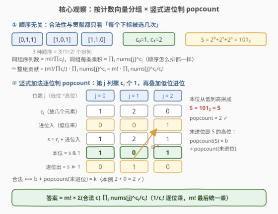
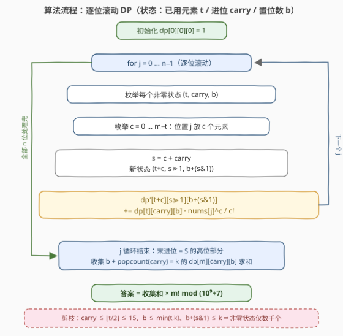

# LeetCode 魔法序列的数组乘积之和 题解

## 1. 题目概述

- **标题 / 题号**：魔法序列的数组乘积之和（#3539，hard）
- **链接**：https://leetcode.cn/problems/find-sum-of-array-product-of-magical-sequences/
- **难度**：困难
- **标签**：位运算、数组、数学、动态规划、状态压缩、组合数学

**题意**：给你两个整数 `m` 和 `k`，以及一个整数数组 `nums`（长度记为 $n$）。

一个整数序列 `seq` 若满足以下条件，则称为**魔法**序列：

- `seq` 的长度为 $m$；
- $0 \le seq[i] < n$；
- $2^{seq[0]} + 2^{seq[1]} + \cdots + 2^{seq[m-1]}$ 的**二进制表示**恰有 $k$ 个**置位**（值为 1 的位）。

序列的**数组乘积**定义为 $\text{prod}(seq) = \text{nums}[seq[0]] \times \text{nums}[seq[1]] \times \cdots \times \text{nums}[seq[m-1]]$。

返回所有魔法序列的数组乘积之和对 $10^9 + 7$ 取模的结果。

**示例 1**：

```text
输入：m = 5, k = 5, nums = [1,10,100,10000,1000000]
输出：991600007
解释：[0,1,2,3,4] 的所有排列都是魔法序列（S = 2⁰+2¹+2²+2³+2⁴ = 31 = 11111₂），
      每条序列的乘积均为 10¹³，共 5! = 120 条，120 × 10¹³ mod (10⁹+7) = 991600007。
```

**示例 2**：

```text
输入：m = 2, k = 2, nums = [5,4,3,2,1]
输出：170
解释：魔法序列恰为所有下标互异的有序对 (i, j), i ≠ j，共 5 × 4 = 20 条，
      乘积之和 = (5+4+3+2+1)² − (5²+4²+3²+2²+1²) = 225 − 55 = 170。
```

**示例 3**：

```text
输入：m = 1, k = 1, nums = [28]
输出：28
解释：唯一的魔法序列是 [0]：S = 2⁰ = 1，置位数为 1。
```

**约束**：

- $1 \le k \le m \le 30$
- $1 \le n = \text{nums.length} \le 50$
- $1 \le \text{nums}[i] \le 10^8$

> 💡 **读题关键**：约束条件（$S$ 的 popcount）与权值（乘积）都是 `seq` 中**每个下标出现次数**的函数，与**顺序无关**——这是整道题的突破口。另外 $S \le 30 \cdot 2^{49} < 2^{54}$，popcount 至多为 $m$，而 $k \le m$ 恰好卡在可达范围内。

## 2. 解题思路

### 2.1 暴力思路

`seq` 每个位置可取 $n \le 50$ 个下标，全体序列共 $n^m \le 50^{30}$ 条，逐条计算 $S$ 与乘积显然不可行。

但注意两件「对称」的事：交换 `seq` 内部任意两个位置，

- $S = \sum_i 2^{seq[i]}$ 不变（加法交换律）；
- 乘积 $\prod_i \text{nums}[seq[i]]$ 不变（乘法交换律）。

所以**合法性与贡献都只依赖下标的多重集**，即**计数向量** $c = (c_0, c_1, \dots, c_{n-1})$（$c_j$ 为下标 $j$ 被选中的次数，$\sum_j c_j = m$）。按计数向量分组统计，能把「顺序」维度彻底剥离，为 DP 铺路。

### 2.2 核心观察：多重集分组（EGF）+ 二进制进位 DP



**第一步：按计数向量分组，答案化成 EGF 求和。**

固定计数向量 $c$，组内有多少条**互不相同**的序列？这正是**多重集排列数**：

$$\#\text{seq} = \frac{m!}{\prod_j c_j!}$$

组内每条序列的乘积相同，均为 $\prod_j \text{nums}[j]^{c_j}$。于是

$$\text{answer} \;=\; \sum_{\text{valid } c} \frac{m!}{\prod_j c_j!}\cdot\prod_j \text{nums}[j]^{c_j} \;=\; m!\cdot\sum_{\text{valid } c}\; \prod_{j=0}^{n-1} \frac{\text{nums}[j]^{c_j}}{c_j!}$$

其中 valid $\iff \operatorname{popcount}\big(\sum_j c_j 2^j\big) = k$。把 $m!$ 提到最后统一乘、$\frac{1}{c_j!}$ 逐位置累乘——这正是**指数生成函数（EGF）**的标准拆法；模质数 $10^9+7$ 下 $1/c_j!$ 用逆元实现（$c_j \le 30 \ll p$）。

**第二步：进位 DP 判定 popcount。**

$\sum_j c_j 2^j$ 就是把 $m$ 个 2 的幂做**竖式加法**：第 $j$ 列竖着摞 $c_j$ 个 1，再叠加来自低位的进位。从 $j = 0$（最低位）扫到 $j = n-1$，设当前进位为 $\text{carry}$：

$$s = c_j + \text{carry},\qquad \text{本位} = s \,\&\, 1,\qquad \text{新进位} = s \gg 1$$

本位为 1 就新增一个置位。由此定义 DP：

$$dp[j][t][\text{carry}][b] = \text{处理完位置 } 0..j-1 \text{ 后，已用 } t \text{ 个元素、进位 carry、低位置位数 } b \text{ 时的 } \sum \prod_i \frac{\text{nums}[i]^{c_i}}{c_i!}$$

转移（在位置 $j$ 放 $c$ 个元素，$0 \le c \le m - t$）：

$$dp[j+1][t+c]\big[(c+\text{carry})\gg 1\big]\big[b+((c+\text{carry})\,\&\,1)\big] \mathrel{+}= dp[j][t][\text{carry}][b]\cdot \frac{\text{nums}[j]^c}{c!}$$

**终态收集**：扫完全部 $n$ 个位置后，

$$\sum_j c_j 2^j = (\text{低 } n \text{ 位的本位比特}) + \text{carry}\cdot 2^n$$

剩余进位的二进制**本身就是 $S$ 的高位部分**，故

$$\operatorname{popcount}(S) = b + \operatorname{popcount}(\text{carry})$$

收集所有满足 $b + \operatorname{popcount}(\text{carry}) = k$ 的 $dp[n][m][\text{carry}][b]$ 求和，最后乘 $m!$ 即答案。

**进位与置位数都很小（关键剪枝）**：

- $\text{carry} = \Big\lfloor \sum_{i<j} c_i 2^i \,/\, 2^j \Big\rfloor \le \frac{t\cdot 2^{j-1}}{2^j} \le \lfloor t/2 \rfloor \le 15$，其中 $t$ 为已放置元素数（每项 $c_i 2^i \le 2^{j-1}$）；
- $b \le \min(t, k)$（$t$ 个 2 的幂之和，popcount 不超过 $t$；超过 $k$ 的状态必死）。

于是状态数只有 $O\big(m \cdot \frac{m}{2} \cdot k\big) \approx 1.5\times 10^4$ 的上界，实际因三个维度互相制约仅数千个非零状态；转移再乘 $O(m)$ 的 $c$ 枚举与 $O(n)$ 的位置数，总量仅百万级——C++ 毫秒级、Python 也不到半秒。

### 2.3 算法流程图



流程要点：

1. **预处理**：阶乘表与逆元阶乘表（费马小定理 $x^{-1} \equiv x^{p-2} \pmod p$）；
2. **滚动**：$dp$ 按 $j$ 滚动，每轮对当前 $j$ 预计算 EGF 权重 $w[c] = \text{nums}[j]^c / c!$；
3. **三重剪枝**：枚举状态时 $\text{carry} \le \lfloor t/2\rfloor$、$b \le \min(t,k)$；转移时 $b + (s\,\&\,1) > k$ 直接跳过；
4. **收集**：$b + \operatorname{popcount}(\text{carry}) = k$ 的终态求和后乘 $m!$。

### 2.4 示例演算

以示例 2（$m=2,\ k=2,\ \text{nums}=[5,4,3,2,1]$）走「分组」视角。计数向量满足 $\sum c_j = 2$，共 $\binom{2+5-1}{2} = 15$ 个，其中合法的 10 个：

| 计数向量 $c$ | $S=\sum c_j 2^j$ | popcount | 组内序列数 | 组乘积 | 贡献 |
|---|---|---|---|---|---|
| (1,1,0,0,0) | $2^0+2^1=3=11_2$ | 2 ✓ | $2!/1!1! = 2$ | $5\cdot4=20$ | 40 |
| (1,0,1,0,0) | $1+4=5=101_2$ | 2 ✓ | 2 | $5\cdot3=15$ | 30 |
| (1,0,0,1,0) | $1+8=9=1001_2$ | 2 ✓ | 2 | $5\cdot2=10$ | 20 |
| (1,0,0,0,1) | $1+16=17=10001_2$ | 2 ✓ | 2 | $5\cdot1=5$ | 10 |
| (0,1,1,0,0) | $2+4=6=110_2$ | 2 ✓ | 2 | $4\cdot3=12$ | 24 |
| (0,1,0,1,0) | $2+8=10=1010_2$ | 2 ✓ | 2 | $4\cdot2=8$ | 16 |
| (0,1,0,0,1) | $2+16=18=10010_2$ | 2 ✓ | 2 | $4\cdot1=4$ | 8 |
| (0,0,1,1,0) | $4+8=12=1100_2$ | 2 ✓ | 2 | $3\cdot2=6$ | 12 |
| (0,0,1,0,1) | $4+16=20=10100_2$ | 2 ✓ | 2 | $3\cdot1=3$ | 6 |
| (0,0,0,1,1) | $8+16=24=11000_2$ | 2 ✓ | 2 | $2\cdot1=2$ | 4 |

其余 5 个向量（同一下标取两次）满足 $S = 2^{j+1}$，popcount 均为 1，非法。合计 $40+30+20+10+24+16+8+12+6+4 = 170$ ✓。

> 💡 **交叉验证**：合法序列恰为所有 $i \ne j$ 的有序对，$\sum_{i \ne j}\text{nums}[i]\text{nums}[j] = (5+4+3+2+1)^2 - (5^2+4^2+3^2+2^2+1^2) = 225 - 55 = 170$ ✓。示例 1 同理只有 $(1,1,1,1,1)$ 一个合法向量，贡献 $5! \cdot 10^{13} \bmod (10^9+7) = 991600007$ ✓。

## 3. 参考代码

### C++

```cpp
class Solution {
  public:
    int magicalSum(int m, int k, vector<int>& nums) {
        const long long MOD = 1000000007;
        int n = nums.size();
        // 阶乘与逆元阶乘（EGF 权重里的 1/c!）
        vector<long long> fact(m + 1);
        fact[0] = 1;
        for (int i = 1; i <= m; i++) fact[i] = fact[i - 1] * i % MOD;
        auto power = [&](long long a, long long e) {
            long long r = 1;
            while (e) {
                if (e & 1) r = r * a % MOD;
                a = a * a % MOD;
                e >>= 1;
            }
            return r;
        };
        vector<long long> invFact(m + 1);
        invFact[m] = power(fact[m], MOD - 2);
        for (int i = m; i > 0; i--) invFact[i - 1] = invFact[i] * i % MOD;

        int C = m / 2 + 1;  // carry ∈ [0, m/2]
        int B = k + 1;      // b    ∈ [0, k]
        auto alloc = [&]() {
            return vector<vector<vector<long long>>>(
                m + 1, vector<vector<long long>>(C, vector<long long>(B, 0)));
        };
        auto dp = alloc(), ndp = alloc();
        dp[0][0][0] = 1;
        for (int j = 0; j < n; j++) {              // 逐二进制位（= 逐下标）滚动
            vector<long long> w(m + 1);            // w[c] = nums[j]^c / c!
            long long p = 1;
            for (int c = 0; c <= m; c++) {
                w[c] = p * invFact[c] % MOD;
                p = p * nums[j] % MOD;
            }
            for (auto& pl : ndp)
                for (auto& row : pl) fill(row.begin(), row.end(), 0LL);
            for (int t = 0; t <= m; t++) {
                for (int carry = 0; carry <= t / 2; carry++) {   // 剪枝 1
                    int bmax = min(B - 1, t);                    // 剪枝 2：b <= min(k, t)
                    for (int b = 0; b <= bmax; b++) {
                        long long v = dp[t][carry][b];
                        if (!v) continue;
                        for (int c = 0; c + t <= m; c++) {
                            int s = c + carry;
                            int nb = b + (s & 1);
                            if (nb >= B) continue;               // 剪枝 3：置位数超 k
                            long long& tgt = ndp[t + c][s >> 1][nb];
                            tgt = (tgt + v * w[c]) % MOD;
                        }
                    }
                }
            }
            swap(dp, ndp);
        }
        long long ans = 0;
        for (int carry = 0; carry < C; carry++) {  // 末进位即 S 的高位部分
            int pc = __builtin_popcount((unsigned)carry);
            for (int b = 0; b < B; b++)
                if (b + pc == k) ans = (ans + dp[m][carry][b]) % MOD;
        }
        return (int)(ans * fact[m] % MOD);         // 统一乘 m!
    }
};
```

### Python

```python
class Solution:
    def magicalSum(self, m: int, k: int, nums: List[int]) -> int:
        MOD = 10 ** 9 + 7
        n = len(nums)
        fact = [1] * (m + 1)
        for i in range(1, m + 1):
            fact[i] = fact[i - 1] * i % MOD
        inv_fact = [1] * (m + 1)
        inv_fact[m] = pow(fact[m], MOD - 2, MOD)
        for i in range(m, 0, -1):
            inv_fact[i - 1] = inv_fact[i] * i % MOD

        C, B = m // 2 + 1, k + 1          # carry ∈ [0, m/2]，b ∈ [0, k]
        dp = [[[0] * B for _ in range(C)] for _ in range(m + 1)]
        dp[0][0][0] = 1
        for x in nums:                     # 逐二进制位（= 逐下标）滚动
            w, p = [], 1                   # w[c] = x^c / c!
            for c in range(m + 1):
                w.append(p * inv_fact[c] % MOD)
                p = p * x % MOD
            ndp = [[[0] * B for _ in range(C)] for _ in range(m + 1)]
            for t in range(m + 1):
                for carry in range(t // 2 + 1):        # 剪枝 1
                    for b in range(min(B, t + 1)):     # 剪枝 2：b <= min(k, t)
                        v = dp[t][carry][b]
                        if not v:
                            continue
                        for c in range(m - t + 1):
                            s = c + carry
                            nb = b + (s & 1)
                            if nb < B:                 # 剪枝 3：置位数超 k 跳过
                                row = ndp[t + c][s >> 1]
                                row[nb] = (row[nb] + v * w[c]) % MOD
            dp = ndp
        ans = 0
        for carry in range(C):            # 末进位即 S 的高位部分
            pc = bin(carry).count('1')
            for b in range(B):
                if b + pc == k:
                    ans += dp[m][carry][b]
        return ans % MOD * fact[m] % MOD  # 统一乘 m!
```

> 💡 三处工程细节：① EGF 权重 $w[c]$ 逐位置预计算，内层转移只剩一次乘加；② 三重剪枝（$\text{carry} \le t/2$、$b \le \min(t,k)$、$b+(s\&1) \le k$）让实际状态数远小于理论上界；③ Python 对 $m=30,\ k=30,\ n=50$ 的最坏用例实测约 0.3s，C++ 两次最坏用例合计 < 5ms。

## 4. 复杂度分析

| 维度 | 复杂度 | 说明 |
|------|--------|------|
| 时间复杂度 | $O(n \cdot m^3 \cdot k)$（上界） | 位置数 $n$ × 状态 $(t, \text{carry}, b)$ 至多 $(m{+}1)(\frac{m}{2}{+}1)(k{+}1) \approx 1.5\times10^4$ × 转移枚举 $c \le m$。三重剪枝联合制约后实测仅约 $2\times10^6$ 次乘加：$n=50, m=k=30$ 时 C++ < 5ms、Python ≈ 0.3s |
| 空间复杂度 | $O(m^2 k)$ | 滚动数组只保留相邻两层，每层 $(m{+}1)\times(\frac{m}{2}{+}1)\times(k{+}1)$ 个状态 |

> ⚠️ 本题的「上界」与「实际」差距悬殊：$\text{carry} \le t/2$ 与 $c \le m - t$ 是同一枚硬币的两面（进位来自已放置的元素），$b \le \min(t,k)$ 又与两者耦合，因此真正访问到的状态-转移对只有上界的约十分之一。若不做剪枝，纯 Python 可能超时。

## 5. 扩展：这套「分组 + EGF」还能怎么玩

- **退化验证**：若去掉 popcount 约束，对 $k = 1 \dots m$ 的答案求和应恰等于 $(\sum_j \text{nums}[j])^m$——因为 $\sum_c \frac{m!}{\prod c_j!}\prod_j \text{nums}[j]^{c_j}$ 正是多项式定理的展开式。这是天然的对拍校验器。
- **只数个数**：若问魔法序列的**条数**而非乘积和，令 $\text{nums}[j] \equiv 1$，同一份代码直接复用。
- **另一种状态设计（官方 hint 路线）**：按「序列第 $i$ 项」推进，维护部分和低位窗口 mask（$dp[i][j][\text{mask}]$）。也可解，但窗口维护与进位方向更绕；本题按「二进制位置」推进的竖式 DP 把进位显式收进状态，反而更直白、更难写错。
- **位约束家族**：把「popcount 恰为 $k$」换成「按位与为 0」是 [982. 按位与为零的三元组](https://leetcode.cn/problems/triples-with-bitwise-and-equal-to-zero/) 的子集计数套路；换成「异或值域计数」则是 3513/3514 的值域封顶思路——位约束的形状（popcount / AND / XOR）决定状态设计，与数位 DP 中「约束形状决定计数形态」如出一辙。

## 6. 面试要点

1. **为什么可以按计数向量分组？**

   > 约束 $S=\sum 2^{seq[i]}$ 的 popcount 与乘积 $\prod \text{nums}[seq[i]]$ 在交换序列任意两个元素后都不变（加法/乘法交换律），因此合法性与贡献都只依赖「每个下标出现的次数」。同组序列条数 = 多重集排列数 $m!/\prod c_j!$，同组每条序列的乘积相同。

2. **$m!/\prod c_j!$ 怎么塞进 DP（为什么能拆成逐位置乘 $1/c!$）？**

   > $m!$ 与位置无关，最后统一乘；$\prod_j 1/c_j!$ 按 EGF 的方式逐位置累乘——在位置 $j$ 选 $c$ 个元素时权值乘 $\text{nums}[j]^c/c!$。这正是「有序结构 = 多重集 × 排列」的生成函数语言，模质数下 $1/c!$ 用逆元阶乘实现。

3. **进位为什么不超过 $m/2$？终态为什么是 $b + \operatorname{popcount}(\text{carry})$？**

   > 位置 $j$ 的进位 $=\lfloor\sum_{i<j} c_i 2^i / 2^j\rfloor \le t\cdot 2^{j-1}/2^j \le t/2$（$t$ 为已放置元素数，每项 $\le 2^{j-1}$）。扫完全部 $n$ 位后 $S = \text{低位本位比特} + \text{carry}\cdot 2^n$，剩余进位恰是 $S$ 的高位部分，故 popcount 直接相加。

4. **状态空间多大？哪些剪枝是必要的？**

   > 理论上界 $(m+1)\times(\lfloor m/2\rfloor+1)\times(k+1) \approx 1.5\times 10^4$；实际因 $\text{carry} \le t/2$、$b \le \min(t,k)$、$t + c \le m$ 三者联合制约只有数千个非零状态，转移总量百万级。不做剪枝也能过（C++），但纯 Python 会明显变慢。

5. **怎么验证这类复杂计数代码的正确性？**

   > 两板斧：① 小规模暴力（$n, m \le 5$ 枚举全部 $n^m$ 条序列）与 DP 对拍，本解 C++/Python 双实现共对拍 500 组全过；② 结构性特例做封闭验算——如示例 2 的 $(\sum)^2 - \sum (\cdot^2)$、去掉约束后退化为 $(\sum \text{nums})^m$。计数题的 bug 往往藏在「差一个排列系数」这类细节里，封闭特例最能暴露。

> 💡 **一句话总结**：3539 = 顺序无关 ⇒ 按计数向量分组（多重集排列数 $m!/\prod c_j!$，EGF 拆权）+ popcount 判定 ⇒ 逐位竖式进位 DP（状态 $t/\text{carry}/b$，末进位即高位），收集 $b + \operatorname{popcount}(\text{carry}) = k$ 后统一乘 $m!$。

## 同类练习题

| # | 题目 | 与本题的关联 |
|---|------|-------------|
| 1863 | [所有子集的异或总和](https://leetcode.cn/problems/sum-of-all-subset-xor-totals/)（[题解](../1801-1900/1863_所有子集的异或总和.md)） | 对称性分组求和的入门版——按最高位贡献分解，与本题「顺序无关」一脉相承 |
| 1079 | [活字印刷](https://leetcode.cn/problems/letter-tile-possibilities/)（[题解](../1001-1100/1079_活字印刷.md)） | 多重集排列数 $m!/\prod c_i!$ 的直接练习 |
| 1639 | [通过给定词典构造目标字符串的方案数](https://leetcode.cn/problems/number-of-ways-to-form-a-target-string-given-a-dictionary/)（[题解](../1601-1700/1639_通过给定词典构造目标字符串的方案数.md)） | 逐列（位置）推进 + 乘法权重的计数 DP，框架与本题同构 |
| 982 | [按位与为零的三元组](https://leetcode.cn/problems/triples-with-bitwise-and-equal-to-zero/)（[题解](../0901-1000/982_按位与为零的三元组.md)） | 把 popcount 约束换成按位与约束的位计数近亲 |
| 3514 | [不同 XOR 三元组的数目 II](https://leetcode.cn/problems/number-of-unique-xor-triplets-ii/)（[题解](../3501-3600/3514_不同XOR三元组的数目II.md)） | 位运算值域坍缩计数，对照感受「位约束家族」的不同打法 |
