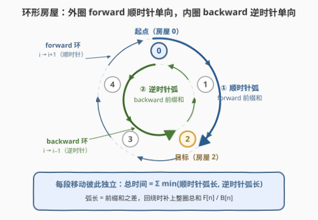
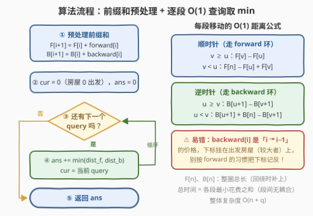

# 访问所有房屋的最短时间

- **题目名称**：访问所有房屋的最短时间
- **链接**：[3540. Minimum Time to Visit All Houses](https://leetcode.cn/problems/minimum-time-to-visit-all-houses/)
- **难度**：中等
- **标签**：数组、前缀和、环形数组

## 1. 题目概述

> ⚠️ 本题为 LeetCode 付费题，题意描述根据官方示例用例与 hints 重建（已与公开镜像核对），可能与官方题面有出入。

$n$ 所房屋排成一个**环**，连接房屋的道路分两套，且都是**单向**的：

- **前向（forward）环**：对所有 $0 \le i \le n-2$，房屋 $i$ 有一条长 $\text{forward}[i]$ 米的道路通向房屋 $i+1$；房屋 $n-1$ 另有一条长 $\text{forward}[n-1]$ 的道路通回房屋 $0$——整套前向道路构成一个**顺时针**单向环。
- **后向（backward）环**：对所有 $1 \le i \le n-1$，房屋 $i$ 有一条长 $\text{backward}[i]$ 米的道路通向房屋 $i-1$；房屋 $0$ 另有一条长 $\text{backward}[0]$ 的道路通回房屋 $n-1$——整套后向道路构成一个**逆时针**单向环。

你以 **1 米/秒** 的速度步行，从**房屋 0** 出发，要求按 `queries` 给出的顺序**依次到访**这些房屋（途中路过其他房屋不算完成访问），返回所需的最短总时间。

**示例 1**：

```text
输入：forward = [1,4,4], backward = [4,1,2], queries = [1,2,0,2]
输出：12
解释：路径为 0(0) → 1(1) → 2(5) ⇢ 1(7) ⇢ 0(8) ⇢ 2(12)，括号内为到达时刻；
      → 为前向道路，⇢ 为后向道路。
      最后一段 0 → 2 走后向道路 backward[0] = 4，比顺时针绕行（1+4=5）更便宜。
```

**示例 2**：

```text
输入：forward = [1,1,1,1], backward = [2,2,2,2], queries = [1,2,3,0]
输出：4
解释：0 → 1 → 2 → 3 → 0 全程走前向道路，每段 1 秒。
```

**约束条件**：

- $2 \le n \le 10^5$，$n = \text{forward.length} = \text{backward.length}$
- $1 \le \text{forward}[i], \text{backward}[i] \le 10^5$
- $1 \le \text{queries.length} \le 10^5$，$0 \le \text{queries}[i] < n$
- 相邻查询不同：$\text{queries}[i] \ne \text{queries}[i+1]$；且 $\text{queries}[0] \ne 0$

> 💡 **读题关键**：① 两套道路都是**单向**的——`forward[i]` 只能从房屋 $i$ 走到 $i+1$，`backward[i]` 只能从房屋 $i$ 走到 $i-1$。`backward` 环不是 `forward` 环的"逆向车道"，而是**另一批独立的路**：示例 1 中 $1 \to 2$ 只能花 $\text{forward}[1] = 4$，不能拿 $\text{backward}[2] = 2$ 那条路反着走；② 整个行程共 $\text{queries.length}$ 段移动（首段为 $0 \to \text{queries}[0]$），每段的花费**只取决于两端点**；③ $n$ 与 $q$ 都是 $10^5$ 量级，单段耗时必须压到 $O(1)$。

---

## 2. 解题思路

### 2.1 暴力思路

最直接的做法：对行程中每一段 $u \to v$，先沿**顺时针**方向一步一步走，把途经的前向道路长度累加起来；再沿**逆时针**方向逐步累加后向道路长度；取两者较小值计入答案。全程逐段累加。

复杂度是致命的：每段要走 $O(n)$ 步，共约 $q$ 段，总计 $O(n \cdot q) \approx 10^{10}$——必然超时。瓶颈在于"逐步累加"：同一段弧的长度被反复重算，而这些弧长本质上都是**固定数组的区间和**。

（更笨的暴力是对每段建图跑 Dijkstra，但图本身就是两个规则的单向环，最短路必然贴着其中一圈走，Dijkstra 属于杀鸡用牛刀，复杂度也更差。）

### 2.2 核心观察：每段独立，环上弧长用前缀和



**观察一（各段完全独立）。** 走到 $\text{queries}[i]$ 之后，下一段的花费只由「当前所在房屋」与「目标房屋」决定，与之前怎么走**没有任何关系**——没有方向惯性、没有转向代价，道路又是永久固定的。因此全局最优 = 每段局部最优之和，可以放心逐段贪心：

$$\text{ans} = \sum_{k} \min\big(\text{顺时针弧长},\ \text{逆时针弧长}\big)$$

**观察二（最优路径不会折返）。** 在环上，房屋 $w$ 只有两个邻居 $w-1$ 与 $w+1$。若路径在 $w$ 处**转向**（比如顺时针进来、逆时针离开），那离开的一步只能踩回**刚经过的房屋**——即任何一次转向都伴随"原路返回"。而所有道路长度都 $\ge 1 > 0$，把"两次到访同一房屋"之间的绕圈整段删掉，仍是合法路径且严格更省。删干净后，路径不重复经过任何房屋、方向也不再改变——而环上**不重复房屋的 $u \to v$ 路径恰好只有两条**：顺时针弧与逆时针弧。所以每段的最优花费就是两条弧长度的较小值。

**观察三（弧长 = 前缀和之差）。** 顺时针从 $u$ 走到 $v$ 途经的前向道路恰好是 `forward` 数组的一段连续区间，逆时针同理是 `backward` 的连续区间。区间和用前缀和 $O(1)$ 得到。记

$$F[i] = \sum_{j<i} \text{forward}[j], \qquad B[i] = \sum_{j<i} \text{backward}[j]$$

则两条弧长为：

$$\text{dist}_f(u,v) = \begin{cases} F[v] - F[u] & v \ge u \\ F[n] - F[u] + F[v] & v < u \end{cases} \qquad \text{dist}_b(u,v) = \begin{cases} B[u{+}1] - B[v{+}1] & u \ge v \\ B[u{+}1] + B[n] - B[v{+}1] & u < v \end{cases}$$

（$v < u$ 时顺时针需要回绕，补上整圈总和 $F[n]$；逆时针同理。）

> ⚠️ **逆时针公式的下标易错**：`backward[i]` 的语义是"房屋 $i$ → 房屋 $i-1$"，下标挂在**出发**房屋（较大下标）上。因此逆时针从 $u$ 走到 $v$（$u \ge v$）历经的道路是 $\text{backward}[v{+}1] + \cdots + \text{backward}[u]$，写成前缀和即 $B[u{+}1] - B[v{+}1]$——两端都带 $+1$，与顺时针公式不对称，是本题最容易手滑的地方。

### 2.3 算法流程图



| 步骤 | 动作 | 说明 |
|------|------|------|
| ① 预处理 | 构建 $F$、$B$ 两个前缀和数组 | $O(n)$，注意用 64 位整数 |
| ② 初始化 | `cur = 0`，`ans = 0` | 从房屋 0 出发 |
| ③ 遍历 | 依次取出 $q = \text{queries}[i]$ | 共 $\text{queries.length}$ 段移动（含首段 $0 \to \text{queries}[0]$） |
| ④ 累加 | $\text{ans} \mathrel{+}= \min(\text{dist}_f(\text{cur}, q),\ \text{dist}_b(\text{cur}, q))$ | 4 次数组访问 + 1 次比较，$O(1)$ |
| ⑤ 前进 | `cur = q` | 段与段之间无状态耦合 |

### 2.4 示例演算

用**示例 1**（`forward = [1,4,4]`，`backward = [4,1,2]`，`queries = [1,2,0,2]`）走一遍。前缀和：

$$F = [0, 1, 5, 9], \qquad B = [0, 4, 5, 7]$$

| 段 | 顺时针 $\text{dist}_f$ | 逆时针 $\text{dist}_b$ | 取 min |
|----|------------------------|------------------------|--------|
| $0 \to 1$ | $F[1]-F[0] = 1$ | $B[1]+B[3]-B[2] = 4+2 = 6$ | $1$ |
| $1 \to 2$ | $F[2]-F[1] = 4$ | $B[2]+B[3]-B[3] = 5$ | $4$ |
| $2 \to 0$ | $F[3]-F[2]+F[0] = 4$ | $B[3]-B[1] = 3$ | $3$ |
| $0 \to 2$ | $F[2]-F[0] = 5$ | $B[1]+B[3]-B[3] = 4$ | $4$ |

总时间 $= 1+4+3+4 = 12$，与官方输出一致。对照官方给出的路径：$2 \to 0$ 走的是逆时针弧（经过房屋 1，花费 $\text{backward}[2]+\text{backward}[1] = 2+1 = 3$），$0 \to 2$ 也走逆时针弧（直达，花费 $\text{backward}[0] = 4$）——正是逐行取 min 的结果。**示例 2** 中 `backward` 全面偏贵，每段都选顺时针，合计 $1+1+1+1 = 4$。

---

## 3. 参考代码

### C++

```cpp
class Solution {
  public:
    long long minTime(vector<int>& forward, vector<int>& backward,
                      vector<int>& queries) {
        int n = forward.size();
        vector<long long> F(n + 1, 0), B(n + 1, 0);
        for (int i = 0; i < n; i++) {
            F[i + 1] = F[i] + forward[i];
            B[i + 1] = B[i] + backward[i];
        }

        auto distForward = [&](int u, int v) -> long long {
            return v >= u ? F[v] - F[u] : F[n] - F[u] + F[v];
        };
        auto distBackward = [&](int u, int v) -> long long {
            return u >= v ? B[u + 1] - B[v + 1] : B[u + 1] + B[n] - B[v + 1];
        };

        long long ans = 0;
        int cur = 0;
        for (int q : queries) {
            ans += min(distForward(cur, q), distBackward(cur, q));
            cur = q;
        }
        return ans;
    }
};
```

### Python

```python
class Solution:
    def minTime(self, forward: List[int], backward: List[int],
                queries: List[int]) -> int:
        n = len(forward)
        F = [0] * (n + 1)
        B = [0] * (n + 1)
        for i in range(n):
            F[i + 1] = F[i] + forward[i]
            B[i + 1] = B[i] + backward[i]

        def dist_f(u: int, v: int) -> int:
            return F[v] - F[u] if v >= u else F[n] - F[u] + F[v]

        def dist_b(u: int, v: int) -> int:
            return B[u + 1] - B[v + 1] if u >= v else B[u + 1] + B[n] - B[v + 1]

        ans = 0
        cur = 0
        for q in queries:
            ans += min(dist_f(cur, q), dist_b(cur, q))
            cur = q
        return ans
```

> ⚠️ **易错点**：① 逆时针公式两端下标都带 $+1$（$B[u{+}1]-B[v{+}1]$），最常见的手滑是写成 $B[u]-B[v]$——根源是忘了 `backward[i]` 的下标是**出发**房屋；② 前缀和与答案都要 **64 位**：整圈总长可达 $10^5 \times 10^5 = 10^{10}$，早已超出 `int`；③ 回绕分支别忘加 $F[n]$ / $B[n]$；④ 虽然约束保证了相邻 query 不同、$\text{queries}[0] \ne 0$，但两个距离公式对 $u = v$ 天然给出 $0$，无需特判。

---

## 4. 复杂度分析

| 维度 | 复杂度 | 说明 |
|------|--------|------|
| 时间复杂度 | $O(n + q)$ | 预处理两趟前缀和 $O(n)$；每段移动常数次数组访问 + 一次比较 $O(1)$ |
| 空间复杂度 | $O(n)$ | 两个长度 $n+1$ 的前缀和数组 $F$、$B$ |
| 数据范围验证 | — | $n, q \le 10^5$：总计约 $3 \times 10^5$ 次基本操作，远低于时限 |
| 对比暴力 | — | 逐段步行 $O(n \cdot q) \approx 10^{10}$，超出时限两个数量级 |

---

## 5. 扩展：变体与环形手法对照

**变体一：道路改成双向。** 若每条道路两个方向都能通行，则房屋 $e$ 与 $e+1$ 之间的几何边有两个可选价格，有效权重取 $w_e = \min(\text{forward}[e],\ \text{backward}[(e{+}1) \bmod n])$。对 $w$ 做一遍前缀和，每段答案同样是"顺时针弧和与逆时针弧和取较小者"——结构完全不变，只是把"两个方向各自的前缀和"合并成了"一个有效权重的前缀和"（最优路径仍不折返，正权环上删环的论证照样成立）。

**变体二：允许 $\text{queries}[0] = 0$。** 首段变成 $0 \to 0$，两个距离公式都自然给出 $0$，无需任何特判——把 $u = v$ 的边界留给公式处理，比加 if 分支更不易出错。

**手法对照：回绕式 vs 拆环式。** 处理环形数组有两派套路：一是本题的"**回绕补总和**"（前缀和之差出现"负跨度"就加上整圈总和 $F[n]$），适合**距离 / 区间和查询**类问题；二是 503 / 918 / 2134 等题常用的"**拆环成链**"（数组翻倍或下标取模），适合**扫描、枚举所有环形窗口**类问题。两派本质等价，按查询模式选顺手的那派即可。

---

## 6. 面试要点

1. **为什么可以逐段独立地取最小值？**

   - 每段花费只由该段两端房屋决定：道路固定、无方向惯性、无转向代价，到达 $\text{queries}[i]$ 之前的历史不影响下一步的代价。全局最优 = 各段最优之和，逐段贪心即为全局最优。

2. **为什么每段的最优路径不会混合两个方向？**

   - 环上每所房屋只有两个邻居，在 $w$ 处转向意味着"从 $w-1$ 顺时针进、又逆时针退回 $w-1$"——转向必踩回头路。正权图上含回头路的路径可以删掉重访的闭合环而严格变小；删干净后是不重复经过房屋的简单路径，而环上 $u \to v$ 的简单路径只有顺、逆两条弧。

3. **逆时针距离公式为什么是 $B[u{+}1]-B[v{+}1]$？**

   - `backward[i]` 的语义是"房屋 $i$ → 房屋 $i-1$"，下标挂在**出发**房屋（较大下标）上。逆时针 $u \to v$（$u \ge v$）历经 $\text{backward}[u], \ldots, \text{backward}[v{+}1]$，用前缀和表示即 $B[u{+}1]-B[v{+}1]$。它与顺时针的 $F[v]-F[u]$ 不对称，是本题第一大陷阱。

4. **哪些地方会溢出？**

   - 单条弧最长可达 $n \cdot \max(\text{道路长}) = 10^5 \cdot 10^5 = 10^{10}$，超出 32 位 `int`；总时间上界约 $q \cdot 10^{10} = 10^{15}$。C++ 中前缀和数组与返回值都必须用 `long long`；Python 天然大整数无此忧虑。

5. **如果要求"途中路过也算访问"，本题会怎样？**

   - 贪心立刻失效：某段的最短路可能途经**排在后面的目标房屋**，造成"提前到访"破坏顺序约束，此时必须为保序而绕远路，段与段之间产生耦合，不能再逐段独立取 min。这说明"独立性"正是本题可贪心的根基，也是面试官最想听你点破的地方。

---

## 7. 同类练习题

- [503. 下一个更大元素 II](https://leetcode.cn/problems/next-greater-element-ii/)（[站内题解](../0501-0600/503_下一个更大元素 II.md)）：环形数组"拆环 / 取模回绕"手法的原型，与本题的回绕式前缀和互为表里
- [918. 环形子数组的最大和](https://leetcode.cn/problems/maximum-sum-circular-subarray/)（[站内题解](../0901-1000/918_最大环形子数组和.md)）：环形结构上"两种情况分类取最优"的范式，与本题"两条弧取 min"同构
- [2134. 最少交换次数来组合所有的 1 II](https://leetcode.cn/problems/minimum-swaps-to-group-all-1s-together-ii/)（[站内题解](../2101-2200/2134_最少交换次数来组合所有的1II.md)）：环形前缀和求定长窗口和的直接应用
- [303. 区域和检索 - 数组不可变](https://leetcode.cn/problems/range-sum-query-immutable/)：前缀和 $O(1)$ 区间和的模板题，本题的地基
