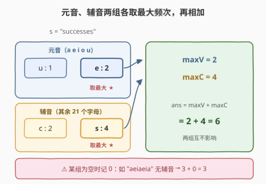
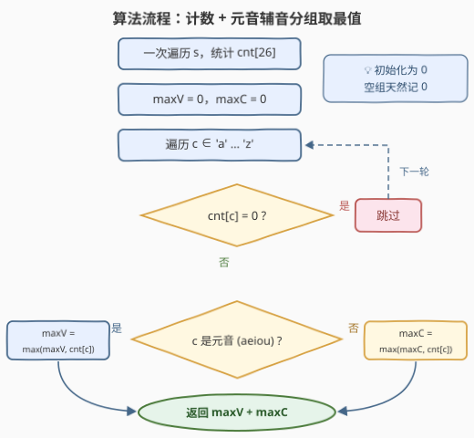

# 找到频率最高的元音和辅音

- **题目名称**：找到频率最高的元音和辅音
- **链接**：[3541. 找到频率最高的元音和辅音](https://leetcode.cn/problems/find-most-frequent-vowel-and-consonant/)
- **难度**：简单
- **标签**：哈希表, 字符串, 计数

## 1. 题目概述

给你一个由小写英文字母（`'a'` 到 `'z'`）组成的字符串 `s`。你的任务是找出出现频率**最高**的元音（`'a'`、`'e'`、`'i'`、`'o'`、`'u'` 中的一个）和出现频率最高的辅音（除元音以外的所有字母），并返回这两个频数**之和**。

注意：如果有多个元音或辅音具有相同的最高频率，可以任选其中一个。如果字符串中没有元音或没有辅音，则其频率视为 0。一个字母 `x` 的**频率**是它在字符串中出现的次数。

**示例 1**：

```text
输入：s = "successes"
输出：6
解释：元音有 'u' 出现 1 次、'e' 出现 2 次，最大元音频率 = 2；
     辅音有 's' 出现 4 次、'c' 出现 2 次，最大辅音频率 = 4。
     输出为 2 + 4 = 6。
```

**示例 2**：

```text
输入：s = "aeiaeia"
输出：3
解释：元音有 'a' 出现 3 次、'e' 出现 2 次、'i' 出现 2 次，最大元音频率 = 3；
     s 中没有辅音，因此最大辅音频率 = 0。
     输出为 3 + 0 = 3。
```

**约束条件**：

- $1 \le s.length \le 100$
- `s` 只包含小写英文字母

> 💡 **读题关键**：① 答案是两个**分组各自的最大频次之和**，元音组与辅音组互不重叠（一个字母要么是元音、要么是辅音），两组的最值可以**完全独立**地求；② 「没有元音/没有辅音时频率视为 0」不是陷阱而是**送的兜底**——把两个最值初始化为 0 就天然满足，不必像某些题那样刻意排除空组。

---

## 2. 解题思路

### 2.1 暴力思路：每个字母各扫一遍字符串

对 26 个字母逐个调用 `s.count(c)` 统计频次，分元音、辅音两组各取最大再相加：

```python
max_v = max(s.count(c) for c in 'aeiou')
max_c = max(s.count(c) for c in 'bcdfghjklmnpqrstvwxyz')
return max_v + max_c
```

$O(26n)$ 的复杂度对 $n \le 100$ 完全够用，但每个字母都把字符串整个重扫一遍，**重复劳动**——明明一次遍历就能把所有频次一起数出来。

### 2.2 核心观察：和式拆解，两组各取一个最大值



把答案拆开看：

$$ans = \underbrace{\max_{c \in \text{元音}} freq(c)}_{maxV} + \underbrace{\max_{c \in \text{辅音}} freq(c)}_{maxC}$$

- 这是**和式**而非差式：两项都要**尽量大**，于是两组**各自取组内最大**即可；
- 元音集 $\{a,e,i,o,u\}$ 与辅音集（其余 21 个字母）**互不重叠**，两个最值的选择互不干扰，无需任何配对检查；
- 某组为空时该组贡献 0——把 `maxV`、`maxC` **初始化为 0** 就自动成立，连哨兵值（$-\infty$）都不需要。

于是：一次遍历 `s` 数出 `cnt[26]`，再扫一遍 26 个桶，按「是否元音」分流更新两个最大值，最后相加。

> 💡 **与 3442 对比**：[3442. 奇偶频次间的最大差值 I](https://leetcode.cn/problems/maximum-difference-between-even-and-odd-frequency-i/) 是同款骨架的「差式」版本——$\max - \min$，且那里**频次 0 不参与**分组（否则 `min` 恒为 0）；本题是「和式」$\max + \max$，且**空组恰好记 0**。两题对照着看，「最值可拆解」这一思想就吃透了。

### 2.3 算法流程图



1. 一次遍历 `s`，统计频次 `cnt[26]`；
2. 初始化 `maxV = 0`，`maxC = 0`（空组兜底值）；
3. 遍历 26 个字母 `c`：
   - 若 `cnt[c] == 0`，跳过；
   - 若 `c` 是元音（`a/e/i/o/u`），`maxV = max(maxV, cnt[c])`；
   - 否则，`maxC = max(maxC, cnt[c])`；
4. 返回 `maxV + maxC`。

### 2.4 示例演算

以**示例 1**（`s = "successes"`）走一遍：

| 字符 | 频次 | 类别 | 归属 |
|---|---|---|---|
| s | 4 | 辅音 | `maxC` 候选 ★ |
| c | 2 | 辅音 | `maxC` 候选 |
| e | 2 | 元音 | `maxV` 候选 ★ |
| u | 1 | 元音 | `maxV` 候选 |

得 `maxV = 2`（e）、`maxC = 4`（s），答案 $2 + 4 = 6$ ✓。其余 22 个字母频次为 0，全部跳过。

**示例 2**（`s = "aeiaeia"`）同法：`a:3, e:2, i:2` 全是元音 → `maxV = 3`；辅音组**为空**，`maxC` 保持初始值 0，答案 $3 + 0 = 3$ ✓。

---

## 3. 参考代码

### C++

```cpp
class Solution {
  public:
    int maxFreqSum(string s) {
        int cnt[26] = {0};
        for (char c : s) ++cnt[c - 'a'];

        auto isVowel = [](int i) {              // a e i o u 对应下标 0/4/8/14/20
            return i == 0 || i == 4 || i == 8 || i == 14 || i == 20;
        };
        int maxV = 0, maxC = 0;                 // 缺省 0：某组为空时贡献 0
        for (int i = 0; i < 26; ++i) {
            if (cnt[i] == 0) continue;
            if (isVowel(i)) maxV = max(maxV, cnt[i]);
            else            maxC = max(maxC, cnt[i]);
        }
        return maxV + maxC;
    }
};
```

### Python

```python
class Solution:
    def maxFreqSum(self, s: str) -> int:
        cnt = Counter(s)
        vowels = set('aeiou')
        max_v = max((v for k, v in cnt.items() if k in vowels), default=0)
        max_c = max((v for k, v in cnt.items() if k not in vowels), default=0)
        return max_v + max_c
```

> 💡 Python 的 `max(..., default=0)` 正好表达「该组为空则记 0」的语义，生成器为空时返回默认值而不抛异常。

---

## 4. 复杂度分析

| 维度 | 复杂度 | 说明 |
|------|--------|------|
| 时间 | $O(n + \|\Sigma\|)$ | 遍历 `s` 计数 $O(n)$，再扫 26 个桶取最值 $O(26)$，$\|\Sigma\| = 26$ |
| 空间 | $O(\|\Sigma\|)$ | 频次数组 `cnt[26]`，与字符串长度无关 |

---

## 5. 扩展：单趟写法与元音位掩码

**单趟写法**：计数与取最值合并到同一趟循环里，免掉第二遍扫桶：

```python
class Solution:
    def maxFreqSum(self, s: str) -> int:
        cnt, max_v, max_c = Counter(), 0, 0
        for ch in s:
            cnt[ch] += 1
            if ch in 'aeiou':
                max_v = max(max_v, cnt[ch])
            else:
                max_c = max(max_c, cnt[ch])
        return max_v + max_c
```

**元音位掩码**：`a/e/i/o/u` 对应字母表第 $0/4/8/14/20$ 位，置 1 得掩码 $0x104111$。判断第 `i` 个字母是否元音只需一次移位：

```cpp
bool isVowel = (0x104111 >> i) & 1;   // C++ / Java 通用小技巧
```

```python
is_vowel = (0x104111 >> (ord(ch) - 97)) & 1
```

对 5 个元音的判断来说 `set('aeiou')` 已足够快，掩码属于免哈希、免分支预测的炫技写法，面试里说出原理即可加分。

---

## 6. 面试要点

- **Q1：为什么 `maxV` 和 `maxC` 可以独立取，不用考虑两个字母的配对关系？**
  答：答案是**和式** $\max + \max$，且元音集与辅音集互不重叠——一个字母不可能既是元音又是辅音，两个最大值来自两个不相交的集合，互不干扰，各取各的即可。
- **Q2：字符串里没有元音（或没有辅音）时怎么办？**
  答：题目明确规定该组频率视为 0。把 `maxV`、`maxC` 初始化为 0 即天然满足——空组的最大值就是兜底值 0，无需哨兵（$-\infty$）或特判分支。
- **Q3：元音判断有哪几种写法？各有什么取舍？**
  答：① `set('aeiou')` / 哈希表：最直观；② `string("aeiou").find(c) != npos`：注意 `npos` 处理；③ 位掩码 `(0x104111 >> i) & 1`：无哈希无分支最快；④ 逐个 `||` 比较：编译器能优化成位运算。字符集固定时都是常数级，口味之选。
- **Q4：频次统计用 `cnt[26]` 数组还是 `Counter` 哈希表？**
  答：仅 26 个小写字母时数组更快（无哈希开销、缓存友好、空间恒定）；`Counter` 只存出现过的键，配合 `default=0` 处理空组很顺手。复杂度同阶，按语言习惯选。
- **Q5：还能更优吗？**
  答：不能也不必。$O(n)$ 读入是下界（每个字符至少看一次），26 侧扫描是常数。本题考点在「和式拆解 + 空组兜底」的建模，而非复杂度优化。

---

## 7. 同类练习题

- [3442. 奇偶频次间的最大差值 I](https://leetcode.cn/problems/maximum-difference-between-even-and-odd-frequency-i/)：同款「分组取最值」骨架的差式版本，注意它那里频次 0 不参与分组
- [1704. 判断字符串的两半是否相似](https://leetcode.cn/problems/determine-if-string-halves-are-alike/)：同样的元音判断 + 计数，比较两半元音个数
- [1941. 检查是否所有字符出现次数相同](https://leetcode.cn/problems/check-if-all-characters-have-equal-number-of-occurrences/)：`cnt[26]` 计数后做均匀性判断
- [242. 有效的字母异位词](https://leetcode.cn/problems/valid-anagram/)：`cnt[26]` 计数比对的经典模板
- [387. 字符串中的第一个唯一字符](https://leetcode.cn/problems/first-unique-character-in-a-string/)：先计数再二次扫描的频次哈希基本应用
