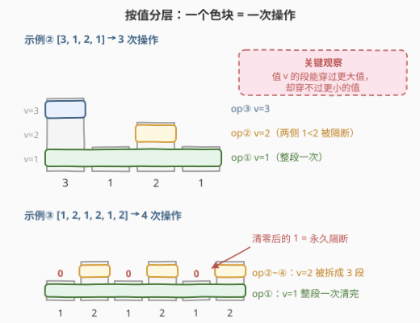
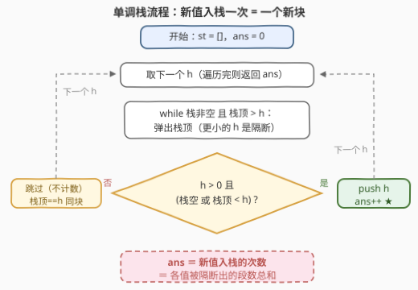

# 将所有元素变为0的最少操作次数

- **题目名称**：将所有元素变为 0 的最少操作次数
- **链接**：[3542. 将所有元素变为 0 的最少操作次数](https://leetcode.cn/problems/minimum-operations-to-convert-all-elements-to-zero/)
- **难度**：中等
- **标签**：栈, 贪心, 数组, 哈希表, 单调栈

## 1. 题目概述

给你一个大小为 $n$ 的**非负**整数数组 `nums`。你的任务是对该数组执行若干次（可能为 0 次）操作，使得**所有**元素都变为 0。

在一次操作中，你可以选择一个子数组 `[i, j]`（其中 $0 \le i \le j < n$），将该子数组中所有**最小的非负整数**设为 0（即把子数组最小值出现的每一处都清零）。返回使整个数组变为 0 所需的最少操作次数。

**示例 1**：

```text
输入：nums = [0,2]
输出：1
解释：选择子数组 [1,1]（即 [2]），最小非负整数是 2，将 2 设为 0，得到 [0,0]。
```

**示例 2**：

```text
输入：nums = [3,1,2,1]
输出：3
解释：选 [1,3]（min=1）→ [3,0,2,0]；选 [2,2]（min=2）→ [3,0,0,0]；
     选 [0,0]（min=3）→ [0,0,0,0]。
```

**示例 3**：

```text
输入：nums = [1,2,1,2,1,2]
输出：4
解释：选 [0,5]（min=1）一次清掉全部三个 1 → [0,2,0,2,0,2]；
     剩下三个 2 被清零的 1 隔开，只能各花一次，共 1 + 3 = 4 次。
```

**约束条件**：

- $1 \le n = nums.length \le 10^5$
- $0 \le nums[i] \le 10^5$

> 💡 **读题关键**：① 操作清掉的是「子数组**最小值**的全部出现处」，不是任意值——所以一次有效操作只能针对**一个值**；② 若子数组里有 0，最小值就是 0，这次操作等于白做——因此有效操作的子数组里**不能含 0（也不能含比目标值更小的数）**；③ 元素只会从原值变成 0，**只减不变**。

---

## 2. 解题思路

### 2.1 暴力思路：逐值扫描模拟

最直接的正确做法是**按值从小到大模拟**（这也是题目 hints 给出的方向）：

- 把所有出现过的值 $v$（除 0 外）升序排列；
- 对每个 $v$，扫一遍数组，数出「值为 $v$ 的元素被更小的值隔成了几段」，每段计一次操作，并把这段里的 $v$ 清零。

这个模拟是对的（正确性见 2.2），但每个值都要扫一遍全数组，复杂度 $O(n \cdot V)$（$V$ 为不同值的个数，最坏 $10^5$），最坏 $10^{10}$ 次操作必然超时。至于纯 BFS 枚举所有操作序列，状态空间是指数级，更不可行。

### 2.2 核心观察：分层 + 隔断，每个「块」恰好一次操作



把数组画成柱状图，按**值分层**来看，答案的结构就浮现了。三个关键事实：

**事实一：一次操作只能清「一个值」，且子数组内所有元素 $\ge v$。**
操作清掉的是子数组的最小值 $v$，那么子数组里不可能有比 $v$ 更小的数。

**事实二：原值更小的位置是「永久隔断」。**
元素只会从原值 $w$ 变成 0。若 $w < v$，则这个位置任何时刻的取值（$w$ 或 0）都 $< v$，**永远无法被 $v$ 的操作跨越**。而原值更大的位置不同：它暂时还是大值，可以待在 $v$ 的子数组里「当背景板」，甚至把两侧的 $v$ **连接**成同一次操作。

**事实三：答案 $= \sum_v$（值为 $v$ 的元素被更小值隔成的段数）。**

- **下界**：不同段的 $v$ 无法同属一次操作（子数组跨不过隔断），所以值 $v$ 至少要「段数」次操作，不同值的操作互不重复；
- **可达**：按 $v$ 从小到大处理，处理 $v$ 时所有更小的值已清零、更大的值原封不动，对每个极大段选「段内第一个 $v$ 到最后一个 $v$」作为子数组，最小值恰为 $v$，一次清完该段所有 $v$。

于是问题变成：**统计每个值被「更小值」隔断出的段数总和**。

### 2.3 算法流程图：单调栈 $O(n)$ 统计段数



维护一个**栈底到栈顶严格递增**的单调栈，栈中保存的是「当前还打开着的块的最小值」。从左到右扫描每个 $h = nums[i]$：

- **弹栈**：栈顶 $> h$ 说明这些块遇到了更小的值，被隔断、结束了（弹出，之后不必再管——它们的操作次数已计入）；
- **入栈并计数**：弹完后若 $h$ 大于新栈顶（或栈空）且 $h > 0$，说明 $h$ 是一个**新块的开始**，`ans++`；
- **相等跳过**：栈顶 $== h$ 说明是**同一块的延续**（如 $[1,1]$ 是一段，不是两段），不重复计数。

每个元素至多入栈、出栈一次，总复杂度均摊 $O(n)$。

### 2.4 示例演算

以**示例 2** `nums = [3,1,2,1]` 走一遍单调栈：

| $i$ | $h$ | 栈内动作 | 栈（底→顶） | $ans$ |
|---|---|---|---|---|
| 0 | 3 | 3 是新值，入栈 | $[3]$ | 1 |
| 1 | 1 | 弹出 3（$3>1$ 被隔断），1 入栈 | $[1]$ | 2 |
| 2 | 2 | 栈顶 $1 < 2$，入栈 | $[1,2]$ | 3 |
| 3 | 1 | 弹出 2（$2>1$），栈顶 $1==1$ 同块延续 | $[1]$ | 3 |

返回 $3$ ✓。

**示例 3** `[1,2,1,2,1,2]`：入栈的是 $1(i{=}0),\ 2(i{=}1),\ 2(i{=}3),\ 2(i{=}5)$，中间的 $1$ 都是「弹出 2 后与栈顶相等」的同块延续，共 $4$ ✓。

---

## 3. 参考代码

### C++

```cpp
class Solution {
  public:
    int minOperations(vector<int>& nums) {
        vector<int> st;                                   // 栈底 -> 栈顶严格递增
        int ans = 0;
        for (int h : nums) {
            while (!st.empty() && st.back() > h)          // 更小的 h 隔断更大的块
                st.pop_back();
            if (h > 0 && (st.empty() || st.back() < h)) { // 新值 = 新块
                st.push_back(h);
                ++ans;
            }                                             // 栈顶 == h：同块延续
        }
        return ans;
    }
};
```

### Python

```python
class Solution:
    def minOperations(self, nums: List[int]) -> int:
        st, ans = [], 0
        for h in nums:
            while st and st[-1] > h:                  # h 终结所有更大的块
                st.pop()
            if h > 0 and (not st or st[-1] < h):      # 新值开新块
                st.append(h)
                ans += 1                              # 栈顶 == h 则是同块延续
        return ans
```

---

## 4. 复杂度分析

| 维度 | 复杂度 | 说明 |
|------|--------|------|
| 时间 | $O(n)$ | 每个元素至多入栈一次、出栈一次，弹栈总次数均摊线性 |
| 空间 | $O(n)$ | 栈深度上界为 $n$（严格递增数组时最深），实际存的是当前打开的块 |

---

## 5. 扩展：与「区间 +1」版 1526 的对偶对比

[1526. 形成目标数组的子数组最少增加次数](https://leetcode.cn/problems/minimum-number-of-increments-on-subarrays-to-form-a-target-array/) 是本题的「镜像」：每次操作给子数组全体 **+1**，问从全 0 变成 `target` 的最少操作数，答案是漂亮的 $\sum_i \max(0,\ h_i - h_{i-1})$（相邻差之和）。

本题**不能**套用这个公式：`[3,1]` 用 1526 公式得 $3 + 0 = 3$，但本题答案只有 $2$。原因是操作语义不同——

- 1526 的操作给区间内**所有**柱子 +1，一根高柱会把低柱「垫高」，所以每层的高度差都要单独铺；
- 本题的操作只清**等于最小值**的元素，更大的值原地不动、还能充当连接桥（$[3,1]$ 里清 $1$ 时顺路把区间拉到 $[0,1]$，一次操作后 $3$ 依然站在那）。

「相等合并、更大可穿、更小隔断」这组约束，恰好就是**单调栈**最擅长维护的结构——这也是为什么两道长得像的题，一个用前缀差分、一个必须用栈。

---

## 6. 面试要点

- **Q1：为什么说一次有效操作只能清一个值？**
  答：操作把子数组中「最小非负整数」的全部出现处清零，最小值只有一个值 $v$；若子数组含 0 则最小值为 0、操作无效。所以每次操作只针对一个正值 $v$，且子数组内所有元素都 $\ge v$。
- **Q2：为什么「更小的值」是不可逾越的隔断？**
  答：元素只会从原值 $w$ 变为 0，单调不增。若 $w < v$，该位置的取值永远是 $w$ 或 $0$，两者都 $< v$，任何以 $v$ 为最小值的子数组都无法覆盖它。相反，更大的值可以留在子数组里当「连接桥」。
- **Q3：贪心（从小到大逐段清）为什么最优？**
  答：值 $v$ 被隔断成几段，就至少需要几次操作（一次操作的子数组不能跨越隔断），这是下界；从小到大处理时每个极大段恰好一次清完，达到下界，故最优。
- **Q4：单调栈在这里的语义是什么？为什么入栈才计数、相等不计数？**
  答：栈存「当前打开的块的最小值」（底到顶递增）。新值入栈 = 一个新块开启；弹栈 = 块被更小的值终结（次数已计入）；栈顶相等 = 同一块延续。若相等地也计数，$[1,1]$ 会被算成 2 次，而实际整段是一次操作。
- **Q5：栈里存值还是存下标？本题需要下标吗？**
  答：只存值即可。像 84 题那样需要宽度结算时才存下标；本题弹出即「结算完毕」（计数发生在入栈时），无须知道块的边界。

---

## 7. 同类练习题

- [1526. 形成目标数组的子数组最少增加次数](https://leetcode.cn/problems/minimum-number-of-increments-on-subarrays-to-form-a-target-array/)：「区间 +1」对偶版本，答案是相邻差之和，与本题对照最能看清操作语义差异
- [84. 柱状图中最大的矩形](https://leetcode.cn/problems/largest-rectangle-in-histogram/)：单调栈祖师爷题，同样是「弹出即结算」的柱状图思维
- [739. 每日温度](https://leetcode.cn/problems/daily-temperatures/)：单调栈找「下一个更大元素」的入门模板
- [901. 股票价格跨度](https://leetcode.cn/problems/online-stock-span/)：在线维护「左边更小元素」的单调栈
- [42. 接雨水](https://leetcode.cn/problems/trapping-rain-water/)：柱状图分层 + 单调栈的另一经典应用
