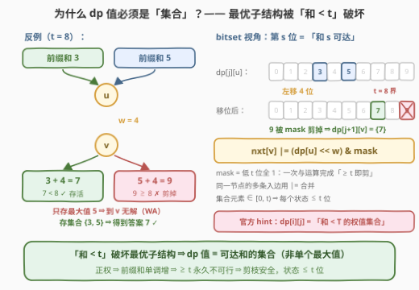
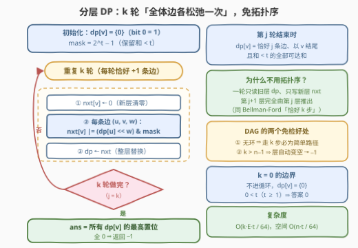

# K 条边路径的最大边权和

- **题目名称**：K 条边路径的最大边权和
- **链接**：[3543. K 条边路径的最大边权和](https://leetcode.cn/problems/maximum-weighted-k-edge-path/)
- **难度**：中等
- **标签**：图, 动态规划, 哈希表, 位运算

## 1. 题目概述

给定 $n$ 个节点（编号 $0 \sim n-1$）的**有向无环图（DAG）**，由二维数组 `edges` 描述，`edges[i] = [u, v, w]` 表示一条从 $u$ 到 $v$ 的有向边，权值为 $w$。再给定两个整数 $k$ 和 $t$。

求图中边权和**尽可能大**的路径，要求同时满足：

- 路径包含**恰好** $k$ 条边；
- 路径上边权之和**严格小于** $t$。

返回该最大边权和；不存在这样的路径时返回 $-1$。

**示例 1**：

```text
输入：n = 3, edges = [[0,1,1],[1,2,2]], k = 2, t = 4
输出：3
解释：唯一包含 2 条边的路径是 0 -> 1 -> 2，权和 1 + 2 = 3 < 4。
```

**示例 2**：

```text
输入：n = 3, edges = [[0,1,2],[0,2,3]], k = 1, t = 3
输出：2
解释：0 -> 1 权和 2 < 3 合法；0 -> 2 权和 3 = t，不满足严格小于，故答案为 2。
```

**示例 3**：

```text
输入：n = 3, edges = [[0,1,6],[1,2,8]], k = 1, t = 6
输出：-1
解释：0 -> 1 权和 6 = t 不合法；1 -> 2 权和 8 > t 不合法，无解。
```

**约束条件**：

- $1 \le n \le 300$
- $0 \le edges.length \le 300$
- $0 \le u_i, v_i < n$，$u_i \ne v_i$，无重边
- $1 \le w_i \le 10$
- $0 \le k \le 300$
- $1 \le t \le 600$
- 输入图是 DAG

> 💡 **读题关键**：① 「恰好 $k$ 条边」而非「至多」——$k = 0$ 也合法，此时路径是单个点，权和 $0 < t$（$t \ge 1$）恒成立，答案为 $0$；② 「严格小于 $t$」是硬约束，$= t$ 也不行；③ 全部边权 $\ge 1$（**正权**）⇒ 路径前缀和**严格递增**，这是后面剪枝的根基；④ DAG 无环 ⇒ 任意走 $k$ 步自动是简单路径（不会绕回已访问的点），且边数超过 $n-1$ 的路径必然不存在。

---

## 2. 解题思路

### 2.1 暴力思路：DFS 枚举所有路径

最直接的做法是从每个节点出发 DFS，枚举所有恰好 $k$ 条边的路径，检查权和是否 $< t$，取最大值。但 DAG 中 $k$ 条边路径的条数是指数级的（每一步最多有 $E = 300$ 种选择），天文数字，不可行。

更隐蔽的陷阱是「优化成 DP」时的直觉写法：

$$\text{dp}[j][v] = \text{恰好 } j \text{ 条边、以 } v \text{ 结尾的最大权和}$$

**这是错的**——错在哪，正是本题的核心。

### 2.2 核心观察：约束破坏最优子结构，dp 值必须是「集合」



考虑 $t = 8$：到节点 $u$ 的某层有两条同长前缀，权和分别为 $3$ 和 $5$；再接一条 $u \to v$、$w = 4$ 的边：

- $5 + 4 = 9 \ge 8$，违反约束，**死路**；
- $3 + 4 = 7 < 8$，**合法**。

若 dp 只保留「最大和 5」，可行的 $3$ 就被丢掉了。**「和 $< t$」的上界约束让更大的前缀和反而可能更差——最优子结构被破坏**，dp 值不能是单个数，而必须是**所有可达和的集合**（官方 hint 2、3 正是这个方向）：

$$dp[j][v] = \{\, s \mid \text{存在恰好 } j \text{ 条边、以 } v \text{ 结尾、权和为 } s < t \text{ 的路径} \,\}$$

转移：对每条边 $(u, v, w)$，

$$dp[j+1][v] \;\supseteq\; \{\, s + w \mid s \in dp[j][u],\ s + w < t \,\}$$

两个让它「可算」的关键事实：

**事实一（剪枝安全）**：边权全为正 ⇒ 前缀和沿路径**严格递增** ⇒ 某前缀一旦 $\ge t$，无论怎么延伸都 $\ge t$，**永久不可行**，直接丢弃。于是集合元素始终落在 $[0, t)$ 内，每个集合至多 $t \le 600$ 个元素。

**事实二（分层免拓扑序）**：按**边数**分层，第 $j+1$ 层完全由第 $j$ 层推出——一条 $j+1$ 条边的路径，去掉最后一条边就是 $j$ 条边的路径。每轮「读旧层、写新层、算完整层再替换」即可，**不需要显式拓扑排序**。这与 Bellman-Ford 求「恰好 $k$ 步」可达的写法、787 题「K 站中转内最便宜的航班」完全同构。

实现上，由于集合元素 $\subseteq [0, t)$，用 **$t$ 位 bitmask** 表示集合（第 $s$ 位置 1 表示和 $s$ 可达），单条边的转移浓缩成一次位运算：

$$\text{nxt}[v] \mathrel{|}= \big(\,dp[u] \ll w\,\big) \,\&\, \underbrace{(2^t - 1)}_{\text{mask：顺带剪掉} \ge t}$$

最终答案 $= \max_v \big(\max dp[k][v]\big)$；若所有 $dp[k][v]$ 均为空集则返回 $-1$。

### 2.3 算法流程图



算法一共三步：

1. **初始化**：$dp[v] = \{0\}$（0 条边，每个节点都是单点路径），$mask = 2^t - 1$；
2. **迭代 $k$ 轮**：每轮把 `nxt` 清零，对每条边 $(u, v, w)$ 执行 $\text{nxt}[v] \mathrel{|}= (dp[u] \ll w) \,\&\, mask$，然后 $dp \leftarrow \text{nxt}$；
3. **取答案**：所有 $dp[v]$ 的最高置位即最大可达和；全 0 返回 $-1$。

### 2.4 示例演算

以**示例 1** `n = 3, edges = [[0,1,1],[1,2,2]], k = 2, t = 4` 走一遍（$mask$ 只保留和 $0 \sim 3$）：

| 层 $j$ | $dp[j][0]$ | $dp[j][1]$ | $dp[j][2]$ | 说明 |
|---|---|---|---|---|
| 0 | $\{0\}$ | $\{0\}$ | $\{0\}$ | 0 条边：每个点都是单点路径 |
| 1 | $\varnothing$ | $\{1\}$ | $\{2\}$ | 边 $(0,1,1)$：$0+1=1$；边 $(1,2,2)$：$0+2=2$ |
| 2 | $\varnothing$ | $\varnothing$ | $\{3\}$ | $dp[1][1]=\{1\}$ 接边 $(1,2,2)$：$1+2=3 < 4$ ✓ |

答案 $= 3$ ✓。

**示例 2**（$t = 3$）：第 1 层中 $0 \to 1$ 得 $2 < 3$ 存活，$0 \to 2$ 得 $3$ 被 $mask$ 剪掉（$3 \ge 3$），答案 $2$ ✓。
**示例 3**（$t = 6$）：$6 \ge 6$、$8 > 6$ 全被剪，第 1 层全空，返回 $-1$ ✓。

---

## 3. 参考代码

### C++

```cpp
class Solution {
  public:
    int maxWeight(int n, vector<vector<int>>& edges, int k, int t) {
        bitset<600> mask;                             // 只保留 [0, t) 的和
        for (int s = 0; s < t; ++s) mask.set(s);

        vector<bitset<600>> dp(n), nxt(n);
        for (int v = 0; v < n; ++v) dp[v].set(0);     // 0 条边：和集合 = {0}

        for (int j = 0; j < k; ++j) {                 // 一轮 = 恰好多走 1 条边
            for (int v = 0; v < n; ++v) nxt[v].reset();
            for (auto& e : edges)
                nxt[e[1]] |= (dp[e[0]] << e[2]) & mask;   // >= t 的和被 mask 剪掉
            swap(dp, nxt);
        }

        int ans = -1;
        for (int v = 0; v < n; ++v)                   // 找所有状态中的最高置位
            for (int s = t - 1; s > ans; --s)
                if (dp[v][s]) { ans = s; break; }
        return ans;
    }
};
```

### Python

```python
class Solution:
    def maxWeight(self, n: int, edges: List[List[int]], k: int, t: int) -> int:
        mask = (1 << t) - 1                    # 只保留 < t 的和
        dp = [1] * n                           # 0 条边：和集合 = {0}（bit 0）
        for _ in range(k):                     # 一轮 = 恰好多走 1 条边
            nxt = [0] * n
            for u, v, w in edges:
                nxt[v] |= (dp[u] << w) & mask  # >= t 的和被 mask 剪掉
            dp = nxt
        best = max(dp)                         # 数值最大 <=> 最高置位最大
        return best.bit_length() - 1 if best else -1
```

> 💡 Python 的 `int` 本身就是任意长 bitmask：`<< w` 完成加权和，`& mask` 一步完成「剪掉 $\ge t$」，`|=` 合并同一节点的多条入边；`bit_length() - 1` 直接取出集合中的最大和。

---

## 4. 复杂度分析

| 维度 | 复杂度 | 说明 |
|------|--------|------|
| 时间 | $O\!\big(\dfrac{k \cdot E \cdot t}{64}\big)$ | $k$ 轮 × 每轮 $E$ 条边 × 每次 $t$ 位 bitset 的移位/或/与（按 64 位机器字折算）；代入上界 $300 \times 300 \times 600 / 64 \approx 8.4 \times 10^5$ 次字操作 |
| 空间 | $O\!\big(\dfrac{n \cdot t}{64}\big)$ | 滚动保留 `dp` / `nxt` 两层，各 $n$ 个 $t$ 位 bitset（约 45 KB） |

若用哈希集合代替 bitset，时间为 $O(k \cdot E \cdot t) = 5.4 \times 10^7$，C++ 也能通过；$t \le 600$ 的小上界正是为位运算优化留的口子。

---

## 5. 扩展：如果约束 / 数据范围变了呢？

- **$t$ 大到约束不生效**（如 $t > 10k$，超过最大可能路径和 $10 \cdot k$）：任何路径都满足 $< t$，最优子结构恢复——按拓扑序 DP 每个状态只存最大值即可，$O(k \cdot (n + E))$。
- **$t$ 很大但约束仍紧**：bitset 失效，退回哈希集合版 $dp$，最坏 $O(k \cdot E \cdot t)$（$t$ 为不同和数的上界）。
- **等价的记忆化写法**：DAG 可拓扑排序，也可以按拓扑序自底向上合并 $\text{dfs}(v, j)$ 返回的集合，与分层写法只是循环方向不同。

---

## 6. 面试要点

- **Q1：为什么 dp[v][j] 不能只存「最大和」？**
  答：给反例即可：$t = 8$，到 $u$ 有和 $3$、$5$ 两条同长前缀，接 $w = 4$ 的边后 $9 \ge 8$ 死、$7 < 8$ 活。「和 $< t$」的上界约束让更大前缀可能更差，最优子结构被破坏，dp 值必须存**可达和的集合**。
- **Q2：为什么敢把 $\ge t$ 的和直接丢弃？**
  答：所有边权 $\ge 1$，前缀和沿路径严格递增；某前缀一旦 $\ge t$，任何延伸都 $\ge t$，永久不可行。剪枝后集合元素 $\subseteq [0, t)$，状态大小有界。
- **Q3：分层转移为什么不需要拓扑序？**
  答：第 $j+1$ 层完全由第 $j$ 层推出（$j+1$ 条边的路径 = $j$ 条边的路径 + 最后一条边），一轮内只读旧层、只写新层、算完整层再替换。这正是 Bellman-Ford「恰好 $k$ 步」的写法（对照 787 题）。
- **Q4：bitset 怎么支撑转移？**
  答：第 $s$ 位表示「和 $s$ 可达」：接一条权 $w$ 的边 = 整体左移 $w$ 位；$\&\ (2^t - 1)$ 同时完成剪枝；同一节点的多条入边用 $|=$ 合并。单边转移 $O(t / 64)$。
- **Q5：有哪些边界情况？**
  答：$k = 0$：单点路径和为 0，$t \ge 1$ 恒有 $0 < t$，答案 0（dp 初值 bit0 = 1 自然覆盖）；$k > n - 1$：DAG 中不存在这么多条边的简单路径，层数自动变空得 $-1$；无边（$E = 0$）且 $k \ge 1$ 同样 $-1$。

---

## 7. 同类练习题

- [787. K 站中转内最便宜的航班](https://leetcode.cn/problems/cheapest-flights-within-k-stops/)：同款「恰好 $k$ 条边」的分层松弛（Bellman-Ford），只是求最小费用，可与本题互为模板
- [329. 矩阵中的最长递增路径](https://leetcode.cn/problems/longest-increasing-path-in-a-matrix/)：隐式 DAG 上的记忆化 DP 入门经典
- [1928. 规定时间内到达终点的最小花费](https://leetcode.cn/problems/minimum-cost-to-reach-destination-in-time/)：资源上界同样破坏「只存最优」，必须把已用时间纳入状态
- [847. 访问所有节点的最短路径](https://leetcode.cn/problems/shortest-path-visiting-all-nodes/)：状态本身是 bitmask 集合的图最短路，与本题「dp 值是集合」互为镜像
