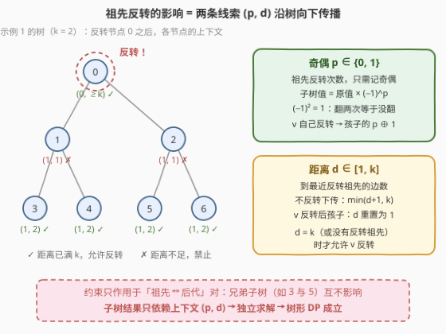
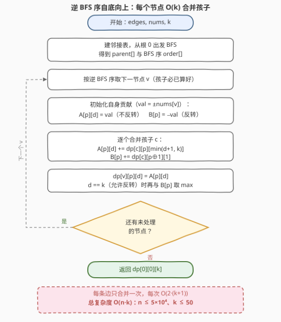

# 子树反转和

- **题目名称**：子树反转和
- **链接**：[3544. 子树反转和](https://leetcode.cn/problems/subtree-inversion-sum/)
- **难度**：困难
- **标签**：树, 深度优先搜索, 数组, 动态规划

## 1. 题目概述

给你一棵以节点 $0$ 为根、包含 $n$ 个节点的无向树，节点编号从 $0$ 到 $n-1$，由边数组 `edges` 表示。同时给定整数 $k$ 和长度为 $n$ 的整数数组 `nums`，其中 `nums[i]` 是节点 $i$ 的值。

你可以对部分节点执行**反转操作**，需满足：

- **子树反转**：反转一个节点时，以它为根的**整棵子树**中所有节点的值都乘以 $-1$；
- **距离限制**：若被反转的两个节点 $a$、$b$ 中一个是另一个的祖先（即 $\mathrm{LCA}(a,b) = a$ 或 $b$），那么它们之间路径上的**边数必须至少为 $k$**。

返回执行若干次（可以为 0 次）反转后，树上节点值的**最大**可能总和。

**示例 1**：

```text
输入：edges = [[0,1],[0,2],[1,3],[1,4],[2,5],[2,6]], nums = [4,-8,-6,3,7,-2,5], k = 2
输出：27
解释：反转节点 0、3、4、6，最终 nums = [-4,8,6,3,7,2,5]，总和 27。
```

**示例 2**：

```text
输入：edges = [[0,1],[1,2],[2,3],[3,4]], nums = [-1,3,-2,4,-5], k = 2
输出：9
解释：只反转节点 4，最终 nums = [-1,3,-2,4,5]，总和 9。
```

**示例 3**：

```text
输入：edges = [[0,1],[0,2]], nums = [0,-1,-2], k = 3
输出：3
解释：反转节点 1 和 2（兄弟之间无约束），得到 [0,1,2]。
```

**约束条件**：

- $2 \le n \le 5 \times 10^4$
- $-5 \times 10^4 \le nums[i] \le 5 \times 10^4$
- $1 \le k \le 50$

> 💡 **读题关键**：① 反转作用的是**整棵子树**而非单个节点——一次反转牵动一整片，子树里的正值会被「误伤」；② 距离限制**只约束祖先↔后代对**，兄弟/堂兄弟分支之间完全独立；③ 一个节点的最终符号 = $(-1)^{\text{（它自身和所有祖先中被反转的个数）}}$——**只取决于奇偶**，这是全题的突破口。

---

## 2. 解题思路

### 2.1 暴力思路：枚举反转集合

最直接的做法是枚举反转集合 $S \subseteq V$ 的所有 $2^n$ 种选择：

- 对 $S$ 中每对 $(a, b)$ 检查是否构成祖先-后代关系（沿着父指针上跳即可），若是则验证距离 $\ge k$；
- 对合法的 $S$，自顶向下把每次反转的 $-1$ 因子推到每个节点上，$O(n)$ 求和。

复杂度 $O(2^n \cdot n^2)$，$n = 5 \times 10^4$ 时是天方夜谭。

**贪心也不可行**：「见到负值节点就反转」有两个致命伤——反转 $v$ 会把 $v$ 子树里的正值一起变负；且祖先的反转既**改变**后代的符号（负的可能变正，得不偿失），又**封锁**附近后代的选择权（距离不足 $k$ 时它们不能再反转）。上下层的决策深度耦合，必须用 DP 把「祖先的影响」显式建模。

### 2.2 核心观察：把祖先的影响压缩成 $(奇偶\ p,\ 距离\ d)$ 两个维度



站在节点 $v$ 的视角，祖先们的反转决策对 $v$ 子树的影响只有两条「线索」：

**线索一（奇偶 $p$）**：翻转因子是 $-1$，而 $(-1)^2 = 1$。无论祖先里有多少个节点被反转，$v$ 子树里所有值只会整体乘 $(-1)^p$，$p \in \{0, 1\}$ 一个 bit 就够——**这是「乘 $-1$」这类操作独有的坍缩性质**。

**线索二（距离 $d$）**：约束只问「$v$ 到最近的反转祖先是否 $\ge k$」。因此一切 $d \ge k$ 的情形（包括没有反转祖先）行为完全一致：$v$ 可反转，且下传给孩子后仍是 $\ge k$。于是把 $d$ **封顶**在 $k$，$d \in [1, k]$ 共 $k$ 档。

由此定义树形 DP：

$$
dp[v][p][d] = \text{「在祖先造成的上下文 } (p, d) \text{ 下，子树 } v \text{ 能取得的最大总和」}
$$

设 $val = (-1)^p \cdot nums[v]$（$v$ 在上下文 $p$ 下的当前值），转移为：

$$
dp[v][p][d] = \max\begin{cases}
val + \sum\limits_{c \in son(v)} dp[c][p][\min(d+1,\ k)] & \text{（不反转 } v\text{）} \\[6pt]
-\,val + \sum\limits_{c \in son(v)} dp[c][p \oplus 1][1] & \text{（反转 } v\text{，仅当 } d = k\text{）}
\end{cases}
$$

- **不反转 $v$**：符号 $p$ 原样下传，每个孩子的距离变成 $d+1$（封顶 $k$）；
- **反转 $v$**（前提 $d = k$，即「距离已满」）：$v$ 自身取 $-val$；孩子的符号翻成 $p \oplus 1$，距离**重置为 1**（到 $v$ 只有一条边）；
- **兄弟子树互不影响**——约束只在祖先↔后代对之间生效，所以每个孩子独立取各自的最优，直接相加。

答案为 $dp[0][0][k]$：根没有祖先，$p = 0$、距离视为「无穷远」即封顶值 $k$。状态数 $n \cdot 2 \cdot (k+1) \le 5 \times 10^4 \times 102 \approx 5 \times 10^6$，完全可承受。

### 2.3 算法流程图



实现上有两个工程要点：

- **用 BFS 序代替递归**：$n = 5 \times 10^4$ 的链状树递归深度达 $5 \times 10^4$（Python 必爆栈，C++ 也悬）。从根 BFS 一次得到 `parent[]` 与拓扑序 `order[]`，**逆序遍历**即为自底向上的后序——孩子必定先于父亲被处理；
- **A/B 双累加器**：对节点 $v$，「不反转」与「反转」两个孩子查表位置不同（前者查 $dp[c][p][\min(d{+}1,k)]$，后者查 $dp[c][p \oplus 1][1]$），故分别用累加器 $A[p][d]$、$B[p]$ 收集，最后仅在 $d = k$ 处做一次 $\max(A, B)$——其余 $d < k$ 直接取 $A$。合并完的孩子数组立即释放，把峰值内存压在「处理前沿」上。

每条边恰好合并一次、每次合并 $O(2(k+1))$，总时间 $O(n \cdot k)$。

### 2.4 示例演算

以**示例 1**（$k = 2$）走一遍：最优解反转 $\{0, 3, 4, 6\}$。各节点被「自身 + 祖先」中的反转者作用后的最终值：

| 节点 | nums | 作用到它的反转者 | 次数 | 最终值 |
|---|---|---|---|---|
| 0 | 4 | $\{0\}$ | 1 | $-4$ |
| 1 | −8 | $\{0\}$ | 1 | $+8$ |
| 2 | −6 | $\{0\}$ | 1 | $+6$ |
| 3 | 3 | $\{0, 3\}$ | 2 | $+3$ |
| 4 | 7 | $\{0, 4\}$ | 2 | $+7$ |
| 5 | −2 | $\{0\}$ | 1 | $+2$ |
| 6 | 5 | $\{0, 6\}$ | 2 | $+5$ |

**约束核对**：$(0,3)$、$(0,4)$、$(0,6)$ 距离均为 $2 \ge k = 2$ ✓；$3, 4, 6$ 互为兄弟/堂兄弟，无约束 ✓。总和 $-4+8+6+3+7+2+5 = 27$ ✓。

**DP 视角**正是左图展示的传播：反转 $0$ 后，孩子 $1, 2$ 的上下文是 $(1, 1)$——距离 1 不足，**不能再反转**；孙辈 $3, 4, 5, 6$ 的上下文是 $(1, 2)$——距离已满 $k$，**重新获得反转权**，于是 $3, 4, 6$ 各自再翻一次把符号「翻回来」。注意 $5$ 虽然**允许**反转但 DP 不选它：$-2$ 在 $p=1$ 下已是 $+2$，再翻反而变差——「允许」≠「必须」，这正是每个状态取 $\max$ 的意义。

---

## 3. 参考代码

### C++

```cpp
class Solution {
  public:
    long long subtreeInversionSum(vector<vector<int>>& edges, vector<int>& nums, int k) {
        int n = nums.size();
        vector<vector<int>> g(n);
        for (auto& e : edges) {
            g[e[0]].push_back(e[1]);
            g[e[1]].push_back(e[0]);
        }
        vector<int> parent(n, -1), order;
        order.reserve(n);
        parent[0] = 0;                       // 防 0 被孩子“重新发现”
        order.push_back(0);
        for (int i = 0; i < n; i++) {        // BFS：求 parent 与拓扑序
            int v = order[i];
            for (int c : g[v])
                if (parent[c] == -1) {
                    parent[c] = v;
                    order.push_back(c);
                }
        }
        int W = k + 1;                       // d ∈ [0, k]，d == k 表示距离已 ≥ k
        vector<vector<long long>> dp(n);
        for (int i = n - 1; i >= 0; i--) {   // 逆 BFS 序：孩子必先于父亲
            int v = order[i];
            long long val0 = nums[v], val1 = -val0;
            vector<long long> A(2 * W), B(2);        // A：不反转；B：反转
            for (int d = 0; d < W; d++) { A[d] = val0; A[W + d] = val1; }
            B[0] = val1; B[1] = val0;
            for (int c : g[v]) {
                if (c == parent[v]) continue;
                vector<long long>& C = dp[c];
                for (int d = 0; d < k; d++) {       // 不反转：孩子 (p, d+1)
                    A[d] += C[d + 1];
                    A[W + d] += C[W + d + 1];
                }
                A[k] += C[k];                       // d 封顶：孩子 (p, k)
                A[W + k] += C[W + k];
                B[0] += C[W + 1];                   // 反转：孩子 (p^1, 1)
                B[1] += C[1];
                vector<long long>().swap(C);        // 用完即释放
            }
            A[k] = max(A[k], B[0]);                 // 仅 (p, d=k) 允许反转
            A[W + k] = max(A[W + k], B[1]);
            dp[v] = move(A);
        }
        return dp[0][k];                            // 根：(p=0, d=k)
    }
};
```

### Python

```python
class Solution:
    def subtreeInversionSum(self, edges: List[List[int]], nums: List[int], k: int) -> int:
        n = len(nums)
        g = [[] for _ in range(n)]
        for u, v in edges:
            g[u].append(v)
            g[v].append(u)

        parent = [-1] * n
        parent[0] = 0                       # 防 0 被孩子“重新发现”
        order = [0]
        for v in order:                     # BFS：求 parent 与拓扑序
            for c in g[v]:
                if parent[c] == -1:
                    parent[c] = v
                    order.append(c)

        W = k + 1                           # d ∈ [0, k]，d == k 表示距离已 ≥ k
        dp = [None] * n
        for i in range(n - 1, -1, -1):      # 逆 BFS 序：孩子必先于父亲
            v = order[i]
            val0, val1 = nums[v], -nums[v]
            A = [val0] * W + [val1] * W     # A[p*W+d]：不反转 v 的累计
            B = [val1, val0]                # B[p]：反转 v 的累计（要求 d == k）
            for c in g[v]:
                if c == parent[v]:
                    continue
                C = dp[c]
                dp[c] = None                # 用完即释放，控内存
                A[0:W-1]   = [a + b for a, b in zip(A[0:W-1],   C[1:W])]       # p=0 移位加
                A[W:2*W-1] = [a + b for a, b in zip(A[W:2*W-1], C[W+1:2*W])]   # p=1 移位加
                A[W-1]   += C[W-1]          # d 封顶：孩子 (p, k)
                A[2*W-1] += C[2*W-1]
                B[0] += C[W + 1]            # 反转 v：孩子 (p⊕1, 1)
                B[1] += C[1]
            A[W-1]   = max(A[W-1],   B[0])  # 仅 (p, d=k) 允许反转
            A[2*W-1] = max(A[2*W-1], B[1])
            dp[v] = A
        return dp[0][k]                     # 根：无祖先翻转，距离视为 ≥ k
```

> ⚠️ 两个实现细节：① `parent[0] = 0`（而非 $-1$）是关键——否则 BFS 扫到根的邻居时会「重新发现」根，序与父指针全错；② 总和可达 $5 \times 10^4 \times 5 \times 10^4 = 2.5 \times 10^9$，C++ 必须用 `long long`。Python 版用切片 + 列表推导做「移位累加」，$n = 5 \times 10^4$、$k = 50$ 实测约 0.5s。

---

## 4. 复杂度分析

| 维度 | 复杂度 | 说明 |
|------|--------|------|
| 时间 | $O(n \cdot k)$ | 每条边恰合并一次，每次合并遍历 $2(k+1)$ 个状态；$n \cdot k \le 2.5 \times 10^6$ |
| 空间 | $O(n \cdot k)$ | 每个节点一个 $2(k+1)$ 的 dp 数组；合并后立即释放孩子数组，峰值内存集中在「处理前沿」，实测远小于全量 |

---

## 5. 扩展：为什么 1 bit 奇偶就够？

本题状态设计的精髓在于**影响的最小充分统计量**：

- **乘 $-1$ 的特殊性**：$(-1)^2 = 1$，任意多次祖先反转坍缩成 1 bit 奇偶。若把操作换成「乘 $2$」或「乘任意 $c \notin \{0, \pm 1\}$」，祖先乘积不再坍缩，必须记录完整乘积（或值域内的所有可达乘积），状态立刻爆炸——这类变体通常需要额外的结构性限制才可做；
- **阈值约束的坍缩**：距离封顶 $k$ 的本质与「滑动窗口长度 $\ge k$ 一律同质」同理——约束只关心越过阈值与否，不关心具体超出多少。若约束改成「距离恰好为 $k$」这类非单调条件，封顶技巧即失效；
- **写法等价性**：`dfs(v, p, d)` + 记忆化与逆 BFS 序迭代在逻辑上完全等价，但 $n = 5 \times 10^4$ 的链会同时击穿 Python 的递归深度与缓存开销，故工程上首选显式定序迭代。

---

## 6. 面试要点

- **Q1：为什么祖先反转的影响只需一个奇偶位 $p$？**
  答：翻转因子是 $-1$，$(-1)^2 = 1$。无论多少个祖先被反转，$v$ 子树的值只会整体乘 $(-1)^p$，$p \in \{0,1\}$ 就是影响的**最小充分统计量**。
- **Q2：距离 $d$ 封顶到 $k$ 为什么不损失信息？**
  答：约束是「距离 $\ge k$ 才允许反转」。一切 $d \ge k$ 的情形在「能否反转」与「下传后仍是 $\min(d+1,k)=k$」上行为完全一致，合并成一档不改变任何转移结果。
- **Q3：兄弟节点之间的反转会互相约束吗？**
  答：不会。约束只作用于 LCA 恰为其中一方的对（祖先↔后代）。不同分支的子树在给定上下文 $(p,d)$ 下独立求解、结果直接相加——这正是树形 DP 成立的前提。
- **Q4：反转 $v$ 后，孩子的上下文是什么？不反转又是什么？**
  答：反转：$(p \oplus 1,\ 1)$——符号再翻一次，距离重置为 1；不反转：$(p,\ \min(d+1,\ k))$——符号不变，距离加一并封顶。$v$ 自身贡献分别为 $-val$ 与 $val$（$val = (-1)^p \cdot nums[v]$）。
- **Q5：$n = 5 \times 10^4$ 的链状树如何避免递归爆栈？**
  答：BFS 显式求出拓扑序与父指针，**逆序遍历**等价于自底向上后序；同时合并完的孩子 dp 数组立即释放，峰值内存只与「处理前沿」相关。

---

## 7. 同类练习题

- [337. 打家劫舍 III](https://leetcode.cn/problems/house-robber-iii/)：树形 DP 入门——每个节点「选/不选」两种状态自底向上合并
- [968. 监控二叉树](https://leetcode.cn/problems/binary-tree-cameras/)：多状态树形 DP（放摄像头/被覆盖/悬空），同样依赖「子树独立 + 状态合并」
- [834. 树中距离之和](https://leetcode.cn/problems/sum-of-distances-in-tree/)：换根 DP——DFS 携带「祖先侧信息」修正子树答案，与本题「上下文状态」思想同源
- [1372. 二叉树中的最长交错路径](https://leetcode.cn/problems/longest-zigzag-path-in-a-binary-tree/)：DFS 状态机（方向 + 长度），练习「把路径约束编码进状态」
- [2646. 最小化旅行的价格总和](https://leetcode.cn/problems/minimize-the-total-price-of-the-trips/)：树上带「相邻不能同时选」约束的决策 DP，与本题的距离限制遥相呼应
