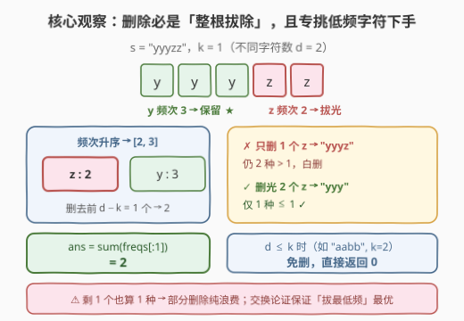
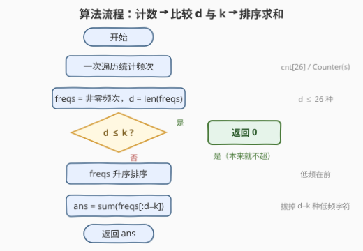

# LeetCode 不同字符数量最多为K时的最少删除数 题解

## 1. 题目概述

- **标题 / 题号**：不同字符数量最多为K时的最少删除数（#3545，easy）
- **链接**：https://leetcode.cn/problems/minimum-deletions-for-at-most-k-distinct-characters/
- **难度**：简单
- **标签**：贪心, 哈希表, 字符串, 计数, 排序

**题意**：给你一个字符串 `s`（由小写英文字母组成）和一个整数 `k`。你的任务是删除字符串中的一些字符（可以不删除任何字符），使得结果字符串中的**不同字符数量**最多为 `k`。返回为达到上述目标所需删除的**最小**字符数量。

**示例 1**：

```text
输入：s = "abc", k = 2
输出：1
解释：s 有三个不同字符 'a'、'b'、'c'，每个字符的出现频率为 1。
     由于最多只能有 k = 2 个不同字符，需要删除某一个字符的所有出现。
     例如删除所有 'c' 后，不同字符数最多为 k。因此答案是 1。
```

**示例 2**：

```text
输入：s = "aabb", k = 2
输出：0
解释：s 有两个不同字符 'a' 和 'b'，频率分别为 2 和 2。
     由于最多可以有 k = 2 个不同字符，不需要删除任何字符。
```

**示例 3**：

```text
输入：s = "yyyzz", k = 1
输出：2
解释：s 有两个不同字符 'y' 和 'z'，频率分别为 3 和 2。
     由于最多只能有 k = 1 个不同字符，删除所有 'z'（2 个字符）即可。
```

**约束**：

- $1 \le s.length \le 16$
- $1 \le k \le 16$
- `s` 仅由小写英文字母组成

> 💡 **读题关键**：① 约束的是**种类数**而非长度——一个字符只要还剩**至少一个**，就仍占一个「不同字符」名额；② `k` 可以大于 `s` 的不同字符数（如 `k = 16` 覆盖一切），此时一个字符都不用删；③ 删除的代价按**个数**计，于是「删谁」的选择空间全在频次表上。

## 2. 解题思路

### 2.1 暴力思路：枚举「赶尽杀绝」的字符集合

$s.length \le 16$ 意味着不同字符数 $d \le 16$，可以**枚举要完全删除的字符子集** $S \subseteq \{s 的不同字符\}$：若剩余种类数 $d - |S| \le k$，代价为 $S$ 中所有字符频次之和，取最小。$2^{16} = 65536$ 个子集，每个 $O(d)$ 检查，总量不过百万级，完全跑得动。

但对一道简单题而言这是杀鸡用牛刀——本题有一步到位的**贪心结论**。

### 2.2 核心观察：整根拔除 + 拔最低频



三步观察层层递进：

**观察 1：部分删除无意义**。字符 `c` 若最终还剩 $\ge 1$ 个，它在「不同字符」口径下与剩 100 个**无异**——中途删掉的那几个纯属浪费。因此任何最优解中，删除都发生在「**整根拔除**」粒度上：要么不动这个字符，要么删光它。

**观察 2：恰拔 $d - k$ 种**。设不同字符数为 $d$。若 $d \le k$，答案为 0；否则必须让至少 $d - k$ 种字符完全消失。且**恰好拔 $d - k$ 种最优**——多拔一种只会多删字符，约束上没有任何额外收益。

**观察 3：拔频次最小的 $d - k$ 种**（交换论证）。若某方案拔了高频字符 $x$（频次 $f_x$）而留下低频字符 $y$（频次 $f_y < f_x$），把「拔 $x$」换成「拔 $y$」：约束照旧满足（消失的种类数不变），删除总数减少 $f_x - f_y > 0$。于是最优方案必是**频次升序排序后，前 $d - k$ 个频次之和**：

$$
ans = \begin{cases} 0 & d \le k \\[4pt] \displaystyle\sum_{i=0}^{d-k-1} freqs_{\text{升序}}[i] & d > k \end{cases}
$$

> 💡 一句话：**约束数种类、代价算个数**，两者口径错位正是贪心的切入点——用最少的「个数」代价换掉足够多的「种类」名额，自然挑频次最低的下手。

### 2.3 算法流程图



1. 一次遍历 `s`，统计频次（`cnt[26]` 或 `Counter`）；
2. 收集所有非零频次到列表 `freqs`，记 $d = len(freqs)$；
3. 若 $d \le k$，直接返回 0；
4. `freqs` 升序排序，返回前 $d - k$ 个之和。

### 2.4 示例演算

以三个官方示例走一遍（`d` 为不同字符数）：

| 示例 | s | k | 频次表 | d | 与 k 比较 | 升序 freqs | 删除 | 答案 |
|---|---|---|---|---|---|---|---|---|
| 1 | `abc` | 2 | a:1, b:1, c:1 | 3 | 3 > 2，拔 1 种 | [1, 1, 1] | 前 1 个 = 1 | **1** ✓ |
| 2 | `aabb` | 2 | a:2, b:2 | 2 | 2 ≤ 2，免删 | — | 0 | **0** ✓ |
| 3 | `yyyzz` | 1 | y:3, z:2 | 2 | 2 > 1，拔 1 种 | [2, 3] | 前 1 个 = 2 | **2** ✓ |

示例 3 中拔谁一目了然：`z` 频次 2 < `y` 频次 3，拔 `z` 代价最小——这正是「低频优先」的直观体现。

## 3. 参考代码

### C++

```cpp
class Solution {
  public:
    int minDeletion(string s, int k) {
        int cnt[26] = {0};
        for (char c : s) ++cnt[c - 'a'];

        vector<int> freqs;
        for (int f : cnt)
            if (f > 0) freqs.push_back(f);

        int d = freqs.size();
        if (d <= k) return 0;                 // 种类数本就不超，免删

        sort(freqs.begin(), freqs.end());     // 低频在前
        return accumulate(freqs.begin(), freqs.begin() + (d - k), 0);
    }
};
```

### Python

```python
class Solution:
    def minDeletion(self, s: str, k: int) -> int:
        freqs = sorted(Counter(s).values())
        d = len(freqs)
        return 0 if d <= k else sum(freqs[:d - k])
```

> 💡 Python 三行版：`sorted(Counter(s).values())` 天然只含非零频次，切片 `[:d - k]` 在 `d ≤ k` 时为空、`sum` 为 0——所以第 3 行甚至可以直接写 `return sum(freqs[:max(0, d - k)])`（`d < k` 时 `d - k` 为负，切片语义会出错，需 `max(0, ·)` 兜底，分支写法更稳）。

## 4. 复杂度分析

| 维度 | 复杂度 | 说明 |
|------|--------|------|
| 时间 | $O(n + \|\Sigma\| \log \|\Sigma\|)$ | 遍历计数 $O(n)$；至多 $\|\Sigma\| = 26$ 个频次参与排序，为常数 |
| 空间 | $O(\|\Sigma\|)$ | 频次表至多 26 项，与 $n$ 无关 |

## 5. 扩展：n ≤ 16 的位枚举对拍器

数据规模 $n \le 16$ 小到可以**穷举验证**贪心的正确性——面试中口述「我写个暴力对拍器自证」是加分项：

```python
from itertools import combinations
from collections import Counter

def brute(s: str, k: int) -> int:
    cnt = Counter(s)
    chars = list(cnt)
    best = len(s)                       # 上界：全删
    # 枚举保留 r 种字符（0 <= r <= min(k, d)）
    for r in range(0, min(k, len(chars)) + 1):
        for keep in combinations(chars, r):
            best = min(best, len(s) - sum(cnt[c] for c in keep))
    return best
```

对所有长度 $\le 16$ 的随机小写串与 $k \in [1, 16]$ 对拍，可确认贪心与穷举结果一致（交换论证在数学上已经保证了这一点，对拍只是工程自证）。

**变体思考**：若把「删除任意位置的字符」改成「删除一个连续子串」，贪心立即失效——频次表不再充分，需要滑窗找「窗口外不同字符数 $\le k$ 且窗口最短」的最优窗口，属于另一套做法。

## 6. 面试要点

- **Q1：为什么删除一定是「整根拔除」，而不是每种字符删一部分？**
  答：约束按**种类数**计——字符只要剩 1 个就仍占一个名额。部分删除既花了删除个数、又没减种类数，是纯浪费。所以最优解里每种字符要么不动、要么删光。
- **Q2：为什么恰好拔 $d - k$ 种，而不是更多？**
  答：拔够 $d - k$ 种后约束已满足，多拔一种只会额外增加该字符全部频次的删除量，没有任何收益，故恰好 $d - k$ 种最优。
- **Q3：为什么拔频次最低的？请给出证明思路。**
  答：交换论证。设最优方案拔了高频字符 $x$ 而留下低频字符 $y$（$f_y < f_x$），把拔 $x$ 换成拔 $y$：消失种类数不变（约束仍满足），删除总数减少 $f_x - f_y$，矛盾于「最优」。故最优方案拔的必是频次最小的 $d - k$ 种。
- **Q4：`k` 很大（如 $k = 16$）或 $k \ge d$ 时会怎样？**
  答：不同字符数 $d \le 26$ 且受 $n \le 16$ 限制实际 $d \le 16$，$k \ge d$ 时约束天然满足，返回 0。代码里就是 `d <= k` 的分支，`k` 再大也不会越界（不会出现负数删除数）。
- **Q5：这题数据规模这么小（$n \le 16$），考的到底是什么？**
  答：考**建模与证明**，不是复杂度。能否发现「种类 vs 个数」的口径错位、能否用交换论证说清「低频优先」，才是面试官想听的东西；位枚举暴力反而是保底方案。

## 同类练习题

| # | 题目 | 与本题的关联 |
|---|------|-------------|
| 1647 | [字符频次唯一的最小删除次数](https://leetcode.cn/problems/minimum-deletions-to-make-character-frequencies-unique/) | 同款「频次统计 + 贪心删除」骨架，但约束在「频次互不相同」上，需要更细的调整 |
| 3016 | [输入单词需要的最少按键次数 II](https://leetcode.cn/problems/minimum-number-of-pushes-to-type-word-ii/) | 按频次降序贪心分配最优位置——同样吃透「按频次排序后分配」的思想 |
| 2423 | [删除字符使频率相同](https://leetcode.cn/problems/remove-letter-to-equalize-frequency/) | 频次统计 + 分类讨论的小型变体，注意「频次为 0 不算存在」 |
| 2287 | [重排字符形成目标字符串](https://leetcode.cn/problems/rearrange-characters-to-make-target-string/) | 频次上限取 min 的计数应用，巩固 `cnt[26]` 模板 |
| 3541 | [找到频率最高的元音和辅音](https://leetcode.cn/problems/find-most-frequent-vowel-and-consonant/)（[题解](../3501-3600/3541_找到频率最高的元音和辅音.md)） | 同仓库的频次计数姐妹篇，对照着看「分组取最值」与「低频拔除」两种频次表用法 |
