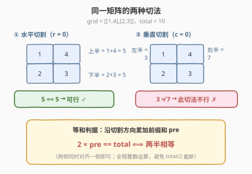
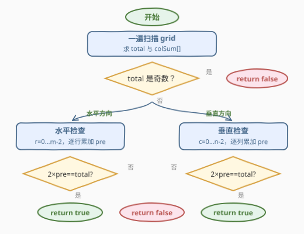

# 等和矩阵分割 I

- **题目名称**：等和矩阵分割 I
- **链接**：[3546. 等和矩阵分割 I](https://leetcode.cn/problems/equal-sum-grid-partition-i/)
- **难度**：中等
- **标签**：数组, 前缀和, 矩阵, 枚举

## 1. 题目概述

给你一个由正整数组成的 `m x n` 矩阵 `grid`。你的任务是判断是否可以通过**一条水平或一条垂直分割线**将矩阵分割成两部分，使得：

- 分割后形成的每个部分都是**非空**的；
- 两个部分中所有元素的和**相等**。

如果存在这样的分割，返回 `true`；否则，返回 `false`。

**示例 1**：

```text
输入：grid = [[1,4],[2,3]]
输出：true
解释：在第 0 行和第 1 行之间进行水平分割，得到两个非空部分，
     每部分的元素之和为 5。因此，答案是 true。
```

**示例 2**：

```text
输入：grid = [[1,3],[2,4]]
输出：false
解释：无论是水平分割还是垂直分割，都无法使两个非空部分的元素之和相等。
```

**约束条件**：

- $1 \le m = grid.length \le 10^5$
- $1 \le n = grid[i].length \le 10^5$
- $2 \le m \cdot n \le 10^5$
- $1 \le grid[i][j] \le 10^5$

> 💡 **读题关键**：三个容易忽略的细节——① $m$、$n$ **各自**都可以到 $10^5$，但乘积 $m \cdot n \le 10^5$，因此 $O(mn)$ 的算法完全可行，别被 $10^5 \times 10^5$ 吓到；② 分割线必须切在**内部**（第 $r$ 行与第 $r+1$ 行之间，$0 \le r \le m-2$），切在边界会产生空部分，$m=1$ 时水平切割天然不存在；③ 总和上界 $m \cdot n \times \max(grid) = 10^5 \times 10^5 = 10^{10}$，**超出 32 位整数范围**，C++/Java 必须用 64 位类型。

---

## 2. 解题思路

### 2.1 暴力思路：逐条切割线重算两侧和

最直接的做法：枚举全部 $m-1$ 条水平切割线与 $n-1$ 条垂直切割线，对每条线分别累加两侧的元素和再比较。单次求和 $O(mn)$，总复杂度 $O\big((m+n) \cdot mn\big)$。在本题规模下（$mn \le 10^5$，切割线最多约 $2 \times 10^5$ 条）最坏要算 $2 \times 10^{10}$ 次加法，**必然超时**。

问题出在**重复劳动**：切割线从上往下移动时，上一侧的和只需「加上新扫过的一行」，根本不必从头重算。

### 2.2 核心观察：前缀和 + 等式变形



两个观察把问题化到线性：

- **等式变形**：设切割线一侧的和为 $pre$，另一侧自动为 $total - pre$。「两半相等」等价于
  $$2 \times pre = total$$
  只需追踪**一侧**的前缀和即可，且用 $2 \times pre$ 与 $total$ 比较，全程整数运算——**不要写 $pre = total / 2$**，`total` 为奇数时整除截断会误判（如 `total = 5`、`pre = 2` 时 `5 / 2 == 2` 恰好相等，返回错误的 `true`）。

- **方向独立**：水平切割只关心**行和**序列的前缀和，垂直切割只关心**列和**序列的前缀和。预处理 `rowSum[i]`、`colSum[j]` 后，两轮线性扫描即可覆盖所有切割位置。

于是一遍扫描矩阵求出 `total` 与 `colSum[]`，再分别沿行、沿列累加前缀和，出现 $2 \times pre = total$ 即返回 `true`。

### 2.3 算法流程图



1. 一遍扫描 `grid`，累加总和 `total`，同时维护每列的和 `colSum[]`；
2. （可选剪枝）若 `total` 为奇数，直接返回 `false`——两半相等意味着 $total = 2 \times$ 半边和，必为偶数；
3. **水平检查**：`pre` 从第 0 行起逐行累加行和，每加完一行（$r \le m-2$）判一次 $2 \times pre = total$；
4. **垂直检查**：`pre` 复位后逐列累加 `colSum[c]`（$c \le n-2$），同样判 $2 \times pre = total$；
5. 两轮都未命中，返回 `false`。

### 2.4 示例演算

**示例 1**（`grid = [[1,4],[2,3]]`）：

| 方向 | 前缀累加过程 | 判定 |
|---|---|---|
| 水平 | rowSum = [5, 5]，total = 10；r=0 后 pre = 5 | $2 \times 5 = 10$ ✓ 命中 → **true** |

**示例 2**（`grid = [[1,3],[2,4]]`）：

| 方向 | 前缀累加过程 | 判定 |
|---|---|---|
| 水平 | rowSum = [4, 6]，total = 10；r=0 后 pre = 4 | $2 \times 4 = 8 \ne 10$ ✗ |
| 垂直 | colSum = [3, 7]；c=0 后 pre = 3 | $2 \times 3 = 6 \ne 10$ ✗ |

两轮全部落空 → **false** ✓（与官方答案一致）。

---

## 3. 参考代码

### C++

```cpp
class Solution {
  public:
    bool canPartitionGrid(vector<vector<int>>& grid) {
        int m = grid.size(), n = grid[0].size();
        long long total = 0;                  // 总和最大 1e10，必须 long long
        vector<long long> colSum(n, 0);
        for (int i = 0; i < m; ++i)
            for (int j = 0; j < n; ++j) {
                total += grid[i][j];
                colSum[j] += grid[i][j];
            }

        long long pre = 0;                    // 水平：切割线在第 r 行下方，r = 0..m-2
        for (int i = 0; i + 1 < m; ++i) {
            for (int j = 0; j < n; ++j) pre += grid[i][j];
            if (2 * pre == total) return true;
        }
        pre = 0;                              // 垂直：切割线在第 c 列右侧，c = 0..n-2
        for (int j = 0; j + 1 < n; ++j) {
            pre += colSum[j];                 // 复用列和，每步 O(1)
            if (2 * pre == total) return true;
        }
        return false;
    }
};
```

### Python

```python
class Solution:
    def canPartitionGrid(self, grid: List[List[int]]) -> bool:
        m, n = len(grid), len(grid[0])
        row_sum = [sum(row) for row in grid]
        col_sum = [sum(col) for col in zip(*grid)]
        total = sum(row_sum)

        pre = 0
        for i in range(m - 1):            # 水平切割线在第 i 行下方
            pre += row_sum[i]
            if 2 * pre == total:
                return True

        pre = 0
        for j in range(n - 1):            # 垂直切割线在第 j 列右侧
            pre += col_sum[j]
            if 2 * pre == total:
                return True
        return False
```

> 💡 两处细节：`range(m - 1)` 上界天然排除了切在边界的非法分割，$m=1$ 时循环体不执行，**无需特判**；C++ 版水平检查直接累加 `grid[i][j]` 而非先建 `rowSum`，一趟扫描同时喂饱 `total` 与 `colSum`，垂直检查就能 $O(1)$ 步进。

---

## 4. 复杂度分析

| 维度 | 复杂度 | 说明 |
|------|--------|------|
| 时间 | $O(m \cdot n)$ | 一遍扫描求 `total` 与 `colSum` $O(mn)$；行、列前缀各线性扫 $O(m + n)$ |
| 空间 | $O(n)$ | 列和数组 `colSum`（Python 版另存 `row_sum` 为 $O(m)$，均可改为流式累加省掉） |

---

## 5. 扩展：奇偶剪枝与流式单趟写法

**奇偶剪枝**：两半和相等 $\Rightarrow total = 2 \times$ 半边和，必为偶数。求出 `total` 后先判 `total % 2 != 0` 即可直接返回 `false`，省掉两轮前缀扫描。对本题属于常数级优化，但「**从等式结构反推奇偶性**」的思路在分割类问题中很常用。

**流式写法**：连 `colSum` 数组都可以不建——垂直检查时逐列现算（内层循环按列累加）即可把空间压到 $O(1)$，代价是矩阵按行存储时列访问缓存不友好，实测通常**得不偿失**。工程上保留 $O(n)$ 的列和数组换取顺序访问，是更优的取舍。

**进阶预告**：[3548. 等和矩阵分割 II](https://leetcode.cn/problems/equal-sum-grid-partition-ii/) 允许在分割前**移除一个格子**。届时两侧的和不再只由前缀和决定，还需要维护「已扫过区域中角点/可删除候选的集合」来枚举删哪个格子——前缀和骨架不变，细节复杂度上一个台阶。

---

## 6. 面试要点

- **Q1：为什么判据写 `2 * pre == total` 而不是 `pre == total / 2`？**
  答：整数除法会截断。`total = 5`、`pre = 2` 时 `total / 2 == 2` 恰好相等，会误判成可行分割。乘法形式 `2 * pre == total` 全程精确，还省去先判奇偶的分支。
- **Q2：C++ 为什么要用 `long long`？**
  答：$m \cdot n \le 10^5$ 且 $grid[i][j] \le 10^5$，总和上界 $10^{10}$，超出 `int`（约 $2.1 \times 10^9$）范围。行/列前缀和与 `total` 同阶，都要用 64 位。
- **Q3：`m == 1`（单行矩阵）时怎么处理？**
  答：无需特判。水平切割线必须落在两行之间，`range(m - 1)` 为空循环，水平检查自动跳过，只剩垂直检查——代码结构天然表达了「非空部分」约束。
- **Q4：为什么垂直检查要先预处理 `colSum`？**
  答：矩阵按行存储，按列随机访问缓存不友好。一遍扫描时顺手累加 `colSum[j]`，之后垂直方向的前缀推进就是 $O(1)$ 步进，总复杂度严格 $O(mn)$。
- **Q5：本题暴力为什么超时、正解为什么快？**
  答：暴力对每条切割线重算两侧和，$O((m+n) \cdot mn)$ 约 $2 \times 10^{10}$；前缀和把「每条线两侧的和」变成「序列前缀和」，所有切割位置的答案一趟扫出，$O(mn)$。这是前缀和最经典的用法：**用增量代替重算**。

---

## 7. 同类练习题

- [3548. 等和矩阵分割 II](https://leetcode.cn/problems/equal-sum-grid-partition-ii/)：本题续作，允许移除一个格子后再分割，前缀和骨架上的进阶版
- [724. 寻找数组的中心下标](https://leetcode.cn/problems/find-pivot-index/)：一维同款判据「左和 == 总和 - 左和 - 自身」，前缀和找分割点
- [1991. 找到数组的中间位置](https://leetcode.cn/problems/find-the-middle-index-in-array/)：与 724 完全同构的换皮题，适合练手速
- [2485. 找出中枢整数](https://leetcode.cn/problems/find-the-pivot-integer/)：在 $1..n$ 自然数上找等和分割点，前缀和的数学化版本
- [303. 区域和检索 - 数组不可变](https://leetcode.cn/problems/range-sum-query-immutable/)：前缀和的模板题，掌握「增量代替重算」的源头
