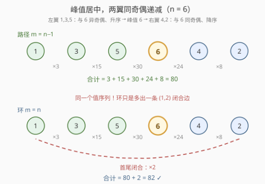
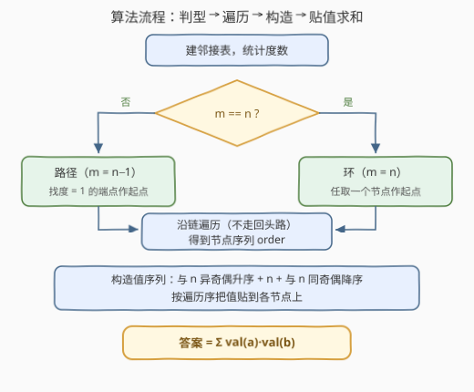

# LeetCode 图中边值的最大和 题解

## 1. 题目概述

- **标题 / 题号**：图中边值的最大和（#3547，hard）
- **链接**：https://leetcode.cn/problems/maximum-sum-of-edge-values-in-a-graph/
- **难度**：困难
- **标签**：贪心、图、数学

**题意**：给你一个包含 $n$ 个节点的**无向连通图**，节点按 $0$ 到 $n-1$ 编号，**每个节点最多与其他两个节点相连**。图中包含 $m$ 条边，用二维数组 `edges` 表示，`edges[i] = [ai, bi]` 表示节点 $a_i$ 与 $b_i$ 之间有一条边。

你需要为每个节点分配一个从 $1$ 到 $n$ 的**唯一**值。**边的值**定义为其两端节点值的**乘积**，你的得分是所有边值的总和。返回可以获得的**最大**得分。

**示例 1**（路径）：

```text
输入：n = 4, edges = [[0,1],[1,2],[2,3]]
输出：23
解释：链 0-1-2-3 依次分配 1,3,4,2，边值总和 = (1×3) + (3×4) + (4×2) = 23。
```

**示例 2**（环）：

```text
输入：n = 6, edges = [[0,3],[4,5],[2,0],[1,3],[2,4],[1,5]]
输出：82
解释：环 0-2-4-5-1-3-0 上分配 1,3,5,6,4,2，
      边值总和 = (1×2) + (2×4) + (4×6) + (6×5) + (5×3) + (3×1) = 82。
```

**约束**：

- $1 \le n \le 5 \times 10^4$
- $m = \text{edges.length}$，$1 \le m \le n$
- $0 \le a_i, b_i < n$，$a_i \ne b_i$，无重复边
- 图连通，每个节点最多与其他两个节点相连

> 💡 **读题关键**：
> ① 「连通 + 每个节点度数 $\le 2$」⟹ 图只能是一条**路径**或一个**环**（官方提示 1 也点明了），这是全部推理的起点；
> ② 由握手定理 $2m = \sum \deg \le 2n$ 且连通图 $m \ge n-1$，得 $m \in \{n-1,\ n\}$——**用边数一秒判型**：$m = n-1$ 是路径，$m = n$ 是环；
> ③ $n$ 可达 $5 \times 10^4$，答案量级约 $\frac{n^3}{3} \approx 4 \times 10^{14}$，**必须用 64 位整数**累加。

## 2. 解题思路

### 2.1 暴力思路：枚举全排列

给 $n$ 个节点枚举 $1 \dots n$ 的全部排列，逐排列计算边积和取最大。复杂度 $O(n!)$，$n > 10$ 即彻底不可行。这类「排列优化」问题的正解通常不是搜索，而是先看清**结构**、再直接**构造**最优排列。

### 2.2 核心观察：峰值居中，两翼同奇偶递减



**观察一：图是路径或环，问题坍缩为「排一条序列」。**
把节点沿链遍历成一列，得分就是**相邻乘积之和**（环再额外加一条首尾乘积）。于是原题等价于：把 $1 \dots n$ 排成一列，使相邻乘积之和最大。

**观察二：大值必须「扎堆」。**
把得分按节点改写：

$$\sum_{\text{边}(u,v)} val(u)\cdot val(v) = \frac{1}{2}\sum_{u} val(u)\cdot\big(\text{邻居值之和}\big)$$

每个值能赚多少，取决于它与谁相邻。值 $n$ 的「出场费」最贵，让它旁边坐着小值是巨大浪费；反过来，值 $1$ 的对端是谁几乎无所谓（乘出来都小）。直觉非常明确：**大值聚成一团互相乘，小值被推到边缘互相「抵消」**。

**观察三：峰值 $n$ 的两个邻居是 $n-1$ 和 $n-2$，两翼各拉一条「同奇偶」递减链。**
给 $n$ 安排最贵的两个对端 $n-1$、$n-2$；此后 $n-1$ 还剩一个空位，最贵的可用对端是 $n-3$；$n-2$ 的另一个空位给 $n-4$……两翼各自**每步减 2** 递减，链尾自然剩下 $1$ 和 $2$。

为什么每步减 2（跳奇偶）而不是连续递减？做个**局部四边对比**（以 $n \ge 4$ 为例）：

- **跳奇偶结构**：$\cdots - (n{-}3) - (n{-}1) - n - (n{-}2) - (n{-}4) - \cdots$，四条边之和为 $4n^2 - 13n + 11$；
- **连续递减结构**：$\cdots - (n{-}4) - (n{-}2) - (n{-}1) - n - (n{-}3) - \cdots$，四条边之和为 $4n^2 - 14n + 14$。

两者之差 $n - 3 > 0$：跳奇偶严格占优。直观上，$n-1$ 和 $n-2$ 都想贴着 $n$，若它们彼此相邻，只能「共享」一次乘积；分开则各自再带一个较大的伙伴，两边同时吃到乘积增量。

**统一构造**（对路径和环同时成立）：把值排成

$$\underbrace{1,\ 3,\ 5,\ \cdots}_{\text{与 } n \text{ 异奇偶，升序}}\quad \boxed{n}\quad \underbrace{\cdots,\ 6,\ 4,\ 2}_{\text{与 } n \text{ 同奇偶，降序}}$$

- **路径**：沿链依次贴上这个序列，两端恰好是 $1$ 和 $2$；
- **环**：同样贴上，首尾的 $1$、$2$ 自动相邻——环只比路径**多出一条值为 $1 \times 2$ 的闭合边**。

> 💡 上述直觉可以用交换论证严格化（任何「大值旁边坐着小值」的排法都能通过交换变优），完整证明较繁琐；实践中「直觉构造 + 小规模对拍」是竞赛标准自信来源。本构造已用 $n \le 8$ 的全排列暴力验证：路径与环的全部结果与构造值完全一致。

### 2.3 算法流程图



四步走，全程线性：

1. **建邻接表**，用 $m = n$ 还是 $m = n-1$ 判环 / 路径；
2. **定起点**：环任取节点 $0$；路径找度数为 $1$ 的端点，然后沿链「不走回头路」遍历得到节点序列 `order`；
3. **构造值序列**：与 $n$ 异奇偶的升序 + 峰值 $n$ + 与 $n$ 同奇偶的降序；
4. **按序贴值**，遍历 `edges` 累加两端乘积。

> ⚠️ 遍历**不需要 visited 数组**：度 $\le 2$ 保证「除来路外」的出边唯一（端点只有来路一条边），用一个 `prev` 变量一路跟随即可，环上最后一步自然回到起点。

### 2.4 示例演算

以示例 2（环）为例。邻接表：$0:\{3,2\}$，$1:\{3,5\}$，$2:\{0,4\}$，$3:\{0,1\}$，$4:\{5,2\}$，$5:\{4,1\}$，环序为 $0-2-4-5-1-3-0$。

$n = 6$ 为偶数，值序列 = 异奇偶（奇数）升序 $[1,3,5]$ + 峰值 $[6]$ + 同奇偶（偶数）降序 $[4,2]$：

| 遍历位置 | 0 | 2 | 4 | 5 | 1 | 3 |
|---------|---|---|---|---|---|---|
| 贴上的值 | 1 | 3 | 5 | 6 | 4 | 2 |

逐边计算：$(0,3)=1 \times 2=2$，$(4,5)=5 \times 6=30$，$(2,0)=3 \times 1=3$，$(1,3)=4 \times 2=8$，$(2,4)=3 \times 5=15$，$(1,5)=4 \times 6=24$，合计 $2+30+3+8+15+24=82$ ✓

示例 1（路径）：链 $0-1-2-3$ 贴值 $[1,3,4,2]$，$1 \times 3 + 3 \times 4 + 4 \times 2 = 3+12+8 = 23$ ✓

## 3. 参考代码

### C++

```cpp
class Solution {
  public:
    long long maxScore(int n, vector<vector<int>>& edges) {
        vector<vector<int>> adj(n);
        for (auto& e : edges) {
            adj[e[0]].push_back(e[1]);
            adj[e[1]].push_back(e[0]);
        }

        // 1) 判型定起点：m == n 为环（任取 0）；否则为路径（取度 1 的端点）
        int start = 0;
        if ((int)edges.size() != n)
            while (adj[start].size() != 1) start++;

        // 2) 沿链遍历，不走回头路
        vector<int> order;
        order.reserve(n);
        int prev = -1, cur = start;
        for (int i = 0; i < n; i++) {
            order.push_back(cur);
            for (int nxt : adj[cur])
                if (nxt != prev) {
                    prev = cur;
                    cur = nxt;
                    break;
                }
        }

        // 3) 构造值序列：与 n 异奇偶升序 + n + 与 n 同奇偶降序
        vector<long long> val(n);
        int idx = 0;
        for (int v = (n % 2 == 0 ? 1 : 2); v < n; v += 2) val[order[idx++]] = v;
        val[order[idx++]] = n;
        for (int v = n - 2; v >= 1; v -= 2) val[order[idx++]] = v;

        // 4) 统计边积和
        long long ans = 0;
        for (auto& e : edges) ans += val[e[0]] * val[e[1]];
        return ans;
    }
};
```

### Python

```python
class Solution:
    def maxScore(self, n: int, edges: List[List[int]]) -> int:
        adj = [[] for _ in range(n)]
        for a, b in edges:
            adj[a].append(b)
            adj[b].append(a)

        # 1) 判型定起点：m == n 为环（任取 0）；否则为路径（取度 1 的端点）
        start = 0
        if len(edges) != n:
            start = next(i for i in range(n) if len(adj[i]) == 1)

        # 2) 沿链遍历，不走回头路
        order, prev, cur = [], -1, start
        for _ in range(n):
            order.append(cur)
            for nxt in adj[cur]:
                if nxt != prev:
                    prev, cur = cur, nxt
                    break

        # 3) 值序列：与 n 异奇偶升序 + n + 与 n 同奇偶降序
        vals = list(range(2 if n % 2 else 1, n, 2)) + [n] + list(range(n - 2, 0, -2))

        # 4) 按序贴值，统计边积和
        val = [0] * n
        for node, v in zip(order, vals):
            val[node] = v
        return sum(val[a] * val[b] for a, b in edges)
```

> 💡 **写法要点**：
> - 值序列一行构造：`range(2 if n % 2 else 1, n, 2)` 取与 $n$ 异奇偶的一半（升序），`range(n-2, 0, -2)` 取与 $n$ 同奇偶的一半（降序），中间拼峰值 $n$——注意 $n$ 偶数时左翼是奇数 $1,3,\dots$，$n$ 奇数时左翼是偶数 $2,4,\dots$；
> - 贴值方向无关紧要：路径两端的贴值互换、环从任意起点开始，都只产生旋转 / 镜像对称的等价解；
> - 累加器必须 64 位（C++ `long long`），Python 天然大整数无此顾虑。

## 4. 复杂度分析

| 维度 | 复杂度 | 说明 |
|------|--------|------|
| 时间复杂度 | $O(n + m)$ | 建图、判型、遍历、构造、求和各一趟，$m \le n$ 故即 $O(n)$ |
| 空间复杂度 | $O(n)$ | 邻接表 + 节点序列 + 值数组 |
| 预处理 | 无 | 无需排序（值序列由奇偶性直接生成），无需 visited |

> ⚠️ 对照暴力的 $O(n!)$：优化不来自数据结构，而来自**结构洞察**——「度 $\le 2$ 的连通图 = 路径或环」把图问题坍缩成排列问题，再用「峰值居中、两翼同奇偶递减」一步构造出最优排列。

## 5. 扩展：闭式验算

构造出的边集有清晰的结构：两翼内部的边全是**差 2 对** $(k, k+2)$，外加峰值对 $(n-1, n)$ 与闭合边 $(1, 2)$（环）。利用

$$\sum_{k=1}^{m} k(k+2) = \sum_{k=1}^{m} k^2 + 2\sum_{k=1}^{m} k = \frac{m(m+1)(2m+7)}{6}$$

可以写出环得分的闭式（按 $n$ 的奇偶分两种情形，两翼的「差 2 对」各占一半）：

$$\text{环} = \begin{cases} \dfrac{(n-2)(n-1)(2n+3)}{6} + n(n-1) + 2, & n \text{ 为偶数} \\[2ex] \dfrac{(n-3)(n-2)(2n+1)}{6} + n(n-1) + n(n-2) + 2, & n \text{ 为奇数} \end{cases}$$

路径得分 = 环得分 $- 2$（少一条 $1 \times 2$ 闭合边）。验算：$n=4$ 环 $11+12+2=25$、路径 $23$ ✓；$n=5$ 环 $11+20+15+2=48$ ✓；$n=6$ 环 $50+30+2=82$ ✓；$n=7$ 环 $50+42+35+2=129$ ✓。

> 💡 写代码时**直接构造求和更稳**——闭式仅适合对拍验算，手推时极易把 $2m+7$ 误写成 $2m+3$（本文就踩过这个坑）。

## 6. 面试要点

1. **为什么图一定是路径或环？**

   > 连通图 $m \ge n-1$；握手定理 $2m = \sum \deg \le 2n$ 得 $m \le n$。故 $m \in \{n-1, n\}$：$m = n-1$ 时是树，而树中所有度 $\le 2$ 只能是路径；$m = n$ 时度数总和打满 $2n$，所有点度恰为 2，是环。判型只需比较 $m$ 与 $n$，连度数都不用数。

2. **为什么把最大的值放在「中间」而不是端点？**

   > 得分 $= \frac12\sum_u val(u) \times (\text{邻居和})$。中间节点参与 2 条边，端点只参与 1 条；值 $n$ 的出场费最贵，放端点等于浪费它最贵的一次出场。最优解中 $n$ 一定在中间，两翼递减。

3. **两翼为什么「跳奇偶」递减，而不是连续递减？**

   > 局部四边对比：跳奇偶 $4n^2-13n+11$ vs 连续 $4n^2-14n+14$，差 $n-3>0$。直观理由：$n-1$、$n-2$ 若彼此相邻只能共享一次乘积，分开在 $n$ 两侧则各自再带一个较大伙伴，两翼同时吃到增量。

4. **环和路径为什么能共用一套代码？差在哪？**

   > 值序列完全相同；唯一区别是环的首尾 $1$、$2$ 也连成一条边，多赚 $1 \times 2 = 2$ 分。代码里只有「判型 + 定起点」一个 if 的差异，其余逻辑完全一致。

5. **有哪些边界与溢出坑？**

   > ① $n = 2$ 时 $m = 1$，是路径，答案 $1 \times 2 = 2$；由于无重复边，$n = 2$ 的环不存在；② $n = 5\times10^4$ 时总分约 $\frac{n^3}{3} \approx 4\times10^{14}$，C++ 必须用 `long long` 累加；③ 遍历不需要 visited，但路径终点的「下一步」不存在——靠固定 $n$ 次循环 + 不走回头路自然终止。

> 💡 **一句话总结**：3547 = **结构坍缩 + 贪心构造**——度 $\le 2$ 的连通图必为路径或环，把问题坍缩成「排一条序列」；最优排列是「峰值居中、两翼同奇偶递减」，环比路径恰好多一条 $1 \times 2$ 的闭合边，线性扫描四步收工。

## 同类练习题

| # | 题目 | 与本题的关联 |
|---|------|-------------|
| 670 | [最大交换](https://leetcode.cn/problems/maximum-swap/)（[题解](../0601-0700/670_最大交换.md)） | 交换论证入门——证明「怎么换只会更优」的最小案例，体会本题贪心直觉的严格化基础 |
| 213 | [打家劫舍 II](https://leetcode.cn/problems/house-robber-ii/)（[题解](../0201-0300/213_打家劫舍II.md)） | 环结构上的经典处理（拆环为链），与本题「环只比路径多一条边」的视角相通 |
| 2542 | [最大子序列的分数](https://leetcode.cn/problems/maximum-subsequence-score/)（[题解](../2501-2600/2542_最大子序列的分数.md)） | 排序 + 贪心配对，「让大的配大的」在另一类问题中的实现 |
| 179 | [最大数](https://leetcode.cn/problems/largest-number/) | 排列型贪心 + 交换论证确定相邻次序，与「构造最优排列」同宗 |
| 2603 | [收集树中金币](https://leetcode.cn/problems/collect-coins-in-a-tree/) | 利用度数剥叶子确定图可用结构的拓扑思维，与本题「用度数判型找端点」互相印证 |
