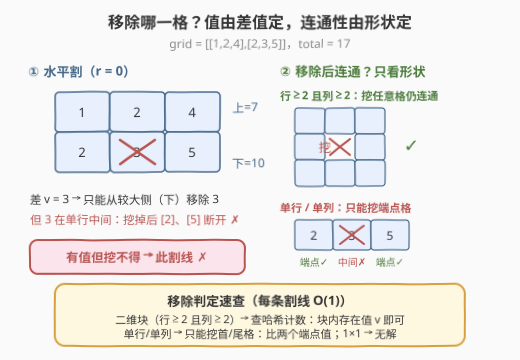
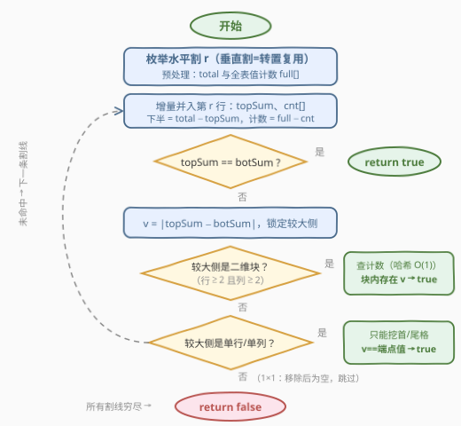

# 等和矩阵分割 II

- **题目名称**：等和矩阵分割 II
- **链接**：[3548. 等和矩阵分割 II](https://leetcode.cn/problems/equal-sum-grid-partition-ii/)
- **难度**：困难
- **标签**：数组, 哈希表, 枚举, 矩阵, 前缀和

## 1. 题目概述

给你一个由正整数组成的 `m x n` 矩阵 `grid`。你的任务是判断是否可以通过**一条水平或一条垂直分割线**将矩阵分割成两部分，使得：

- 分割后形成的每个部分都是**非空**的；
- 两个部分中所有元素的和**相等**，或者**总共最多移除一个单元格**（从其中一个部分中）的情况下可以使它们相等；
- 如果移除某个单元格，**剩余部分必须保持连通**（部分中每个单元格都能通过上下左右移动到达同部分的其它单元格）。

如果存在这样的分割，返回 `true`；否则返回 `false`。

**示例 1**：

```text
输入：grid = [[1,4],[2,3]]
输出：true
解释：第 0 行下方水平分割，两部分的和分别为 5 和 5，相等。
```

**示例 2**：

```text
输入：grid = [[1,2],[3,4]]
输出：true
解释：第 0 列右侧垂直分割，左右两部分的和为 4 和 6；
     从右侧移除 2（6 − 2 = 4）后相等，且右侧剩余部分连通。
```

**示例 3**：

```text
输入：grid = [[1,2,4],[2,3,5]]
输出：false
解释：水平分割后两部分的和为 7 和 10，从底部移除 3 虽能使和相等，
     但底部断成 [2] 和 [5] 两截，不再连通。
```

**示例 4**：

```text
输入：grid = [[4,1,8],[3,2,6]]
输出：false
解释：不存在任何（含至多移除一格的）有效分割。
```

**约束条件**：

- $1 \le m = grid.length \le 10^5$
- $1 \le n = grid[i].length \le 10^5$
- $2 \le m \cdot n \le 10^5$
- $1 \le grid[i][j] \le 10^5$

> 💡 **读题关键**：与 [3546. 等和矩阵分割 I](https://leetcode.cn/problems/equal-sum-grid-partition-i/) 相比只多了一句话——「最多移除一个单元格，且移除后剩余部分须连通」。四个坑要提前看到：① $m$、$n$ **各自**可到 $10^5$（极端情况是 $1 \times 10^5$ 的长条），单行/单列不是边角料而是常态，连通性讨论必须覆盖；② 总和上界 $10^5 \times 10^5 = 10^{10}$，C++ 必须 `long long`；③ 移除**不是自由枚举**——两侧差值唯一确定了「从哪一侧移除、移除的值是多少」；④ 连通性约束落在**被移除的那一侧**，另一侧是完整矩形天然连通。

---

## 2. 解题思路

### 2.1 暴力思路：逐割线、逐格子、逐次 BFS

最直接的做法：枚举全部 $m-1$ 条水平割线与 $n-1$ 条垂直割线，对每条割线：

1. 累加两侧的和，判直接相等；
2. 不等时，枚举较大一侧的**每个格子**，若其值恰为两侧差值 $v$，再 BFS 一遍判断挖掉它后该侧是否连通。

单条割线就要 $O(mn)$ 个候选 × 每次 BFS $O(mn)$，再乘上 $O(m+n)$ 条割线，总量至少 $10^{10}$ 级别，必然超时。瓶颈有三：重复求和（前缀和可解，I 版已做）、逐格枚举移除候选、逐次 BFS 判连通——后两个正是本题的新功夫。

### 2.2 核心观察：移除值由差唯一确定，连通性由形状唯一确定



**观察一：移除候选不是「枚举」出来的，是「算」出来的。**
设割线两侧的和为 $S_A > S_B$，移除格子的值为 $w$：

- 从较大侧 $A$ 移除：$S_A - w = S_B \Rightarrow w = S_A - S_B$；
- 从较小侧 $B$ 移除：$S_B - w = S_A$ 需要 $w < 0$，不可能（元素为正）。

所以**只能从较大侧移除，且移除值唯一**：$w = v = |S_A - S_B|$。问题从「枚举 $O(mn)$ 个格子」坍缩成「较大侧**有没有**值为 $v$ 的格子」——哈希表 $O(1)$ 查询。（$v = 0$ 即直接相等，退化为 I 版。）

**观察二：连通性与「挖哪一格」无关，只由块的形状决定。**

- **行数 $\ge 2$ 且列数 $\ge 2$ 的矩形块**：挖掉**任意**一格仍连通。直观证明：被挖格 $(r,c)$ 把块分成至多四个矩形区域，而 $(r,c)$ 外围一圈「回」字边框把它们全部串起来——行、列都 $\ge 2$ 时这个边框永远存在（$2\times2$ 挖角剩 L 形；$2\times n$ 挖掉上排任意格，下排仍是完整通路）。结论：**只需查计数，无需关心具体位置**。
- **单行（$1 \times n$）或单列（$m \times 1$）块**：没有第二排可绕，挖中间格必拦腰截断；只有挖**端点格**（首格/尾格）不破坏剩余部分的连通。结论：**只需比较首尾两个格子的值**。
- **$1 \times 1$ 块**：挖掉唯一格子后该侧为空。且数学上也不可能成功——移除后该侧和为 $0$，另一侧恒为正。**直接跳过**。

**观察三：值计数沿割线增量维护。**
割线从上往下扫，上半的计数 `cnt` 逐行并入（每个格子恰好一次）；下半计数无需单独维护——**全表计数 `full` 减去 `cnt` 即是**。垂直割不必另写一套：把矩阵**转置**后复用同一套逻辑。

### 2.3 算法流程图



以水平割为例（垂直割转置后同构）：

1. 一遍扫描求 `total` 与全表值计数 `full`；
2. 割线 $r$ 从 $0$ 推进到 $m-2$：把第 $r$ 行并入 `topSum` 与 `cnt`；
3. `topSum == botSum` → 直接返回 `true`；
4. 否则 $v = |topSum - botSum|$，锁定**较大一侧**，按形状三分支判定：二维块查计数 / 单行单列比首尾端点 / $1\times1$ 跳过；
5. 全部割线（水平 + 转置后的垂直）穷尽仍无解 → `false`。

### 2.4 示例演算

**示例 3**（`grid = [[1,2,4],[2,3,5]]`，total = 17）：

| 割线 | 两侧和 | 移除判定 | 结果 |
|---|---|---|---|
| 水平 r=0 | 上 7 / 下 10 | $v=3$ 从下移；下侧是单行 `[2,3,5]`，端点 2、5 ≠ 3 | ✗ |
| 垂直 c=0 | 左 3 / 右 14 | $v=11$ 从右移；右块是二维，但值集 {2,3,4,5} 无 11 | ✗ |
| 垂直 c=1 | 左 8 / 右 9 | $v=1$ 从右移；右侧单列 `[4,5]`，端点 4、5 ≠ 1 | ✗ |

→ **false** ✓。水平割那条正是「值存在（有 3）但形状不允许（3 在单行中间）」的陷阱：**有解值 ≠ 可移除格**。

**示例 2**（`grid = [[1,2],[3,4]]`，total = 10）：

| 割线 | 两侧和 | 移除判定 | 结果 |
|---|---|---|---|
| 水平 r=0 | 上 3 / 下 7 | $v=4$ 从下移；下侧单行 `[3,4]`，尾格 = 4 ✓ | **true** |

（官方解是垂直割移除 2，殊途同归——只要任一割线可行即返回 `true`。）

---

## 3. 参考代码

### C++

```cpp
class Solution {
  public:
    bool canPartitionGrid(vector<vector<int>>& grid) {
        if (check(grid)) return true;
        int m = grid.size(), n = grid[0].size();
        vector<vector<int>> t(n, vector<int>(m));       // 转置后复用：垂直割
        for (int i = 0; i < m; ++i)
            for (int j = 0; j < n; ++j) t[j][i] = grid[i][j];
        return check(t);
    }
  private:
    bool check(vector<vector<int>>& g) {
        int m = g.size(), n = g[0].size();
        long long total = 0;
        vector<int> full(100001), cnt(100001);          // 值域 1e5，用计数数组
        for (auto& row : g)
            for (int x : row) { total += x; ++full[x]; }
        long long top = 0;
        for (int i = 0; i + 1 < m; ++i) {               // 割线在第 i 行下方
            for (int x : g[i]) { top += x; ++cnt[x]; }  // 增量并入上半
            long long bot = total - top;
            if (top == bot) return true;
            long long v = llabs(top - bot);             // 必须移除的值
            bool up = top > bot;                        // 只能从较大侧移除
            int rows = up ? i + 1 : m - 1 - i;          // 较大侧的行数
            if (rows >= 2 && n >= 2) {                  // 二维块：任一格可移
                if (v <= 100000 && (up ? cnt[v] : full[v] - cnt[v]) > 0)
                    return true;
            } else if (n >= 2) {                        // 单行：只能挖首/尾格
                int r = up ? 0 : m - 1;
                if (g[r][0] == v || g[r][n - 1] == v) return true;
            } else if (rows >= 2) {                     // 单列：只能挖首/尾格
                int r0 = up ? 0 : i + 1, r1 = up ? i : m - 1;
                if (g[r0][0] == v || g[r1][0] == v) return true;
            }                                           // 1×1：移除后为空，跳过
        }
        return false;
    }
};
```

### Python

```python
from collections import Counter

class Solution:
    def canPartitionGrid(self, grid: List[List[int]]) -> bool:
        def check(g: List[List[int]]) -> bool:
            m, n = len(g), len(g[0])
            total = sum(map(sum, g))
            full = Counter()
            for row in g:
                full.update(row)
            cnt, top = Counter(), 0            # 上半的值计数与和
            for i in range(m - 1):             # 割线在第 i 行下方
                cnt.update(g[i])
                top += sum(g[i])
                bot = total - top
                if top == bot:
                    return True
                v = abs(top - bot)             # 必须移除的值
                up = top > bot                 # 只能从较大侧移除
                rows = i + 1 if up else m - 1 - i
                if rows >= 2 and n >= 2:       # 二维块：查计数即可
                    if (cnt[v] if up else full[v] - cnt[v]) > 0:
                        return True
                elif n >= 2:                   # 单行：只能挖首/尾格
                    r = 0 if up else m - 1
                    if g[r][0] == v or g[r][n - 1] == v:
                        return True
                elif rows >= 2:                # 单列：只能挖首/尾格
                    r0, r1 = (0, i) if up else (i + 1, m - 1)
                    if g[r0][0] == v or g[r1][0] == v:
                        return True
                # 1×1：移除后为空，跳过
            return False

        if check(grid):
            return True
        return check([list(col) for col in zip(*grid)])   # 转置复用：垂直割
```

> 💡 两处易错点：① C++ 中 $v$ 的上界是 $10^{10}$，**用值域数组索引前必须先判 `v <= 100000`**，否则越界（Python 的 `Counter` 无此顾虑）；② 「单行/单列」的形状判断要落在**较大一侧**上——较小一侧根本不发生移除，形状无所谓。

---

## 4. 复杂度分析

| 维度 | 复杂度 | 说明 |
|------|--------|------|
| 时间 | $O(m \cdot n)$ | 建全表计数 $O(mn)$；割线扫描中每个格子恰好并入 `cnt` 一次；转置后再跑一遍仍 $O(mn)$ |
| 空间 | $O(m \cdot n)$ | C++：值域计数 $O(10^5)$ + 转置矩阵 $O(mn)$；Python：`Counter` $O(mn)$ |

---

## 5. 扩展：从 I 到 II，「多移除一格」贵在哪

[3546. 等和矩阵分割 I](https://leetcode.cn/problems/equal-sum-grid-partition-i/) 阶段，「两半相等」只看前缀和，一遍扫描解决。II 版多出的「移除一格」带来两级跳：

- **信息升级**：光有和不够，还得知道**块里有哪些值**——于是前缀和之外再背一份值计数，复杂度仍是线性；
- **结构升级**：移除会破坏连通性，好在破坏模式被形状完全决定（二维块免疫、单行单列限端点、$1\times1$ 无解），「判连通」退化成「判形状」，一次比较搞定，BFS 完全不必上场。

若进一步允许移除**两个**格子，「存在值为 $v$ 的格子」就得升级为「存在和为 $v$ 的二元组」（排序 + 双指针或哈希），还要讨论两个洞的连通性组合——复杂度陡增，已超出本题范围。

---

## 6. 面试要点

- **Q1：移除的格子一定在哪一侧？值是多少？**
  答：一定在**和较大**的一侧，值唯一为 $v = |S_A - S_B|$。从较小侧移除需要 $w < 0$ 才能追平，不可能；元素均为正数保证 $v \ge 1$，差为 0 即 I 版的直接相等。
- **Q2：为什么二维块挖任意一格仍连通？单行为什么只能挖端点？**
  答：二维块（行、列均 $\ge 2$）中被挖格外围的「回」字边框永远存在，把四周区域全部串通（$2\times2$ 挖角剩 L 形，$2\times n$ 挖上排格后下排仍是完整通路）。单行块没有第二排可绕，挖中间格必断成两截；首/尾格没有「两侧邻居」，挖掉不影响剩余部分的连通。
- **Q3：$1\times1$ 的块为什么要单独跳过？**
  答：两层原因：挖掉唯一格子后该侧为空，不满足「部分非空」的语义；且数学上也不可能成功——移除后该侧和为 0，另一侧恒为正。跳过是最安全的处理。
- **Q4：每换一条割线都重建值计数会怎样？**
  答：重建 $O(mn)$ × 割线 $O(m+n)$ 条，总量约 $10^{10}$ 超时。增量维护：上半计数 `cnt` 随割线下移逐行并入（每格恰好一次）；下半计数用「全表 `full` 减 `cnt`」懒计算，一套计数器覆盖所有割线。
- **Q5：C++ 实现里最隐蔽的坑是什么？**
  答：$v = |S_A - S_B|$ 的上界是 $10^{10}$，远超值域数组大小 $10^5$，索引 `cnt[v]` 前必须判 `v <= 100000`，否则越界崩溃；同理 `total`、`top`、`bot` 都必须用 `long long`。

---

## 7. 同类练习题

- [3546. 等和矩阵分割 I](https://leetcode.cn/problems/equal-sum-grid-partition-i/)：前作，无移除的纯前缀和版本，先做它再体会「多移除一格」带来的计数与连通性两级跳
- [724. 寻找数组的中心下标](https://leetcode.cn/problems/find-pivot-index/)：一维前缀和分割的模板，「左和 == 右和」判据的源头
- [1013. 将数组分成相等的三个部分](https://leetcode.cn/problems/partition-array-into-three-parts-with-equal-sum/)：前缀和 + 等和分段的一维进阶
- [2918. 数组替换后的最小相等和](https://leetcode.cn/problems/minimum-equal-sum-of-two-arrays-after-replacing-zeros/)：两侧各自可调整时求最小相等和，边界讨论同样细致
