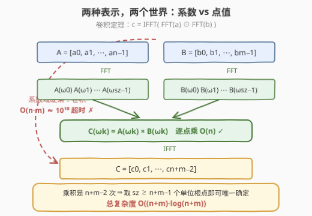
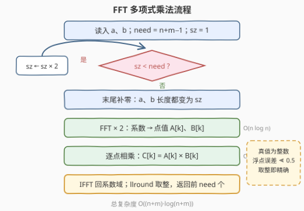

# 两个多项式相乘

- **题目名称**：两个多项式相乘
- **链接**：[3549. 两个多项式相乘](https://leetcode.cn/problems/multiply-two-polynomials/)
- **难度**：困难
- **标签**：数组, 数学, 分治, FFT

## 1. 题目概述

> ⚠️ 本题为 LeetCode 付费题，题意描述根据官方示例用例与 hints 重建，可能与官方题面有出入。

给定两个整数数组 `a` 和 `b`，分别表示两个多项式的系数（下标 `i` 对应 $x^i$ 的系数）。返回两多项式**乘积**的系数数组，长度恒为 $a.length + b.length - 1$（乘积次数为 $(n-1)+(m-1)$，需要 $n+m-1$ 个系数）。

**示例 1**：

```text
输入：a = [3,2,5], b = [1,4]
输出：[3,14,13,20]
解释：(3 + 2x + 5x²)(1 + 4x) = 3 + 14x + 13x² + 20x³
```

**示例 2**：

```text
输入：a = [1,0,-2], b = [-1]
输出：[-1,0,2]
解释：(1 - 2x²)·(-1) = -1 + 2x²
```

**示例 3**：

```text
输入：a = [1,5,-3], b = [-4,2,0]
输出：[-4,-18,22,-6,0]
解释：(1 + 5x - 3x²)(-4 + 2x) = -4 - 18x + 22x² - 6x³；
     b 末尾系数为 0（实际次数 1），输出长度仍为 3 + 3 - 1 = 5
```

**约束条件**（按 hint「Use Fast Fourier Transform」与 Hard 定位重建的规模假设）：

- $1 \le a.length,\ b.length$，且 $a.length + b.length$ 达 $10^5$ 量级
- 系数为绝对值不超过 $10^2 \sim 10^3$ 的整数

> 💡 **读题关键**：① 系数编号从低次幂到高次幂还是反过来**不影响答案数组**——把两个输入同时翻转，卷积结果数组不变，因此只需按「数组卷积」理解；② 输出长度是**满长度** $n+m-1$，含值为 0 的首尾系数，不要裁剪；③ 官方 hint 直接点名 FFT，说明 $O(n \cdot m)$ 的暴力必然超时，$n = m = 10^5$ 时约 $10^{10}$ 次乘加。

---

## 2. 解题思路

### 2.1 暴力思路：双重循环卷积

多项式乘法的定义就是**卷积**：$c_k = \sum_{i+j=k} a_i b_j$。直接双重循环枚举每一对 $(i, j)$，把 $a_i b_j$ 累加到 $c_{i+j}$，时间 $O(n \cdot m)$、空间 $O(n+m)$。

小规模下它完全正确，但在 $n, m \sim 10^5$ 的规模下约 $10^{10}$ 次乘加，超时约两个数量级。**乘法必须换一个域做**。

### 2.2 核心观察：FFT——在系数与点值之间快速切换



多项式有两种等价表示：

- **系数表示** $(a_0, a_1, \dots)$：$n$ 个系数直接写下。乘法是卷积，$O(n \cdot m)$；
- **点值表示** $\big(x_0, A(x_0)\big), \big(x_1, A(x_1)\big), \dots$：取 $d+1$ 个不同点处的函数值唯一确定一个 $d$ 次多项式。乘法是**逐点相乘** $(A \cdot B)(x_k) = A(x_k) \cdot B(x_k)$，$O(n)$！

瓶颈在于两种表示的**互相转换**。在任意点上求值每个点都要 $O(n)$（秦九韶算法），共 $O(n^2)$。**FFT 的洞察**：把求值点取成 $n$ 次单位根 $\omega^0, \omega^1, \dots, \omega^{n-1}$（$\omega = e^{2\pi i/n}$），则按系数下标的奇偶拆成两半后

$$A(\omega^k) = A_{\text{even}}\big(\omega^{2k}\big) + \omega^k \cdot A_{\text{odd}}\big(\omega^{2k}\big)$$

其中 $A_{\text{even}}$、$A_{\text{odd}}$ 是规模减半的多项式。关键在于 $\omega^{2k}$ 随 $k$ 只取 $n/2$ 个不同值——两个规模减半的子问题恰好各只需在 $n/2$ 个点求值！于是 $T(n) = 2T(n/2) + O(n) = O(n \log n)$，这就是**蝶形运算**。逆变换 IFFT 结构完全相同（单位根换成共轭、结果除以 $n$）。

乘积多项式需要 $n+m-1$ 个点才能唯一确定，因此把两个多项式**补零**到长度 $sz$（$\ge n+m-1$ 的最小 2 的幂——分治要求长度是 2 的幂）再做变换，即得**卷积定理**的算法：

$$c = \text{IFFT}\big(\text{FFT}(a) \odot \text{FFT}(b)\big)$$

其中 $\odot$ 是逐点相乘。三次变换 $O(sz \log sz)$，一次点乘 $O(sz)$。

### 2.3 算法流程图



1. 读入 `a`、`b`，令 `need = n + m - 1`（输出长度）；
2. 取 $sz$ 为 $\ge need$ 的最小 2 的幂，把 `a`、`b` 末尾补零到长度 `sz`；
3. 对两者各做一次 FFT，得到点值数组 `A[k]`、`B[k]`；
4. 逐点相乘 `C[k] = A[k] * B[k]`；
5. 对 `C` 做 IFFT 得到（浮点的）系数数组；
6. 每个系数 `llround` 四舍五入恢复整数，截取前 `need` 个返回。

### 2.4 示例演算

以示例 1（$a = [3,2,5]$，$b = [1,4]$，$need = 4$，$sz = 4$）展示系数域的卷积含义（FFT 走的是点值域的等价路径）：

| $k$ | 贡献项（$i+j=k$） | 计算 | $c_k$ |
|---|---|---|---|
| 0 | $a_0 b_0$ | $3 \times 1$ | $3$ |
| 1 | $a_0 b_1 + a_1 b_0$ | $3 \times 4 + 2 \times 1$ | $14$ |
| 2 | $a_1 b_1 + a_2 b_0$ | $2 \times 4 + 5 \times 1$ | $13$ |
| 3 | $a_2 b_1$ | $5 \times 4$ | $20$ |

结果 $[3, 14, 13, 20]$ ✓。示例 3 中 $b = [-4,2,0]$ 的末位 0 说明：**补零与输出满长度**是本题的两个隐含考点。

---

## 3. 参考代码

> 付费题，函数签名按题意重建，参数与返回类型以官方为准；C++ 返回 `long long` 以容纳最坏 $10^5 \times 10^2 \times 10^2 = 10^9$ 量级的系数。

### C++

```cpp
class Solution {
  public:
    vector<long long> multiply(vector<int>& a, vector<int>& b) {
        int n = a.size(), m = b.size();
        if (n == 0 || m == 0) return {};
        int need = n + m - 1, sz = 1;
        while (sz < need) sz <<= 1;              // ≥ need 的最小 2 的幂
        vector<complex<double>> fa(sz), fb(sz);  // 补零即默认 0
        for (int i = 0; i < n; ++i) fa[i] = {double(a[i]), 0};
        for (int j = 0; j < m; ++j) fb[j] = {double(b[j]), 0};
        fft(fa, false);
        fft(fb, false);
        for (int i = 0; i < sz; ++i) fa[i] *= fb[i];  // 点值域 O(n) 乘法
        fft(fa, true);                                // 逆变换回系数域
        vector<long long> res(need);
        for (int i = 0; i < need; ++i) res[i] = llround(fa[i].real());
        return res;
    }

  private:
    void fft(vector<complex<double>>& p, bool inv) {
        int n = p.size();
        for (int i = 1, j = 0; i < n; ++i) {     // 位逆序置换
            int bit = n >> 1;
            for (; j & bit; bit >>= 1) j ^= bit;
            j ^= bit;
            if (i < j) swap(p[i], p[j]);
        }
        for (int len = 2; len <= n; len <<= 1) {  // 自底向上蝶形合并
            double ang = 2 * acos(-1.0) / len * (inv ? 1 : -1);
            complex<double> wl(cos(ang), sin(ang));
            for (int i = 0; i < n; i += len) {
                complex<double> w(1, 0);
                for (int k = 0; k < len / 2; ++k) {
                    auto u = p[i + k];
                    auto v = p[i + k + len / 2] * w;
                    p[i + k] = u + v;
                    p[i + k + len / 2] = u - v;
                    w *= wl;
                }
            }
        }
        if (inv)
            for (auto& x : p) x /= n;            // 逆变换多除一个 n
    }
};
```

### Python

```python
import math

class Solution:
    def multiply(self, a: List[int], b: List[int]) -> List[int]:
        n, m = len(a), len(b)
        need = n + m - 1
        sz = 1
        while sz < need:                          # ≥ need 的最小 2 的幂
            sz <<= 1
        fa = [complex(x) for x in a] + [0j] * (sz - n)   # 末尾补零
        fb = [complex(x) for x in b] + [0j] * (sz - m)
        self._fft(fa, False)
        self._fft(fb, False)
        for i in range(sz):                       # 点值域逐点相乘
            fa[i] *= fb[i]
        self._fft(fa, True)                       # 逆变换回系数域
        return [int(round(fa[i].real)) for i in range(need)]

    def _fft(self, p: List[complex], inv: bool) -> None:
        n = len(p)
        j = 0
        for i in range(1, n):                     # 位逆序置换
            bit = n >> 1
            while j & bit:
                j ^= bit
                bit >>= 1
            j |= bit
            if i < j:
                p[i], p[j] = p[j], p[i]
        length = 2
        while length <= n:                        # 自底向上蝶形合并
            ang = 2 * math.pi / length * (1 if inv else -1)
            wl = complex(math.cos(ang), math.sin(ang))
            for i in range(0, n, length):
                w = 1 + 0j
                half = length >> 1
                for k in range(i, i + half):
                    u, v = p[k], p[k + half] * w
                    p[k] = u + v
                    p[k + half] = u - v
                    w *= wl
            length <<= 1
        if inv:
            for i in range(n):
                p[i] /= n
```

> 💡 三处细节：① **正/逆变换共用一个函数**，只差角度符号（$\omega$ 换共轭）与末尾的 $\div n$；② **迭代版先做位逆序置换**，再自底向上按 `len = 2, 4, 8, …` 合并，等价于递归版「奇偶拆分」的执行顺序，避免递归开销；③ 浮点结果经 `llround`/`round` 恢复整数——真值是整数时误差远小于 $0.5$（见扩展节的精度边界）。

---

## 4. 复杂度分析

| 维度 | 复杂度 | 说明 |
|------|--------|------|
| 时间 | $O\big((n+m)\log(n+m)\big)$ | 三次长度为 $sz$ 的 FFT/IFFT，各 $O(sz \log sz)$，$sz$ 为 $\ge n+m-1$ 的最小 2 的幂；另有 $O(sz)$ 的点乘与取整 |
| 空间 | $O(n+m)$ | 两个补零后的复数数组与结果数组 |
| 暴力对照 | $O(n \cdot m)$ | 双重循环卷积；$n = m = 10^5$ 时约 $10^{10}$ 次乘加，比 FFT 路径慢约两个数量级 |

---

## 5. 扩展：精度边界与 NTT

**double 的精度边界**：FFT 全程浮点运算，误差大致随「结果系数的最大绝对值 $\times \log sz \times 2^{-53}$」增长。经验安全边界是

$$\max|a| \cdot \max|b| \cdot \min(n, m) \lesssim 9 \times 10^{14}$$

本题规模（系数 $\sim 10^2$、长度 $\sim 10^5$，乘积系数 $\le 10^9$）误差量级仅 $10^{-6}$，`llround` 稳妥恢复精确值。若系数放大到 $10^4$ 以上、或长度到 $10^6$，double 开始危险。

**NTT（数论变换）**：把复数单位根换成模素数 $p$ 意义下的原根 $g$（$g$ 的幂在 $\mathbb{Z}_p$ 中同样具有循环对称性），全部运算变为整数取模，**彻底没有精度问题**。竞赛标配 $p = 998244353 = 119 \times 2^{23} + 1$、$g = 3$，支持变换长度至 $2^{23}$；若题目要求答案取模，NTT 是唯一正解。系数极大但仍要**精确值**时，可用「拆系数」：把 $a_i$ 写成 $h_i \cdot 2^{15} + l_i$，做 $O(1)$ 次 FFT 分别卷积再组合，把单次系数上限压回 double 安全区。

---

## 6. 面试要点

- **Q1：为什么点值表示下多项式乘法是 $O(n)$？**
  答：每个求值点相互独立，$(A \cdot B)(x_k) = A(x_k) \cdot B(x_k)$，$n$ 个点各乘一次即可。系数域的乘法之所以是卷积 $O(nm)$，是因为每个 $a_i$ 要与每个 $b_j$ 配对；点值域把「配对」变成了「对位」。
- **Q2：为什么至少要 $n+m-1$ 个点？**
  答：乘积多项式次数为 $(n-1)+(m-1) = n+m-2$，而 $d$ 次多项式需要 $d+1$ 个不同点才能唯一确定。点数不足时满足条件的乘积多项式不唯一，逆变换会「串味」出错误结果。
- **Q3：为什么变换长度要取 2 的幂、还要补零？**
  答：分治每轮要求序列精确减半，长度必须是 $2$ 的幂；补零只是加长数组表示，不改变多项式本身（$0$ 系数不贡献任何乘积项），却保证了 $n+m-1$ 个点都取得到。
- **Q4：IFFT 为什么也是一次 FFT？**
  答：DFT 矩阵的逆等于「取共轭的 DFT 矩阵再除 $n$」。实现上同一个函数用 `inv` 标志翻转单位根角度（$\omega$ 换共轭），结束时整体除以 $n$ 即可。
- **Q5：位逆序置换是做什么的？**
  答：递归 FFT 按下标奇偶层层拆分后合并，元素在数组中的最终位置恰好是其下标二进制表示的翻转。迭代实现先一次性把元素放到「终极位置」，再自底向上逐层做蝶形合并，省去递归栈——这是手写 FFT 的标准形态。

---

## 7. 同类练习题

- [43. 字符串相乘](https://leetcode.cn/problems/multiply-strings/)：大数乘法 = 十进制系数的卷积 + 进位处理，本题的「数字版」近亲，可先用它理解卷积含义
- [415. 字符串相加](https://leetcode.cn/problems/add-strings/)：高精度四则运算家族的入门题，逐位 + 进位的模拟
- [989. 数组形式的整数加法](https://leetcode.cn/problems/add-to-array-form-of-integer/)：数组形式的大数加法，注意「低位对齐」的姿势与本题系数编号呼应
- [2. 两数相加](https://leetcode.cn/problems/add-two-numbers/)：链表形式的大数加法，同一套「按位运算 + 进位」套路的换皮
