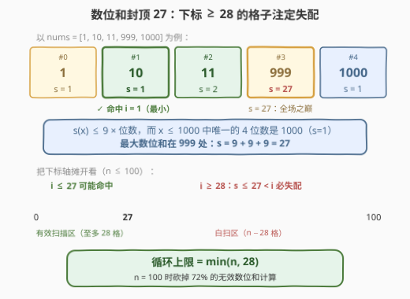
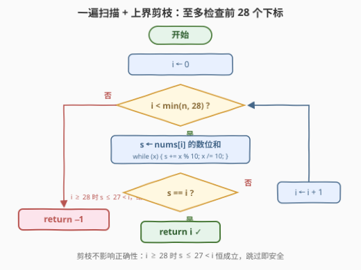

# LeetCode 数位和等于下标的最小下标 题解

## 1. 题目概述

- **标题 / 题号**：数位和等于下标的最小下标（#3550，easy）
- **链接**：https://leetcode.cn/problems/smallest-index-with-digit-sum-equal-to-index/
- **难度**：简单
- **标签**：数组、数学

**题意**：给你一个整数数组 `nums`。返回满足 **`nums[i]` 的数位和**（每一位数字相加求和）等于 `i` 的**最小**下标 `i`。如果不存在满足要求的下标，返回 `-1`。

**示例 1**：

```text
输入：nums = [1,3,2]
输出：2
解释：nums[2] = 2，其数位和等于 2，与下标 i = 2 相等，输出 2。
```

**示例 2**：

```text
输入：nums = [1,10,11]
输出：1
解释：nums[1] = 10，数位和 1+0 = 1 等于下标 1；nums[2] = 11，数位和 1+1 = 2
也等于下标 2，但 1 是更小的下标，输出 1。
```

**示例 3**：

```text
输入：nums = [1,2,3]
输出：-1
解释：不存在满足要求的下标。
```

**约束**：

- $1 \le nums.length \le 100$
- $0 \le nums[i] \le 1000$

> 💡 **读题关键**：要求的是**最小**下标——按下标升序扫描、命中即返回，天然保证最小；「数位和」如 $s(10) = 1 + 0 = 1$，注意 $s(0) = 0$，所以下标 0 配上元素 0 也会命中。

## 2. 解题思路

### 2.1 朴素思路：升序逐个检查

按下标从小到大遍历，对每个 `nums[i]` 逐位取模求出数位和，与 `i` 相等就立刻返回——升序扫描保证返回的第一个命中就是最小下标。这正是题面 hint 说的 "Simulate as described"，已经是正确的 $O(nD)$ 解法（$D$ 为元素位数，本题 $D \le 4$）。

朴素版唯一的浪费：它会把**注定失配的下标也老实算一遍数位和**。$n \le 100$ 时无伤大雅，但这笔浪费有规律可抠——数位和根本长不到大下标那么高。

### 2.2 核心观察：数位和封顶 27，下标 ≥ 28 必失配



**结论**：值域 $x \le 1000$ 内数位和 $s(x) \le 27$（在 $x = 999$ 处取到；唯一的 4 位数 `1000` 数位和只有 1）。而命中要求 $s(nums[i]) = i$，故只可能发生在 $i \le 27$：

$$\text{循环上限} = \min(n,\ 28)$$

一般地，$s(x) \le 9 \times (\text{位数}) = O(\log x)$——数位和**对数级**增长，下标**线性**增长，两条线在极小的位置就永别了。长数组的大多数下标从结构上就不可能命中，答案只活在数组极前部。

> ⚠️ **别急着把上界写成 36**：粗放地用「4 位 × 9 = 36」作上限也对（多扫的下标全部失配、不会误判），但值域 $[0, 1000]$ 里 4 位数只有 1000，紧界是 999 的 27。紧界体现的是「先查值域再定界」的习惯，与 3514 的值域封顶思路同源。

### 2.3 算法流程图



流程就是朴素模拟加一道「限高」：循环条件从 `i < n` 收紧为 `i < min(n, 28)`；每个 `i` 用 `x % 10` 逐位累加求数位和（`x = 0` 时循环体不执行、$s = 0$，天然正确）；命中返回 `i`，扫完有效区间仍无命中返回 `-1`。

### 2.4 示例演算

以 `nums = [1, 10, 11]` 走一遍（有效区间 $[0, \min(3, 28)) = [0, 3)$）：

| 步 | $i$ | $nums[i]$ | 数位和 $s$ | 判定 |
|----|-----|-----------|------------|------|
| 1 | 0 | 1 | 1 | $1 \ne 0$，继续 |
| 2 | 1 | 10 | $1 + 0 = 1$ | $1 = 1$，**返回 1** |

（若继续扫，$i = 2$ 的 `11` 数位和 $2$ 也会命中——但升序扫描在 1 就收工了，这正是「最小下标」的含义。）

再看 `nums = [1, 2, 3]`：数位和 $[1, 2, 3]$ 对上下标 $[0, 1, 2]$ 全部错位，扫完 $i \le 2$ 无命中，返回 `-1`。

## 3. 参考代码

### C++

```cpp
class Solution {
  public:
    int smallestIndex(vector<int>& nums) {
        for (int i = 0; i < nums.size() && i < 28; i++) {
            int s = 0;
            for (int x = nums[i]; x > 0; x /= 10) s += x % 10;
            if (s == i) return i;
        }
        return -1;
    }
};
```

### Python

```python
class Solution:
    def smallestIndex(self, nums: List[int]) -> int:
        for i, x in enumerate(nums[:28]):
            if sum(map(int, str(x))) == i:
                return i
        return -1
```

> 💡 Python 的 `nums[:28]` 一步兑现 2.2 的上限（切片越界安全，`n < 28` 时取整个数组）；`str(0)` 求和同样得 0，边界无需特判。C++ 若不想要魔数 28，写成 `i <= 27` 或干脆回到朴素版 `i < nums.size()` 也正确——剪枝是优化，不是正确性的一部分。

## 4. 复杂度分析

| 维度 | 复杂度 | 说明 |
|------|--------|------|
| 时间复杂度 | $O(\min(n, 28) \cdot D)$ | $D \le 4$ 为元素位数；剪枝后至多 28 次数位和计算，$n = 100$ 时砍掉 $72\%$ |
| 空间复杂度 | $O(1)$ | 逐位取模版只有常数变量；Python 切片/`str` 版另计 $O(\min(n, 28))$ / $O(D)$ |

## 5. 扩展：mod 9 同余——数位和的身份证明

数位和最重要的代数性质是**弃九同余**：$s(x) \equiv x \pmod 9$。因为 $10 \equiv 1 \pmod 9 \Rightarrow 10^k \equiv 1$，故 $x = \sum d_k 10^k \equiv \sum d_k = s(x)$。对本题它给出一个**必要条件**：

$$s(nums[i]) = i \ \Rightarrow\ nums[i] \equiv i \pmod 9$$

于是可拿 $nums[i] \bmod 9 \ne i \bmod 9$ 当 $O(1)$ 预筛，跳过约 $8/9$ 的下标再精算数位和。$n \le 100$ 时纯属杀鸡用牛刀，但「同余预筛 + 精算复核」是数位题的通用两段式（承接 3512/1590 同余族）。把数位和反复迭代到个位即**数根**：$\mathrm{dr}(x) = 1 + (x - 1) \bmod 9$（$x > 0$），迭代版见 1945。

## 6. 面试要点

1. **为什么下标扫到 27 就敢停？**

   > 值域 $x \le 1000$ 内数位和最大为 27（999 处取到）。$i \ge 28$ 时 $s(nums[i]) \le 27 < i$ 恒成立，任何元素都不可能命中——被剪掉的区间是结构性无解，剪枝不影响正确性。

2. **`nums[i] = 0` 这类边界怎么处理？**

   > $s(0) = 0$：`while (x)` 型代码循环体不执行、$s$ 保持 0；`str` 版 `"0"` 求和也是 0。所以 `nums = [0, ...]` 会在 $i = 0$ 直接命中返回 0，无需特判。

3. **上界写成 36（4 位 × 9）会错吗？**

   > 不会错，只是更松——宽界意味着扫到 $i \le 35$，其中 $i \ge 28$ 的检查全部白做但不会误判（$s \le 27 < 28 \le i$）。紧界 27 的价值在于精确刻画「答案只可能出现在数组前 28 格」，宽界是保守正确的兜底。

4. **mod 9 同余在这题里能干什么？**

   > $s(x) \equiv x \pmod 9$ 给出必要条件 $nums[i] \equiv i \pmod 9$，可作 $O(1)$ 预筛跳过约 $8/9$ 的下标。本题规模用不上，但它是数位和最常考的代数身份——整除性判定与数根公式的根基。

5. **如果数组是流式到达、只能常数空间缓存呢？**

   > 答案只由前 28 个元素决定（$i \ge 28$ 结构性无解），流式场景只需缓存前 28 个元素即可给出最终答案，之后的所有元素读都不用读。剪枝把「需要看的数据量」与「数组总长」解耦了。

> 💡 **一句话总结**：3550 = 升序模拟 + 值域封顶——数位和 $\le 27$，下标 $\ge 28$ 结构性无解，`min(n, 28)` 封顶后一遍扫描收工。

## 同类练习题

| # | 题目 | 与本题的关联 |
|---|------|-------------|
| 1281 | [整数的各位积和之差](https://leetcode.cn/problems/subtract-the-product-and-sum-of-digits-of-an-integer/)（[题解](../1201-1300/1281_整数各位积和之差.md)） | 同一套「逐位取模拆数位」，只是积与和各算一遍做差 |
| 1945 | [字符串转化后的各位数字之和](https://leetcode.cn/problems/sum-of-digits-of-string-after-convert/)（[题解](../1901-2000/1945_字符串转化后的各位数字之和.md)） | 数位和的反复迭代，本文 5 节数根视角的展开版 |
| 2180 | [统计各位数字之和为偶数的整数个数](https://leetcode.cn/problems/count-integers-with-even-digit-sum/)（[题解](../2101-2200/2180_统计各位数字之和为偶数的整数个数.md)） | 枚举值域 + 数位和奇偶判定，值域封顶计数同源 |
| 2520 | [统计能整除数字的位数](https://leetcode.cn/problems/count-the-digits-that-divide-a-number/)（[题解](../2501-2600/2520_统计能整除数字的位数.md)） | 逐位拆出再逐一判定，数位分离模板的直接练习 |
| 2269 | [找到一个数字的 K 美丽值](https://leetcode.cn/problems/find-the-k-beauty-of-a-number/)（[题解](../2201-2300/2269_找到一个数字的K美丽值.md)） | 数位串上的定长滑窗截取，「数值 vs 位置」判定的组合版 |
