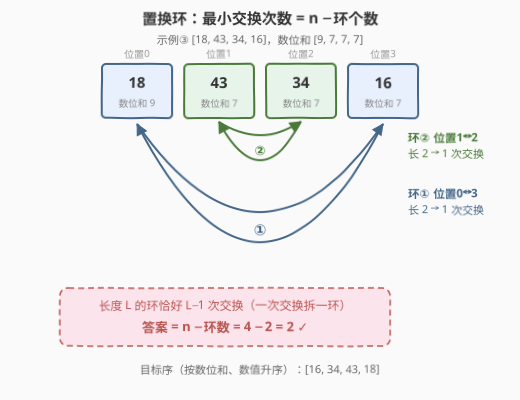
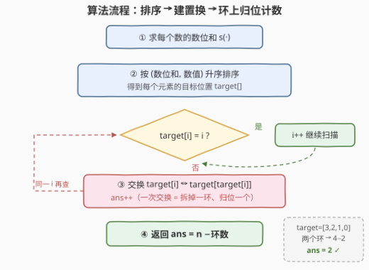

# 数位和排序需要的最小交换次数

- **题目名称**：数位和排序需要的最小交换次数
- **链接**：[3551. 数位和排序需要的最小交换次数](https://leetcode.cn/problems/minimum-swaps-to-sort-by-digit-sum/)
- **难度**：中等
- **标签**：数组、排序、哈希表、贪心

## 1. 题目概述

给定一个由**互不相同**的正整数组成的数组 `nums`，要求按每个数的**数位和**（每一位数字之和）**升序**排序；若两个数的数位和相等，则**较小的数排在前面**。返回将 `nums` 变成该顺序所需的**最小**交换次数，一次交换指交换数组中两个不同位置的值。

**示例 1**：

```text
输入：nums = [37,100]
输出：1
解释：数位和 [10, 1]，排序结果 [100, 37]；交换 37 与 100 即得。
```

**示例 2**：

```text
输入：nums = [22,14,33,7]
输出：0
解释：数位和 [4, 5, 6, 7] 严格递增，数组本来就是目标顺序。
```

**示例 3**：

```text
输入：nums = [18,43,34,16]
输出：2
解释：数位和 [9, 7, 7, 7]，排序结果 [16, 34, 43, 18]；
     交换 18↔16、43↔34，共 2 次。
```

**约束条件**：

- $1 \le nums.length \le 10^5$
- $1 \le nums[i] \le 10^9$
- `nums` 中元素**互不相同**

> 💡 **读题关键**：排序键是二元组 $(数位和,\ 数值)$。由于元素互不相同，这个键**两两不同**，目标排列**唯一确定**——这一点保证了后面「置换」是良定义的。真正的考点不在排序，而在「最小交换次数」怎么数。

---

## 2. 解题思路

### 2.1 暴力思路：BFS 搜索交换序列

最朴素的想法是把「数组的一种排列」视为一个状态，从初始状态出发做 BFS：每个状态可以向任意 $j \ne i$ 连一条边（交换位置 $i, j$），求到目标排列的最短路。但状态数是 $n!$ 级别，$n = 10^5$ 时是天文数字；即便 $n = 10$ 也有 $3628800$ 个状态、每个状态 $O(n^2)$ 条边，完全不可行。

不过这个模型揭示了一个关键性质：**交换的代价与距离无关**——把相隔十万八千里的两个元素对调，和交换相邻两个元素，都只算一次。这强烈暗示：答案由排列的**组合结构**（环）决定，而不是由元素的移动距离决定，应该存在一个闭式计数解。

### 2.2 核心观察：置换环分解，答案 = n − 环数



目标排列唯一确定后，我们定义一个**置换** $\pi$：当前位置 $i$ 上的元素最终应落到位置 $\pi(i)$，即 $target[i]$。把每个位置看成一个点、画一条箭头 $i \to target[i]$，整个数组就分解成若干个**互不相交的环**（每个点恰有一条出边、一条入边）。如上图：示例 3 中 $18$ 要去位置 3、$16$ 要回位置 0，构成环①；$43 \leftrightarrow 34$ 构成环②。

**定理**：设置换分解成 $c$ 个环，则最小交换次数 $= n - c$。

- **下界（至少要 $n-c$ 次）**：任何一次交换，等价于对置换复合一个对换 $(a\ b)$。若 $a, b$ 属于**同一个环**，该环被拆成两个（环数 $+1$）；若属于**不同的环**，两环合并（环数 $-1$）。也就是说**每次交换至多让环数增加 1**。初始有 $c$ 个环，目标是恒等排列（每个位置自环，共 $n$ 个环），故至少需要 $n - c$ 次交换。
- **可达（$n-c$ 次足够）**：每次在**同一个环内**任取两个位置交换，环必然一分为二，环数严格 $+1$。重复 $n - c$ 次即全部变成自环。特别地，长度为 $L$ 的环恰好需要 $L - 1$ 次交换——图中的 2-环（环①、环②）各需 1 次，总答案 $4 - 2 = 2$ ✓。

> 💡 直觉版本：一次「聪明」的交换能把环上**两个元素同时送进对方的坑**（2-环一次搞定），而孤立点（已在位）不花任何代价。动手瞎换（跨环交换）反而会把两个环粘成一个，让事情更糟。

### 2.3 算法流程图



整体流程分四步：**求数位和 → 排序建 `target` → 环上就地归位计数 → 返回**。其中第三步是经典的**环排序（cycle sort）**骨架：从左到右扫描每个位置 $i$，只要 $target[i] \ne i$，就把「$i$ 处元素应去的位置 $j = target[i]$」与 $i$ 交换——这一步**恰好归位一个元素**（交换后 $target[j] = j$），且正是 2.2 中「拆环」操作的具体实现。

实现上有两种等价写法：

1. **就地置换**（推荐，见参考代码）：`while target[i] != i: 交换并 ans++`，每次交换至少归位一个元素，全程至多 $n$ 次交换，均摊 $O(n)$；
2. **数环**：用 `visited` 数组沿 $i \to target[i]$ 走环标记，数出环数 $c$，返回 $n - c$。

```python
# 写法二：数环版本（与写法一等价）
visited, cycles = [False] * n, 0
for i in range(n):
    if not visited[i]:
        cycles += 1
        j = i
        while not visited[j]:
            visited[j] = True
            j = target[j]
return n - cycles
```

### 2.4 示例演算

以**示例 3** `nums = [18, 43, 34, 16]` 走完全流程：

| 步骤 | 内容 | 结果 |
|------|------|------|
| ① 数位和 | $18 \to 9$，$43 \to 7$，$34 \to 7$，$16 \to 7$ | $s = [9, 7, 7, 7]$ |
| ② 排序 | 键 $(s, 值)$：$(7,16) < (7,34) < (7,43) < (9,18)$ | 目标 $[16, 34, 43, 18]$ |
| ③ 建 target | $18$ 去位置 3，$43$ 去位置 2，$34$ 去位置 1，$16$ 去位置 0 | $target = [3, 2, 1, 0]$ |
| ④ 找环 | $0 \to 3 \to 0$；$1 \to 2 \to 1$ | $2$ 个环 |
| ⑤ 计数 | $n - c = 4 - 2$ | $ans = 2$ ✓ |

就地置换视角验证：$i=0$ 时 $target[0]=3$，交换后 $target=[0,2,1,3]$（环①拆完，1 次）；$i=1$ 时同理再 1 次，共 $2$ ✓。**示例 1** 同理：$target = [1, 0]$ 单个 2-环，$ans = 2 - 1 = 1$ ✓。

---

## 3. 参考代码

### C++

```cpp
class Solution {
  public:
    int minSwaps(vector<int>& nums) {
        int n = nums.size();

        vector<int> ds(n, 0);                       // 数位和
        for (int i = 0; i < n; ++i)
            for (int x = nums[i]; x > 0; x /= 10)
                ds[i] += x % 10;

        vector<int> idx(n);
        iota(idx.begin(), idx.end(), 0);
        sort(idx.begin(), idx.end(), [&](int a, int b) {
            if (ds[a] != ds[b]) return ds[a] < ds[b];   // 先比数位和
            return nums[a] < nums[b];                    // 再比数值
        });

        vector<int> target(n);
        for (int k = 0; k < n; ++k)
            target[idx[k]] = k;                       // 原位置 idx[k] 的元素应去位置 k

        int ans = 0;
        for (int i = 0; i < n; ++i)
            while (target[i] != i) {                  // i 还没归位
                int j = target[i];                    // i 处的元素应去 j
                swap(target[i], target[j]);           // 送它过去，换回 j 处的元素
                ++ans;                                // 一次交换拆掉一环
            }
        return ans;
    }
};
```

### Python

```python
class Solution:
    def minSwaps(self, nums: List[int]) -> int:
        n = len(nums)

        def dsum(x: int) -> int:
            s = 0
            while x:
                s, x = s + x % 10, x // 10
            return s

        order = sorted(range(n), key=lambda i: (dsum(nums[i]), nums[i]))
        target = [0] * n
        for k, i in enumerate(order):        # 原位置 i 的元素应去位置 k
            target[i] = k

        ans = 0
        for i in range(n):
            while target[i] != i:            # i 未归位
                j = target[i]
                target[i], target[j] = target[j], target[i]
                ans += 1
        return ans
```

---

## 4. 复杂度分析

| 维度 | 复杂度 | 说明 |
|------|--------|------|
| 时间 | $O(n \log n)$ | 排序主导；数位和计算 $O(nD)$（$D \le 10$ 为位数），环扫描均摊 $O(n)$（每次交换至少归位一个元素，交换总数 $\le n$） |
| 空间 | $O(n)$ | `idx` 与 `target` 辅助数组（若直接对 $(s, 值, i)$ 三元组排序可省去 `ds`） |

---

## 5. 扩展：只允许相邻交换怎么办？

本题允许**任意**交换，代价与距离无关，所以答案是 $n - 环数$。若把操作限制为**交换相邻两个元素**，每次交换至多消除一个逆序对，答案就变成**逆序对个数**（可用归并排序或树状数组在 $O(n \log n)$ 内统计）。两个结论对照，正好刻画了「交换自由度」对代价的影响：

| 操作限制 | 最小次数 | 计算方式 |
|----------|----------|----------|
| 任意位置交换 | $n - 环数$ | 置换环分解 |
| 仅相邻交换 | 逆序对数 | 归并排序 / 树状数组 |

另外，若题目去掉「元素互不相同」的约束，$target$ 不再唯一：只需按 $(数位和, 值)$ **稳定排序**（同键元素保持原相对次序、原地不动），此时相同元素之间无需任何交换，$n - 环数$ 的结论依然成立。

---

## 6. 面试要点

- **Q1：为什么最小交换次数恰为 $n - 环数$？**
  答：交换两元素 = 对置换复合一个对换：同环两点交换把环一分为二（环数 $+1$），异环交换把两环合并（环数 $-1$），故每次交换环数至多 $+1$；初始 $c$ 个环、终态 $n$ 个自环，下界 $n - c$；每次挑同环两点交换必能 $+1$，下界可达。
- **Q2：`target` 数组是怎么定义的？为什么它一定是置换？**
  答：按 $(数位和, 值)$ 升序排序后，排名 $k$ 的元素原来在位置 $idx[k]$，则 $target[idx[k]] = k$，即「位置 $i$ 上的元素最终要去哪」。由于值互不相同，排序键两两不同，每个位置的目标唯一且互不相同，故 $target$ 是 $0..n-1$ 的一个排列。
- **Q3：就地置换的 `while` 循环为什么是均摊 $O(n)$？**
  答：每执行一次交换，$target[j]$ 变为 $j$ 且此后不再变动——即**每次交换至少永久归位一个元素**，全程交换次数不超过 $n$，外层再套 `for` 也只是线性扫描。
- **Q4：如果只允许交换相邻元素，答案是多少？**
  答：逆序对个数。相邻交换一次至多消除一个逆序对（下界），且冒泡排序总能消满（可达）。这与「任意交换 = $n - 环数$」形成经典对照。
- **Q5：贪心地「从左到右把每个位置放对的元素换进来」是最优的吗？**
  答：是。这本质上就是环排序：位置 $i$ 需要的元素恰是环上前驱处的元素，交换后环长 $-1$。它恰好实现了「每次拆一环」，达到 $n - c$ 的下界。看似朴素的模拟，其实严格最优。

---

## 7. 同类练习题

- [2471. 逐层排序二叉树所需的最小操作次数](https://leetcode.cn/problems/minimum-number-of-operations-to-sort-a-binary-tree-by-level/)：每一层独立做一次「$n - 环数$」，同一套置换环套路（本仓库题解见[逐层排序二叉树的最少操作数](../2401-2500/2471_逐层排序二叉树的最少操作数.md)）
- [3011. 判断一个数组是否可以变为有序](https://leetcode.cn/problems/find-if-array-can-be-sorted/)：同样按数位和定序，只是把「数交换次数」换成「判断能否分段有序」（题解见[判断一个数组是否可以变为有序](../3001-3100/3011_判断一个数组是否可以变为有序.md)）
- [801. 使序列递增的最小交换次数](https://leetcode.cn/problems/minimum-swaps-to-make-sequences-increasing/)：受限交换（只能同下标配对交换）的最小次数，用 DP 而非置换环，对照理解「交换自由度」（题解见[使序列递增的最小交换次数](../0801-0900/801_使序列递增的最小交换次数.md)）
- [2134. 最少交换次数将二进制字符串所有 1 组合在一起 II](https://leetcode.cn/problems/minimum-swaps-to-group-all-1s-together-ii/)：环形窗口上的最小交换贪心，另一类「最小交换」模型（题解见[最少交换次数来组合所有的 1 II](../2101-2200/2134_最少交换次数来组合所有的1II.md)）
- [41. 缺失的第一个正数](https://leetcode.cn/problems/first-missing-positive/)：原地交换归位（环排序骨架）的经典应用，「把值 $v$ 放到下标 $v-1$」（题解见[缺失的第一个正数](../0001-0100/41_缺失的第一个正数.md)）
