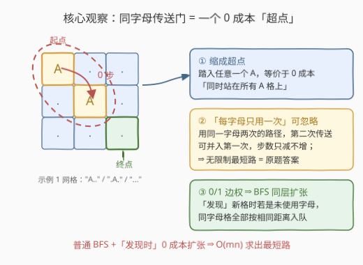
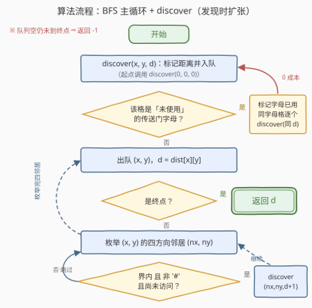

# LeetCode 网格传送门旅游 题解

## 1. 题目概述

- **标题 / 题号**：网格传送门旅游（#3552，medium）
- **链接**：https://leetcode.cn/problems/grid-teleportation-traversal/
- **难度**：中等
- **标签**：广度优先搜索, 数组, 哈希表, 矩阵

**题意**：给你一个 $m \times n$ 的二维字符网格 `matrix`（字符串数组），`matrix[i][j]` 是以下三种字符之一：

- `'.'`：空单元格；
- `'#'`：障碍物；
- 大写字母 `'A'`–`'Z'`：传送门。

你从左上角 $(0, 0)$ 出发，目标是右下角 $(m-1, n-1)$。每次**移动**可以走到上下左右相邻的格子（必须界内且不是障碍物）。**踏入**一个传送门格子时，若该字母此前从未使用过，你可以**立即**免费传送到网格中**另一个同字母**的格子——传送不计入移动次数，但**每个字母的传送门在整段旅程中最多使用一次**。返回到达终点的最少移动次数；无法到达则返回 $-1$。

**示例 1**：

```text
输入：matrix = ["A..",".A.","..."]
输出：2
解释：在第一次移动之前，先从 (0, 0) 传送到 (1, 1)；再移动两次到达 (2, 2)。
```

**示例 2**：

```text
输入：matrix = [".#...",".#.#.",".#.#.","...#."]
输出：13
解释：网格中没有传送门，退化为普通迷宫 BFS。
```

**约束**：

- $1 \le m = matrix.length \le 10^3$
- $1 \le n = matrix[i].length \le 10^3$
- `matrix[i][j]` 是 `'#'`、`'.'` 或一个大写英文字母
- `matrix[0][0]` 不是障碍物

> 💡 **读题关键**：① 传送是「踏入即触发、可放弃」，成本为 0；② 限制的对象是**字母**（不是格子、也不是格子对）——一个字母用过一次后，它名下**所有**传送全部失效；③ 起点本身可能是传送门：示例 1 的传送发生在**第 0 次移动之前**，初始化时就要处理。

## 2. 解题思路

### 2.1 暴力思路：把「已用字母」塞进状态？

求最少移动次数，第一反应是 BFS，但这里的转移依赖于「哪些字母已经用过」。老实地把状态定义为 (格子, 已用字母集合)，集合有 $2^{26}$ 种取值，状态数 $m n \cdot 2^{26}$ 直接爆炸。反过来，若完全无视传送做普通 BFS，求出的是纯步行距离，会漏掉所有抄近路的机会（示例 1 会算成 4 而不是 2）。

出路在于证明：**「已用字母集合」这一维状态根本不需要记录**。

### 2.2 核心观察：同字母传送门 = 一个 0 成本「超点」



三个层层递进的事实：

**事实一：踏入任意一个 A，等价于 0 成本站在所有 A 上。**
所有同字母格子两两之间都有一条 0 成本边（到达其中一个，即可选择传送到其余任意一个）。把它们缩成一个「**超点**」，原图就变成一张边权只有 0（传送）和 1（步行）的图，问题化为 **0/1 边权最短路**。

**事实二：「每个字母最多用一次」的限制可以忽略。**
设某条路径用了字母 A 的传送两次：$a \xrightarrow{0} b$，步行若干格后回到 $c \xrightarrow{0} d$（$a, b, c, d$ 均为 A 格）。由于从 $a$ 出发可以 0 成本传到**任意** A 格（包括 $d$），把整段 $a \xrightarrow{0} b \to \cdots \to c \xrightarrow{0} d$ 替换为 $a \xrightarrow{0} d$，步数只减不增，还少用一次 A。因此任何用了同一字母两次的路径都能改写成至多用一次且不更长——**无限制图上的最短路就等于原题答案**（这正是题目 hints 里 "doesn't affect correctness" 的严格版）。

**事实三：0/1 边权最短路用「发现时同层扩张」的普通 BFS 即可。**
普通 BFS 的正确性依赖队列中距离单调不减。做法：**发现**（首次确定距离）一个格子时，若它是**未使用字母**的传送门，立即标记该字母已用，并把所有同字母格子按**相同距离**一并发现入队。这样 0 成本扩张全部发生在同一层内部，队列依然按距离分层、每个格子只被发现一次。

> ⚠️ **两个高频出错点**：
> 1. **起点是传送门**要先扩张——示例 1 的传送发生在第 0 次移动之前，初始化时就要对起点做字母扩张；
> 2. 扩张必须放在「**发现**时」而不是「**出队**时」做。出队时才扩张，同字母格可能已被更远的步行距离抢先占用且无法修正——例如 `["...","AA."]` 正确答案是 2（下移 1 步踏入 A → 0 成本传到 $(1,1)$ → 右移 1 步），出队时扩张的版本会算出 3。

### 2.3 算法流程图



把「发现」封装成过程 `discover(x, y, d)`：标记距离并入队；若是未使用字母，先标记已用，再对每个同字母格递归执行 `discover(·, d)`（同字母格的字母已标记，递归实际只有一层）。主循环就是标准 BFS：出队、判终点、对界内且非障碍且未访问的邻居执行 `discover(·, d+1)`。队列空后仍未到达终点则返回 $-1$。

### 2.4 示例演算

以示例 1 `matrix = ["A..", ".A.", "..."]` 为例：

| 动作 | 新发现（距离） | 说明 |
|---|---|---|
| `discover(0,0,0)` | $(0,0)=0$，$(1,1)=0$ | 起点是 A：立即扩张，$(1,1)$ 以距离 0 入队，A 标记已用 |
| 出队 $(0,0)$ | $(0,1)=1$，$(1,0)=1$ | 常规邻居 |
| 出队 $(1,1)$ | $(1,2)=1$，$(2,1)=1$ | A 已使用，不再扩张 |
| 依次出队距离 1 的格子 | $(0,2)=2$，$(2,0)=2$，$(2,2)=2$ | $(2,2)$ 被 $(2,1)$ 以距离 2 发现 |

出队 $(2,2)$ 时返回 $d = 2$ ✓。

## 3. 参考代码

### C++

```cpp
class Solution {
  public:
    int minMoves(vector<string>& matrix) {
        int m = matrix.size(), n = matrix[0].size();
        if (matrix[m - 1][n - 1] == '#') return -1;     // 终点是障碍，直接无解

        vector<vector<pair<int, int>>> portals(26);      // 字母 -> 所有同字母格子
        for (int i = 0; i < m; ++i)
            for (int j = 0; j < n; ++j)
                if (isupper(matrix[i][j]))
                    portals[matrix[i][j] - 'A'].emplace_back(i, j);

        vector<vector<int>> dist(m, vector<int>(n, -1));
        vector<bool> used(26, false);                    // 字母是否已扩张过
        queue<pair<int, int>> q;
        const int dirs[4][2] = {{1, 0}, {-1, 0}, {0, 1}, {0, -1}};

        auto discover = [&](auto&& self, int x, int y, int d) -> void {
            if (dist[x][y] != -1) return;                // 已发现，跳过
            dist[x][y] = d;
            q.emplace(x, y);
            char c = matrix[x][y];
            if (c != '.' && !used[c - 'A']) {            // 未使用字母 -> 同层扩张
                used[c - 'A'] = true;
                for (auto& [px, py] : portals[c - 'A'])
                    self(self, px, py, d);               // 同字母同距离，递归仅一层
            }
        };

        discover(discover, 0, 0, 0);                     // 起点也可能是传送门！
        while (!q.empty()) {
            auto [x, y] = q.front();
            q.pop();
            int d = dist[x][y];
            if (x == m - 1 && y == n - 1) return d;
            for (auto& [dx, dy] : dirs) {
                int nx = x + dx, ny = y + dy;
                if (nx >= 0 && nx < m && ny >= 0 && ny < n && matrix[nx][ny] != '#')
                    discover(discover, nx, ny, d + 1);
            }
        }
        return -1;
    }
};
```

### Python

```python
class Solution:
    def minMoves(self, matrix: List[str]) -> int:
        m, n = len(matrix), len(matrix[0])
        if matrix[m - 1][n - 1] == '#':
            return -1

        portals = defaultdict(list)          # 字母 -> 所有同字母格子
        for i in range(m):
            for j in range(n):
                if matrix[i][j].isupper():
                    portals[matrix[i][j]].append((i, j))

        dist = [[-1] * n for _ in range(m)]
        used = set()                         # 已扩张过的字母
        q = deque()

        def discover(x: int, y: int, d: int) -> None:
            if dist[x][y] != -1:             # 已发现，跳过
                return
            dist[x][y] = d
            q.append((x, y))
            c = matrix[x][y]
            if c != '.' and c not in used:   # 未使用字母 -> 同层扩张
                used.add(c)
                for px, py in portals[c]:
                    discover(px, py, d)      # 同字母同距离，递归仅一层

        discover(0, 0, 0)                    # 起点也可能是传送门！
        while q:
            x, y = q.popleft()
            d = dist[x][y]
            if x == m - 1 and y == n - 1:
                return d
            for nx, ny in ((x + 1, y), (x - 1, y), (x, y + 1), (x, y - 1)):
                if 0 <= nx < m and 0 <= ny < n and matrix[nx][ny] != '#':
                    discover(nx, ny, d + 1)
        return -1
```

## 4. 复杂度分析

| 维度 | 复杂度 | 说明 |
|------|--------|------|
| 时间 | $O(mn)$ | 每个格子至多被发现一次；每个字母只扩张一次，各字母扩张总量之和 $\le$ 传送门格子总数；建字母表 $O(mn)$ |
| 空间 | $O(mn)$ | 距离数组、队列、字母 → 格子列表 |

## 5. 扩展：0-1 BFS / Dijkstra 视角

把每个字母缩成超点后，这就是一张标准的 0/1 边权图，除本题的「同层扩张」技巧外还有两个通用武器：

- **0-1 BFS（双端队列）**：边权 0 的邻居从**队头**入队、边权 1 的从**队尾**入队，始终保持队列距离不增。2290 题是该模板的裸题，本题完全可以套用。
- **堆优化 Dijkstra**：天然支持任意非负边权，但多一个 $\log$ 因子，对 $10^3 \times 10^3$ 的规模属于杀鸡用牛刀。

另一个值得咀嚼的对照：本题为什么可以**丢掉**字母状态，而 864 题（获取所有钥匙）**必须**把钥匙集合放进状态？分水岭在于——**约束是否会被最优路径自然满足**。本题的「每字母一次」会被最短路自动满足（事实二的改写论证），而 864 的钥匙约束没有这一性质：不记录钥匙集合就无法判断哪些门能开。

## 6. 面试要点

- **Q1：为什么不需要记录「已使用哪些字母」？**
  答：同一字母用两次的路径总可以改写成只用一次且步数不增（把第二次传送的出口直接接到第一次传送上，跳过中间所有步行），所以最优解天然满足「每字母至多一次」，限制不影响无限制图上的最短路，状态里无须携带字母集合。
- **Q2：为什么 0 成本扩张要放在「发现」时而不是「出队」时？**
  答：发现时扩张保证 0 成本边只在同层内部传播，队列距离单调不减，普通 BFS 的正确性论证原封不动。若挪到出队时，同字母格可能已被更大的步行距离抢先占用（visit-once 无法回退修正），`["...","AA."]` 会从 2 错成 3。
- **Q3：起点是传送门怎么处理？示例 1 为什么答案是 2？**
  答：初始化时对起点执行 `discover(0, 0, 0)`，过程自带字母扩张：示例 1 中 $(0,0)$ 与 $(1,1)$ 同为 A，$(1,1)$ 以距离 0 入队，此后再走 2 步到达 $(2,2)$。
- **Q4：复杂度为什么是 $O(mn)$ 而不是 $O(26 \cdot mn)$？**
  答：每个字母的扩张只发生一次（`used` 标记保证），所有字母扩张总量之和 $\le$ 传送门格子总数 $\le mn$；发现、入队、出队也都是每格一次。
- **Q5：这题和 0-1 BFS 是什么关系？**
  答：把同字母格缩成超点后就是 0/1 边权最短路。同层扩张相当于把 0 边的传递在 BFS 的同一层内就地完成；用双端队列的 0-1 BFS 或 Dijkstra 也都能做，只是本题写法更轻。

## 同类练习题

| # | 题目 | 与本题的关联 |
|---|------|-------------|
| 1091 | [二进制矩阵中的最短路径](https://leetcode.cn/problems/shortest-path-in-binary-matrix/) | 网格 BFS 的基础模板，即本题去掉传送门后的形态 |
| 1926 | [迷宫离入口最近的出口](https://leetcode.cn/problems/nearest-exit-from-entrance-in-maze/) | 带障碍物的网格 BFS，注意入口格的特殊处理 |
| 909 | [蛇梯棋](https://leetcode.cn/problems/snakes-and-ladders/) | 「跳格传送」式 BFS 的另一经典形态，传送同样不花步数 |
| 2290 | [到达角落需要移除障碍物的最小数目](https://leetcode.cn/problems/minimum-obstacle-removal-to-reach-corner/) | 0-1 BFS 双端队列模板题，与本题的 0/1 边权视角相通 |
| 864 | [获取所有钥匙的最短路径](https://leetcode.cn/problems/shortest-path-to-get-all-keys/) | 对照题——那里的钥匙约束必须进状态，说明何时不能像本题一样丢弃状态 |
