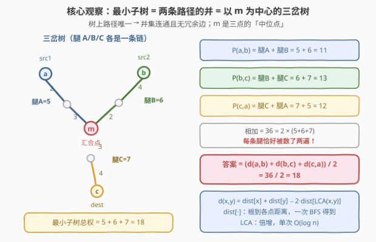
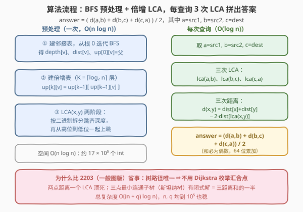

# LeetCode 包含要求路径的最小带权子图 II 题解

## 1. 题目概述

- **标题 / 题号**：包含要求路径的最小带权子图 II（#3553，hard）
- **链接**：https://leetcode.cn/problems/minimum-weighted-subgraph-with-the-required-paths-ii/
- **难度**：困难
- **标签**：树、最近公共祖先、倍增、位运算、深度优先搜索

**题意**：给你一棵 **无向带权树**，共 $n$ 个节点（编号 $0$ 到 $n-1$），由长度为 $n-1$ 的二维数组 `edges` 描述，`edges[i] = [ui, vi, wi]` 表示节点 $u_i$ 与 $v_i$ 之间有一条权重为 $w_i$ 的无向边。

再给你一个二维数组 `queries`，其中 `queries[j] = [src1j, src2j, destj]`。

返回长度等于 `queries.length` 的数组 `answer`，其中 `answer[j]` 表示一棵**子树**的**最小总权重**——使用该子树的边，可以**从 `src1j` 和 `src2j` 都到达 `destj`**。这里的「子树」指原树中任意节点和边组成的**连通子集**所形成的一棵有效树。

**示例 1**：

```text
输入：edges = [[0,1,2],[1,2,3],[1,3,5],[1,4,4],[2,5,6]], queries = [[2,3,4],[0,2,5]]
输出：[12,11]
解释：
answer[0]：从 src1=2 和 src2=3 到 dest=4，选出的子树路径总权重为 3 + 5 + 4 = 12。
answer[1]：从 src1=0 和 src2=2 到 dest=5，选出的子树路径总权重为 2 + 3 + 6 = 11。
```

**示例 2**：

```text
输入：edges = [[1,0,8],[0,2,7]], queries = [[0,1,2]]
输出：[15]
解释：从 src1=0 和 src2=1 到 dest=2，路径总权重为 8 + 7 = 15。
```

**约束**：

- $3 \le n \le 10^5$
- `edges.length == n - 1`，$0 \le u_i, v_i < n$，$1 \le w_i \le 10^4$，保证构成合法的树
- $1 \le \text{queries.length} \le 10^5$
- $0 \le \text{src1}_j, \text{src2}_j, \text{dest}_j < n$，且三者互不相同

> 💡 **读题关键**：这是 2203「包含要求路径的最小带权子图 I」的**树版**。一般图版要靠 3 次 Dijkstra 枚举汇合点；而树**连通无环、任意两点间路径唯一**，两条要求路径是**确定**的，最小子树就是它们的并——问题瞬间从「最短路搜索」坍缩成「树上两点距离 + LCA」的模板组合拳。

## 2. 解题思路

### 2.1 暴力思路：逐查询沿父链收集路径边

把树根在 $0$，预处理出每个点的父节点。每次查询分别从 `src1`、`src2` 沿父指针爬到 `dest`（经过 LCA 中转），把途经的边放进一个哈希集合再去重求和。单次查询 $O(\text{depth})$，树退化成链时深度为 $n-1$，总代价 $O(nq) = 10^{10}$，必然超时。

瓶颈在于：**每条查询都完整重走两遍路径**，而路径上的信息（距离）本可以被 $O(\log n)$ 甚至 $O(1)$ 地「问」出来。

### 2.2 核心观察：最小子树 = 三点斯坦纳树，答案 = 三距离和的一半



三个观察层层递进：

**观察 1：答案 = 两条要求路径的并。** 树上任意两点间路径唯一，所以任何「能从 `src1`、`src2` 到达 `dest`」的连通子图都**必须**包含路径 $P(\text{src1}, \text{dest})$ 与 $P(\text{src2}, \text{dest})$ 的每一条边；反过来，这两条路径的并**本身**就是连通的、是一棵合法子树。下界与可行解重合，答案就是并集的总权重。

**观察 2：这个并是一棵以 $m$ 为中心的「三岔树」。** 设 $a=\text{src1}$、$b=\text{src2}$、$c=\text{dest}$。两条路径汇合的公共部分从某个点 $m$ 开始（$m$ 是三点在树上的**中位点**，也是两两 LCA 中**最深**的那个），于是并集的形状是三条「腿」：

$$\text{answer} = d(a,m) + d(b,m) + d(c,m)$$

**观察 3：三条两两路径把每条腿恰好数两遍。** $P(a,b)$ = 腿A + 腿B，$P(b,c)$ = 腿B + 腿C，$P(c,a)$ = 腿C + 腿A。三者相加，每条腿出现恰好 2 次：

$$d(a,b) + d(b,c) + d(c,a) = 2\big(d(a,m) + d(b,m) + d(c,m)\big)$$

$$\boxed{\ \text{answer} = \frac{d(a,b) + d(b,c) + d(c,a)}{2}\ }$$

**闭式解连 $m$ 都不用显式去找**——三条两两距离一加、除以 2，$m$ 的信息已经被消掉了。剩下的唯一子问题：树上两点距离。任选根（比如 $0$）做一次 BFS 得到根距离 $\text{dist}[\cdot]$，则

$$d(x,y) = \text{dist}[x] + \text{dist}[y] - 2 \cdot \text{dist}[\mathrm{lca}(x,y)]$$

LCA 用**倍增**（binary lifting）预处理 $O(n \log n)$、单次查询 $O(\log n)$——这正是官方标签里「位运算 / 动态规划」的出处：$up[k][v] = up[k-1][\,up[k-1][v]\,]$ 本质是以「跳 $2^k$ 步到达的祖先」为状态的 DP，跳跃量按二进制拆分。

> ⚠️ **常见误读**：一是沿用 2203 一般图版的思路，想「枚举汇合点 $v$ 最小化 $d(a,v)+d(b,v)+d(c,v)$」——树上这个最优点有闭式解（中位点 $m$），而且本题 $q$ 高达 $10^5$，每个查询跑 Dijkstra 是 $O(q \cdot n \log n)$，直接爆炸；二是担心除以 2 出现小数——三条两两路径中每条边被经过 **0 或 2 次**，距离和必为偶数，整除安全。

### 2.3 算法流程图



预处理一次迭代 BFS（防爆栈）+ 倍增表；之后每个查询只做三次「LCA + 距离」，套公式除以 2 收工。

### 2.4 示例演算

以示例 1 的树（根取 $0$）走一遍。BFS 得 `depth = [0,1,2,2,2,3]`，`dist = [0,2,5,7,6,11]`：

| 查询 | 三次 LCA | 三次距离 $d(x,y) = \text{dist}[x]+\text{dist}[y]-2\,\text{dist}[\mathrm{lca}]$ | 答案 |
|------|----------|--------------------------------------------------------------------------------|------|
| `[2,3,4]` | $\mathrm{lca}(2,3)=1$，$\mathrm{lca}(3,4)=1$，$\mathrm{lca}(4,2)=1$ | $d(2,3)=8$，$d(3,4)=9$，$d(4,2)=7$ | $(8+9+7)/2 = \mathbf{12}$ |
| `[0,2,5]` | $\mathrm{lca}(0,2)=0$，$\mathrm{lca}(2,5)=2$，$\mathrm{lca}(5,0)=0$ | $d(0,2)=5$，$d(2,5)=6$，$d(5,0)=11$ | $(5+6+11)/2 = \mathbf{11}$ |

与期望输出 `[12,11]` 一致。第一个查询三点挂在同一个节点 1 下，$m=1$（三腿 $3+5+4$）；第二个查询 $m=2$（最深 LCA），三腿 $d(0,2)+d(0,5)-d(2,5)$ 之外的公共段被公式自动扣除。

## 3. 参考代码

### C++（迭代 BFS + 倍增 LCA）

```cpp
class Solution {
public:
    vector<int> minimumWeight(vector<vector<int>>& edges, vector<vector<int>>& queries) {
        int n = edges.size() + 1;
        vector<vector<pair<int,int>>> adj(n);
        for (auto& e : edges) {
            adj[e[0]].push_back({e[1], e[2]});
            adj[e[1]].push_back({e[0], e[2]});
        }
        int LOG = 1;                       // 2^LOG > 最大深度即可
        while ((1 << LOG) < n) ++LOG;

        vector<int> depth(n, -1);
        vector<long long> dist(n);
        vector<vector<int>> up(LOG, vector<int>(n));
        up[0][0] = 0;                      // 根的父亲指向自己，跳过头也不怕

        vector<int> bfs{0};                // 迭代 BFS：链形树不爆栈
        depth[0] = 0;
        for (int i = 0; i < (int)bfs.size(); ++i) {
            int u = bfs[i];
            for (auto [v, w] : adj[u]) {
                if (depth[v] == -1) {
                    depth[v] = depth[u] + 1;
                    dist[v] = dist[u] + w;
                    up[0][v] = u;
                    bfs.push_back(v);
                }
            }
        }
        for (int k = 1; k < LOG; ++k)      // 倍增表：跳 2^k 步的祖先
            for (int v = 0; v < n; ++v)
                up[k][v] = up[k - 1][up[k - 1][v]];

        auto lca = [&](int x, int y) {
            if (depth[x] < depth[y]) swap(x, y);
            int diff = depth[x] - depth[y];
            for (int k = 0; diff; ++k, diff >>= 1)   // 二进制拆深度差，逐位上跳
                if (diff & 1) x = up[k][x];
            if (x == y) return x;
            for (int k = LOG - 1; k >= 0; --k)       // 高位到低位一起跳
                if (up[k][x] != up[k][y]) { x = up[k][x]; y = up[k][y]; }
            return up[0][x];
        };
        auto d = [&](int x, int y) {
            return dist[x] + dist[y] - 2 * dist[lca(x, y)];
        };

        vector<int> ans;
        ans.reserve(queries.size());
        for (auto& qy : queries) {
            long long s = d(qy[0], qy[1]) + d(qy[1], qy[2]) + d(qy[2], qy[0]);
            ans.push_back((int)(s / 2));   // 每条边被数 0/2 次，和必为偶数
        }
        return ans;
    }
};
```

### Python

```python
class Solution:
    def minimumWeight(self, edges: List[List[int]], queries: List[List[int]]) -> List[int]:
        n = len(edges) + 1
        adj = [[] for _ in range(n)]
        for u, v, w in edges:
            adj[u].append((v, w))
            adj[v].append((u, w))

        LOG = max(1, (n - 1).bit_length())     # 2^LOG > 最大深度
        depth = [-1] * n
        dist = [0] * n
        up = [[0] * n for _ in range(LOG)]
        up[0][0] = 0                            # 根的父亲指向自己

        bfs = [0]
        depth[0] = 0
        for u in bfs:                           # 迭代 BFS：链形树不爆栈
            for v, w in adj[u]:
                if depth[v] == -1:
                    depth[v] = depth[u] + 1
                    dist[v] = dist[u] + w
                    up[0][v] = u
                    bfs.append(v)
        for k in range(1, LOG):
            upk, upk1 = up[k], up[k - 1]
            for v in range(n):
                upk[v] = upk1[upk1[v]]

        def lca(x: int, y: int) -> int:
            if depth[x] < depth[y]:
                x, y = y, x
            diff = depth[x] - depth[y]
            k = 0
            while diff:                         # 二进制拆深度差，逐位上跳
                if diff & 1:
                    x = up[k][x]
                diff >>= 1
                k += 1
            if x == y:
                return x
            for k in range(LOG - 1, -1, -1):    # 高位到低位一起跳
                if up[k][x] != up[k][y]:
                    x = up[k][x]
                    y = up[k][y]
            return up[0][x]

        def d(x: int, y: int) -> int:
            return dist[x] + dist[y] - 2 * dist[lca(x, y)]

        ans = []
        for a, b, c in queries:
            ans.append((d(a, b) + d(b, c) + d(c, a)) // 2)
        return ans
```

> 💡 **写法要点**：
> - **迭代 BFS 防爆栈**：$n = 10^5$ 的链形树递归深度同量级，Python 默认上限 1000 必炸；「遍历队列 + 边遍历边扩展」的写法（`for u in bfs:`）天然线性。
> - **根的父亲指向自己**（`up[0][0] = 0`）：跳跃越过后停在根，不用判空；倍增表的归纳构造也由此封口。
> - **64 位累加**：单次距离上限约 $(10^5)\times(10^4) = 10^9$，三项求和可达 $3\times10^9$，超出 `int32`；最终答案 $\le 10^9$ 落回 `int` 安全区（C++ 返回 `vector<int>`）。
> - **除法必整除**：三条两两路径中每条边被经过 0 或 2 次，距离和是偶数，`// 2` 无舍入误差。
> - **LOG 取法**：`2^LOG > n` 即可保证能对齐任意深度差并完成第二阶段上跳（C++ 用 `while ((1 << LOG) < n)`，Python 用 `(n-1).bit_length()`）。

## 4. 复杂度分析

| 维度 | 复杂度 | 说明 |
|------|--------|------|
| 时间复杂度 | $O((n + q)\log n)$ | 预处理 BFS $O(n)$ + 倍增表 $O(n\log n)$；每查询 3 次 LCA，各 $O(\log n)$ |
| 空间复杂度 | $O(n \log n)$ | 倍增表 $\lceil\log_2 n\rceil \times n$（约 $17\times10^5$ 个 int）+ 邻接表与 depth/dist 各 $O(n)$ |

> 💡 对照暴力：$O(nq) = 10^{10}$ → $O((n+q)\log n) \approx 6\times10^6$ 次基本操作，快三个数量级；换欧拉序 + ST 表的 $O(1)$ LCA 可再降为 $O(n\log n + q)$，但代码量翻倍，倍增版在此数据规模下足够。

## 5. 扩展：一般图版与 O(1) LCA

- **一般图版（2203）**：图上路径不唯一，「最小权连通子图含三条路径」是真正的**斯坦纳树问题**（NP 难）；但三点版可在多项式时间解决——从 $a$、$b$、$c$ 各跑一次 Dijkstra，答案 $= \min_v \big(d_a(v) + d_b(v) + d_c(v)\big)$（最优汇合点被枚举出来）。树是特例：路径唯一让汇合点有闭式解，本题公式正是一般图解在树上的退化形态。
- **O(1) LCA**：欧拉序（每点进出各记一次）+ ST 表稀疏查询，预处理 $O(n\log n)$ 后每次 LCA $O(1)$。$q$ 与 $n$ 同为 $10^5$ 时总代价与倍增版同阶，$q$ 再大一个量级才值得切换。
- **倍增的 DP 本质**：$up[k][v] = up[k-1][up[k-1][v]]$ 是「半程拼接」的状态转移——跳 $2^k$ 步 = 跳两个 $2^{k-1}$ 步。同一骨架稍加改造即得 1483「树节点的第 K 个祖先」、树上路径第 $k$ 条边、两点路径中点等一族的通解。

## 6. 面试要点

1. **为什么答案就是两条路径的并？**

   > 树上两点间简单路径唯一。任何满足「从 src1、src2 可达 dest」的连通子图都必须含这两条路径的全部边（连通性强制包含唯一路径）；而并集本身连通、构成合法子树。下界 = 可行解，即最小值。

2. **$(d(a,b)+d(b,c)+d(c,a))/2$ 为什么成立？为什么一定能整除？**

   > 并集是以中位点 $m$ 为中心的三岔树，权为 $d(a,m)+d(b,m)+d(c,m)$；而三条两两路径分别是「两条腿的拼接」，求和后每条腿恰好被数两次。故距离和 = 2 × 三岔树权。每条边在三条两两路径中被经过 0 或 2 次，和必为偶数。

3. **中位点 $m$ 怎么求？本题需要求它吗？**

   > $m$ 是三个两两 LCA 中**最深**的那个（三个两两 LCA 必有两个相同、第三个相同或更深）。但闭式公式把 $m$ 消掉了，实现里只需三次 LCA 求距离，不必显式定位 $m$——除非题目改成「输出汇合点」。

4. **倍增 LCA 的两个阶段分别是什么？**

   > 先**对齐深度**：把深度差按二进制拆分，逐位用 $up[k][\cdot]$ 跳；再**同跳找分叉**：从高位到低位，若 $up[k][x] \ne up[k][y]$ 则一起上跳，最后 $up[0][x]$ 即 LCA。根的父亲设为自己，跳跃越界自动停靠。

5. **为什么不能像 2203 那样跑 Dijkstra？**

   > 2203 的 $q$ 规模小，每个查询 3 次 Dijkstra 可承受；本题 $q$ 到 $10^5$，$O(q \cdot n\log n)$ 必超时。树的结构（路径唯一）把最短路搜索坍缩成 $O(\log n)$ 的 LCA 查询——识别「树上两点距离 = dist 前缀差 + LCA」这一模板是本题的考察核心。

> 💡 **一句话总结**：3553 = 「树上三点斯坦纳树的闭式解」——最小子树是两条唯一路径的并（三岔树），答案 $= (d(a,b)+d(b,c)+d(c,a))/2$；距离用「根距离 + 倍增 LCA」$O(\log n)$ 问出来，总复杂度 $O((n+q)\log n)$。

## 同类练习题

| # | 题目 | 与本题的关联 |
|---|------|-------------|
| 2203 | [包含要求路径的最小带权子图 I](https://leetcode.cn/problems/minimum-weighted-subgraph-with-the-required-paths/) | 本题的一般图版，3 次 Dijkstra + 枚举汇合点 $v$ 取 $d_a(v)+d_b(v)+d_c(v)$ 最小，对照理解「路径唯一」带来的闭式解退化 |
| 1483 | [树节点的第 K 个祖先](https://leetcode.cn/problems/kth-ancestor-of-a-tree-node/)（[题解](../1401-1500/1483_树节点的第K个祖先.md)） | 倍增表 $up[k][v]$ 的纯模板题，K 拆二进制逐位跳与本题 LCA 第一阶段同源 |
| 236 | [二叉树的最近公共祖先](https://leetcode.cn/problems/lowest-common-ancestor-of-a-binary-tree/)（[题解](../0201-0300/236_二叉树的最近公共祖先.md)） | LCA 概念入门（二叉树后序递归版），与倍增在线版互为参照 |
| 834 | [树中距离之和](https://leetcode.cn/problems/sum-of-distances-in-tree/)（[题解](../0801-0900/834_树中距离之和.md)） | 树上批量距离的另一套武器「换根 DP」，与「根距离 + LCA」的距离公式组合覆盖大多数树上距离问题 |
