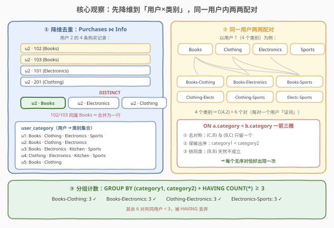
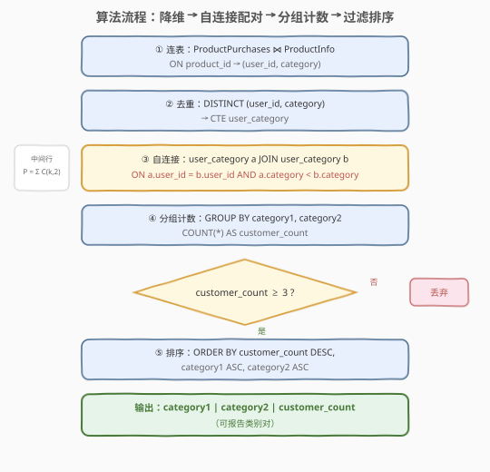
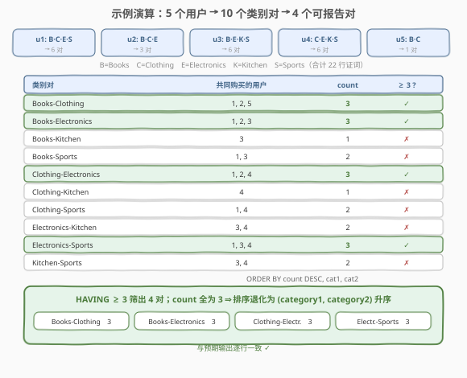

# 查找类别推荐对

- **题目名称**：查找类别推荐对
- **链接**：[3554. 查找类别推荐对](https://leetcode.cn/problems/find-category-recommendation-pairs/)
- **难度**：困难
- **标签**：数据库、SQL、自连接（Self Join）、`GROUP BY`、`HAVING`、`DISTINCT` 去重、CTE、组合枚举

## 1. 题目概述

**表结构**：

`ProductPurchases` 表：

| 列名 | 类型 |
|------|------|
| user_id | int |
| product_id | int |
| quantity | int |

- `(user_id, product_id)` 是这张表的唯一主键。
- 每一行代表用户以特定数量购买的一种产品。

`ProductInfo` 表：

| 列名 | 类型 |
|------|------|
| product_id | int |
| category | varchar |
| price | decimal |

- `product_id` 是这张表的唯一主键。
- 每一行表示一件商品的类别和价格。

**目标**：编写一个解决方案：

- 查找所有**类别对**（其中 $category1 < category2$，按字典序）；
- 对于每个类别对，确定**同时**购买了两类别产品的**不同用户**数量；
- 若至少有 **3 个**不同的客户购买了两个类别的产品，则该类别对被视为**可报告的**；
- 返回可报告的类别对，按 `customer_count` **降序**排列，为防排序持平，再按 `category1` **升序**、`category2` **升序**排列。

**示例 1**：

```text
输入：
ProductPurchases 表：
+---------+------------+----------+
| user_id | product_id | quantity |
+---------+------------+----------+
| 1       | 101        | 2        |
| 1       | 102        | 1        |
| 1       | 201        | 3        |
| 1       | 301        | 1        |
| 2       | 101        | 1        |
| 2       | 102        | 2        |
| 2       | 103        | 1        |
| 2       | 201        | 5        |
| 3       | 101        | 2        |
| 3       | 103        | 1        |
| 3       | 301        | 4        |
| 3       | 401        | 2        |
| 4       | 101        | 1        |
| 4       | 201        | 3        |
| 4       | 301        | 1        |
| 4       | 401        | 2        |
| 5       | 102        | 2        |
| 5       | 103        | 1        |
| 5       | 201        | 2        |
| 5       | 202        | 3        |
+---------+------------+----------+

ProductInfo 表：
+------------+-------------+-------+
| product_id | category    | price |
+------------+-------------+-------+
| 101        | Electronics | 100   |
| 102        | Books       | 20    |
| 103        | Books       | 35    |
| 201        | Clothing    | 45    |
| 202        | Clothing    | 60    |
| 301        | Sports      | 75    |
| 401        | Kitchen     | 50    |
+------------+-------------+-------+

输出：
+-------------+-------------+----------------+
| category1   | category2   | customer_count |
+-------------+-------------+----------------+
| Books       | Clothing    | 3              |
| Books       | Electronics | 3              |
| Clothing    | Electronics | 3              |
| Electronics | Sports      | 3              |
+-------------+-------------+----------------+
```

**解释**：

- Books-Clothing：用户 1（Books:102 + Clothing:201）、用户 2（Books:102,103 + Clothing:201）、用户 5（Books:102,103 + Clothing:201,202）——共 **3** 人；
- Books-Electronics：用户 1、2、3——共 **3** 人；
- Clothing-Electronics：用户 1、2、4——共 **3** 人；
- Electronics-Sports：用户 1、3、4——共 **3** 人；
- 其它类别对如 Clothing-Sports（仅用户 1、4 共 2 人）、Books-Kitchen（仅用户 3 共 1 人）共同用户不足 3 个，不入选；
- 所有可报告对的 `customer_count` 均为 3，故排序退化为按 `category1`、`category2` 字典序升序。

**约束条件**（由表结构与题意提取）：

- `ProductPurchases` 的主键是 `(user_id, product_id)`——**不是** `(user_id, category)`：同一用户可以在**同一类别**购买多件不同商品（如用户 2 买了 102、103 两本 Book），这是本题最大的坑；
- `quantity` 与 `price` 字段均为烟雾弹，与统计无关；
- `category1 < category2` 的字典序约定保证每个无序类别对在结果中至多出现一次。

> 💡 **审题关键**：① 「同时购买两类」⇒ 把购买记录降维成「用户×类别」集合后做**交集计数**；② 「类别对」⇒ 同一用户的类别两两组合（组合数 $C(k,2)$）；③ 「至少 3 人」⇒ `GROUP BY` 之后的**组级条件**，必须用 `HAVING`；④ 「category1 < category2」既是输出规范，也是**去对称重复**的抓手。四点凑齐，本题就是一道自连接模板题。

---

## 2. 解题思路

### 2.1 暴力思路：枚举所有类别对，逐对验证共同用户

最直译的写法是「外层枚举 + 内层验证」：先把所有类别两两组成 $C(m,2)$ 个候选对（$m$ 为类别数），再对每个候选对扫一遍「用户×类别」表，用两个 `EXISTS` 数出在两个类别**都**出现过的用户：

```sql
WITH user_category AS (
    SELECT DISTINCT pp.user_id, pi.category
    FROM ProductPurchases pp
    JOIN ProductInfo pi ON pp.product_id = pi.product_id
),
all_pairs AS (
    SELECT a.category AS category1, b.category AS category2
    FROM (SELECT DISTINCT category FROM user_category) a
    CROSS JOIN (SELECT DISTINCT category FROM user_category) b
    WHERE a.category < b.category
)
SELECT p.category1, p.category2, COUNT(*) AS customer_count
FROM all_pairs p
CROSS JOIN (SELECT DISTINCT user_id FROM user_category) u
WHERE EXISTS (SELECT 1 FROM user_category x
              WHERE x.user_id = u.user_id AND x.category = p.category1)
  AND EXISTS (SELECT 1 FROM user_category y
              WHERE y.user_id = u.user_id AND y.category = p.category2)
GROUP BY p.category1, p.category2
HAVING COUNT(*) >= 3
ORDER BY customer_count DESC, p.category1, p.category2;
```

逻辑正确（MySQL 可运行），但**方向反了**：

1. **重复扫描**：类别对 × 用户做笛卡尔积，每个组合还要做两次 `EXISTS` 探测，整体约 $O(m^2 \cdot n)$（$n$ 为用户×类别行数）；
2. **先枚举后过滤**：绝大多数类别对根本凑不齐 3 人（示例 5 个类别共 10 对，只有 4 对可报告），先花大代价枚举再丢弃；
3. 相关子查询嵌套深，优化器难以改写。

### 2.2 核心观察：换方向——「按用户生成类别对」再分组计数



把「求每个类别对的共同用户数」倒过来想：**一个用户如果同时属于类别 X 和 Y，他天然就是对 (X, Y) 的一名「证人」**。于是只需让每个用户为自己的类别对「投票」，最后按对计票：

1. **降维（DISTINCT）**：`Purchases ⋈ Info` 后取 `DISTINCT (user_id, category)`，把「买了哪件商品」坍缩成「买了哪些类别」——用户 2 的 4 条购买记录（102、103、101、201）坍缩成 3 个类别（Books、Electronics、Clothing）。**这一步必须做**：主键是 `(user_id, product_id)` 而非 `(user_id, category)`，同类别多商品会让同一用户被重复计数（5.1 节详述）。
2. **配对（自连接）**：`user_category a JOIN user_category b ON a.user_id = b.user_id AND a.category < b.category`——同一用户的不同类别两两「握手」，每个用户产出 $C(k_u, 2)$ 行（$k_u$ 为该用户的类别数），每行是一条「(类别对, 用户)」证词。
3. **计票（GROUP BY + HAVING）**：按 `(category1, category2)` 分组，`COUNT(*)` 就是共同用户数（第 1 步已去重，每对每用户恰一行）；`HAVING COUNT(*) >= 3` 筛出可报告对。

连接条件 `a.category < b.category` 是**一箭三雕**的关键比较符：

- **剔除对称重复**：`(Books, Clothing)` 与 `(Clothing, Books)` 只保留字典序小的方向，无序对唯一化；
- **满足输出规范**：题目要求 `category1 < category2`，连接条件直接保证；
- **排除同类配对**：`(Books, Books)` 这种类别相同的「对」天然不满足严格小于。

> 💡 与 2.1 对照：暴力是「对每个**对**，去找**用户**」（外层组合、内层扫描验证）；自连接是「对每个**用户**，去生成**对**」（一趟连接把所有证词摊开，再分组汇总）。后者把「交集大小」问题转化为「分组计数」问题——这正是自连接在关系代数里的本职：**同一关系的笛卡尔积 + 条件筛选**。示例中 5 个用户共生成 $6+3+6+6+1=22$ 行证词，一次分组即得全部 10 对的计数。

### 2.3 算法流程图



**逻辑执行步骤**：

| 步骤 | 子句 | 作用 |
|------|------|------|
| ① | `Purchases JOIN Info ON product_id` | 商品 → 类别，得到 (user_id, category) |
| ② | `DISTINCT` | 坍缩为「用户×类别」集合（CTE `user_category`） |
| ③ | 自连接 + `a.category &lt; b.category` | 同一用户类别两两配对，产出 (类别对, 用户) 行 |
| ④ | `GROUP BY category1, category2` | `COUNT(*)` 即共同用户数 |
| ⑤ | `HAVING COUNT(*) >= 3` | 组级过滤，留下可报告对 |
| ⑥ | `ORDER BY` 三键排序 | count 降序，category1、category2 依次升序 |

> 💡 **WHERE 与 HAVING 的分工**：③ 的 `a.category < b.category` 写在 `ON` 里（内连接下放 `WHERE` 语义等价），是分组**前**的行级条件；「≥ 3 人」是对聚合结果的判断，发生在分组**后**，只能写 `HAVING`。SQL 逻辑执行顺序 `FROM → ON → WHERE → GROUP BY → HAVING → SELECT → ORDER BY`——聚合值诞生在 GROUP BY 之后，所以 `WHERE` 里引用 `COUNT(*)` 会直接报错。

### 2.4 示例演算



**第 ① 步：每个用户的类别集合**（Purchases ⋈ Info 后 DISTINCT）：

| 用户 | 购买商品 | 类别集合 |
|------|----------|----------|
| 1 | 101, 102, 201, 301 | {Books, Clothing, Electronics, Sports} |
| 2 | 101, 102, 103, 201 | {Books, Clothing, Electronics} |
| 3 | 101, 103, 301, 401 | {Books, Electronics, Kitchen, Sports} |
| 4 | 101, 201, 301, 401 | {Clothing, Electronics, Kitchen, Sports} |
| 5 | 102, 103, 201, 202 | {Books, Clothing} |

**第 ② 步：按用户生成类别对**（$k$ 个类别产出 $C(k,2)$ 行证词）：

- 用户 1（4 类）→ 6 对；用户 2（3 类）→ 3 对；用户 3（4 类）→ 6 对；用户 4（4 类）→ 6 对；用户 5（2 类）→ 1 对；
- 合计 $6+3+6+6+1=22$ 行「(类别对, 用户)」中间行。

**第 ③ 步：分组计数 + HAVING ≥ 3**：

| 类别对 | 共同用户 | count | 入选 |
|--------|----------|-------|------|
| Books-Clothing | 1, 2, 5 | 3 | ✓ |
| Books-Electronics | 1, 2, 3 | 3 | ✓ |
| Books-Kitchen | 3 | 1 | ✗ |
| Books-Sports | 1, 3 | 2 | ✗ |
| Clothing-Electronics | 1, 2, 4 | 3 | ✓ |
| Clothing-Kitchen | 4 | 1 | ✗ |
| Clothing-Sports | 1, 4 | 2 | ✗ |
| Electronics-Kitchen | 3, 4 | 2 | ✗ |
| Electronics-Sports | 1, 3, 4 | 3 | ✓ |
| Kitchen-Sports | 3, 4 | 2 | ✗ |

**第 ④ 步：排序输出**：4 个可报告对的 count 全为 3，排序退化为 `category1, category2` 字典序升序——Books-Clothing → Books-Electronics → Clothing-Electronics → Electronics-Sports，与预期输出逐行一致。

---

## 3. 参考代码

### SQL（CTE + 自连接，推荐）

```sql
# Write your MySQL query statement below
WITH user_category AS (
    SELECT DISTINCT pp.user_id, pi.category
    FROM ProductPurchases pp
    JOIN ProductInfo pi ON pp.product_id = pi.product_id
)
SELECT a.category AS category1,
       b.category AS category2,
       COUNT(*) AS customer_count
FROM user_category a
JOIN user_category b
  ON a.user_id = b.user_id
 AND a.category < b.category
GROUP BY category1, category2
HAVING COUNT(*) >= 3
ORDER BY customer_count DESC, category1, category2;
```

> 💡 **写法要点**：
> - CTE 内 `DISTINCT` 保证「每用户每类别一行」⇒ 自连接后每个 (类别对, 用户) 恰好一行，`COUNT(*)` 即正确答案；
> - `<` 条件写在 `ON` 里：内连接下放 `WHERE` 语义完全等价，放 `ON` 更能表达「这是配对规则」而非「过滤脏数据」；
> - `GROUP BY` / `HAVING` 引用 `SELECT` 别名是 MySQL 方言（标准写法为 `GROUP BY a.category, b.category`、`HAVING COUNT(*) >= 3` 保持不变）；
> - 排序三键缺一不可：count 降序在前，`category1`、`category2` 升序兜底防持平。

### SQL（不建 CTE 的一趟四表版本）

```sql
SELECT i1.category AS category1,
       i2.category AS category2,
       COUNT(DISTINCT p1.user_id) AS customer_count
FROM ProductPurchases p1
JOIN ProductInfo i1 ON p1.product_id = i1.product_id
JOIN ProductPurchases p2 ON p2.user_id = p1.user_id
JOIN ProductInfo i2 ON p2.product_id = i2.product_id
WHERE i1.category < i2.category
GROUP BY category1, category2
HAVING COUNT(DISTINCT p1.user_id) >= 3
ORDER BY customer_count DESC, category1, category2;
```

> 💡 不预去重时中间结果按「商品对」膨胀（用户 2 的 4 条记录自乘出 16 种组合），必须 `COUNT(DISTINCT user_id)` 兜底正确性；逻辑等价但中间行数更多（见 5.1 对比），适合作为「一趟写完」的对照版本。

### Pandas

```python
import pandas as pd


def find_category_recommendation_pairs(product_purchases: pd.DataFrame, product_info: pd.DataFrame) -> pd.DataFrame:
    uc = (
        product_purchases.merge(product_info, on="product_id")[["user_id", "category"]]
        .drop_duplicates()
    )
    a = uc.rename(columns={"category": "category1"})
    b = uc.rename(columns={"category": "category2"})
    pairs = a.merge(b, on="user_id")
    pairs = pairs[pairs["category1"] < pairs["category2"]]
    cnt = (
        pairs.groupby(["category1", "category2"], as_index=False)["user_id"]
        .nunique()
        .rename(columns={"user_id": "customer_count"})
    )
    return (
        cnt[cnt["customer_count"] >= 3]
        .sort_values(["customer_count", "category1", "category2"], ascending=[False, True, True])
        .reset_index(drop=True)
    )
```

> 💡 **pandas 对照**：`merge` + `drop_duplicates` 对应 CTE 降维；同一张表改名后 `merge` 即「自连接」（merge 无自引用限制，改名副本即可）；布尔条件 `category1 < category2` 对应连接条件（pandas 按元素做字符串字典序比较）；`groupby + nunique` 对应 `GROUP BY + COUNT(*)`（去重后 `nunique` 与 `size` 等价，`nunique` 更稳）；`sort_values` 传 `ascending` 列表实现三键混向排序。

---

## 4. 复杂度分析

| 维度 | 复杂度 | 说明 |
|------|--------|------|
| **时间复杂度** | $O(n + P)$ | $n$ 为购买记录数：连表 + 去重一趟 $O(n)$；$P = \sum_u \binom{k_u}{2}$ 为自连接产出的「(类别对, 用户)」行数，分组计数再花 $O(P)$ |
| **空间复杂度** | $O(d + P)$ | $d \le n$ 为去重后的「用户×类别」行数（CTE 物化），加上中间配对行 |

> - $k_u$ 为用户 $u$ 的类别数。最坏情况（某用户覆盖全部 $m$ 个类别）$P = O(d \cdot m)$；类别数远小于商品数的现实数据下，中间结果远小于全表笛卡尔积。
> - 暴力解（2.1）为 $O(m^2 \cdot n)$：候选对数 × 每对扫描验证用户集合。
> - **索引视角**：`ProductInfo.product_id` 是主键，连表走索引；`user_category` 按 `user_id` 组织后，自连接退化为「每个用户组内 $O(k_u^2)$」的局部小笛卡尔积；分组用哈希聚合 $O(P)$。
> - LeetCode SQL 数据量小，两种写法均在毫秒级；差异体现在中间结果规模与语义清晰度上。

---

## 5. 扩展：三个易错变体

### 5.1 不去重 + `COUNT(*)`：直接虚高

若跳过 `DISTINCT`（或四表版里把 `COUNT(DISTINCT p1.user_id)` 写成 `COUNT(*)`）：

- 用户 2 在 Books 买了 102、103 两件、在 Electronics 买了 101 一件 ⇒ 自连接为用户 2 产出 (Books, Electronics) × 2 行证词；
- `COUNT(*)` 把 Books-Electronics 数成 $1 + 2 + 1 = 4$（用户 1 一行、用户 2 两行、用户 3 一行）——**虚高 1**。
- 根因：主键是 `(user_id, product_id)`，「同类别多商品」让同一 (用户, 类别对) 出现多次。`DISTINCT` 预去重（推荐，同时压缩中间结果）或 `COUNT(DISTINCT)` 事后兜底（保正确但中间结果仍膨胀），**二者必居其一**。

### 5.2 `<` 写成 `<>`：每对拆成两组

`a.category <> b.category` 会把 (Books, Clothing) 与 (Clothing, Books) 当成**两个不同的组**分别计数（各 3 人）——输出行数翻倍且违反 `category1 < category2` 规范；写成 `=` 则生成 (Books, Books) 这类无意义的同类「对」。无序对的唯一化必须用**严格不等号**（`<` 或 `>` 二选一）——这与 197「上升的温度」用 `w2.id > w1.id` 去掉自比与重复是同一技巧。

### 5.3 变体：只要共同用户最多的对（Top-1）

若追问「不写死阈值 3，只要 count 最大的对」，在分组结果外套一层窗口函数即可：

```sql
SELECT category1, category2, customer_count
FROM (
    SELECT category1, category2, customer_count,
           RANK() OVER (ORDER BY customer_count DESC) AS rk
    FROM ( ...分组计数结果... ) t
) r
WHERE rk = 1;
```

阈值改为 $K$ 时只需参数化 `HAVING` 中的常量，结构不变——这正是把「过滤条件」收敛到 `HAVING` 一处的架构收益。

---

## 6. 面试要点

1. **为什么必须先 `DISTINCT`（或用 `COUNT(DISTINCT)`）？**

   > `ProductPurchases` 的主键是 `(user_id, product_id)` 而非 `(user_id, category)`——同一用户可以在同一类别购买多件商品（示例中用户 2 在 Books 买 102、103 两件）。不去重时自连接按「商品对」膨胀，`COUNT(*)` 会重复计入同一用户：Books-Electronics 从真实的 3 虚高到 4。预 `DISTINCT` 让「每用户每类别一行」，`COUNT(*)` 即答案；或用 `COUNT(DISTINCT user_id)` 兜底，但中间结果仍按商品数膨胀。

2. **`a.category < b.category` 这个比较符起了几个作用？**

   > 三个：① 剔除对称重复——(X,Y) 与 (Y,X) 只保留一个方向，无序对唯一化；② 直接满足输出规范 `category1 < category2`；③ 排除 (X,X) 同类配对。若写成 `<>`，每对拆成两组、输出翻倍且违反规范；写成 `=` 则生成同类对。与 197「上升的温度」用 `w2.id > w1.id` 去自比重复是同一招。

3. **`HAVING` 和 `WHERE` 在本题里怎么分工？**

   > `WHERE`/`ON` 在分组**前**作用于原始行：`a.category < b.category` 是行级条件，放这里；「customer_count ≥ 3」是对 `COUNT(*)` 聚合结果的判断，分组后才存在，只能 `HAVING`。逻辑执行顺序为 `FROM → ON → WHERE → GROUP BY → HAVING → SELECT → ORDER BY`，聚合值诞生在 GROUP BY 之后，WHERE 里引用 `COUNT(*)` 会直接报错。

4. **数据量大时如何优化？**

   > 分三层：① 连表侧 `ProductInfo.product_id` 是主键，走索引/哈希连接 $O(n)$；② 自连接按 `user_id` 分区后是每个用户组内的局部 $O(k_u^2)$ 配对——先把 `user_category` 物化为按 `user_id` 聚簇的中间表（或建 `(user_id, category)` 索引），避免连接过程反复重扫；③ 分组用哈希聚合 $O(P)$。中间行数 $P=\sum_u\binom{k_u}{2}$ 只与「用户类别分散度」有关、与商品数无关——这也是先 `DISTINCT` 的第二重收益：把 $k_u$ 从商品数压到类别数。

5. **三个排序键、两个方向，SQL 怎么落地？**

   > `ORDER BY customer_count DESC, category1 ASC, category2 ASC`——每列独立指定方向，MySQL 中 `SELECT` 别名可直接用于 `ORDER BY`。题面的「防排序持平」链缺一不可：示例里 4 个可报告对的 count 全为 3，输出顺序完全由后两个键决定，漏写任何一个键都可能输出不稳定。

> 💡 **一句话总结**：3554 是「**自连接枚举无序对**」的招牌题——先把购买记录 `DISTINCT` 降维成「用户×类别」，再让同一用户的类别两两握手（`a.category < b.category` 一箭三雕：去对称、保输出序、排同类），`GROUP BY` 后 `HAVING ≥ 3` 收官。两个坑：**主键不含 category 导致的重复计数**、**WHERE/HAVING 层级错用**。同构题：197（自连接入门）、180（自连接三副本）、1398（购买集合匹配）。

---

## 7. 同类练习题

- [197. 上升的温度](https://leetcode.cn/problems/rising-temperature/)（[题解](../0101-0200/197_上升的温度.md)）：自连接入门招牌题——同表 JOIN + 不等条件去自比重复，与本题 `<` 一箭三雕同源
- [180. 连续出现的数字](https://leetcode.cn/problems/consecutive-numbers/)（[题解](../0101-0200/180_连续出现的数字.md)）：自连接三个副本 + `GROUP BY/HAVING`，本题结构的进阶版
- [1398. 购买了产品 A 和产品 B 但没有购买产品 C 的顾客](https://leetcode.cn/problems/customers-who-bought-products-a-and-b-but-not-c/)（[题解](../1301-1400/1398_购买了产品A和产品B却没有购买产品C的顾客.md)）：同是购买表上的集合匹配，A∩B−C 与「同时购买两类」互为镜像
- [1045. 买下所有产品的客户](https://leetcode.cn/problems/customers-who-bought-all-products/)（[题解](../1001-1100/1045_买下所有产品的客户.md)）：`HAVING COUNT(DISTINCT ...) = 总数` 的组级聚合判断，与本题 `HAVING ≥ 3` 同一工具箱
- [578. 查询回答率最高的问题](https://leetcode.cn/problems/get-highest-answer-rate-question/)（[题解](../0501-0600/578_查询回答率最高的问题.md)）：分组聚合 + 多键排序取最值，练本题第 ⑤⑥ 步的排序与取头名
