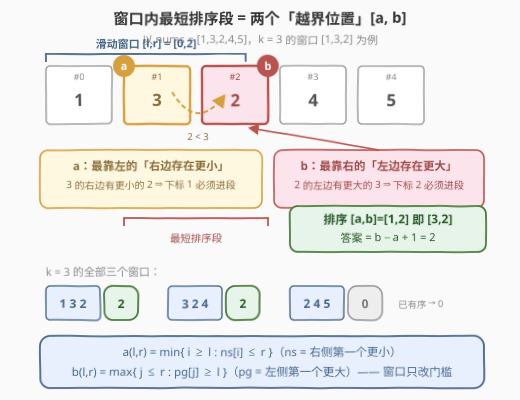
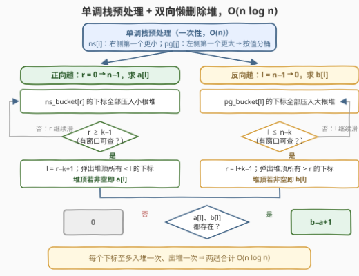

# LeetCode 排序每个滑动窗口中最小的子数组 题解

## 1. 题目概述

- **标题 / 题号**：排序每个滑动窗口中最小的子数组（#3555，medium）
- **链接**：https://leetcode.cn/problems/smallest-subarray-to-sort-in-every-sliding-window/
- **难度**：中等
- **标签**：栈、贪心、数组、双指针、排序、单调栈

> ⚠️ 本题为 LeetCode 付费题，题意描述根据官方示例用例与 hints 重建（函数签名与约束为按惯例的假设），可能与官方题面有出入。

**题意**：给你一个整数数组 `nums` 和一个整数 `k`。数组的每个**长度为 `k` 的滑动窗口**（共 $n-k+1$ 个）独立回答同一个问题：

> 找出窗口内一段**最短的连续子数组**，使得对它升序排序后，整个窗口变成**非递减**；若窗口本身已经非递减，答案为 `0`。

返回长度为 $n-k+1$ 的数组 `answer`，其中 `answer[i]` 对应左端点为 `i` 的窗口。

**示例 1**：

```text
输入：nums = [1,3,2,4,5], k = 3
输出：[2,2,0]
解释：
- 窗口 [1,3,2]：只需排序子数组 [3,2]，得到 [1,2,3]，答案 2；
- 窗口 [3,2,4]：只需排序子数组 [3,2]，得到 [2,3,4]，答案 2；
- 窗口 [2,4,5]：已经非递减，答案 0。
```

**示例 2**：

```text
输入：nums = [5,4,3,2,1], k = 4
输出：[4,4]
解释：两个窗口 [5,4,3,2] 与 [4,3,2,1] 都必须整体排序，答案均为 4。
```

**约束**：

- $1 \le k \le nums.length \le 10^5$（按惯例假设）
- $-10^5 \le nums[i] \le 10^5$

> 💡 **读题关键**：本题是 [581. 最短无序连续子数组](https://leetcode.cn/problems/shortest-unsorted-continuous-subarray/) 的滑动窗口版——581 相当于 $k = n$ 只有一个窗口，本题要把同样的分析对 $n-k+1$ 个窗口**各做一遍**，且不能每个窗口都从头扫。两个官方 hint 正是这条路线图："Solve for each subarray independently"（每个窗口独立求解）与 "What are the extreme positions that need to be included in the segment to make the subarray non‑decreasing?"（用极值位置刻画排序段边界）。

## 2. 解题思路

### 2.1 朴素思路：每个窗口独立套 581 的双向扫描

按 hint 1，对每个窗口 $[l, r]$ 直接搬 581 的 $O(k)$ 双向扫描：从左到右维护前缀最大值，最后一个小于它的位置是无序段右边界；从右到左维护后缀最小值，最后一个大于它的位置是左边界。

共 $n-k+1$ 个窗口，时间 $O(nk)$。当 $k$ 与 $n$ 同阶（例如 $k = n/2$）时退化为 $O(n^2)$，$n = 10^5$ 时约 $10^{10}$ 次操作，必然超时。症结在于：**窗口每滑一步，都与上一窗口重叠 $k-1$ 个元素，我们却把高度重叠的区间从头再扫一遍**。

### 2.2 核心观察：边界条件与窗口无关，可全局预处理

先回答 hint 2 的提问——「让窗口非递减，哪些极值位置必须被排序段覆盖？」

> **排序段的左右边界由两个「越界位置」唯一确定**：
> - 左边界 $a$：窗口内**最靠左**的、右边（窗口内）存在比它**更小**元素的位置；
> - 右边界 $b$：窗口内**最靠右**的、左边（窗口内）存在比它**更大**元素的位置。
>
> 窗口无序时最短排序段就是 $[a, b]$，答案 $b-a+1$；窗口有序时两个位置都不存在，答案 $0$。



证明与 581 同构，两个方向各一句：

- **必须包含**：$a$ 右侧有个更小的元素，二者相对顺序错了。把 $a$ 留在排序段外，它依旧压着后面那个小元素，窗口不可能非递减；$b$ 对称。
- **只需 $[a,b]$**：$a$ 左边的元素都不大于其后（窗口内）任何元素，$b$ 右边的元素都不小于其前任何元素——两侧天然有序，且分别与段内元素相容，段内排完序整体即非递减。

关键一步来了——把「右边存在更小 / 左边存在更大」翻译成**全数组性质**，用单调栈 $O(n)$ 预处理：

- $ns[i]$：$i$ 右侧第一个**严格更小**元素的下标（不存在记 $n$）；
- $pg[j]$：$j$ 左侧第一个**严格更大**元素的下标（不存在记 $-1$）。

由于 $ns[i] \in (i, r]$ 与 $pg[j] \in [l, j)$ 会自动落在窗口内，窗口边界查询改写为**带门槛的极值查询**：

$$a(l, r) = \min\{\, i \ge l : ns[i] \le r \,\}, \qquad b(l, r) = \max\{\, j \le r : pg[j] \ge l \,\}$$

**$ns$ 与 $pg$ 是一次性的全局预处理，不随窗口变化**——变的只是门槛 $l$ 与 $r$。「每个窗口独立求解」于是被改写成「随窗口滑动维护两个门槛查询」：

- 查 $a$：在**已激活**（$ns[i] \le r$）的下标里找 $\ge l$ 的最小值——$r$ 每走到一个 $ns$ 值就把对应 $i$ 压进**小根堆**；查询前把堆顶所有 $< l$ 的下标弹掉（$l$ 单调递增，弹掉即永别）；
- 查 $b$：对称反向——$l$ 每走到一个 $pg$ 值就把对应 $j$ 压进**大根堆**；查询前把堆顶所有 $> r$ 的下标弹掉（$r$ 单调递减）。

这就是**懒删除堆**：每个下标至多进堆一次、出堆一次，两趟合计 $O(n \log n)$。

> ⚠️ **方向别搞反**：$a$ 堆随右端点 $r$ **正向**滑（激活门槛在右边），$b$ 堆随左端点 $l$ **反向**滑（激活门槛在左边）。反向趟必须从 $l = n-1$ 一路做下来——即便 $l > n-k$ 还没有窗口可查也要照常入堆，否则 $pg[j] > n-k$ 的下标永远进不了堆（例如 $[5,4,3,2,1],\ k=4$ 中 $j=4$ 的 $pg[4] = 3 > n-k = 1$，漏推它会丢掉第二窗口的 $b$）。

### 2.3 算法流程图



文字版流程：

1. 单调栈预处理 $ns[\,]$ 与 $pg[\,]$，并按值分桶：$ns\_bucket[r]$ 存所有 $ns[i] = r$ 的 $i$，$pg\_bucket[l]$ 存所有 $pg[j] = l$ 的 $j$；
2. **正向趟**（$r = 0 \to n-1$）：把 $ns\_bucket[r]$ 中的下标全部压入小根堆；若 $r \ge k-1$，令 $l = r-k+1$，弹掉堆顶所有 $< l$ 的下标，堆顶（若非空）即 $a[l]$；
3. **反向趟**（$l = n-1 \to 0$）：把 $pg\_bucket[l]$ 中的下标全部压入大根堆（存相反数）；若 $l \le n-k$，令 $r = l+k-1$，弹掉堆顶所有 $> r$ 的下标，堆顶（若非空）即 $b[l]$；
4. 汇总：$a[l]$ 与 $b[l]$ 同时存在（窗口无序）时答案为 $b[l]-a[l]+1$，否则为 $0$。

### 2.4 示例演算

以示例 1 `nums = [1,3,2,4,5], k = 3` 全程走一遍。先算全局表：

| $i$ | 0 | 1 | 2 | 3 | 4 |
|-----|---|---|---|---|---|
| $nums[i]$ | 1 | 3 | 2 | 4 | 5 |
| $ns[i]$（右侧第一个更小） | $\infty$ | 2 | $\infty$ | $\infty$ | $\infty$ |
| $pg[i]$（左侧第一个更大） | $-1$ | $-1$ | 1 | $-1$ | $-1$ |

（$1$ 右边没有更小的元素；$3$ 右侧第一个更小是 $2$（下标 2）；$2$ 左侧第一个更大是 $3$（下标 1）。）

**正向趟**（小根堆求 $a$）：

| $r$ | 入堆（$ns[i]=r$） | 查询 $l$ | 弹出（堆顶 $< l$） | 堆内容 | $a[l]$ |
|-----|------------------|----------|-------------------|--------|--------|
| 2 | $i=1$ | 0 | — | {1} | $a[0]=1$ |
| 3 | — | 1 | — | {1} | $a[1]=1$ |
| 4 | — | 2 | 弹 1 | {} | 不存在 |

**反向趟**（大根堆求 $b$）：

| $l$ | 入堆（$pg[j]=l$） | 查询 $r$ | 弹出（堆顶 $> r$） | 堆内容 | $b[l]$ |
|-----|------------------|----------|-------------------|--------|--------|
| 2 | — | 4 | — | {} | 不存在 |
| 1 | $j=2$ | 3 | — | {2} | $b[1]=2$ |
| 0 | — | 2 | — | {2} | $b[0]=2$ |

**汇总**：窗口 0 得 $b-a+1 = 2-1+1 = 2$；窗口 1 同为 $2$；窗口 2 的 $a, b$ 均不存在 → $0$。结果 `[2,2,0]`，与预期一致。注意窗口 1 `[3,2,4]` 的 $a$ 恰是上一窗口遗留的堆元素——**重叠部分零成本复用**，这正是对 2.1 症结的回应。

## 3. 参考代码

### C++

```cpp
class Solution {
  public:
    vector<int> smallestSubarrayToSort(vector<int>& nums, int k) {
        int n = nums.size();
        vector<int> ns(n, n), pg(n, -1);
        stack<int> st;
        for (int i = 0; i < n; i++) {            // ns[i]：右侧第一个严格更小
            while (!st.empty() && nums[st.top()] > nums[i]) {
                ns[st.top()] = i;
                st.pop();
            }
            st.push(i);
        }
        while (!st.empty()) st.pop();
        for (int j = 0; j < n; j++) {            // pg[j]：左侧第一个严格更大
            while (!st.empty() && nums[st.top()] <= nums[j]) st.pop();
            if (!st.empty()) pg[j] = st.top();
            st.push(j);
        }

        vector<vector<int>> nsBucket(n + 1), pgBucket(n);
        for (int i = 0; i < n; i++) {
            if (ns[i] < n) nsBucket[ns[i]].push_back(i);
            if (pg[i] >= 0) pgBucket[pg[i]].push_back(i);
        }

        int m = n - k + 1;
        vector<int> a(m, -1), b(m, -1);

        priority_queue<int, vector<int>, greater<int>> minh;  // 正向趟求 a
        for (int r = 0; r < n; r++) {
            for (int i : nsBucket[r]) minh.push(i);
            if (r >= k - 1) {
                int l = r - k + 1;
                while (!minh.empty() && minh.top() < l) minh.pop();
                if (!minh.empty()) a[l] = minh.top();
            }
        }

        priority_queue<int> maxh;                            // 反向趟求 b
        for (int l = n - 1; l >= 0; l--) {
            for (int j : pgBucket[l]) maxh.push(j);
            if (l <= n - k) {
                int r = l + k - 1;
                while (!maxh.empty() && maxh.top() > r) maxh.pop();
                if (!maxh.empty()) b[l] = maxh.top();
            }
        }

        vector<int> ans(m);
        for (int l = 0; l < m; l++)
            ans[l] = (a[l] != -1 && b[l] != -1) ? b[l] - a[l] + 1 : 0;
        return ans;
    }
};
```

### Python

```python
from heapq import heappush, heappop

class Solution:
    def smallestSubarrayToSort(self, nums: List[int], k: int) -> List[int]:
        n = len(nums)
        ns, pg = [n] * n, [-1] * n
        st = []
        for i, x in enumerate(nums):              # ns[i]：右侧第一个严格更小
            while st and nums[st[-1]] > x:
                ns[st.pop()] = i
            st.append(i)
        st = []
        for j, x in enumerate(nums):              # pg[j]：左侧第一个严格更大
            while st and nums[st[-1]] <= x:
                st.pop()
            if st:
                pg[j] = st[-1]
            st.append(j)

        ns_bucket = [[] for _ in range(n + 1)]
        pg_bucket = [[] for _ in range(n)]
        for i in range(n):
            if ns[i] < n:
                ns_bucket[ns[i]].append(i)
            if pg[i] >= 0:
                pg_bucket[pg[i]].append(i)

        m = n - k + 1
        a, b = [-1] * m, [-1] * m

        minh = []                                  # 正向趟求 a
        for r in range(n):
            for i in ns_bucket[r]:
                heappush(minh, i)
            if r >= k - 1:
                l = r - k + 1
                while minh and minh[0] < l:
                    heappop(minh)
                if minh:
                    a[l] = minh[0]

        maxh = []                                  # 反向趟求 b
        for l in range(n - 1, -1, -1):
            for j in pg_bucket[l]:
                heappush(maxh, -j)
            if l <= n - k:
                r = l + k - 1
                while maxh and -maxh[0] > r:
                    heappop(maxh)
                if maxh:
                    b[l] = -maxh[0]

        return [b[l] - a[l] + 1 if a[l] != -1 and b[l] != -1 else 0
                for l in range(m)]
```

> 💡 两处易错点都在「全程入堆」上：正向趟 $r < k-1$ 时只入堆不查询，反向趟 $l > n-k$ 时同理——若只在查询区间内入堆，早期激活（$ns[i] < k-1$）或晚期激活（$pg[j] > n-k$）的下标会整段漏掉。另注意 $a[l]$ 存在当且仅当 $b[l]$ 存在（见面试要点 4），代码里的双重判断只是稳妥写法。

## 4. 复杂度分析

| 维度 | 复杂度 | 说明 |
|------|--------|------|
| 时间复杂度 | $O(n \log n)$ | 单调栈预处理 $O(n)$；两趟滑窗中每个下标至多入堆一次、出堆一次，单次堆操作 $O(\log n)$ |
| 空间复杂度 | $O(n)$ | $ns$、$pg$、分桶数组与两个堆；朴素法 $O(nk)$ 时间、$O(1)$ 额外空间，速度差约 $k / \log n$ 倍 |

## 5. 扩展：与 581 的退化关系、变体与结构选型

- **退化关系**：$k = n$ 时只有一个窗口 $[0, n-1]$，门槛 $r = n-1$、$l = 0$ 对所有下标恒成立，两趟扫描退化成「入堆后立即查询」，与 581 的双向扫描一一对应——本题就是把 581 的两个扫描方向**沿时间轴拉长成滑窗**。
- **返回子数组本身**：$[a, b]$ 是唯一的最短排序段（必须包含与只需包含已双向证明），题目若改问子数组内容，直接输出 $nums[a..b]$，有序窗口输出空数组即可。
- **镜像变体**：把「非递减」改成「非递增」，只需把 $ns/pg$ 换成「右侧第一个更大 / 左侧第一个更小」，其余一字不改。
- **为什么单调双端队列救不了**：239 式单调队列依赖「新元素在值域上压制旧元素」从而批量淘汰队尾，而本题查询的是**下标的最值**——新激活的下标只会更大（更差），永远压不住旧元素；且 $a[l]$ 关于 $l$ 并不单调（`nums = [1,2,3,0], k = 3`：$a[0]$ 不存在而 $a[1] = 1$）。两个懒删除堆（或按位置建线段树做「激活 + 查询」）是当前的自然代价。

## 6. 面试要点

1. **为什么最短排序段是 $[a, b]$ 这两个「极值位置」？（hint 2 的标准答案）**

   > $a$ 是最靠左「右侧有更小」的位置，它与那个更小元素顺序颠倒，任何修复段必须同时覆盖二者，故左边界被 $a$ 钉死；$b$ 对称钉死右边界。反过来 $a$ 左侧元素不大于其后一切、$b$ 右侧元素不小于其前一切，段外天然有序——所以只排 $[a,b]$ 就够。

2. **为什么 $ns$、$pg$ 可以全局预处理而不依赖窗口？**

   > 「$i$ 右侧存在更小」若在全数组成立且那个更小者的下标 $\le r$，它就落在窗口 $(i, r]$ 内——激活条件 $ns[i] \le r$ 恰好把窗口右边界变成一个**门槛**；$pg[j] \ge l$ 对称地处理左边界。门槛化的本质是把窗口约束拆成两个**单向不等式**，各自交给一个方向的滑动扫描维护。

3. **懒删除堆为什么不会漏元素、也不会多算？**

   > 入堆时刻 = 激活时刻（$r$ 走到 $ns[i]$、$l$ 走到 $pg[j]$），且**全程**入堆（包括尚无查询的区间）；出堆只发生在「越界且永不再回」——正向趟 $l$ 单调递增，弹出 $< l$ 即永别；反向趟 $r$ 单调递减，弹出 $> r$ 即永别。均摊每个下标一进一出。

4. **$a$ 存在时 $b$ 一定存在吗？最短排序段长度能是 1 吗？**

   > 一定：若 $a$ 右侧（窗口内）有 $nums[i'] < nums[a]$，则 $i'$ 左侧有更大元素（$nums[a]$ 本身），$i'$ 是 $b$ 的候选，故 $b \ge i' > a$。这也顺带说明无序窗口的答案 $\ge 2$——长度 1 的段排序后原样不变，不可能修复任何逆序。

5. **和 581 的关系怎么在面试里讲？能否进一步优化到 $O(n)$？**

   > 先讲 581 的单窗口 $O(k)$ 双向扫描作为朴素解，指出滑窗场景的重复劳动；再给 $ns/pg$ 门槛化 + 懒删除堆的 $O(n \log n)$。若追问 $O(n)$：可说明查询本质是「只增集合上的下标最值 + 单侧过期」，且 $a[l]$ 关于 $l$ 不单调（`[1,2,3,0], k=3` 反例），单调队列套路失效，堆或线段树的 $\log$ 是当前已知代价。

> 💡 **一句话总结**：3555 = 581 的滑窗版——「右侧有更小 / 左侧有更大」全局单调栈预处理成 $ns/pg$，窗口退化为两个门槛 $l, r$，两把懒删除堆随窗口对向滑行，均摊 $O(n \log n)$ 收工。

## 同类练习题

| # | 题目 | 与本题的关联 |
|---|------|-------------|
| 581 | [最短无序连续子数组](https://leetcode.cn/problems/shortest-unsorted-continuous-subarray/)（[题解](../0501-0600/581_最短无序连续子数组.md)） | 本题 $k = n$ 的特例，单窗口双向扫描即最优 |
| 239 | [滑动窗口最大值](https://leetcode.cn/problems/sliding-window-maximum/)（[题解](../0201-0300/239_滑动窗口最大值.md)） | 滑动窗口 + 单调结构维护极值的祖师爷，对照理解为何本题单调队列失效而懒删除堆成立 |
| 739 | [每日温度](https://leetcode.cn/problems/daily-temperatures/)（[题解](../0701-0800/739_每日温度.md)） | nextGreater 单调栈预处理，正是本题 $ns$/$pg$ 的模板题 |
| 2100 | [适合打劫银行的日子](https://leetcode.cn/problems/find-good-days-to-rob-the-bank/) | 双向「连续 t 天满足单调性」判定再与窗口对齐，双向前/后缀判定的组合练习 |
| 1673 | [找出最具竞争力的子序列](https://leetcode.cn/problems/find-the-most-competitive-subsequence/) | 单调栈贪心构造子序列，另一种「栈 + 窗口」的配合形态 |
