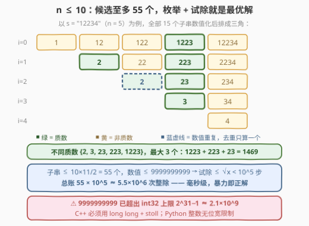
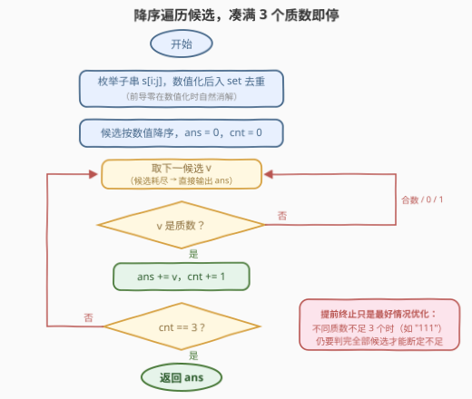

# LeetCode 最大质数子字符串之和 题解

## 1. 题目概述

- **标题 / 题号**：最大质数子字符串之和（#3556，medium）
- **链接**：https://leetcode.cn/problems/sum-of-largest-prime-substrings/
- **难度**：中等
- **标签**：哈希表、数学、字符串、数论、排序

**题意**：给定一个数字字符串 `s`，找出可以由其**子字符串**组成的 **3 个最大的不同质数**的和，返回总和；如果不同质数少于 3 个，则返回**所有**不同质数的和。

- **质数**：大于 1 且只有两个因数（1 和它本身）的自然数，故 0、1 都不是质数；
- **子字符串**：字符串中的连续字符序列；
- 每个质数即使出现在多个子字符串中也只计一次；子字符串转整数时**忽略前导零**（`"02"` 解析为 2）。

**示例 1**：

```text
输入：s = "12234"
输出：1469
解释：由子字符串形成的不同质数为 2, 3, 23, 223, 1223。
最大的 3 个是 1223 + 223 + 23 = 1469。
```

**示例 2**：

```text
输入：s = "111"
输出：11
解释：不同质数只有 11（1 不是质数，111 = 3 × 37），不足 3 个，返回全部之和 11。
```

**约束**：

- $1 \le s.length \le 10$
- $s$ 仅由数字组成

> 💡 **读题关键**：约束里 `s.length ≤ 10` 是本题最大的提示——子字符串至多 $10 \times 11 / 2 = 55$ 个，候选数值至多 10 位（$\le 9999999999 < 10^{10}$），「全部枚举 + 逐个试除判素」在规模上是绰绰有余的。另外注意**去重按数值不按字符串**：`"2"` 与 `"02"` 都解析成 2，只算一个。

## 2. 解题思路

### 2.1 朴素思路：枚举子串 + 试除判素

路径直白：枚举所有子串 $(i, j)$ → 转成整数 → 判质数 → 收集不同的质数 → 排序取最大的 3 个求和。质数的分布本身没有可利用的结构规律，不存在「聪明的剪枝」能绕过逐个判定，所以这条例行路径就是正解——本题考察的不是奇技淫巧，而是**规模估算**与一串**实现细节**（去重、前导零、溢出、判素边界）。

### 2.2 核心观察：一笔规模账——暴力即正解



三笔账算清楚，就能放心写暴力：

- **候选账**：$n \le 10$，子串数（去重前）至多 $\frac{10 \times 11}{2} = 55$ 个；
- **判定账**：候选数值 $\le 9999999999 < 10^{10}$，试除判素只需除到 $\sqrt{x} < 10^5$；
- **总账**：$55 \times 10^5 \approx 5.5 \times 10^6$ 次整除运算——毫秒级完成。

三个语义细节决定正确性：

1. **按数值去重**：子串数值化后放进哈希集合，`"2"`（`i=1`）与 `"2"`（`i=2`）数值相同只留一个；
2. **前导零自然消解**：`int("02") == 2`，数值化这一步自动完成「忽略前导零」，无需特判（`"0"` 数值化为 0，不是质数）；
3. **判素边界**：`x < 2` 直接返回非质数——0、1、负数（本题不会出现）一刀切掉。

> ⚠️ **溢出暗坑**：10 位的 $9999999999 \approx 10^{10}$ 已超出 `int32` 上限 $2^{31} - 1 \approx 2.1 \times 10^9$，C++ 必须用 `long long` 存候选并用 `stoll` 转换；题目函数签名返回 `long long` 就是明示。Python 整数无位宽限制，无此顾虑。

### 2.3 算法流程图



流程在「无脑枚举」之上加一个小优化：候选按**数值降序**遍历，依次判素，**凑满 3 个质数立即收工**。注意这只是最好情况优化——当不同质数不足 3 个时（如 `"111"`），必须把所有候选判完才能断定「不足」。

### 2.4 示例演算

以 `s = "12234"` 走一遍，15 个子串数值化后按起点分列：

| 起点 | 子串数值（去重前） | 其中的质数 |
|------|-------------------|-----------|
| $i=0$ | 1, 12, 122, 1223, 12234 | 1223 |
| $i=1$ | 2, 22, 223, 2234 | 2, 223 |
| $i=2$ | 2, 23, 234 | 2, 23 |
| $i=3$ | 3, 34 | 3 |
| $i=4$ | 4 | — |

逐一复核几个非质数：12、22、34、234、12234 是偶数；122 整除 61？$122 = 2 \times 61$ 是偶数；2234 偶数；1 与 4 非质数按定义排除。去重后的质数集合为 $\{2, 3, 23, 223, 1223\}$，降序取前 3 个：

$$1223 + 223 + 23 = 1469$$

再看 `s = "111"`：子串数值去重后为 $\{1, 11, 111\}$，其中 1 非质数、$111 = 3 \times 37$ 合数，质数只有 11——不足 3 个，返回全部质数之和 11。

## 3. 参考代码

### C++

```cpp
class Solution {
  public:
    bool isPrime(long long x) {
        if (x < 2) return false;
        for (long long d = 2; d * d <= x; ++d)
            if (x % d == 0) return false;
        return true;
    }

    long long sumOfLargestPrimes(string s) {
        set<long long, greater<long long>> cand;
        int n = s.size();
        for (int i = 0; i < n; ++i)
            for (int j = i + 1; j <= n; ++j)
                cand.insert(stoll(s.substr(i, j - i)));

        long long ans = 0;
        int cnt = 0;
        for (long long v : cand) {
            if (isPrime(v)) {
                ans += v;
                if (++cnt == 3) break;
            }
        }
        return ans;
    }
};
```

### Python

```python
class Solution:
    def sumOfLargestPrimes(self, s: str) -> int:
        def is_prime(x: int) -> bool:
            if x < 2:
                return False
            d = 2
            while d * d <= x:
                if x % d == 0:
                    return False
                d += 1
            return True

        cands = {int(s[i:j]) for i in range(len(s))
                                for j in range(i + 1, len(s) + 1)}
        primes = sorted((v for v in cands if is_prime(v)), reverse=True)
        return sum(primes[:3])
```

> 💡 两个实现要点：C++ 用 `set<long long, greater<long long>>` 一石二鸟——插入即按数值去重，遍历天然降序，配合 `++cnt == 3` 提前退出；Python 的集合推导式完成「枚举 + 数值化 + 去重」，`int("02")` 前导零自动消解，`primes[:3]` 对不足 3 个的情况自动截断（不足 3 个时取全部）。

## 4. 复杂度分析

| 维度 | 复杂度 | 说明 |
|------|--------|------|
| 时间复杂度 | $O(n^2 \cdot \sqrt{M})$ | $n \le 10$ 个子串起点对共 $O(n^2) \le 55$ 个候选；$M \le 10^{10}$ 为候选值域上界，单次试除 $O(\sqrt{M}) < 10^5$；总计约 $5.5 \times 10^6$ 次整除 |
| 空间复杂度 | $O(n^2)$ | 哈希集合存至多 55 个候选数值 |

## 5. 扩展：判素数的三档加速

本题「逐个试除到 $\sqrt{x}$」是判素数的最基础档，值域变大时有两条升级路线：

1. **素数表试除**：用埃氏筛预处理 $[2, 10^5]$ 内的全部素数（共 9592 个），试除时**只除素数**。由素数定理，$10^5$ 以内的整数中约 $\frac{1}{\ln 10^5} \approx 8.7\%$ 是素数，只除素数相当于把判定循环长度缩短约 10 倍——代价是一张 $O(10^5)$ 的表，适合批量判定（本题 55 个候选就是小型批量）。筛法本身见 204 题。

2. **Miller-Rabin 确定性判素**：对 $x < 3.2 \times 10^{18}$，用固定底数集 $\{2, 3, 5, 7, 11, 13, 17, 19, 23, 29, 31, 37\}$ 做Witness 测试即可**确定性**判素（无假阳性），单次复杂度 $O(\log^3 x)$。当值域大到 $\sqrt{x}$ 试除不可接受（如 $10^{18}$）时是标配。

3. **结构上限**：若 $n$ 大到 $O(n^2)$ 个子串本身都枚举不动，只能改题面（如只统计质数子串的**个数**、限定子串长度等）。质数分布无规律，「从数字串结构上剪枝」这条路走不通——本题的「最优解」就是由数据范围定义的。

## 6. 面试要点

1. **为什么枚举 + 试除就够？**

   > 三笔规模账：子串至多 55 个，候选 $\le 10^{10}$，单次试除 $< 10^5$ 步，总运算量 $\approx 5.5 \times 10^6$，毫秒级。看到 $n \le 10$ 这种极小约束，第一反应应是「暴力可行」，先算账再谈优化。

2. **前导零和去重怎么处理？**

   > 两者都由「数值化 + 哈希集合」一步消化：`int("02")` 得 2，前导零自然消解；集合按**数值**去重，`"2"` 与 `"02"` 只算一个。千万不要按字符串去重——它们是不同的字符串、相同的数。

3. **C++ 里用 `int` 会挂在哪里？**

   > 10 位串 `9999999999 ≈ 10^10` 超出 `int32` 上限 $2^{31}-1 \approx 2.1 \times 10^9`，`stoi` 直接抛异常。候选与累加器都要用 `long long`，转换用 `stoll`；函数返回类型 `long long` 已经是出题人的明示。

4. **试除为什么到 $\sqrt{x}$ 就停？**

   > 因数成对出现：若 $d \mid x$ 则 $x/d \mid x$，两者必有其一 $\le \sqrt{x}$。所以只要在 $[2, \sqrt{x}]$ 内找不到因数，$x$ 就没有非平凡因数，是质数。

5. **降序遍历 + 满 3 即停，最坏情况还能省吗？**

   > 不能。当不同质数不足 3 个时（如 `"111"` 只有 11），必须判完**所有**候选才能断定「不足」，提前终止只优化最好情况。复杂度上界仍是 $O(n^2 \sqrt{M})$，该优化只是常数级改善。

> 💡 **一句话总结**：3556 = 枚举子串 + 数值化去重 + 试除判素 + 降序取 3——规模账 $55 \times 10^5$ 说明暴力即正解，坑全在细节（前导零、按数值去重、long long）。

## 同类练习题

| # | 题目 | 与本题的关联 |
|---|------|-------------|
| 204 | [计数质数](https://leetcode.cn/problems/count-primes/)（[题解](../0201-0300/204_计数质数.md)） | 埃氏筛——批量判素数的另一条路线，本文 5 节素数表试除的铺垫 |
| 762 | [二进制表示中质数个置位](https://leetcode.cn/problems/prime-number-of-set-bits-in-binary-representation/)（[题解](../0701-0800/762_二进制表示中质数个置位.md)） | 枚举候选 + 小范围查表判素，与本题同款两段式 |
| 866 | [回文质数](https://leetcode.cn/problems/prime-palindrome/)（[题解](../0801-0900/866_回文质数.md)） | 构造回文候选再判素，「候选生成」一侧的进阶版 |
| 1175 | [质数排列](https://leetcode.cn/problems/prime-arrangements/)（[题解](../1101-1200/1175_质数排列.md)） | 先判素统计个数再做排列计数，判素结果作下游输入 |
| 2264 | [字符串中最大的 3 位奇数](https://leetcode.cn/problems/largest-3-same-digit-number-in-string/)（[题解](../2201-2300/2264_字符串中最大的3位相同数字.md)） | 同款「在数字串子串里挑满足数性条件的最大者」，把质数换成奇偶性判定 |
