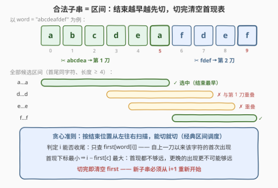
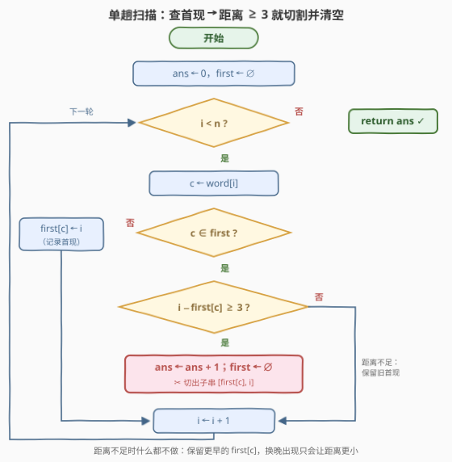

# LeetCode 不相交子字符串的最大数量 题解

## 1. 题目概述

- **标题 / 题号**：不相交子字符串的最大数量（#3557，medium）
- **链接**：https://leetcode.cn/problems/find-maximum-number-of-non-intersecting-substrings/
- **难度**：中等
- **标签**：贪心, 哈希表, 字符串, 动态规划

**题意**：给你一个字符串 `word`，返回**首尾字母相同**且**长度至少为 4** 的**不相交**子字符串的最大数量。

子字符串是字符串中连续的非空字符序列；「不相交」指被选中的子串两两不共用任何下标（区间不重叠）。

**示例 1**：

```text
输入：word = "abcdeafdef"
输出：2
解释：两个子字符串是 "abcdea" 和 "fdef"。
```

**示例 2**：

```text
输入：word = "bcdaaaab"
输出：1
解释：唯一的子字符串是 "aaaa"。注意不能同时选 "bcdaaaab"，因为它和另一个子字符串有重叠。
```

**约束**：

- $1 \le word.length \le 2 \times 10^5$
- `word` 仅由小写英文字母组成

> 💡 **读题关键**：① 「首尾字母相同」不是回文，中间字符完全自由——合法子串由一对同字符的位置 $(j, i)$ 决定：$word[j] = word[i]$ 且 $i - j \ge 3$（长度 $\ge 4$）；② 「不相交」是**下标区间不重叠**，不是「字符不重复」；③ 选的是**数量最大**，不是总长度最大——这提示我们把每个子串看成一条等权线段，做区间调度。

## 2. 解题思路

### 2.1 暴力思路：枚举同字符对再区间调度

合法子串由位置对 $(j, i)$ 唯一决定（$word[j] = word[i]$，$i - j \ge 3$），一共可能有 $O(n^2)$ 个候选。朴素做法是全部枚举出来，再做经典的「最多不相交区间」调度（按右端点排序 + DP 或贪心）。$n = 2 \times 10^5$ 时候选区间数量达 $10^{10}$ 量级，时间和空间都不可行。

突破口在于：我们**不需要显式枚举区间**——区间调度贪心只需要回答一个在线问题：「扫描到位置 $i$ 时，是否存在一条尚未占用、能以 $i$ 结尾的合法线段？」这个问题可以 $O(1)$ 回答。

### 2.2 核心观察：区间调度 + 「首现表」



三层递进：

**第一层：问题是换皮的区间调度。** 每个合法子串是一条线段 $[j, i]$，「最多不相交子串」就是经典的**活动安排 / 不相交区间调度**问题。最优贪心是**按结束位置从左到右，能切就切**：设上一刀的结束位置为 $p$（初始 $p = -1$），扫描到 $i$ 时，只要存在 $j \in [p+1,\ i-3]$ 使 $word[j] = word[i]$，就选中线段 $[j, i]$ 并令 $p \leftarrow i$。正确性是标准交换论证：贪心第一刀的结束位置 $i$ 是**最早可行**的结束位置，任何最优解的第一条线段结束位置必然 $\ge i$，把它换成 $[j, i]$ 不会推迟任何后续线段，段数不变；对剩余后缀归纳即得最优。

**第二层：「位置 $i$ 能否收尾」只需查一个数。** 判定条件是「窗口 $[p+1,\ i-3]$ 内是否存在同字符」。维护 $first[c]$ = **上一刀之后**字符 $c$ 的**首次出现**下标。由于 $first[word[i]]$ 是该窗口内 $word[i]$ 的**最小**下标，$i - first[c]$ 取到**最大**——所以：

- 若 $i - first[word[i]] \ge 3$：窗口内确有可用起点，切！
- 若 $i - first[word[i]] < 3$（或 $first$ 中没有该字符）：更晚的出现下标更大、距离只会更小，**必定无解**。

一个存在性问题被「最小下标」单点代理，无须记录全部出现位置。

**第三层：切完就清空。** 选中 $[first[c],\ i]$ 后，这条线段占用了从 $first[c]$ 到 $i$ 的所有位置，之后所有子串必须从 $i+1$ 开始——因此**清空整个 $first$ 表**重新记录（注意 $i$ 本身也不要写入新表：它已被占用）。这正是示例 1 的过程：$i=5$ 时 $first[a]=0$，$5-0\ge 3$，切出 `"abcdea"`；清空后 $i=6$ 起重新积累，$i=9$ 时 $first[f]=6$，切出 `"fdef"`。

> ⚠️ **两个高频出错点**：
> 1. **切割后忘记清空** `first`：旧首现落在已占用的区间里，后续判定会基于失效的窗口，切出重叠子串。
> 2. **距离不足时误更新** `first[c]`：必须保留**最早**的那个出现。例如 `"aaaa"`，若在 $i=1$ 时把 $first[a]$ 更新成 1，那么 $i=3$ 时 $3-1=2<3$，会漏切 `"aaaa"`（答案 1 错成 0）。

### 2.3 算法流程图



伪代码只有几行：

```text
first ← ∅, ans ← 0
for i = 0 … n−1:
    c = word[i]
    if c ∈ first and i − first[c] ≥ 3:
        ans ← ans + 1        # 切出子串 [first[c], i]
        first ← ∅            # 一切从 i+1 重新开始
    elif c ∉ first:
        first[c] = i         # 只在首次出现时记录
return ans
```

### 2.4 示例演算

以示例 1 `word = "abcdeafdef"` 为例：

| $i$ | $word[i]$ | 操作前的 `first` | 判定 | 动作 |
|-----|-----------|------------------|------|------|
| 0 | a | $\varnothing$ | — | $first[a]=0$ |
| 1 | b | $\{a{:}0\}$ | — | $first[b]=1$ |
| 2 | c | $\{a{:}0,b{:}1\}$ | — | $first[c]=2$ |
| 3 | d | $\{a{:}0,b{:}1,c{:}2\}$ | — | $first[d]=3$ |
| 4 | e | $\{a{:}0,\dots,d{:}3\}$ | — | $first[e]=4$ |
| 5 | a | $\{a{:}0,b{:}1,c{:}2,d{:}3,e{:}4\}$ | $5-0=5\ge 3$ | ✂ 切出 `"abcdea"`，清空 |
| 6 | f | $\varnothing$ | — | $first[f]=6$ |
| 7 | d | $\{f{:}6\}$ | — | $first[d]=7$ |
| 8 | e | $\{f{:}6,d{:}7\}$ | — | $first[e]=8$ |
| 9 | f | $\{f{:}6,d{:}7,e{:}8\}$ | $9-6=3\ge 3$ | ✂ 切出 `"fdef"`，清空 |

答案 $ans = 2$ ✓。

示例 2 `word = "bcdaaaab"`：$i=6$ 时 $first[a]=3$（清空前积累的），$6-3=3\ge 3$，切出 `"aaaa"`；$i=7$ 的 `b` 是清空后的新首现、后面再无字符，无法再切——**这正是「不相交」约束阻止了整串 `"bcdaaaab"` 与 `"aaaa"` 同时入选**。答案 $1$ ✓。

## 3. 参考代码

### C++

```cpp
class Solution {
  public:
    int maxSubstrings(string word) {
        int n = word.size();
        vector<int> first(26, -1);                     // 上一刀之后各字符的首现下标
        int ans = 0;
        for (int i = 0; i < n; ++i) {
            int c = word[i] - 'a';
            if (first[c] != -1 && i - first[c] >= 3) {
                ++ans;                                 // 切出子串 [first[c], i]
                fill(first.begin(), first.end(), -1);  // 清空：一切从 i+1 重新开始
            } else if (first[c] == -1) {
                first[c] = i;                          // 只在首次出现时记录
            }
        }
        return ans;
    }
};
```

### Python

```python
class Solution:
    def maxSubstrings(self, word: str) -> int:
        first = {}                          # 上一刀之后各字符的首现下标
        ans = 0
        for i, c in enumerate(word):
            j = first.get(c)
            if j is not None and i - j >= 3:
                ans += 1                    # 切出子串 [j, i]
                first.clear()               # 清空：一切从 i+1 重新开始
            elif j is None:
                first[c] = i                # 只在首次出现时记录
        return ans
```

## 4. 复杂度分析

| 维度 | 复杂度 | 说明 |
|------|--------|------|
| 时间 | $O(n)$ | 单趟扫描；每次切割的清空为 $O(26)$（表至多 26 个条目），切割次数 $\le \lfloor n/4 \rfloor$，总计 $O(n + 26\cdot n/4)$，视字母表为常数即 $O(n)$ |
| 空间 | $O(26) = O(1)$ | 首现表至多 26 个条目 |

## 5. 扩展：DP 视角（官方 hints 的思路）

本题也可以写成线性 DP。令 $dp[i]$ = 前 $i+1$ 个字符（下标 $0..i$）中的最大数量：

$$dp[i] = \max\Big(dp[i-1],\ dp[j-1] + 1\Big)$$

其中 $j$ 取 $word[i]$ 在 $j \le i-3$ 范围内的**最晚**出现位置（不存在则无第二项）。为什么取**最晚**而不是最早？因为 $dp$ 单调不减，$j$ 越大 $dp[j-1]$ 越大。取最早的实现是错的：例如 `"abcabcabca"` 会算出 1，正确答案是 2（`"abca"` + `"bcab"`）。

实现上给每个字符维护出现位置列表，查询时二分找 $\le i-3$ 的最晚者，总复杂度 $O(n \log n)$。贪心版本可以看作这个 DP 的「即时决策」加速：每当发现 $dp[i]$ 能取到 $dp[j-1]+1$ 就立刻落袋并重置窗口，省去 DP 数组与二分，降到 $O(n)$ 时间、$O(26)$ 空间。

## 6. 面试要点

- **Q1：为什么「结束位置最早优先」的贪心是最优的？**
  答：交换论证。设贪心第一刀结束于 $i$（最早可行的结束位置）。任何最优解的第一条线段 $[a, b]$ 必有 $b \ge i$（否则 $b$ 才是更早的可行结束位置，贪心早就切了）。把 $[a, b]$ 替换成 $[first[c], i]$：结束位置不推迟，最优解其余线段全部起于 $b$ 之后 $\ge i+1$，依旧不相交，总数不变。对剩余后缀归纳，贪心与最优解段数相等。
- **Q2：为什么只需记录每个字符「自上一刀以来的首次出现」，不用记全部出现位置？**
  答：判定 $i$ 能否收尾只需要回答「窗口 $[p+1, i-3]$ 内有没有同字符」这一存在性问题。$first[c]$ 是窗口内该字符的最小下标，$i - first[c]$ 最大；连首现都够不着距离 3，更晚的出现更够不着。一个存在性问题被最小下标单点代理。
- **Q3：切割之后为什么连位置 $i$ 也不能写进新的 `first` 表？**
  答：切割选中了 $[first[c], i]$，$i$ 已被占用；下一个子串必须从 $i+1$ 开始。若把 $i$ 记入新表，后续可能切出与 $[\dots, i]$ 重叠的区间。
- **Q4：距离不足时要不要顺手更新 `first[c]` 为更晚的下标？**
  答：不要。换成更晚的下标只会让 $i - first[c]$ 变小，可能错过本可切的一刀：`"aaaa"` 在 $i=1$ 时若把 $first[a]$ 从 0 改成 1，$i=3$ 时 $3-1=2<3$，会漏切 `"aaaa"`。
- **Q5：和 435（无重叠区间）、452（射气球）这类经典区间题的区别在哪？**
  答：经典题**显式给出**区间集合，需要排序后贪心；本题的候选区间有 $O(n^2)$ 个无法显式枚举，但「按下标扫描」天然按右端点有序，配合首现哈希表在线判定，排序这步被扫描顺序免费替代。

## 同类练习题

| # | 题目 | 与本题的关联 |
|---|------|-------------|
| 435 | [无重叠区间](https://leetcode.cn/problems/non-overlapping-intervals/) | 区间调度贪心模板题（求最多保留的不相交区间），本题的「裸装」形态 |
| 452 | [用最少数量的箭引爆气球](https://leetcode.cn/problems/minimum-number-of-arrows-to-burst-balloons/) | 按右端点贪心的同族题，注意「接触也算重叠」的边界细节 |
| 763 | [划分字母区间](https://leetcode.cn/problems/partition-labels/) | 字符串上的切割贪心，切割点由字符最远出现位置决定，与本题「切完清空重来」异曲同工 |
| 2405 | [给字符串分区](https://leetcode.cn/problems/optimal-partition-of-string/) | 单趟扫描 + 哈希表记录窗口状态的同款代码骨架 |
