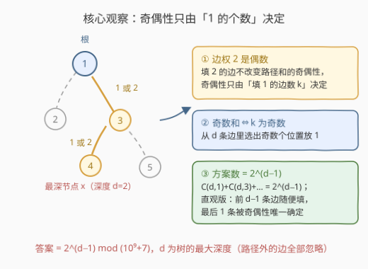
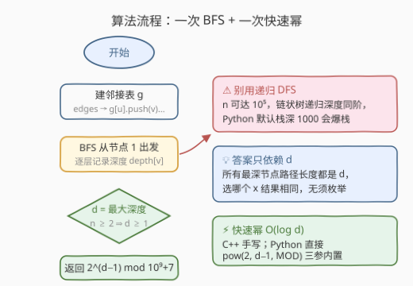

# 给边赋权值的方案数I

- **题目名称**：给边赋权值的方案数I
- **链接**：[3558. 给边赋权值的方案数I](https://leetcode.cn/problems/number-of-ways-to-assign-edge-weights-i/)
- **难度**：中等
- **标签**：树, 深度优先搜索, 广度优先搜索, 数学

## 1. 题目概述

给你一棵 $n$ 个节点的无向树，节点从 $1$ 到 $n$ 编号，以节点 $1$ 为根。树由长度为 $n-1$ 的二维整数数组 `edges` 给出，`edges[i] = [u_i, v_i]` 表示节点 $u_i$ 和 $v_i$ 之间有一条边。

一开始所有边的权重为 $0$。你可以将**每条边**的权重设为 $1$ 或 $2$。两个节点之间路径的**代价**是路径上所有边的权重之和。

选择任意一个**深度最大**的节点 $x$，返回从节点 $1$ 到 $x$ 的路径中，边权重之和为**奇数**的赋值方式数量。答案对 $10^9 + 7$ 取模。

**注意**：忽略从节点 $1$ 到 $x$ 的路径之外的所有边。

**示例 1**：

```text
输入：edges = [[1,2]]
输出：1
解释：路径只有一条边（1 → 2）。赋权为 1 时代价为奇数，赋权为 2 时为偶数，合法方案 1 种。
```

**示例 2**：

```text
输入：edges = [[1,2],[1,3],[3,4],[3,5]]
输出：2
解释：最大深度为 2（节点 4 和 5 都在该深度）。以节点 4 为例，路径含两条边（1→3 和 3→4），
     赋权为 (1,2) 或 (2,1) 时代价为奇数，合法方案 2 种。
```

**约束条件**：

- $2 \le n \le 10^5$
- `edges.length == n - 1`
- `edges[i] == [u_i, v_i]`，$1 \le u_i, v_i \le n$
- `edges` 表示一棵合法的树

> 💡 **读题关键**：① 「选择任意一个深度最大的节点」——所有最深节点到根的路径长度**完全相同**（都等于最大深度 $d$），所以答案只依赖 $d$，与具体选哪个 $x$ 无关；② 路径外的边**全部忽略**，它们填 1 还是 2 不计入任何代价。

---

## 2. 解题思路

### 2.1 暴力思路：枚举每条边的 1/2 赋值

最直接的想法：对全部 $n-1$ 条边枚举 $\{1,2\}^{n-1}$ 种赋值，对每种赋值沿根到最深节点的路径求和判奇偶。总复杂度 $O(n \cdot 2^{n-1})$，$n = 10^5$ 时指数爆炸。

即使只枚举**路径上**的 $d$ 条边（$2^d$ 种），当树退化成链时 $d = n-1$，仍然爆炸。必须找到只依赖 $d$ 的封闭公式。

### 2.2 核心观察：奇偶性只由「1 的个数」决定



三个层层递进的事实：

**事实一：边权 2 是偶数，不改变路径和的奇偶性。**
路径和的奇偶性完全由**填 1 的边数 $k$** 决定（$2$ 的倍数怎么加都是偶数）。于是问题从「赋值方案」坍缩成「**从 $d$ 条边中选 $k$ 个位置放 1**」的组合问题。

**事实二：路径和为奇数 ⇔ $k$ 为奇数。**
合法方案数为

$$\binom{d}{1} + \binom{d}{3} + \binom{d}{5} + \cdots$$

**事实三：上式恰为 $2^{d-1}$。**
由二项式定理 $(1+1)^d = \sum_{k=0}^{d}\binom{d}{k}$，且 $\sum_{k \text{ 偶}}\binom{d}{k} - \sum_{k \text{ 奇}}\binom{d}{k} = (1-1)^d = 0$（$d \ge 1$），奇数项之和与偶数项之和各占一半，均为 $2^{d-1}$。

> 💡 **更直观的证明**：前 $d-1$ 条边**随便填**（$2^{d-1}$ 种），最后一条边的权值由「总和必须是奇数」**唯一确定**——前 $d-1$ 条边权和是偶数就填 1，是奇数就填 2。两种证明殊途同归。
>
> ⚠️ 剩下的问题只有：**怎么求 $d$**。从根 BFS/DFS 一遍即可。注意 $n \le 10^5$ 且树可能退化成链，Python 递归 DFS 会**栈溢出**，推荐 BFS 或迭代写法。

### 2.3 算法流程图



整体分三步：① 由 `edges` 建邻接表 $O(n)$；② 从节点 1 出发 BFS，逐层记录深度，取最大值 $d$（$n \ge 2$ 保证 $d \ge 1$）；③ 快速幂计算 $2^{d-1} \bmod (10^9+7)$。

### 2.4 示例演算

以示例 2 `edges = [[1,2],[1,3],[3,4],[3,5]]` 为例：

| 步骤 | 结果 | 说明 |
|---|---|---|
| BFS 第 0 层 | $depth[1] = 0$ | 根入队 |
| BFS 第 1 层 | $depth[2] = depth[3] = 1$ | |
| BFS 第 2 层 | $depth[4] = depth[5] = 2$ | 无更多节点，$d = 2$ |
| 计算 | $2^{d-1} = 2^1 = 2$ | 对应 $(1,2)$、$(2,1)$ 两种赋值 ✓ |

---

## 3. 参考代码

### C++

```cpp
class Solution {
  public:
    int assignEdgeWeights(vector<vector<int>>& edges) {
        const int MOD = 1'000'000'007;
        int n = edges.size() + 1;
        vector<vector<int>> g(n + 1);
        for (auto& e : edges) {
            g[e[0]].push_back(e[1]);
            g[e[1]].push_back(e[0]);
        }

        // BFS 求最大深度（按边数计），链状树也不怕递归爆栈
        vector<int> depth(n + 1, -1);
        queue<int> q;
        depth[1] = 0;
        q.push(1);
        int maxDepth = 0;
        while (!q.empty()) {
            int u = q.front();
            q.pop();
            for (int v : g[u]) {
                if (depth[v] == -1) {
                    depth[v] = depth[u] + 1;
                    maxDepth = max(maxDepth, depth[v]);
                    q.push(v);
                }
            }
        }

        // 快速幂：2^(maxDepth-1) mod MOD
        long long ans = 1, base = 2, e = maxDepth - 1;
        while (e) {
            if (e & 1) ans = ans * base % MOD;
            base = base * base % MOD;
            e >>= 1;
        }
        return (int)ans;
    }
};
```

### Python

```python
class Solution:
    def assignEdgeWeights(self, edges: List[List[int]]) -> int:
        MOD = 1_000_000_007
        n = len(edges) + 1
        g = [[] for _ in range(n + 1)]
        for u, v in edges:
            g[u].append(v)
            g[v].append(u)

        depth = [-1] * (n + 1)
        depth[1] = 0
        q = deque([1])
        max_depth = 0
        while q:
            u = q.popleft()
            for v in g[u]:
                if depth[v] == -1:
                    depth[v] = depth[u] + 1
                    max_depth = max(max_depth, depth[v])
                    q.append(v)

        return pow(2, max_depth - 1, MOD)
```

---

## 4. 复杂度分析

| 维度 | 复杂度 | 说明 |
|------|--------|------|
| 时间 | $O(n + \log d)$ | 建邻接表 + BFS 每点每边各访问一次 $O(n)$；快速幂 $O(\log d)$，其中 $d \le n-1$ |
| 空间 | $O(n)$ | 邻接表、深度数组、BFS 队列 |

---

## 5. 扩展：从「计数」到「带查询的计数」

本题是系列题的 I，II（3559）会把「忽略路径外的边」改成**所有边都参与统计**——即对每个可能的查询节点分别回答方案数。届时需要把「深度」推广成「每个节点到根的边数 $depth[v]$」，答案即 $2^{depth[v]-1}$（$depth[v] \ge 1$），一次 BFS 预处理后 $O(1)$ 回答每个查询。核心的奇偶性观察与 $2^{d-1}$ 公式原封不动地复用。

另一个方向的推广：若边权从 $\{1,2\}$ 改成 $\{1,2,\dots,k\}$，奇偶性同样只由奇数值边的个数决定，方案数为「选奇数个奇权边」的计数 $\big(总方案 - 全偶方案\big)$ 的组合，仍然落到 $2^{d-1}$ 型封闭式。

---

## 6. 面试要点

- **Q1：为什么边权 2 不影响结果？**
  答：2 是偶数，路径和 mod 2 只由填 1 的边数 $k$ 决定；填 2 的边怎么选都贡献 0（mod 2 意义下），问题坍缩为「$d$ 条边里选奇数个位置放 1」。
- **Q2：为什么答案是 $2^{d-1}$？给出两种证明。**
  答：① 二项式定理：$\sum_{k \text{ 奇}}\binom{d}{k} = 2^{d-1}$（奇偶各半，由 $(1+1)^d$ 与 $(1-1)^d$ 相加减可得）；② 构造式：前 $d-1$ 条边任填 $2^{d-1}$ 种，最后一条边由奇偶约束唯一确定。
- **Q3：「选择任意一个深度最大的节点」为什么不需要枚举 $x$？**
  答：所有最深节点到根的距离都等于最大深度 $d$，而答案只依赖路径长度 $d$，与路径具体形态、选哪个 $x$ 都无关。
- **Q4：为什么推荐 BFS 而不是递归 DFS？**
  答：$n \le 10^5$ 且树可能退化成链，递归深度同阶；Python 默认递归栈深约 1000 会 `RecursionError`（C++ 也可能栈溢出），BFS/迭代 DFS 稳妥。
- **Q5：需要特判 $d = 0$ 吗？**
  答：本题 $n \ge 2$ 保证 $d \ge 1$，无需特判；但若题目允许 $n = 1$（无边），「路径和为奇数」无意义，通常约定返回 0，写代码时加一行防御即可。

---

## 7. 同类练习题

- [3559. 给边赋权值的方案数 II](https://leetcode.cn/problems/number-of-ways-to-assign-edge-weights-ii/)：本系列的直接进阶版，路径外/每个节点的方案数统计，同样复用 $2^{d-1}$ 公式
- [104. 二叉树的最大深度](https://leetcode.cn/problems/maximum-depth-of-binary-tree/)：求树深度的基础模板，本题的前半段
- [50. Pow(x, n)](https://leetcode.cn/problems/powx-n/)：快速幂模板题，本题的最后一步（Python 可用三参 `pow` 直接替代）
- [78. 子集](https://leetcode.cn/problems/subsets/)：每条边「填 1 / 填 2」二选一，与「每个元素选/不选」的 $2^n$ 计数同构
- [1377. T 秒后青蛙的位置](https://leetcode.cn/problems/frog-position-after-t-seconds/)：同样在树上 BFS 记录深度并做乘法计数，训练「树分层 + 数学」组合
