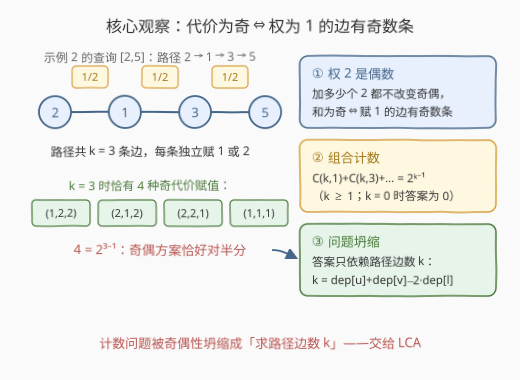
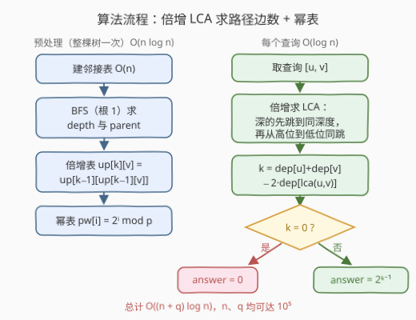

# 给边赋权值的方案数 II

- **题目名称**：给边赋权值的方案数 II
- **链接**：[3559. 给边赋权值的方案数 II](https://leetcode.cn/problems/number-of-ways-to-assign-edge-weights-ii/)
- **难度**：困难
- **标签**：位运算, 树, 深度优先搜索, 数组, 数学, 动态规划

## 1. 题目概述

给你一棵 $n$ 个节点的无向树，节点从 $1$ 到 $n$ 编号，以节点 $1$ 为根。树由长度为 $n-1$ 的二维数组 `edges` 给出，`edges[i] = [ui, vi]` 表示节点 $u_i$、$v_i$ 间有一条边。

初始时所有边权为 $0$。你可以把**每条边的权设为 $1$ 或 $2$**。节点 $u$、$v$ 之间路径的**代价**是路径上所有边的权之和。

给定查询数组 `queries`，对每个 `queries[i] = [ui, vi]`，统计使 $u_i$ 到 $v_i$ 路径代价为**奇数**的赋值方式数量（只考虑路径上的边，路径之外的边随意赋值不影响计数）。答案对 $10^9+7$ 取模，返回数组 `answer`。

**示例 1**：

```text
输入：edges = [[1,2]], queries = [[1,1],[1,2]]
输出：[0,1]
解释：
  查询 [1,1]：节点 1 到自身没有边，代价为 0（偶数），合法方式为 0 种。
  查询 [1,2]：路径只有一条边，权为 1 时代价为奇，权为 2 时为偶，共 1 种。
```

**示例 2**：

```text
输入：edges = [[1,2],[1,3],[3,4],[3,5]], queries = [[1,4],[3,4],[2,5]]
输出：[2,1,4]
解释：
  查询 [1,4]：路径两条边，(1,2) 或 (2,1) 使代价为奇，共 2 种。
  查询 [3,4]：路径一条边，仅权 1 时为奇，共 1 种。
  查询 [2,5]：路径三条边（2→1→3→5），(1,2,2)、(2,1,2)、(2,2,1)、(1,1,1) 均为奇，共 4 种。
```

**约束条件**：

- $2 \le n \le 10^5$
- `edges.length == n - 1`，`edges[i] == [ui, vi]`
- $1 \le queries.length \le 10^5$
- $1 \le u_i, v_i \le n$
- `edges` 表示一棵合法的树

> 💡 **读题关键**：① 「仅考虑路径上的边」意味着每个查询是**独立**的计数问题——答案只由路径本身决定，与路径外的边无关（示例 2 中若把路径外边权也算进方案，[1,4] 的答案就不是 2 了）；② 查询里 $u$ 可以等于 $v$，此时路径上**没有边**；③ 只关心代价的**奇偶**，不关心具体数值——这是全题的题眼。

---

## 2. 解题思路

### 2.1 暴力思路：每个查询现找路径

最直接的做法：对每个查询从 $u$ 出发 DFS/BFS 走到 $v$，还原路径得到边数 $k$（单次 $O(n)$），再对 $k$ 条边做奇偶 DP 计数（$O(k)$）。总计 $O(qn) \approx 10^{10}$，必然超时。

而且计数这一步其实**根本不需要 DP**——它有闭式解（见下）。瓶颈只剩一个：如何对 $10^5$ 个查询**快速**求出任意两点间路径的边数。这是树上路径问题的标准需求，答案就是 **LCA（最近公共祖先）**。

### 2.2 核心观察：奇偶性把计数坍缩成 $2^{k-1}$



三个层层递进的事实：

**事实一：权 $2$ 是偶数，完全不参与奇偶性。**
路径代价 $= 1$ 的边数 $\cdot 1 + 2$ 的边数 $\cdot 2$，其中每个 $2$ 都是偶数，加多少个都不改变和的奇偶。所以：

$$\text{代价为奇} \iff \text{权为 } 1 \text{ 的边有奇数条}$$

**事实二：奇数个 $1$ 的方案数恰为 $2^{k-1}$（$k \ge 1$）。**
设路径有 $k$ 条边，从 $k$ 条边里选奇数条赋 $1$（其余赋 $2$），方案数为 $\binom{k}{1}+\binom{k}{3}+\cdots = 2^{k-1}$。一个一行证明：**前 $k-1$ 条边随便赋**（$2^{k-1}$ 种），最后一条边无论前面和的奇偶如何，恰有一个取值（$1$ 或 $2$）能把总和补成奇数——它是**被唯一确定的**。也可以按官方 hints 的 DP 看：设 $f[j][p]$ 为前 $j$ 条边中和的奇偶为 $p$ 的方案数，转移 $f[j][p] = f[j-1][p] + f[j-1][p \oplus 1]$（赋 $2$ 保持奇偶、赋 $1$ 翻转奇偶），归纳可得 $j \ge 1$ 时 $f[j][0] = f[j][1] = 2^{j-1}$——每加一条边，奇偶恰好对半分。

**事实三：答案只依赖路径边数 $k$，问题坍缩为求 $k$。**

$$k = \mathrm{dep}[u] + \mathrm{dep}[v] - 2 \cdot \mathrm{dep}[\mathrm{LCA}(u, v)]$$

> ⚠️ **特判 $k = 0$（即 $u = v$）**：路径上没有边，「奇数个 1」无从谈起，答案是 $0$，而不是 $2^{-1}$。示例 1 的查询 `[1,1]` 就在考察这一点。

### 2.3 算法流程图



**预处理**（一次，$O(n \log n)$）：

1. 建邻接表，从根 $1$ 出发 **BFS** 得到每个点的深度 `dep` 与父节点 `par`（用迭代而非递归，见下面 ⚠️）；
2. 构建倍增表：`up[0] = par`，`up[k][v] = up[k-1][up[k-1][v]]`，即 $v$ 的第 $2^k$ 级祖先。约定根的父亲指向哨兵 $0$，$0$ 的祖先仍是 $0$，越界上跳自动落在哨兵上；
3. 预处理幂表 `pw[i] = 2^i mod 1e9+7`。

**每次查询**（$O(\log n)$）：先把**深的那端**按深度差的二进制位逐位上跳，与浅端同深度（若此时两点重合，它就是 LCA）；再从**高位到低位**尝试让两点同时上跳，只要跳完仍不相同就跳——结束后两点都停在 LCA 的孩子处，返回父亲即可。最后 $k = \mathrm{dep}[u] + \mathrm{dep}[v] - 2\,\mathrm{dep}[l]$，答案为 $k = 0 ?\ 0 : \mathrm{pw}[k-1]$。

> ⚠️ **为什么用 BFS 求深度而不用 DFS**：$n$ 可达 $10^5$，树可能退化成一条链，Python 默认递归上限 $1000$ 会直接爆栈（`RecursionError`）。C++ 虽无硬限制，但写成 BFS 两边代码统一、更稳。

### 2.4 示例演算

以示例 2 的树（边 `1-2, 1-3, 3-4, 3-5`）为例，$\mathrm{dep}$：$1 \to 0$，$2, 3 \to 1$，$4, 5 \to 2$：

| 查询 | LCA | $k = \mathrm{dep}[u]+\mathrm{dep}[v]-2\,\mathrm{dep}[l]$ | 答案 $= 2^{k-1}$ | 验证 |
|---|---|---|---|---|
| `[1,4]` | $1$ | $0 + 2 - 0 = 2$ | $2$ | $(1,2),(2,1)$ ✓ |
| `[3,4]` | $3$ | $1 + 2 - 2 = 1$ | $1$ | $(1)$ ✓ |
| `[2,5]` | $1$ | $1 + 2 - 0 = 3$ | $4$ | $(1,2,2),(2,1,2),(2,2,1),(1,1,1)$ ✓ |

---

## 3. 参考代码

### C++

```cpp
class Solution {
  public:
    vector<int> assignEdgeWeights(vector<vector<int>>& edges, vector<vector<int>>& queries) {
        const int MOD = 1'000'000'007;
        int n = edges.size() + 1;

        vector<vector<int>> g(n + 1);
        for (auto& e : edges) {
            g[e[0]].push_back(e[1]);
            g[e[1]].push_back(e[0]);
        }

        // BFS 求深度与父节点（迭代写法，链状树不爆栈）
        vector<int> depth(n + 1, -1), par(n + 1, 0);
        queue<int> q;
        depth[1] = 0;
        q.push(1);
        while (!q.empty()) {
            int u = q.front();
            q.pop();
            for (int v : g[u])
                if (depth[v] == -1) {
                    depth[v] = depth[u] + 1;
                    par[v] = u;
                    q.push(v);
                }
        }

        // 倍增表：up[0] = par；根与哨兵 0 的各级祖先都是 0
        int LOG = 1;
        while ((1 << LOG) < n) ++LOG;
        vector<vector<int>> up(LOG, vector<int>(n + 1, 0));
        up[0] = par;
        for (int k = 1; k < LOG; ++k)
            for (int v = 1; v <= n; ++v)
                up[k][v] = up[k - 1][up[k - 1][v]];

        auto lca = [&](int u, int v) {
            if (depth[u] < depth[v]) swap(u, v);
            int diff = depth[u] - depth[v];
            for (int k = 0; diff; ++k, diff >>= 1)  // 深的先跳到同深度
                if (diff & 1) u = up[k][u];
            if (u == v) return u;
            for (int k = LOG - 1; k >= 0; --k)      // 再从高位到低位一起上跳
                if (up[k][u] != up[k][v]) {
                    u = up[k][u];
                    v = up[k][v];
                }
            return up[0][u];
        };

        vector<int> pw(n + 1);                       // 2 的幂表
        pw[0] = 1;
        for (int i = 1; i <= n; ++i)
            pw[i] = (int)((long long)pw[i - 1] * 2 % MOD);

        vector<int> ans;
        ans.reserve(queries.size());
        for (auto& qr : queries) {
            int u = qr[0], v = qr[1];
            int k = depth[u] + depth[v] - 2 * depth[lca(u, v)];
            ans.push_back(k == 0 ? 0 : pw[k - 1]);   // u = v 时无奇方案
        }
        return ans;
    }
};
```

### Python

```python
class Solution:
    def assignEdgeWeights(self, edges: List[List[int]], queries: List[List[int]]) -> List[int]:
        MOD = 10**9 + 7
        n = len(edges) + 1

        g = [[] for _ in range(n + 1)]
        for u, v in edges:
            g[u].append(v)
            g[v].append(u)

        # BFS 求深度与父节点（避免链状树递归爆栈）
        depth = [-1] * (n + 1)
        par = [0] * (n + 1)
        depth[1] = 0
        q = deque([1])
        while q:
            u = q.popleft()
            for v in g[u]:
                if depth[v] == -1:
                    depth[v] = depth[u] + 1
                    par[v] = u
                    q.append(v)

        LOG = max(1, n.bit_length())
        up = [par]
        for _ in range(1, LOG):
            prev = up[-1]
            up.append([prev[prev[v]] for v in range(n + 1)])

        def lca(u: int, v: int) -> int:
            if depth[u] < depth[v]:
                u, v = v, u
            diff = depth[u] - depth[v]
            k = 0
            while diff:                       # 深的先跳到同深度
                if diff & 1:
                    u = up[k][u]
                diff >>= 1
                k += 1
            if u == v:
                return u
            for k in range(LOG - 1, -1, -1):  # 再从高位到低位一起上跳
                if up[k][u] != up[k][v]:
                    u, v = up[k][u], up[k][v]
            return up[0][u]

        pw = [1] * (n + 1)                    # 2 的幂表
        for i in range(1, n + 1):
            pw[i] = pw[i - 1] * 2 % MOD

        ans = []
        for u, v in queries:
            k = depth[u] + depth[v] - 2 * depth[lca(u, v)]
            ans.append(0 if k == 0 else pw[k - 1])  # u = v 时无奇方案
        return ans
```

---

## 4. 复杂度分析

| 维度 | 复杂度 | 说明 |
|------|--------|------|
| 时间 | $O((n+q)\log n)$ | BFS $O(n)$，倍增表 $O(n\log n)$，幂表 $O(n)$；每次查询 LCA 上跳 $O(\log n)$，共 $q$ 次 |
| 空间 | $O(n\log n)$ | 倍增表为主要开销；邻接表、`depth`、幂表各 $O(n)$ |

---

## 5. 扩展：通用公式与更快的 LCA

**边权取值推广到 $1 \sim m$**。设 $m$ 个候选权值中奇数有 $a=\lceil m/2 \rceil$ 个、偶数有 $b=\lfloor m/2 \rfloor$ 个，则奇代价方案数为

$$\frac{(a+b)^k-(b-a)^k}{2}=\frac{m^k-(b-a)^k}{2}$$

（全部 $m^k$ 种赋值按奇偶分成两半，偶/奇差恰好是每条边「保偶 $-$ 保奇」的连乘 $(b-a)^k$）。代入 $m=2$：$a=b=1$，得 $\frac{2^k-0^k}{2}=2^{k-1}$（$k\ge 1$）；代入 $m=1$：得 $\frac{1-(-1)^k}{2}$，即 $k$ 奇为 $1$、$k$ 偶为 $0$——都与直觉一致。

**LCA 的 $O(1)$ 查询替代**。倍增 LCA 每次查询 $O(\log n)$；若改用**欧拉序 + 稀疏表（ST 表）**，预处理 $O(n\log n)$ 后单次查询 $O(1)$，总复杂度降到 $O(n\log n + q)$。本题规模下两者都能轻松通过，倍增胜在代码短、不容易写错。

**与第 I 版（3558）的关系**。I 版约束规模小，单查询直接 DFS 数出路径边数即可；II 版把 $n$、$q$ 同时拉到 $10^5$，逼你把「求路径长度」从 $O(n)$ 优化到 $O(\log n)$——同一道题的计数内核完全相同，考的全是 LCA 工程。

---

## 6. 面试要点

- **Q1：为什么答案只与路径长度有关，与树的形态无关？**
  答：权 $2$ 是偶数不改变奇偶，代价为奇等价于赋 $1$ 的边有奇数条；而「$k$ 条边中选奇数条」的组合数只依赖 $k$，与这 $k$ 条边在树上的连接方式无关。
- **Q2：$2^{k-1}$ 怎么快速证明？**
  答：前 $k-1$ 条边任意赋共 $2^{k-1}$ 种，最后一条边无论前面奇偶如何恰有一个取值能把总和补成奇数，故一一对应 $2^{k-1}$ 种奇方案。等价地，$\binom{k}{1}+\binom{k}{3}+\cdots=2^{k-1}$ 或 DP $f[j][p]=f[j-1][p]+f[j-1][p\oplus 1]$ 归纳。
- **Q3：$u = v$ 时为什么答案是 $0$？**
  答：路径无边，代价恒为 $0$（偶数），不存在奇代价赋值；公式 $2^{k-1}$ 在 $k=0$ 处无意义，必须特判。
- **Q4：倍增 LCA 第二阶段为什么必须从高位到低位跳？**
  答：要找到「最后一次 $2^k$ 级祖先不相同」的最大 $k$，贪心从大步往小步尝试才能保证跳完后恰好停在 LCA 的孩子；从低位开始会错过需要跨大步的情况。
- **Q5：为什么要让根的父亲指向哨兵 $0$？**
  答：倍增跳的步数可能超过根的深度，统一落到哨兵 $0$（其各级祖先仍为 $0$）可避免越界判断；比较 `up[k][u] != up[k][v]` 时同落哨兵视为相等，不影响正确性。
- **Q6：Python 实现有什么工程坑？**
  答：树可能退化成 $10^5$ 深的链，递归 DFS 求深度会触发递归上限，要用迭代 BFS；倍增表逐层用列表推导构建比双重循环 + `sys.setrecursionlimit` 的写法更快更稳。

---

## 7. 同类练习题

- [3558. 给边赋权值的方案数 I](https://leetcode.cn/problems/number-of-ways-to-assign-edge-weights-i/)：本题的小规模版，计数内核相同，可先用 DFS 数路径边数体会差异
- [236. 二叉树的最近公共祖先](https://leetcode.cn/problems/lowest-common-ancestor-of-a-binary-tree/)：LCA 的递归基础模板，理解「左右子树各返回一个点」的判定
- [1483. 树节点的第 K 个祖先](https://leetcode.cn/problems/kth-ancestor-of-a-tree-node/)：倍增上跳的纯模板题，本题 `up` 表的直接原型
- [2846. 边权重均等查询](https://leetcode.cn/problems/minimum-edge-weight-equilibrium-queries-in-a-tree/)：同样「LCA 求路径 + 对路径上边权做统计」的多查询套路
- [2791. 树中形成回文的路径数](https://leetcode.cn/problems/count-paths-that-can-form-a-palindrome-in-a-tree/)：根到点路径前缀 + LCA 合并两段路径的统计思路，树上计数另一经典形态
