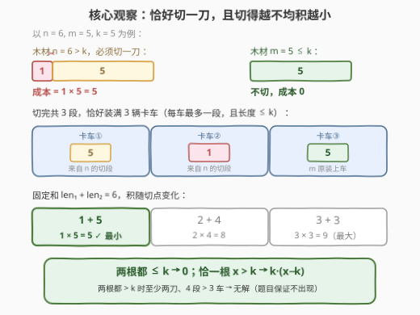
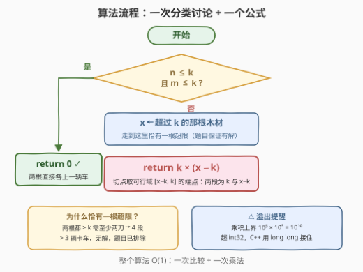

# 木材运输的最小成本

- **题目名称**：木材运输的最小成本
- **链接**：[3560. 木材运输的最小成本](https://leetcode.cn/problems/find-minimum-log-transportation-cost/)
- **难度**：简单
- **标签**：数学、贪心

## 1. 题目概述

给你三个整数 `n`、`m` 和 `k`。有两根长度分别为 `n` 和 `m` 单位的木材，需要通过**三辆卡车**运输，每辆卡车最多只能装载**一根**长度**不超过 `k`** 单位的木材。

你可以将木材切成更小的段：把长度为 $x$ 的木材切成长度 $len_1$ 和 $len_2$ 的两段，成本为 $len_1 \times len_2$，且满足 $len_1 + len_2 = x$。

返回将木材分配到卡车上的**最小总成本**；如果木材不需要切割，总成本为 0。

**示例 1**：

```text
输入：n = 6, m = 5, k = 5
输出：5
解释：将长度为 6 的木材切成长度 1 和 5 的两段，成本 1 × 5 = 5。
三段长度分别为 1、5、5 的木材可以分别装载到每辆卡车。
```

**示例 2**：

```text
输入：n = 4, m = 4, k = 6
输出：0
解释：两根木材已经可以直接装载到卡车上，因此不需要切割。
```

**约束条件**：

- $2 \le k \le 10^5$
- $1 \le n, m \le 2k$
- 输入数据保证木材总存在能被运输的方案

> 💡 **读题关键**：两个数字定死了整道题——**3 辆卡车 vs 2 根木材**（余量恰好 1，决定至多切一刀）；**每车一段且长度 $\le k$**（决定切出的两段都要卡在上限内）。

---

## 2. 解题思路

### 2.1 朴素思路：枚举切法

合法的决策空间本来就很小：要么一根都不切，要么挑一根木材切一刀。朴素做法是枚举「切哪根」和「切点 $len_1 \in [1, x-1]$」，检查切出的两段是否都 $\le k$、另一根是否装得下，在所有合法方案里取成本最小——一次 $O(k)$ 扫描足以通过本题（$k \le 10^5$）。但切点落在哪里其实被数学完全锁死，根本不用枚举。

### 2.2 核心观察：卡车数守恒 → 恰好一刀 + 极端不均分



**第一层：切几刀？** 每切一刀，木材段数恰好 +1。开局 2 段、每辆卡车最多装一段、共 3 辆车，所以**段数 $\le 3$，至多切一刀**。于是只有三种情况：

| 情况 | 判断 | 结论 |
|------|------|------|
| 两根都 $\le k$ | $n \le k$ 且 $m \le k$ | 直接装两辆车，成本 0（示例 2） |
| 两根都 $> k$ | — | 各需一刀 → 至少 4 段 $> 3$ 车，**无解**，题目保证不出现 |
| 恰一根 $x > k$ | 另一根 $\le k$ | **必须且只需**切这一刀，3 段恰好对 3 车 |

**第二层：这一刀切在哪？** 设切点把 $x$ 分成 $len_1$ 和 $len_2$。三段木材各上一辆车，每段都必须 $\le k$，于是切点约束为：

$$len_1 + len_2 = x,\quad len_1 \le k,\quad len_2 \le k \ \Longrightarrow\ len_1 \in [x-k,\ k]$$

（约束 $x \le 2k$ 恰好保证这个区间非空。）在区间上最小化 $len_1 \cdot len_2 = len_1(x - len_1)$——固定和的积，**越不均越小**：$x = 6, k = 5$ 时 $1 \times 5 = 5 < 2 \times 4 = 8 < 3 \times 3 = 9$。由抛物线性质（对称轴 $x/2$ 处最大、向两侧递减），区间 $[x-k, k]$ 上的最小值落在**端点**：

$$\text{answer} = k \cdot (x - k)$$

### 2.3 算法流程图



流程只有一次分支：两根都装得下直接返回 0；否则取超限的那根 $x$（由可行性保证恰有一根），返回 $k \cdot (x-k)$。

### 2.4 示例演算

| 输入 $(n, m, k)$ | 超限木材 $x$ | 最优切分 | 成本 |
|------------------|--------------|----------|------|
| $(6, 5, 5)$ | $6$ | $1 + 5$ | $5 \times 1 = 5$ ✓ |
| $(4, 4, 6)$ | 无 | — | $0$ ✓ |
| $(10, 3, 6)$ | $10$ | $4 + 6$ | $6 \times 4 = 24$ |

最后一行演示了更一般的情形：$x = 10, k = 6$ 时切点 $5 + 5$ 成本 25、$4 + 6$ 成本 24、$3 + 7$ 直接不可行（$7 > k$）——可行域端点 $k$ 与 $x - k$ 即最优。

---

## 3. 参考代码

### C++

```cpp
class Solution {
  public:
    long long minCuttingCost(int n, int m, int k) {
        if (n <= k && m <= k) return 0;
        long long x = (n > k) ? n : m;   // 恰有一根超限（题目保证有解）
        return 1LL * k * (x - k);        // 乘积可达 1e10，用 long long
    }
};
```

### Python

```python
class Solution:
    def minCuttingCost(self, n: int, m: int, k: int) -> int:
        if n <= k and m <= k:
            return 0
        x = n if n > k else m
        return k * (x - k)
```

> 💡 乘积上界 $k \cdot (x-k) \le 10^5 \times 10^5 = 10^{10}$，超出 `int` 约 $2.1 \times 10^9$ 的上限——C++ 版必须用 `long long`（题目签名也如此），且乘法前用 `1LL *` 提升避免中间结果溢出。

---

## 4. 复杂度分析

| 维度 | 复杂度 | 说明 |
|------|--------|------|
| 时间复杂度 | $O(1)$ | 一次比较 + 一次乘法，无循环无搜索 |
| 空间复杂度 | $O(1)$ | 常数个变量 |

---

## 5. 扩展：固定和的积——最大在均分，最小在边界

把积 $len_1 \cdot len_2 = len_1(x - len_1)$ 看成切点 $len_1$ 的函数，它是一条开口向下的抛物线，对称轴在 $x/2$：

- **积最大** → 切点逼近均分。整数版本的经典题是 343「整数拆分」：把整数拆成若干正整数之和使乘积最大，最优策略是尽量均分成若干个 3——与本题互为镜像。
- **积最小** → 切点远离均分，直到被可行域边界 $[x-k,\ k]$ 卡住，落在端点上。

换掉成本函数，分析框架依然成立：成本改为 $len_1^2 + len_2^2$（凸函数）时最小值反而回到均分处；改为 $\max(len_1, len_2)$（最小化最长段）同样趋向均分。**先看成本函数的凹凸，再看可行域的形状**——最优切点由这两件事完全决定。

---

## 6. 面试要点

1. **为什么至多切一刀？**

   > 每切一刀段数 +1；每辆卡车最多装一段，3 辆车 → 段数 $\le 3$；开局 2 根 → 至多 1 刀。「3 辆卡车运 2 根木材」的数字设计正是把问题锁死成一刀的套路。

2. **两根都超过 k 的输入为什么不会出现？**

   > 各切至少一刀 → 至少 4 段 $> 3$ 辆卡车，无论怎么切都装不下，无解；题面「保证存在运输方案」把这类输入排除了。约束 $n, m \le 2k$ 则保证超限的那根「一刀能救回」：$x - k \le k$，两段都装得下。

3. **为什么最优切点是 k 与 x−k，而不是均分？**

   > 固定和的积是切点的开口向下抛物线，在可行域 $[x-k, k]$ 上的最小值取在端点；均分处（对称轴）反而是积最大的位置——343「整数拆分」用的正是后半句。

4. **C++ 实现有什么坑？**

   > 返回类型必须是 `long long`：$k \le 10^5$、$x - k \le 10^5$，乘积上界 $10^{10}$ 超 `int`（约 $2.1 \times 10^9$）。乘法前用 `1LL *` 提升操作数类型。

5. **如果每辆卡车能装多段木材（总长 ≤ k），答案会变吗？**

   > 恰一根超限时不变：可行切点集合仍是 $[x-k, k]$（小段拼车不带来新的更优切点），答案还是 $k(x-k)$。变化在两根都超限的情形——从「无解」变为可解，问题升级成「切割 + 装箱」的组合优化，一刀公式不再成立。

> 💡 **一句话总结**：3560 = 卡车数守恒 → 至多一刀；固定和的积在可行域端点最小 → 两根都装得下返回 0，否则切超限那根，答案 $k \times (x - k)$。

---

## 7. 同类练习题

- [343. 整数拆分](https://leetcode.cn/problems/integer-break/)（[题解](../0301-0400/343_整数拆分.md)）：固定和的积**最大化**→尽量均分成 3，与本题「积最小化→极端不均」互为镜像
- [2578. 最小和分割](https://leetcode.cn/problems/split-with-minimum-sum/)（[题解](../2501-2600/2578_最小和分割.md)）：数字重组成两个数使和最小，同样是「不均分配出最优」的贪心直觉
- [1969. 数组元素的最小非零乘积](https://leetcode.cn/problems/minimum-non-zero-product-of-the-array-elements/)（[题解](../1901-2000/1969_数组元素的最小非零乘积.md)）：成对交换把数推向极端来最小化乘积，「不均出最小积」的组合版本
- [1891. 割绳子](https://leetcode.cn/problems/cutting-ribbons/)（[题解](../1801-1900/1891_割绳子.md)）：同为「木材 + 长度上限 k」的场景，换成二分答案求最多段数
