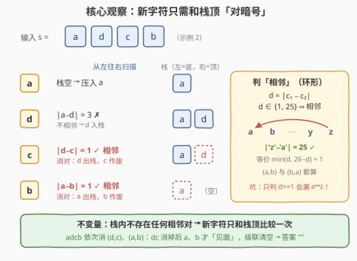
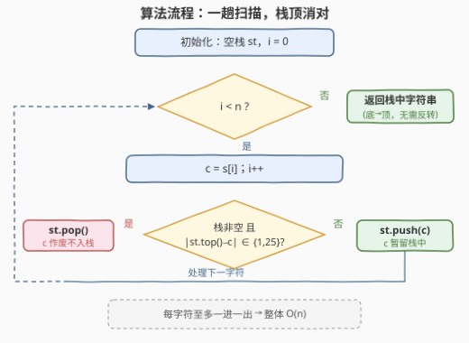

# 移除相邻字符

- **题目名称**：移除相邻字符
- **链接**：[3561. 移除相邻字符](https://leetcode.cn/problems/resulting-string-after-adjacent-removals/)
- **难度**：中等
- **标签**：栈、字符串、模拟

## 1. 题目概述

给定一个由小写英文字母组成的字符串 `s`，反复执行以下操作，直到无法再执行为止：

- 每次移除字符串中**最左边**的一对相邻字符，要求这对字符在字母表中**连续**（顺序不限，`'a'` 与 `'b'`、`'b'` 与 `'a'` 都算）；
- 移除后右侧字符整体左移填补空隙。

注意**字母表是循环的**：`'a'` 与 `'z'` 也视为连续。返回操作全部结束后的最终字符串。

**示例 1**：

```text
输入：s = "abc"
输出："c"
解释：移除 "ab" 后剩下 "c"，无法继续操作。
```

**示例 2**：

```text
输入：s = "adcb"
输出：""
解释：移除 "dc" 后剩下 "ab"；再移除 "ab" 后剩下 ""。
```

**示例 3**：

```text
输入：s = "zadb"
输出："db"
解释：移除 "za"（z 与 a 循环相邻）后剩下 "db"，无法继续操作。
```

**约束条件**：

- $1 \le s.length \le 10^5$
- `s` 仅由小写英文字母组成

> 💡 **读题关键**：两个容易踩的坑——① 操作顺序被钉死为「**最左边优先**」，不是随便挑一对消；② 字母表**循环**，`a` 与 `z` 相邻，只判「差为 1」会漏掉这一对。另外 $n$ 达 $10^5$，按题面「删除 + 左移」直接模拟最坏 $O(n^2)$，必须找线性做法。

---

## 2. 解题思路

### 2.1 暴力思路：按题面逐轮模拟

每轮从左往右扫描，找到**第一对**（即最左边的一对）字母表连续的相邻字符，删掉它，把后缀整体左移；重复直到找不到可消对。每轮的扫描加搬移是 $O(n)$，而消对轮数可达 $n/2$（如 `"ababab..."` 每轮恰好消掉开头的 `"ab"`），总体 $O(n^2)$——$n = 10^5$ 时是数十亿次字符搬运，必然超时。

更麻烦的是，这道题**不能像 1047 那样「随便挑一对消、反正结果一样」**：消对顺序在这里是**本质的**。反例 `"abc"`：

- 先消 `"ab"` → 剩 `"c"`；
- 先消 `"bc"` → 剩 `"a"`。

两个顺序得到不同结果。幸好题目把过程完全确定化了——每次消**最左**对。我们要做的就是高效模拟这个确定过程。

### 2.2 核心观察：栈 = 「最左优先」消对器



从左往右扫描，用一个**栈**保存「已处理前缀的化简结果」，它始终满足不变量：**栈内不存在任何相邻对**。新字符 `c` 到来时只有两种情况：

- **栈顶与 `c` 不相邻**：压入 `c`，不变量保持；
- **栈顶与 `c` 相邻**：这一对正是当前串里**最左边**的可消对——栈里没有更靠左的候选，未扫描后缀里的对又都在它右边——于是弹掉栈顶，`c` 作废不入栈。

「消对」之后的**级联**自然发生：下一个字符会与**新的栈顶**比较，这正对应题面中「删掉一对后左右两段拼合、可能拼出新的可消对」（示例 2 `"adcb"`：`d`、`c` 相消之后，`a` 和 `b` 才得以「见面」）。

**正确性（为什么恰好是「最左优先」）**：对串长归纳。设当前串的最左可消对在位置 $(i, i+1)$：

1. 栈扫过 $s[0..i-1]$ 时**不会发生任何弹栈**——若弹栈，说明栈内出现过相邻对，它对应原串中位置比 $i$ 更靠左的可消对，与「最左」矛盾；
2. 扫到 $s[i+1]$ 时栈顶恰为 $s[i]$，二者相邻 → 弹栈，正好完成题面过程的「第一刀」；
3. 此后栈算法的状态为（栈 $= s[0..i-1]$，待读 $= s[i+2..]$），与「删掉最左对后重跑」的中间状态完全一致，由归纳假设二者最终结果相同。$\blacksquare$

**判「相邻」（环形）**：$d = |c_1 - c_2|$，$d = 1$ 或 $d = 25$ 即相邻，等价于 $\min(d,\ 26-d) = 1$。

### 2.3 算法流程图



一趟扫描、每个字符一次栈顶判断：相邻则 `pop`（消对），否则 `push`（保留）。扫描结束后**栈底到栈顶**拼接即为答案——不需要反转，因为栈顶对应的本来就是靠后的字符。

### 2.4 示例演算

以**示例 3** `s = "zadb"`（覆盖环形相邻 `a↔z`）走完全流程：

| 步骤 | 读入 | 栈（底→顶） | 判断 | 动作 |
|------|------|-------------|------|------|
| ① | `z` | 空 | 栈空 | 压入，栈 `z` |
| ② | `a` | `z` | 差 25 ✓ 环形相邻 | 消对，栈空 |
| ③ | `d` | 空 | 栈空 | 压入，栈 `d` |
| ④ | `b` | `d` | 差 2 ✗ | 压入，栈 `d b` |
| 末 | — | `d b` | 输入耗尽 | 返回 `"db"` ✓ |

再验证**示例 2** `"adcb"`（级联消对）：读 `a`、`d` 入栈 → 读 `c` 时 $|d-c|=1$ 消对（栈 `a`）→ 读 `b` 时 $|a-b|=1$ 消对（栈空）→ 返回 `""` ✓。**示例 1** `"abc"`：读 `a`；读 `b` 时 $|a-b|=1$ 消对（栈空）；读 `c` 入栈 → 返回 `"c"` ✓——注意若先消 `"bc"` 会得到 `"a"`，本题规则下最左的 `"ab"` 先消，与栈行为一致。

---

## 3. 参考代码

### C++

```cpp
class Solution {
  public:
    string resultingString(string s) {
        string st;                              // 栈：栈顶在串尾，最后直接返回
        for (char c : s) {
            if (!st.empty()) {
                int d = abs(st.back() - c);     // 与栈顶的字符差
                if (d == 1 || d == 25) {        // 相邻（含 a↔z 环形）
                    st.pop_back();              // 消对：弹栈顶，c 不入栈
                    continue;
                }
            }
            st.push_back(c);
        }
        return st;                              // 栈底到栈顶 = 最终字符串
    }
};
```

### Python

```python
class Solution:
    def resultingString(self, s: str) -> str:
        st = []
        for c in s:
            if st and abs(ord(st[-1]) - ord(c)) in (1, 25):
                st.pop()                        # 消对：弹栈顶，c 作废
            else:
                st.append(c)
        return ''.join(st)
```

---

## 4. 复杂度分析

| 维度 | 复杂度 | 说明 |
|------|--------|------|
| 时间 | $O(n)$ | 记账法：每个字符至多被压栈一次，且至多参与一次消对（与栈顶「同归于尽」），总操作数 $\le 2n$ |
| 空间 | $O(n)$ | 栈最坏保存全部字符（如 `"aceg..."` 无任何可消对）；C++ 版直接以 `string` 充当栈，返回时零拷贝 |

---

## 5. 扩展：消对顺序什么时候敏感？

本题与「消相邻重复项」家族的经典题（1047 消 `aa`、1544 消 `aA`）形似而神异：

| 题目 | 消对规则 | 顺序是否影响结果 | 原因 |
|------|----------|------------------|------|
| 1047 / 1544 | **等值对**（`aa`、`aA`） | 否（合流） | 消去规则对称，先消后消终态相同 |
| 本题 3561 | **互补对**（`ab` / `ba`） | **是**（`"abc"` 反例） | 消掉一对后左右拼合，不同顺序拼出不同的邻居 |

正因为顺序敏感，题目才必须把过程钉死为「最左优先」，而栈恰好在 $O(n)$ 内忠实实现这个顺序。若消去规则改成「相邻三个连续字母 `abc`（循环同理）」，同一骨架仍然成立——栈里改存 `(字符, 连续长度)`，长度凑满 3 即弹出，思想与 1003 的栈上匹配一脉相承。

---

## 6. 面试要点

- **Q1：为什么栈模拟与「最左优先消对」等价？**
  答：对串长归纳：栈扫到最左可消对之前不会弹栈（否则栈内出现的对更靠左，矛盾）；扫到该对右字符时恰好弹出，完成「第一刀」；此后栈算法状态与「删对后重跑」一致，归纳得二者终态相同。
- **Q2：`'a'` 和 `'z'` 怎么判相邻？**
  答：字符差 $d = |c_1 - c_2|$，$d = 1$ **或 $d = 25$** 即相邻；等价写法 $\min(d, 26-d) = 1$。只判 $d = 1$ 是最常见 WA 点。
- **Q3：消对顺序会影响结果吗？本题如何规避？**
  答：会。`"abc"` 先消 `ab` 得 `"c"`、先消 `bc` 得 `"a"`。题目规定每次消最左对，过程完全确定；栈恰好按最左优先执行。
- **Q4：时间复杂度为什么是 $O(n)$？**
  答：记账法——每个字符至多一次入栈、至多一次「被消」（消对时栈顶与当前字符同时退出），总代价 $O(n)$；没有每轮重扫的 $O(n^2)$ 退化。
- **Q5：为什么最终答案就是栈内容，不用反转？**
  答：栈底是先来的字符、栈顶是后到的字符，从底到顶读出恰好保持原相对顺序；C++ 里用 `string` 本身当栈（`back`/`push_back`/`pop_back`），返回即答案。

---

## 7. 同类练习题

- [1047. 删除字符串中的所有相邻重复项](https://leetcode.cn/problems/remove-all-adjacent-duplicates-in-string/)：等值对版消对（顺序不敏感），同一套栈骨架（题解见[删除字符串中的所有相邻重复项](../1001-1100/1047_删除字符串中的所有相邻重复项.md)）
- [1544. 整理字符串](https://leetcode.cn/problems/make-the-string-great/)：大小写等值对消对，栈顶判断 + 级联弹出的又一实例（题解见[整理字符串](../1501-1600/1544_整理字符串.md)）
- [2696. 删除子串后的字符串最小长度](https://leetcode.cn/problems/minimum-string-length-after-removing-substrings/)：消固定子串 `"AB"`/`"CD"`，同样是「新字符只和栈顶配对」（题解见[删除子串后的字符串最小长度](../2601-2700/2696_删除子串后的字符串最小长度.md)）
- [1003. 检查替换后的词是否有效](https://leetcode.cn/problems/check-if-word-is-valid-after-substitutions/)：栈上匹配目标串 `"abc"`，消对思想的匹配版（题解见[检查替换后的词是否有效](../1001-1100/1003_检查替换后的词是否有效.md)）
- [1209. 删除字符串中的所有相邻重复项 II](https://leetcode.cn/problems/remove-all-adjacent-duplicates-in-string-ii/)：栈存 `(字符, 连续计数)`，凑满 $k$ 个才弹——「栈 + 计数」的进阶变体
