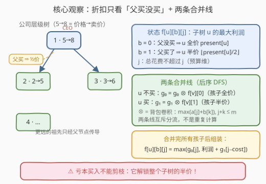
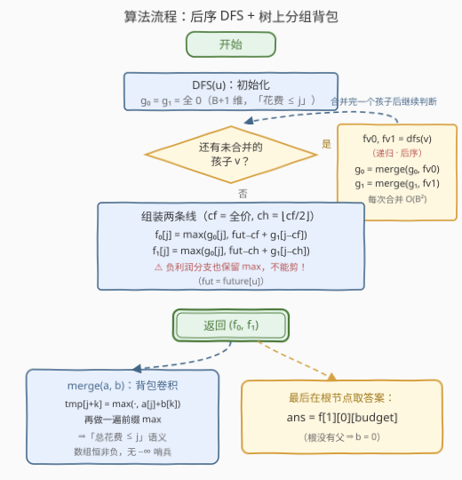

# LeetCode 折扣价交易股票的最大利润 题解

## 1. 题目概述

- **标题 / 题号**：折扣价交易股票的最大利润（#3562，hard）
- **链接**：https://leetcode.cn/problems/maximum-profit-from-trading-stocks-with-discounts/
- **难度**：困难
- **标签**：树, 深度优先搜索, 数组, 动态规划

**题意**：公司有 $n$ 位员工，编号 $1 \sim n$，员工 $1$ 是 CEO。层级关系构成一棵**以 1 为根的树**：`hierarchy[i] = [u, v]` 表示 $u$ 是 $v$ 的直属上司。

- `present[i]`：第 $i$ 位员工今天买股票的**当前价格**；
- `future[i]`：第 $i$ 位员工明天卖股票的**预期价格**；
- `budget`：总投资预算。

**折扣政策**：若某员工的直属上司买了股票，则他可以**半价**购买，即价格变为 $\lfloor present[v] / 2 \rfloor$。

在**总花费不超过 budget**、**每股至多买一次**的前提下，求最大总利润（利润 $= future[v] -$ 实际买价，实际买价取决于父是否购买）。收益不能反哺预算。

**示例 1**：

```text
输入：n = 2, present = [1,2], future = [4,3], hierarchy = [[1,2]], budget = 3
输出：5
解释：员工 1 全价 1 买入（赚 3）；员工 2 因上司买了，半价 floor(2/2)=1 买入（赚 2）；总花费 2 ≤ 3。
```

**示例 2**：

```text
输入：n = 2, present = [3,4], future = [5,8], hierarchy = [[1,2]], budget = 4
输出：4
解释：只买员工 2 的股票（全价 4，赚 4）。
```

**示例 3**：

```text
输入：n = 3, present = [4,6,8], future = [7,9,11], hierarchy = [[1,2],[1,3]], budget = 10
输出：10
解释：买 1（花费 4，赚 3）+ 半价买 3（花费 4，赚 7），总花费 8 ≤ 10。
```

**示例 4**：

```text
输入：n = 3, present = [5,2,3], future = [8,5,6], hierarchy = [[1,2],[2,3]], budget = 7
输出：12
解释：折扣沿链传播：买 1（花费 5，赚 3）→ 2 半价 1 买入（赚 4）→ 3 半价 1 买入（赚 5），总花费 7。
```

**约束**：

- $1 \le n \le 160$
- $1 \le present[i], future[i] \le 50$
- $1 \le budget \le 160$
- `hierarchy` 恰有 $n-1$ 条边，构成以 1 为根的无环层级树

> 💡 **读题关键**：① 折扣只看**直属上司**是否购买——但上司的上司是否购买会通过「上司买没买」逐级传导，形成一条**折扣链**（示例 4）；② 预算是**全局共享**的——各子树间要竞争预算，这正是背包问题的味道；③ 利润可以为负的购买也可能有价值（见 2.2 的坑点）。

## 2. 解题思路

### 2.1 暴力思路：枚举购买集合

每位员工「买 / 不买」二选一，直接枚举 $2^n$ 个购买集合：父的购买状态决定子的买价，总花费 $\le budget$ 时统计利润取最大。$n = 160$ 时 $2^{160}$ 完全不可行，但这个枚举揭示了问题的两层结构：

1. **树上的依赖决策**：每个人的买价由父的决策决定 → 树形 DP；
2. **全局预算约束**：所有购买共享一个背包容量 → 背包 DP。

二者叠加，就是经典的**树形依赖背包**（树上分组背包）。

### 2.2 核心观察：状态只需「父是否购买」+ 预算维度



**观察一：「谁给我折扣」只取决于父节点，状态不需要记录祖先集合。**

定义 $f[u][b][j]$：在子树 $u$ 内、$u$ 的父是否已购股（$b \in \{0,1\}$）、总花费**不超过** $j$ 时的最大利润。看似折扣链很长（祖父、曾祖……），但更远的祖先只能通过「父买没买」影响 $u$ 的价格，而父之下的孙辈又只看 $u$——**依赖是局部的，逐层递归即可完整编码**。$u$ 自己的实际买价：

$$
cost = \begin{cases} present[u] & b = 0 \text{（父没买，全价）} \\ \lfloor present[u]/2 \rfloor & b = 1 \text{（父买了，半价）} \end{cases}
$$

**观察二：$u$ 买 / 不买，把孩子的状态分流成两条独立的合并线。**

在节点 $u$ 处先算两个「孩子侧」数组（与 $u$ 自己无关）：

- $g_0[j]$：$u$ **不买**时子树（不含 $u$）花费 $\le j$ 的最大利润——孩子全走 $f[v][0]$；
- $g_1[j]$：$u$ **买**时子树（不含 $u$）花费 $\le j$ 的最大利润——孩子全走 $f[v][1]$。

初始 $g_0 = g_1 = $ 全 $0$（什么都不买），每递归完一个孩子 $v$ 就做一次**背包卷积合并**（见 2.3）。最后组装：

$$
f[u][b][j] = \max\Big(\, g_0[j],\ \ (future[u] - cost_b) + g_1[j - cost_b] \,\Big)
$$

即「$u$ 不买（利润 $g_0$）」与「$u$ 以 $cost_b$ 买入（利润叠加 $g_1$，预算扣除 $cost_b$）」二取一。答案为 $f[1][0][budget]$（根没有父）。

> ⚠️ **坑点：亏本买入不能剪枝！** 直觉上 $future[u] < cost$ 就该跳过买入分支，但买入的价值不止自身利润——它还**解锁整个子树的半价**。例如 `present = [2,4], future = [1,9], budget = 4, hierarchy = [[1,2]]`：不买员工 1 时，最优是员工 2 全价 4 买入（花费 $4 \le 4$，赚 5）；而亏本买员工 1（亏 1）再让员工 2 半价 2 买入（赚 7），总花费仍为 4，利润 $-1 + 7 = 6 > 5$。亏 1 买入反而更优。转移里对负利润分支取 `max` 天然正确，切勿手动剪掉。

### 2.3 算法流程图



主流程是**后序 DFS**：先递归所有孩子拿到 $(f[v][0], f[v][1])$，再逐个做背包合并：

- $g_0 \leftarrow g_0 \otimes f[v][0]$，$g_1 \leftarrow g_1 \otimes f[v][1]$，其中 $\otimes$ 是**分组背包卷积**：

$$
(a \otimes b)[m] = \max_{j + k \le m} \big( a[j] + b[k] \big)
$$

  实现：双重循环枚举 $j, k$ 更新临时数组 $tmp[j+k]$，最后**前缀 max**（保证「不超过」语义）。所有数组恒非负（全不买利润为 0），无需负无穷哨兵。

- 合并完所有孩子后按 2.2 的公式组装 $f[u][0]$ 与 $f[u][1]$ 返回。

**复杂度**：每个孩子触发一次 $O(B^2)$ 合并（$B$ = budget），共 $2(n-1)$ 次，总计 $O(n \cdot B^2)$；$n, B \le 160$ 时约 $8 \times 10^6$ 次基本操作，轻松通过。

### 2.4 示例演算

以示例 4（链 $1 \to 2 \to 3$，`present = [5,2,3]`，`future = [8,5,6]`，`budget = 7`）为例，数组语义均为「花费 $\le j$」：

**叶子 3**：$g_0 = g_1 = [0,0,\dots]$。买价：全价 3 / 半价 1；利润：$6-3=3$ / $6-1=5$。

| $j$ | 0 | 1 | 2 | 3 | 4 | 5 | 6 | 7 |
|---|---|---|---|---|---|---|---|---|
| $f[3][0]$（全价 3，赚 3） | 0 | 0 | 0 | 3 | 3 | 3 | 3 | 3 |
| $f[3][1]$（半价 1，赚 5） | 0 | 5 | 5 | 5 | 5 | 5 | 5 | 5 |

**节点 2**（孩子 3）：$g_0 = f[3][0]$，$g_1 = f[3][1]$（与全 0 数组合并，结果不变）。买价：全价 2 / 半价 1；利润：$5-2=3$ / $5-1=4$。

- $f[2][1][j] = \max(g_0[j],\ 4 + g_1[j-1])$：$j \ge 1$ 时 $4 + 5 = 9$（2、3 都半价买，花费 $1+1=2$）
- $f[2][0][j] = \max(g_0[j],\ 3 + g_1[j-2])$：$j \ge 5$ 时 $3 + 5 = 8$（2 全价 + 3 半价，花费 $2+1=3$）

**节点 1**（孩子 2）：$g_0 = f[2][0]$，$g_1 = f[2][1]$。买价：全价 5；利润 $8-5=3$。

$$
f[1][0][7] = \max(g_0[7],\ 3 + g_1[2]) = \max(8,\ 3 + 9) = \boxed{12} \ ✓
$$

## 3. 参考代码

### C++

```cpp
class Solution {
  public:
    int maxProfit(int n, vector<int>& present, vector<int>& future,
                  vector<vector<int>>& hierarchy, int budget) {
        int B = budget;
        vector<vector<int>> children(n + 1);
        for (auto& e : hierarchy) children[e[0]].push_back(e[1]);

        // 分组背包卷积：res[m] = max_{j+k<=m}( a[j] + b[k] )，前缀 max 保证「不超过」语义
        auto merge = [&](const vector<int>& a, const vector<int>& b) {
            vector<int> res(B + 1, 0);
            for (int j = 0; j <= B; ++j) {
                if (j > 0 && a[j] == 0) continue;          // 剪枝：a[j]=0 的组合已被覆盖
                for (int k = 0; j + k <= B; ++k)
                    res[j + k] = max(res[j + k], a[j] + b[k]);
            }
            for (int m = 1; m <= B; ++m) res[m] = max(res[m], res[m - 1]);
            return res;
        };

        // 后序 DFS，返回 {f[u][0], f[u][1]}
        function<pair<vector<int>, vector<int>>(int)> dfs = [&](int u) {
            vector<int> g0(B + 1, 0), g1(B + 1, 0);        // u 不买 / 买 的孩子侧数组
            for (int v : children[u]) {
                auto [fv0, fv1] = dfs(v);
                g0 = merge(g0, fv0);                       // u 不买 -> 孩子无折扣
                g1 = merge(g1, fv1);                       // u 买 -> 孩子半价
            }
            int cf = present[u - 1], ch = present[u - 1] / 2;
            int pf = future[u - 1] - cf, ph = future[u - 1] - ch;
            vector<int> f0 = g0, f1 = g0;                  // 不买分支以 g0 为底
            for (int j = cf; j <= B; ++j)                  // 全价买入（父未买）
                f0[j] = max(f0[j], pf + g1[j - cf]);
            for (int j = ch; j <= B; ++j)                  // 半价买入（父已买）
                f1[j] = max(f1[j], ph + g1[j - ch]);
            return make_pair(f0, f1);
        };

        return dfs(1).first[B];                            // 根无父 -> b = 0
    }
};
```

### Python

```python
class Solution:
    def maxProfit(self, n: int, present: List[int], future: List[int],
                  hierarchy: List[List[int]], budget: int) -> int:
        B = budget
        children = defaultdict(list)
        for u, v in hierarchy:
            children[u].append(v)

        def merge(a: List[int], b: List[int]) -> List[int]:
            res = [0] * (B + 1)
            for j in range(B + 1):
                aj = a[j]
                if j > 0 and aj == 0:          # 剪枝：a[j]=0 的组合已被覆盖
                    continue
                for k in range(B + 1 - j):
                    if aj + b[k] > res[j + k]:
                        res[j + k] = aj + b[k]
            for m in range(1, B + 1):          # 前缀 max -> 「不超过」语义
                if res[m] < res[m - 1]:
                    res[m] = res[m - 1]
            return res

        def dfs(u: int) -> tuple:
            g0 = [0] * (B + 1)                 # u 不买：孩子侧走 f[v][0]
            g1 = [0] * (B + 1)                 # u 买：孩子侧走 f[v][1]
            for v in children[u]:
                fv0, fv1 = dfs(v)
                g0 = merge(g0, fv0)
                g1 = merge(g1, fv1)
            cf, ch = present[u - 1], present[u - 1] // 2
            f0 = g0[:]                         # 不买分支以 g0 为底
            f1 = g0[:]
            for j in range(cf, B + 1):         # 全价买入（父未买）
                f0[j] = max(f0[j], future[u - 1] - cf + g1[j - cf])
            for j in range(ch, B + 1):         # 半价买入（父已买）
                f1[j] = max(f1[j], future[u - 1] - ch + g1[j - ch])
            return f0, f1

        return dfs(1)[0][B]                    # 根无父 -> b = 0
```

## 4. 复杂度分析

| 维度 | 复杂度 | 说明 |
|------|--------|------|
| 时间 | $O(n \cdot B^2)$ | 每个节点对孩子的每条合并线各做一次 $O(B^2)$ 背包卷积，共 $2(n-1)$ 次；$n, B \le 160$ 约 $8 \times 10^6$ 次操作 |
| 空间 | $O(n \cdot B)$ | DFS 栈上每层保留 $g_0, g_1, f_0, f_1$ 四个 $O(B)$ 数组；递归深度 $\le n$ |

> 💡 若 $B$ 远大于 $n \cdot \max(present)$，可把合并中 $j$ 的上界限制为「当前已合并物品的总花费与 $B$ 的较小值」，复杂度降为 $O(n^2 \bar{w}^2)$（$\bar{w}$ 为平均价格）——本题 $n \approx B$，无需此优化。

## 5. 扩展：树形依赖背包的一般框架

本题是**树形依赖背包**的直接应用：物品（节点）挂在树上，选择某个物品的「价格」依赖父是否被选。抽象后的通用模板：

1. 每个节点维护一个**预算维度的 dp 数组**，语义建议取「**不超过** $j$」（配合前缀 max，初始化全 0，无负无穷哨兵）；
2. 后序 DFS，孩子数组返回后与当前累计数组做**分组背包卷积**；
3. 本节点自身的决策（选 / 不选、以何种价格选）在**合并完所有孩子之后**统一组装。

经典对照是洛谷 P2014「选课」（每门课需要先修父课程），以及「金明的预算」类主件-附件问题——后者是**两层**的依赖树，可视为本题的退化特例。另一个方向的变化是「换根」：若折扣改为「买了的节点给**整条祖先链**或**全树**让利」，状态就要随拓扑重新设计，不能照搬。

## 6. 面试要点

- **Q1：为什么状态只需要「父是否购买」一维，而不用记录整个祖先的购买集合？**
  答：折扣规则只读取**直属上司**的购买状态。更远的祖先对 $u$ 的影响必须经过父节点传导：祖先买了但父没买，$u$ 依旧全价。因此 $f[u][b]$ 递归定义已完整编码所有信息，状态维数与树深无关。
- **Q2：为什么亏本买入的分支不能剪掉？**
  答：买入的价值 = 自身利润 + **解锁子树半价**。当 $\lfloor present[v]/2 \rfloor$ 的折扣收益足够大时，$future[u] - cost < 0$ 的买入仍可能是全局最优（2.2 的反例：亏 1 买入换来 7 的半价利润）。转移中 `max` 会自动比较，手动剪枝反而出错。
- **Q3：背包卷积为什么最后要做一次前缀 max？**
  答：合并临时数组 $tmp[j+k]$ 只记录恰好凑出 $j+k$ 的组合；「总花费不超过 $m$」要求把所有 $j+k \le m$ 的最优纳入，前缀 max 一次完成。由于所有数组非负且单调，这一步同时保证后续合并的正确性。
- **Q4：复杂度为什么是 $O(n \cdot B^2)$ 而不是 $O(n^2 \cdot B^2)$？**
  答：合并发生在 DFS 的递归树上，每个节点 $u$ 对每个孩子各做一次（两条线）$O(B^2)$ 卷积，合并总次数是 $2(n-1)$（边数级别），不是点对级别——这是树上分组背包「按边合并」的标准计数方式。
- **Q5：为什么答案是 $f[1][0][budget]$？两条线 $g_0 / g_1$ 会重复计算吗？**
  答：根节点没有父，父状态固定为「未买」，取 $b=0$。$g_0 / g_1$ 分别是「$u$ 不买 / 买」两种**互斥决策**对应的孩子侧答案，组装时取 max，是同一子问题的两个分支而非重复计算。

## 同类练习题

| # | 题目 | 与本题的关联 |
|---|------|-------------|
| 337 | [打家劫舍 III](https://leetcode.cn/problems/house-robber-iii/) | 树形 DP「选 / 不选」的入门模板，本题状态设计的退化版（无预算维） |
| 124 | [二叉树中的最大路径和](https://leetcode.cn/problems/binary-tree-maximum-path-sum/) | 后序 DFS 中「合并孩子信息、再组装本节点答案」的经典范式 |
| 968 | [监控二叉树](https://leetcode.cn/problems/binary-tree-cameras/) | 三状态树形 DP，体会状态如何由「邻居的依赖关系」决定 |
| 416 | [分割等和子集](https://leetcode.cn/problems/partition-equal-subset-sum/) | 0-1 背包基础，本题每个节点处的背包卷积正是它的推广 |
| 198 | [打家劫舍](https://leetcode.cn/problems/house-robber/) | 线性版「选 / 不选 + 相邻依赖」，对比树形依赖的异同 |
