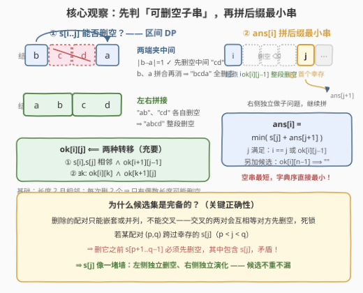
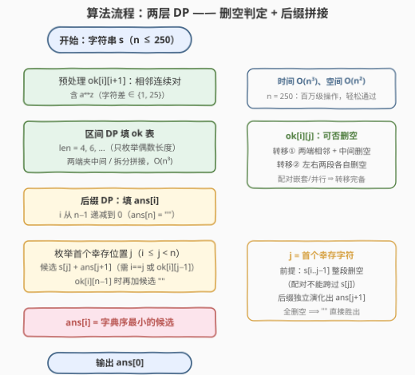

# 移除相邻字符后字典序最小的字符串

- **题目名称**：移除相邻字符后字典序最小的字符串
- **链接**：[3563. 移除相邻字符后字典序最小的字符串](https://leetcode.cn/problems/lexicographically-smallest-string-after-adjacent-removals/)
- **难度**：困难
- **标签**：字符串、动态规划

## 1. 题目概述

给定一个由小写英文字母组成的字符串 `s`，可以进行以下操作**任意次**（包括零次）：

- 移除字符串中**任意**一对**相邻**字符，这两个字符在字母表中是**连续**的，无论顺序如何（例如 `'a'` 和 `'b'`，或者 `'b'` 和 `'a'`）；
- 剩余字符左移填补空隙。

注意**字母表是循环的**：`'a'` 与 `'z'` 也视为连续。返回经过最优操作后可以获得的**字典序最小**的字符串。

**示例 1**：

```text
输入：s = "abc"
输出："a"
解释：移除 "bc" 后剩下 "a"，无法继续操作。
```

**示例 2**：

```text
输入：s = "bcda"
输出：""
解释：移除 "cd" 后剩下 "ba"；再移除 "ba" 后剩下 ""。
```

**示例 3**：

```text
输入：s = "zdce"
输出："zdce"
解释：移除 "dc" 后剩下 "ze"，但 "zdce" 的字典序小于 "ze"，所以什么都不删反而最优。
```

**约束条件**：

- $1 \le s.length \le 250$
- `s` 仅由小写英文字母组成

> 💡 **读题关键**：三个容易踩的坑——① 与 [3561. 移除相邻字符](3561_移除相邻字符.md) 同款消对规则，但那题是「每次必须消**最左**对、求最终结果」（过程确定，栈模拟即可），本题是「**任意**挑对消、求**字典序最小**」——决策空间爆炸，直接升格为 Hard 的区间 DP；② **不是删得越多越好**：示例 3 中删出 `"ze"` 反而比原串 `"zdce"` 大，"不删" 可能就是最优；③ $n \le 250$ 这个规模的 Hard 题几乎明示 $O(n^3)$ 区间 DP。

---

## 2. 解题思路

### 2.1 暴力思路：搜索所有可达状态

最直接的做法是把「可达的字符串」当作状态做 BFS：每个状态枚举当前串中所有可消的相邻对，逐一生成后继状态，用集合去重，最后取字典序最小的终态之一。但每个长度为 $m$ 的串最多有 $m-1$ 个可消对，状态数是**指数级**的——$n = 250$ 时连 $n = 20$ 都撑不住。

那贪心呢？比如「优先删除会让串变小的对」「能删就删」？示例 3 直接给出反例：`"zdce"` 中唯一可消对是 `"dc"`，删了得 `"ze" > "zdce"`——**局部利益与全局字典序完全脱钩**，可达集合是一个非线性的组合结构，只能用 DP 完整刻画。

### 2.2 核心观察：两层 DP——先判「可删空子串」，再拼「后缀最小串」



把每次操作看作一对字符的**配对消去**，整个删除过程就是一个**配对集合**。它有一个决定性的结构性质：

> **配对只能嵌套或并列，不能交叉**。若两对 $(p, q)$ 与 $(p', q')$ 满足 $p < p' < q < q'$，那么要删 $(p,q)$ 就得先把 $s[p+1..q-1]$ 删空（其中含 $p'$），而 $p'$ 的搭档 $q'$ 在 $q$ 之后还活着——删 $p'$ 需要 $q'$ 已经……互相等待，死锁。交叉配对不可能出现在任何合法删除序列中。

**第一层：区间 DP 判定「哪些子串能删空」**。定义 $ok[i][j]$：子串 $s[i..j]$ 能否被若干次操作**完全删除**。由上述结构性质，$ok[i][j]$ 为真当且仅当以下二者之一成立：

- **两端夹中间**：$s[i]$ 与 $s[j]$ 字母表相邻，且 $ok[i+1][j-1]$——先把中间删空，两端字符拼合变相邻，最后消掉这一对（示例 2 的 `"bcda"`：先删中间 `"cd"`，`b`、`a` 才得以「见面」再一起消掉）；
- **拆分拼接**：存在 $k$，使 $ok[i][k]$ 且 $ok[k+1][j]$——左右两段各自删空（如 `"abcd"` = `"ab"` + `"cd"`）。

基础情形是长度 2 且相邻。又因为每次操作恰好消去 **2 个**字符，子串长度奇偶性不变，**只有偶数长度才可能删空**——区间 DP 只枚举偶数长度即可，这是一半的剪枝。

**第二层：后缀 DP 拼出字典序最小**。定义 $ans[i]$：后缀 $s[i..n-1]$ 能变出的字典序最小字符串（$ans[n] = $ `""`）。枚举最优解中**首个幸存字符** $s[j]$：

$$ans[i] = \min\Big(\underbrace{\{\,\text{""} : ok[i][n-1]\,\}}_{\text{整段删空}} \cup \big\{\, s[j] + ans[j+1] \;:\; i \le j \le n-1,\ i = j \text{ 或 } ok[i][j-1] \,\big\}\Big)$$

为什么候选集**恰好完备**？仍是配对结构在发力：若某个配对 $(p, q)$ 跨过幸存的 $s[j]$（$p < j < q$），删它之前 $s[p+1..q-1]$ 必须先删空——其中就包含 $s[j]$，与「幸存」矛盾。所以 **$s[j]$ 像一堵墙**：它左侧的 $s[i..j-1]$ 必然在墙的左侧**独立删空**，右侧独立演化成 $ans[j+1]$ 的某个可达串。反过来，「左段删空 + $s[j]$ + 右侧任意可达串」显然整体可达（先删左边、再处理右边即可）。候选不重不漏。

字典序的最优子结构也成立：候选之间首字符 $s[j]$ 不同时首字符定胜负；相同时比较后缀——子问题取到 $ans[j+1]$ 最小，整体必然最小。另外空串是任何非空串的严格前缀，`""` 可行时必然直接胜出。

### 2.3 算法流程图



整体分两阶段：先用 $O(n^3)$ 的区间 DP 填 $ok$ 表（判定所有子串的可删空性），再从右往左填 $ans$ 表（枚举首个幸存位置 $j$，拼接候选串取字典序最小），$ans[0]$ 即答案。

### 2.4 示例演算

以**示例 2** `s = "bcda"` 走完全流程。

**第一阶段：$ok$ 表**（只列偶数长度）：

| 区间 | 判定 | 结果 |
|------|------|------|
| $[1,2]$ = `"cd"` | 相邻（差 1） | ✓ |
| $[0,1]$ = `"bc"`、$[2,3]$ = `"da"` | `b,c` 相邻 ✓；`d,a` 差 3 ✗ | ✓ / ✗ |
| $[0,3]$ = `"bcda"` | 两端 `b,a` 相邻 ✓ 且 $ok[1][2]$ ✓（两端夹中间） | ✓ |

**第二阶段：$ans$ 表**（从右往左）：

| $i$ | 候选 | $ans[i]$ |
|-----|------|----------|
| 3 | $j{=}3$：`"a"` | `"a"` |
| 2 | $j{=}2$：`"d"+"a"`=`"da"`；$j{=}3$ 需 $ok[2][2]$（奇长）✗ | `"da"` |
| 1 | $j{=}1$：`"c"+"da"`=`"cda"`；$j{=}3$ 需 $ok[1][2]$ ✓：`"a"` | `"a"` |
| 0 | $ok[0][3]$ ✓ ⇒ `""`；$j{=}0$：`"b"+"a"`=`"ba"` | `""` ✓ |

再看**示例 3** `s = "zdce"` 为什么答案是原串：$ok$ 表里只有 $ok[1][2]$（`"dc"`）为真——`"zd"`、`"ce"` 都不相邻，`"dce"` 是奇数长度，`"zdce"` 两端 `z,e` 不相邻也拆不开。于是想让 `z` 后面接更小的串，只能整段删掉 `"dce"`，不可行；$ans[0] = s[0] + ans[1] = "z" + "dce" = "zdce"`——**不删反而最优**。这正是本题与「能删就删」直觉的分野。

---

## 3. 参考代码

### C++

```cpp
class Solution {
  public:
    string lexicographicallySmallestString(string s) {
        int n = s.size();
        // adj：字母表环形相邻判定，差为 1 或 25（a↔z）
        auto adj = [](char a, char b) {
            int d = abs(a - b);
            return d == 1 || d == 25;
        };

        // 第一层：ok[i][j] = s[i..j] 能否完全删除（仅偶数长度）
        vector<vector<char>> ok(n, vector<char>(n, 0));
        for (int i = 0; i + 1 < n; i++)
            if (adj(s[i], s[i + 1])) ok[i][i + 1] = 1;
        for (int len = 4; len <= n; len += 2) {
            for (int i = 0, j = len - 1; j < n; i++, j++) {
                // 转移①：两端相邻 + 中间删空（先消中间，两端拼合后再消）
                if (adj(s[i], s[j]) && ok[i + 1][j - 1]) { ok[i][j] = 1; continue; }
                // 转移②：拆分点左右两段各自删空（k 与 i 异奇偶才可能）
                for (int k = i + 1; k < j; k += 2)
                    if (ok[i][k] && ok[k + 1][j]) { ok[i][j] = 1; break; }
            }
        }

        // 第二层：ans[i] = s[i..n-1] 的字典序最小可达串
        vector<string> ans(n + 1);
        for (int i = n - 1; i >= 0; i--) {
            string best;
            bool has = false;
            if (ok[i][n - 1]) { best = ""; has = true; }   // 整段删空，"" 直接最小
            for (int j = i; j < n; j++) {
                if (j == i || ok[i][j - 1]) {              // s[i..j-1] 必须能删空
                    string cand = s[j] + ans[j + 1];       // 首个幸存字符 + 子问题
                    if (!has || cand < best) { best = move(cand); has = true; }
                }
            }
            ans[i] = move(best);
        }
        return ans[0];
    }
};
```

### Python

```python
class Solution:
    def lexicographicallySmallestString(self, s: str) -> str:
        n = len(s)
        adj = lambda a, b: abs(ord(a) - ord(b)) in (1, 25)   # 环形相邻，含 a↔z

        # 第一层：ok[i][j] = s[i..j] 能否完全删除（仅偶数长度）
        ok = [[False] * n for _ in range(n)]
        for i in range(n - 1):
            if adj(s[i], s[i + 1]):
                ok[i][i + 1] = True
        for length in range(4, n + 1, 2):
            for i in range(n - length + 1):
                j = i + length - 1
                # 转移①：两端相邻 + 中间删空
                if adj(s[i], s[j]) and ok[i + 1][j - 1]:
                    ok[i][j] = True
                    continue
                # 转移②：左右两段各自删空（k 与 i 异奇偶）
                for k in range(i + 1, j, 2):
                    if ok[i][k] and ok[k + 1][j]:
                        ok[i][j] = True
                        break

        # 第二层：ans[i] = s[i..n-1] 的字典序最小可达串
        ans = [""] * (n + 1)
        for i in range(n - 1, -1, -1):
            best = None
            if ok[i][n - 1]:
                best = ""                                    # 整段删空
            for j in range(i, n):
                if j == i or ok[i][j - 1]:                   # s[i..j-1] 必须能删空
                    cand = s[j] + ans[j + 1]                 # 首个幸存字符 + 子问题
                    if best is None or cand < best:
                        best = cand
            ans[i] = best
        return ans[0]
```

---

## 4. 复杂度分析

| 维度 | 复杂度 | 说明 |
|------|--------|------|
| 时间 | $O(n^3)$ | 第一层：$O(n^2)$ 个偶长区间 × $O(n)$ 拆分枚举；第二层：每个 $i$ 枚举 $O(n)$ 个候选 $j$，每个候选的拼接与比较 $O(n)$。$n = 250$ 时约数百万次基本操作，实测 Python 亦瞬间通过（大量区间 $ok$ 为假、拆分循环提前 `break`） |
| 空间 | $O(n^2)$ | $ok$ 布尔表占 $n^2/2$；$ans$ 数组各串总长 $O(n^2)$ |

---

## 5. 扩展：同规则、不同约束——从 3561 到 3563

[3561. 移除相邻字符](3561_移除相邻字符.md) 与本题共用同一套「相邻连续对消去」规则，难度却天差地别，根源在**约束改变了问题的代数结构**：

| 题目 | 消对策略 | 结构 | 解法 |
|------|----------|------|------|
| 3561 | 每次强制消**最左**对 | 过程完全确定（消对顺序敏感，但题目钉死了顺序） | 栈模拟，$O(n)$ |
| 3563 | **任意**挑对消，求字典序最小 | 可达集合是组合结构，需完整刻画 | 区间 DP × 2，$O(n^3)$ |

进一步的加速空间（本题 $n \le 250$ 用不上）：转移②「$\exists k: ok[i][k] \wedge ok[k+1][j]$」可以按行做**位并行**——把 $ok[i][\cdot]$ 压成位向量，类似传递闭包的 Warshall 式批量松弛，理论上降到 $O(n^3/w)$。而 $ans$ 层的候选比较可先筛出最小首字符 $c^\*$，只在 $s[j] = c^\*$ 的候选间比较 $ans[j+1]$，省去大量无谓拼接。

---

## 6. 面试要点

- **Q1：为什么贪心（能删就删 / 优先删小字符）不行？**
  答：局部决策与全局字典序脱钩。`"zdce"` 唯一可消对 `"dc"`，删了得 `"ze" > "zdce"`；可达集合是非线性组合结构，只有 DP 能完整刻画，必须先回答「哪些子串删得空」。
- **Q2：$ok[i][j]$ 只有两种转移，凭什么完备？**
  答：删除配对只能**嵌套或并列、不能交叉**（交叉则互相等待对方先删空，死锁）。对删空的子串归纳：最外层配对若唯一且是 $(i,j)$，得转移①（两端夹中间）；若最外层有多对，按第一棵子树的边界拆分，得转移②。
- **Q3：$ans$ 的转移为什么只枚举「首个幸存字符」就够？**
  答：配对不能跨过幸存的 $s[j]$——若 $(p,q)$ 跨过 $j$，删它前 $s[p+1..q-1]$ 须先删空、包含 $s[j]$，与幸存矛盾。故 $s[j]$ 左侧必然独立删空（$ok[i][j-1]$）、右侧独立演化（$ans[j+1]$），候选集恰好等于全部可达串。
- **Q4：`'a'` 和 `'z'` 的相邻性怎么判？**
  答：字符差 $d = |c_1 - c_2|$，$d \in \{1, 25\}$ 即相邻，等价 $\min(d, 26 - d) = 1$。只判 $d = 1$ 会漏掉 $a \leftrightarrow z$，是最常见 WA 点（与 3561 同款陷阱）。
- **Q5：为什么只枚举偶数长度区间？**
  答：每次操作恰好删 2 个字符，子串长度每步减 2、奇偶性不变；奇数长度子串永远不可能删空。区间 DP 外层 `len` 步进 2、拆分点 `k` 也步进 2，直接省掉一半状态与转移。

---

## 7. 同类练习题

- [546. 移除盒子](https://leetcode.cn/problems/remove-boxes/)：同样用区间 DP 刻画「消除结构」，状态需额外携带「尾巴同色数」，是本题结构①（嵌套消去）的进阶版
- [664. 奇怪的打印机](https://leetcode.cn/problems/strange-printer/)：区间 DP 的「首字符归并」技巧——两端同色时剥皮转移，与本题转移①同宗
- [1541. 平衡括号字符串的最少插入](https://leetcode.cn/problems/minimum-insertions-to-balance-a-parentheses-string/)：括号配对消除类判定，体会「配对嵌套/并列」结构的另一形态
- [316. 去除重复字母](https://leetcode.cn/problems/remove-duplicate-letters/)：构造字典序最小的贪心栈路线（单调栈 + 入栈锁定），对照本题 DP 路线的适用边界
- [402. 移掉 K 位数字](https://leetcode.cn/problems/remove-k-digits/)：「删除若干字符使剩余字典序最小」的贪心栈经典，约束简单到可贪心；本题删除约束（配对消除）复杂得多，只能区间 DP
