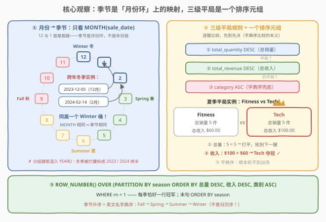
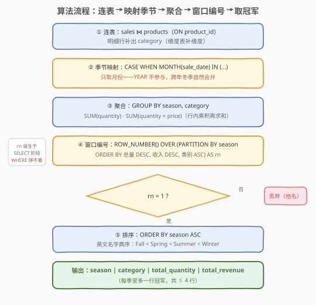

# 季节性销售分析

- **题目名称**：季节性销售分析
- **链接**：[3564. 季节性销售分析](https://leetcode.cn/problems/seasonal-sales-analysis/)
- **难度**：中等
- **标签**：数据库、SQL、`CASE WHEN` 条件映射、`GROUP BY` 聚合、窗口函数 `ROW_NUMBER()`、分组 Top-1

## 1. 题目概述

**表结构**：

`sales` 表：

| 列名 | 类型 |
|------|------|
| sale_id | int |
| product_id | int |
| sale_date | date |
| quantity | int |
| price | decimal |

- `sale_id` 是这张表的唯一主键。
- 每一行包含一件产品的销售信息：产品、销售日期、销售数量与单价。

`products` 表：

| 列名 | 类型 |
|------|------|
| product_id | int |
| product_name | varchar |
| category | varchar |

- `product_id` 是这张表的唯一主键。
- 每一行包含一件产品的名字与分类。

**目标**：编写一个解决方案，找到**每个季节最受欢迎的产品分类**。季节按月份划分：

| 季节 | 月份（只看月份，与年份无关） |
|------|------|
| Winter 冬季 | 12、1、2 月 |
| Spring 春季 | 3、4、5 月 |
| Summer 夏季 | 6、7、8 月 |
| Fall 秋季 | 9、10、11 月 |

- **受欢迎度**由该季节内分类的**总销售量**（`SUM(quantity)`）决定；
- 若有并列，选择**总收入**（`SUM(quantity × price)`）最高的分类；
- 若仍然并列，返回**字典序更小**的分类；
- 返回结果表以季节**升序**排序，输出冠军分类自己的 `total_quantity` 与 `total_revenue`。

**示例 1**：

```text
输入：
sales 表：
+---------+------------+------------+----------+-------+
| sale_id | product_id | sale_date  | quantity | price |
+---------+------------+------------+----------+-------+
| 1       | 1          | 2023-01-15 | 5        | 10.00 |
| 2       | 2          | 2023-01-20 | 4        | 15.00 |
| 3       | 3          | 2023-03-10 | 3        | 18.00 |
| 4       | 4          | 2023-04-05 | 1        | 20.00 |
| 5       | 1          | 2023-05-20 | 2        | 10.00 |
| 6       | 2          | 2023-06-12 | 4        | 15.00 |
| 7       | 5          | 2023-06-15 | 5        | 12.00 |
| 8       | 3          | 2023-07-24 | 2        | 18.00 |
| 9       | 4          | 2023-08-01 | 5        | 20.00 |
| 10      | 5          | 2023-09-03 | 3        | 12.00 |
| 11      | 1          | 2023-09-25 | 6        | 10.00 |
| 12      | 2          | 2023-11-10 | 4        | 15.00 |
| 13      | 3          | 2023-12-05 | 6        | 18.00 |
| 14      | 4          | 2023-12-22 | 3        | 20.00 |
| 15      | 5          | 2024-02-14 | 2        | 12.00 |
+---------+------------+------------+----------+-------+

products 表：
+------------+-----------------+----------+
| product_id | product_name    | category |
+------------+-----------------+----------+
| 1          | Warm Jacket     | Apparel  |
| 2          | Designer Jeans  | Apparel  |
| 3          | Cutting Board   | Kitchen  |
| 4          | Smart Speaker   | Tech     |
| 5          | Yoga Mat        | Fitness  |
+------------+-----------------+----------+

输出：
+---------+----------+----------------+---------------+
| season  | category | total_quantity | total_revenue |
+---------+----------+----------------+---------------+
| Fall    | Apparel  | 10             | 120.00        |
| Spring  | Kitchen  | 3              | 54.00         |
| Summer  | Tech     | 5              | 100.00        |
| Winter  | Apparel  | 9              | 110.00        |
+---------+----------+----------------+---------------+
```

**解释**（要点摘录）：

- **秋季**：Apparel 共 10 件（9 月 6 件夹克 + 11 月 4 条牛仔裤，收入 $120.00），Fitness 仅 3 件——Apparel 以总量夺冠；
- **春季**：Kitchen 3 件 $54.00，Tech 1 件，Apparel 2 件——Kitchen 总量最多且收入最高；
- **夏季**：Tech 与 Fitness 都是 5 件**并列第一**，但 Tech 收入 $100.00 &gt; Fitness $60.00——平局由收入决出；
- **冬季**：Apparel 9 件 $110.00（**2023 年 1 月**的 5 件夹克 + 4 条牛仔裤）夺冠；注意 `sale_id = 15`（Yoga Mat）的日期是 **2024-02-14**，它和 2023 年 12 月的两笔销售同属一个冬季。

**约束条件**（由表结构与题意提取）：

- `sale_date` 横跨多个自然年（示例含 2023 与 2024 两年数据），而季节**只由月份决定**——这是本题最大的坑；
- 「季节升序」是对 `season` **字符串**的升序，输出使用英文季节名，字典序为 Fall &lt; Spring &lt; Summer &lt; Winter——**不是**「春 → 夏 → 秋 → 冬」的日历顺序；
- 只有**存在销售数据**的季节才会出现在结果里（`GROUP BY` 只产生实际出现的组），结果至多 4 行。

> 💡 **审题关键**：① 季节是「月份环」上的概念——12 月与次年 1、2 月同桶，**分组键里绝不能出现 `YEAR()`**；② 三级平局规则（总量 → 收入 → 字典序）天然对应**一个多键排序元组**；③ 收入口径是 `SUM(quantity × price)`——每行的数量与单价**配对相乘**再求和。三点凑齐，本题就是「CASE 映射 + GROUP BY + 窗口函数取分组 Top-1」三件套。

---

## 2. 解题思路

### 2.1 暴力思路：每个季节各写一遍 LIMIT 1，再 UNION ALL

最直译的写法是把「连表 + 聚合 + 三键排序 + 取第一」复制四份，每个季节一段，最后 `UNION ALL` 拼起来：

```sql
(SELECT 'Fall' AS season, p.category,
        SUM(s.quantity) AS total_quantity,
        SUM(s.quantity * s.price) AS total_revenue
 FROM sales s JOIN products p ON s.product_id = p.product_id
 WHERE MONTH(s.sale_date) IN (9, 10, 11)
 GROUP BY p.category
 ORDER BY total_quantity DESC, total_revenue DESC, p.category
 LIMIT 1)
UNION ALL
(SELECT 'Spring' AS season, p.category,
        SUM(s.quantity) AS total_quantity,
        SUM(s.quantity * s.price) AS total_revenue
 FROM sales s JOIN products p ON s.product_id = p.product_id
 WHERE MONTH(s.sale_date) IN (3, 4, 5)
 GROUP BY p.category
 ORDER BY total_quantity DESC, total_revenue DESC, p.category
 LIMIT 1)
UNION ALL
(SELECT 'Summer' AS season, p.category,
        SUM(s.quantity) AS total_quantity,
        SUM(s.quantity * s.price) AS total_revenue
 FROM sales s JOIN products p ON s.product_id = p.product_id
 WHERE MONTH(s.sale_date) IN (6, 7, 8)
 GROUP BY p.category
 ORDER BY total_quantity DESC, total_revenue DESC, p.category
 LIMIT 1)
UNION ALL
(SELECT 'Winter' AS season, p.category,
        SUM(s.quantity) AS total_quantity,
        SUM(s.quantity * s.price) AS total_revenue
 FROM sales s JOIN products p ON s.product_id = p.product_id
 WHERE MONTH(s.sale_date) IN (12, 1, 2)
 GROUP BY p.category
 ORDER BY total_quantity DESC, total_revenue DESC, p.category
 LIMIT 1)
ORDER BY season;
```

逻辑正确（MySQL 可运行），但毛病一堆：

1. **代码复制 4 份**：同一段「连表 + 聚合 + 三键排序」重复四次——哪天平局规则改成「收入优先」，要同步改 4 处，漏改一处立刻出错；
2. **4 趟全表扫描 + 4 次分组聚合**：I/O 与聚合开销直接 ×4；
3. **`LIMIT 1` 的正确性是隐式的**：它依赖「三键必分胜负」——本题第三键 `category` 在组内唯一所以安全，但这个论证藏在水面之下；
4. **每个分支都必须写列别名**：UNION 各分支的 `ORDER BY` 只认自己分支的输出列，后三个分支若省略 `AS total_quantity`，会直接报 Unknown column（实测踩坑）。

### 2.2 核心观察：月份环上的季节映射 + 三级平局规则元组化



**观察一：季节是「月份环」上的映射，不是「年份段」**。把 12 个月摆成环，Winter 占据 12–1–2 三格、首尾相接。示例里 `2023-12-05`（Cutting Board）与 `2024-02-14`（Yoga Mat）相隔两个自然年，却必须落进**同一个 Winter 桶**——`MONTH(sale_date)` 是唯一该用的日期函数，`YEAR()` 是彻头彻尾的烟雾弹。分组键一旦混入年份，冬季就被拦腰拆成「2023 冬」与「2024 冬」两半：结果多出一行 Winter，冠军统计互相污染。

**观察二：三级平局规则 = 一个排序元组**。「先比总量、平了比收入、还平比字典序」翻译成形式语言就是字典序比较元组 $(\text{总量}, \text{收入}, \text{类别})$，与 SQL 的多键 `ORDER BY` **天然同构**——逐键比较、先到先决。于是「每个季节的冠军」= 「分组内按该元组排名第一的行」，一趟 `ROW_NUMBER() OVER (PARTITION BY season ORDER BY total_quantity DESC, total_revenue DESC, category ASC)` 拿到编号，`rn = 1` 即冠军。切忌用 `CASE WHEN` 链手工模拟三级比较——元组比较是它唯一简洁的表达。

**观察三：收入是「行内乘积再求和」**。`total_revenue = SUM(quantity * price)`：每行的数量与单价是**配对**的（同一产品不同批次可能调价），不能写成 `SUM(quantity) * AVG(price)` 之类的近似。本题数据里同产品单价恒定，两种算法数值巧合相同，但口径错误在变价数据下必错。

> 💡 与 2.1 对照：暴力版把「分组取 Top-1」这一**一个**语义任务拆成了四段重复代码；窗口函数版把「四级需求」（映射、聚合、排名、过滤）各交给一个子句，每段只写一遍。前者是「按季节平铺」，后者是「按子句分层」——分层才是 SQL 的母语。

### 2.3 算法流程图



**逻辑执行步骤**：

| 步骤 | 子句 | 作用 |
|------|------|------|
| ① | `sales JOIN products ON product_id` | 明细行补出 `category` |
| ② | `CASE WHEN MONTH(sale_date) IN (...)` | 月份 → 季节（不看年份，跨年冬季自然合并） |
| ③ | `GROUP BY season, category` | `SUM(quantity)` 与 `SUM(quantity × price)` |
| ④ | `ROW_NUMBER() OVER (PARTITION BY season ORDER BY 三键)` | 季节内按元组排名 |
| ⑤ | `WHERE rn = 1` | 每季恰好留下冠军一行 |
| ⑥ | `ORDER BY season` | 英文名字典序：Fall → Spring → Summer → Winter |

> 💡 **为什么 `WHERE rn = 1` 必须再包一层**：SQL 逻辑执行顺序为 `FROM → ON → WHERE → GROUP BY → HAVING → SELECT（窗口函数在这里求值）→ ORDER BY`。`WHERE` 先于 `SELECT` 执行，`rn` 诞生时 `WHERE` 早已跑完，同层引用直接报 Unknown column。所以窗口函数的输出要么进 CTE / 派生表再过滤（本解法），要么用 DuckDB / Snowflake 的 `QUALIFY` 子句——MySQL 与 PostgreSQL 没有 `QUALIFY`。另外注意窗口函数排在 `GROUP BY` **之后**求值，所以 ④ 能「看见」③ 的聚合结果 `total_quantity` / `total_revenue`——这正是本题能用一个窗口函数收官的前提。

### 2.4 示例演算

**第 ① 步：连表 + 季节映射**（15 条明细 → 每行获得 season 与 category）。

**第 ② 步：按 (season, category) 聚合**：

| season | category | total_quantity | total_revenue | 备注 |
|--------|----------|----------------|---------------|------|
| Fall | Apparel | 10 | 120.00 | 9 月 6 件夹克 + 11 月 4 条牛仔裤 |
| Fall | Fitness | 3 | 36.00 | 9 月 3 张瑜伽垫 |
| Spring | Apparel | 2 | 20.00 | 5 月 2 件夹克 |
| Spring | Kitchen | 3 | 54.00 | 3 月 3 张菜板 |
| Spring | Tech | 1 | 20.00 | 4 月 1 台音箱 |
| Summer | Apparel | 4 | 60.00 | 6 月 4 条牛仔裤 |
| Summer | Fitness | 5 | 60.00 | 6 月 5 张瑜伽垫 |
| Summer | Kitchen | 2 | 36.00 | 7 月 2 张菜板 |
| Summer | Tech | 5 | 100.00 | 8 月 5 台音箱 |
| Winter | Apparel | 9 | 110.00 | **2023-01** 的 5 件夹克 + 4 条牛仔裤 |
| Winter | Fitness | 2 | 24.00 | **2024-02-14** 的 2 张瑜伽垫 |
| Winter | Kitchen | 6 | 108.00 | **2023-12-05** 的 6 张菜板 |
| Winter | Tech | 3 | 60.00 | **2023-12-22** 的 3 台音箱 |

注意 Winter 的四行横跨 2023-01、2023-12、2024-02 三个「年份段」——只按月份归桶。

**第 ③ 步：窗口编号 + 取 rn = 1**：

| season | 冠军 | 三键比较过程 |
|--------|------|--------------|
| Fall | Apparel (10, 120.00) | 总量 10 &gt; 3，第一键直接分出胜负 |
| Spring | Kitchen (3, 54.00) | 总量 3 &gt; 2 &gt; 1，第一键分出 |
| Summer | Tech (5, 100.00) | 总量 5 = 5（Fitness 并列）→ 收入 100 &gt; 60，第二键分出 |
| Winter | Apparel (9, 110.00) | 总量 9 &gt; 6 &gt; 3 &gt; 2，第一键分出 |

**第 ④ 步：按 season 字典序输出**：Fall → Spring → Summer → Winter，与预期输出逐行一致。夏季是全表唯一用到第二级平局键的赛季；第三级（字典序）在本例中始终轮不到出场——但它是**确定性兜底**，保证任何数据下编号无歧义。

---

## 3. 参考代码

### SQL（CTE + 窗口函数，推荐）

```sql
# Write your MySQL query statement below
WITH joined AS (
    SELECT
        CASE
            WHEN MONTH(s.sale_date) IN (12, 1, 2)  THEN 'Winter'
            WHEN MONTH(s.sale_date) IN (3, 4, 5)   THEN 'Spring'
            WHEN MONTH(s.sale_date) IN (6, 7, 8)   THEN 'Summer'
            WHEN MONTH(s.sale_date) IN (9, 10, 11) THEN 'Fall'
        END AS season,
        p.category,
        s.quantity,
        s.price
    FROM sales s
    JOIN products p ON s.product_id = p.product_id
),
agg AS (
    SELECT
        season,
        category,
        SUM(quantity)         AS total_quantity,
        SUM(quantity * price) AS total_revenue
    FROM joined
    GROUP BY season, category
),
ranked AS (
    SELECT
        season,
        category,
        total_quantity,
        total_revenue,
        ROW_NUMBER() OVER (
            PARTITION BY season
            ORDER BY total_quantity DESC, total_revenue DESC, category ASC
        ) AS rn
    FROM agg
)
SELECT season, category, total_quantity, total_revenue
FROM ranked
WHERE rn = 1
ORDER BY season;
```

> 💡 **写法要点**：
> - `CASE` 不写 `ELSE`：`MONTH()` 必落在 1–12，四个 `WHEN` 全覆盖，`season` 不会为 NULL；
> - 窗口排序的第三键 `category ASC` 是确定性兜底：同一季节同一类别只有一个组，三键必分胜负，`ROW_NUMBER` 编号无歧义；
> - `total_revenue` 继承 `DECIMAL` 的 scale（如两位小数），MySQL 原生输出 `120.00`，无需格式化；
> - 换 PostgreSQL 只需把 `MONTH(x)` 换成 `EXTRACT(MONTH FROM x)::INT`，其余逐字不变。

### SQL（无窗口函数版：NOT EXISTS 反连接）

```sql
WITH joined AS (
    SELECT
        CASE
            WHEN MONTH(s.sale_date) IN (12, 1, 2)  THEN 'Winter'
            WHEN MONTH(s.sale_date) IN (3, 4, 5)   THEN 'Spring'
            WHEN MONTH(s.sale_date) IN (6, 7, 8)   THEN 'Summer'
            WHEN MONTH(s.sale_date) IN (9, 10, 11) THEN 'Fall'
        END AS season,
        p.category,
        s.quantity,
        s.price
    FROM sales s
    JOIN products p ON s.product_id = p.product_id
),
agg AS (
    SELECT
        season,
        category,
        SUM(quantity)         AS total_quantity,
        SUM(quantity * price) AS total_revenue
    FROM joined
    GROUP BY season, category
)
SELECT a.season, a.category, a.total_quantity, a.total_revenue
FROM agg a
WHERE NOT EXISTS (
    SELECT 1
    FROM agg b
    WHERE b.season = a.season
      AND (b.total_quantity > a.total_quantity
        OR (b.total_quantity = a.total_quantity
            AND b.total_revenue > a.total_revenue)
        OR (b.total_quantity = a.total_quantity
            AND b.total_revenue = a.total_revenue
            AND b.category < a.category))
)
ORDER BY a.season;
```

> 💡 语义：「留下同季节内**没有任何类别能在三键上压过自己**的行」。`OR` 链的三段正是元组比较 $(q, r, c)$ 的展开——$b$ 的元组按 (总量降、收入降、类别升) 意义下「大于」$a$ 的元组。窗口函数是 MySQL 8+ 的特权，这套反连接写法在 MySQL 5.7 时代同样能跑（CTE 换成派生表即可），面试中常作为「不用窗口函数怎么做」的标准答案。

### Pandas

```python
import pandas as pd


def seasonal_sales_analysis(products: pd.DataFrame, sales: pd.DataFrame) -> pd.DataFrame:
    df = sales.merge(products, on="product_id", how="left")
    month = pd.to_datetime(df["sale_date"]).dt.month
    season_map = {12: "Winter", 1: "Winter", 2: "Winter",
                  3: "Spring", 4: "Spring", 5: "Spring",
                  6: "Summer", 7: "Summer", 8: "Summer",
                  9: "Fall", 10: "Fall", 11: "Fall"}
    df["season"] = month.map(season_map)
    df["revenue"] = df["quantity"] * df["price"]
    agg = (df.groupby(["season", "category"], as_index=False)
             .agg(total_quantity=("quantity", "sum"),
                  total_revenue=("revenue", "sum")))
    agg = agg.sort_values(["season", "total_quantity", "total_revenue", "category"],
                          ascending=[True, False, False, True])
    top = agg.drop_duplicates(subset="season", keep="first")
    return (top[["season", "category", "total_quantity", "total_revenue"]]
            .round({"total_revenue": 2})
            .reset_index(drop=True))
```

> 💡 **pandas 对照**：`dt.month` 对应 `MONTH()`——同样天然丢弃年份；字典 `map` 对应 `CASE WHEN`；`groupby + agg` 命名聚合对应 `GROUP BY + SUM`；四键 `sort_values` 传 `ascending` 列表对应窗口内的三键 `ORDER BY`（多出的首键 `season` 是为了让同季聚在一起）；`drop_duplicates(subset="season", keep="first")` 对应 `ROW_NUMBER + WHERE rn = 1`——排序后每季第一行即冠军。末尾 `round(2)` 是 pandas 特有的防线：`price` 进来就是 float64，多次乘加可能引入 $10^{-13}$ 级浮点误差，SQL 里 `DECIMAL` 精确类型没有这个问题。

---

## 4. 复杂度分析

| 维度 | 复杂度 | 说明 |
|------|--------|------|
| **时间复杂度** | $O(n + g \log g)$ | $n$ 为销售记录数：连表走 `product_id` 主键索引 $O(n)$，哈希分组聚合 $O(n)$；窗口排序 $O(g \log g)$，$g$ 为 (季节, 类别) 组数，$g \le 4C$（$C$ 为类别数） |
| **空间复杂度** | $O(n + g)$ | `joined` 中间行 + 聚合表 + 窗口编号列 |

> - 组数 $g$ 是**维度基数**（季节 × 类别），与销售记录数 $n$ 无关——哪怕千万条销售记录，排序的也只是几十个组，这是「先聚合再排名」架构的收益；
> - 暴力解（2.1）为 $O(4n)$：四段各自连表 + 分组聚合，系数放大 4 倍；
> - 反连接版（3.2）在 $g$ 很小时近似 $O(g^2)$ 的组间比较，同样可忽略；
> - LeetCode 数据量毫秒级，三种写法的差异体现在**可维护性**上：窗口函数版只需改一处即可调整平局规则。

---

## 5. 扩展：并列冠军与缺失季节

### 5.1 ROW_NUMBER 换成 RANK：要「恰一行」还是要「并列都留」

本题第三级键 `category` 在 (season, category) 组内唯一，三键必分胜负、排名必无并列，`ROW_NUMBER` 与 `RANK` 逐行一致。但若题目改成「**输出所有并列冠军**」（去掉字典序兜底），两者立刻分道扬镳：

```sql
RANK()       OVER (PARTITION BY season ORDER BY total_quantity DESC)  -- 并列同名次、跳号
DENSE_RANK() OVER (PARTITION BY season ORDER BY total_quantity DESC)  -- 并列同名次、不跳号
ROW_NUMBER() OVER (PARTITION BY season ORDER BY total_quantity DESC)  -- 强行唯一编号（并列时随机留一个！）
```

`ROW_NUMBER` 在并列时会**不确定地**丢弃并列者——示例夏季若只按总量排名，Fitness 与 Tech 并列 5 件，谁被留下全看实现。要「恰一行」就补足确定性键（本题做法），要「并列都留」就换 `RANK` 并过滤 `rk = 1`。

### 5.2 没有销售的季度也要出现：日历表 LEFT JOIN

`GROUP BY` 只产生实际存在的组——某季度若无一笔销售，结果里就没有这一行。若报表要求**固定输出 4 行**、缺失季节补 NULL，需要一个季节维表从左侧补全：

```sql
WITH seasons AS (
    SELECT 'Fall' AS season UNION ALL SELECT 'Spring'
    UNION ALL SELECT 'Summer' UNION ALL SELECT 'Winter'
)
SELECT s.season, w.category, w.total_quantity, w.total_revenue
FROM seasons s
LEFT JOIN ranked w ON w.season = s.season AND w.rn = 1
ORDER BY s.season;
```

「小维表 LEFT JOIN 事实表」是 BI 报表补全稀疏数据的日常操作——语义与「内连接只留有数据的行」刚好互补。

---

## 6. 面试要点

1. **为什么分组键里不能出现 `YEAR(sale_date)`？**

   > 冬季 = 12 月 + 次年 1、2 月，天然横跨两个自然年——示例里 `2023-12-05` 与 `2024-02-14` 必须进同一个 Winter 桶。分组键或季节映射一旦混入年份，冬季就被拆成「2023 冬」「2024 冬」两半：结果多出一行 Winter，冠军统计互相污染。季节是月份环上的概念，`MONTH()` 是唯一该用的日期函数。

2. **三级平局规则怎么用一条 SQL 表达？**

   > 元组化：$(\text{总量 DESC}, \text{收入 DESC}, \text{类别 ASC})$ 就是一个多键排序元组，与 `ORDER BY` 的语义天然同构——逐键比较、先到先决。放进 `ROW_NUMBER() OVER (PARTITION BY season ORDER BY ...)` 的窗口排序，`rn = 1` 即冠军。用 `CASE WHEN` 链手工模拟三级比较既冗长又易错，元组比较是唯一简洁表达。

3. **`WHERE rn = 1` 为什么必须再嵌套一层？**

   > 逻辑执行顺序 `FROM → ON → WHERE → GROUP BY → HAVING → SELECT（窗口函数在此求值）→ ORDER BY`。`WHERE` 先于 `SELECT`，`rn` 诞生时 `WHERE` 早已执行完，同层引用直接报 Unknown column。通用解法是 CTE / 派生表再过滤；DuckDB、Snowflake 提供 `QUALIFY` 子句省掉嵌套，MySQL 与 PostgreSQL 没有。反过来，窗口函数在 `GROUP BY` 之后求值，所以能引用聚合列——这正是本题结构的成立前提。

4. **`ROW_NUMBER` 换成 `RANK` 有影响吗？**

   > 本题没有：第三键 `category` 组内唯一，三键必分胜负，两者逐行一致。但语义不同——若去掉字典序兜底键，`ROW_NUMBER` 会在并列时不确定地随机留一行，`RANK` 才会把并列冠军都留下。选型取决于业务要「恰一行」还是「并列都留」，见 5.1。

5. **输出的 `120.00` 两位小数是怎么保住的？pandas 需要注意什么？**

   > `price` 是 `DECIMAL`，`quantity * price` 与 `SUM` 都保持 `DECIMAL` 的 scale（两位小数），MySQL 原生输出 `120.00`。pandas 里 `price` 读进来就是 float64，乘加可能引入 $10^{-13}$ 级误差，输出前需 `round(2)` 兜底——「数据库精确类型 vs 浮点近似」的经典对照，金额字段永远优先 DECIMAL。

> 💡 **一句话总结**：3564 = 「`CASE` 月份映射 + `GROUP BY` 聚合 + `ROW_NUMBER` 取分组 Top-1」三件套。两个坑：**跨年冬季不能带 `YEAR`**（月份环思维）、**季节升序是英文字典序而非日历序**。平局三级规则元组化是与 184「部门工资最高的员工」一脉相承的分组 Top-1 套路，收入口径 `SUM(quantity × price)` 与 1251「平均售价」同源。

---

## 7. 同类练习题

- [184. 部门工资最高的员工](https://leetcode.cn/problems/department-highest-salary/)（[题解](../0101-0200/184_部门工资最高的员工.md)）：分组 Top-1 招牌题——JOIN 补维度 + 组内取最大，本题「无窗口函数版」的原型
- [586. 订单最多的客户](https://leetcode.cn/problems/customer-placing-the-largest-number-of-orders/)（[题解](../0501-0600/586_订单最多的客户.md)）：GROUP BY 计数后取最大组，`HAVING = (SELECT MAX ...)` 的无窗口 Top-1 技巧，练本题第 ④⑤ 步的另一种落地
- [1251. 平均售价](https://leetcode.cn/problems/average-selling-price/)（[题解](../1201-1300/1251_平均售价.md)）：同为 `SUM(quantity × price)` 的「行内乘积再求和」收入口径 + 日期区间连接，练本题第 ①③ 步
- [1327. 列出指定时间段内所有的下单产品](https://leetcode.cn/problems/list-the-products-ordered-in-a-period/)：月份区间筛选 + GROUP BY + HAVING 聚合过滤，练本题的日期处理与组级条件
- [1076. 项目员工 II](https://leetcode.cn/problems/project-employees-ii/)：`HAVING COUNT(*) = (SELECT MAX ...)` 的分组最大值模板，与 NOT EXISTS 反连接互为镜像
