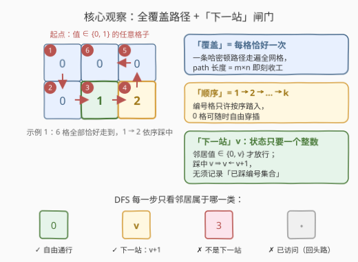
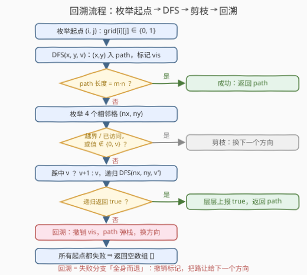

# LeetCode 顺序网格路径覆盖 题解

## 1. 题目概述

- **标题 / 题号**：顺序网格路径覆盖（#3565，medium）
- **链接**：https://leetcode.cn/problems/sequential-grid-path-cover/
- **难度**：中等
- **标签**：递归、数组、矩阵、回溯

> ⚠️ 本题为 LeetCode 付费题（🔒），官方 GraphQL 接口不返回题面。以下题意依据官方示例用例（`jsonExampleTestcases`）、hints 与函数签名 `findPath(grid, k)` 重建，并已与社区镜像 [doocs/leetcode](https://github.com/doocs/leetcode) 收录的官方中文题面交叉核对（题意、示例输入输出、约束条件一致，出入风险较低）。

**题意**：给定一个 $m \times n$ 的二维矩阵 `grid` 和一个整数 $k$。`grid` 中恰有 $k$ 个单元格存放着 $1$ 到 $k$（每个值恰好出现一次），其余单元格的值为 $0$。

你可以从**任何**单元格出发，每一步移动到上下左右相邻的单元格。请找出一条路径，满足：

1. 访问 `grid` 中的每个单元格**恰好一次**；
2. **按顺序**访问值为 $1$ 到 $k$ 的单元格。

返回一个大小为 $m \times n$ 的二维数组 `result`，其中 `result[i] = [x_i, y_i]` 表示路径中第 $i$ 个访问的单元格。如果存在多条这样的路径，你可以返回**任何**一条；如果不存在这样的路径，返回**空**数组。

**示例 1**：

```text
输入：grid = [[0,0,0],[0,1,2]], k = 2
输出：[[0,0],[1,0],[1,1],[1,2],[0,2],[0,1]]
解释：路径从 (0,0) 出发蛇形走遍全部 6 个格子；1 位于第 3 步、2 位于第 4 步，顺序正确。
```

**示例 2**：

```text
输入：grid = [[1,0,4],[3,0,2]], k = 4
输出：[]
解释：不存在满足条件的路径。
```

**约束**：

- $1 \le m = grid.length \le 5$
- $1 \le n = grid[i].length \le 5$
- $1 \le k \le m \times n$
- $0 \le grid[i][j] \le k$
- `grid` 包含 $1$ 到 $k$ 的所有整数**恰好**一次

> 💡 **读题关键**：三个词拆开看——「**路径覆盖**」= 每格恰好一次（一条哈密顿路径，不是随便走走）；「**顺序**」= 编号格 $1 \to 2 \to \cdots \to k$ 依次踩到（$0$ 格随时穿插）；「**任何一条**」= 构造题，找到即返回，不计数、不求最优。

## 2. 解题思路

### 2.1 暴力思路：全排列与状压 DP 都不划算

最直白的暴力是枚举 $m \times n$ 个格子的**全排列**，逐一验证「相邻 + 编号有序」——$(m \cdot n)!$ 在 25 格时是天文数字。

退一步想 DP：状态定义为（已访问集合 `mask`，当前格），似乎能做。但 $2^{25} \times 25 \approx 8 \times 10^8$ 个状态，存不下也跑不动；何况本题只要**任意一条**路径，把整张状态表算完属于杀鸡用牛刀。

出路在于题目自带的两个性质：**答案「找到即停」** + **顺序约束可以 $O(1)$ 判定**（见下）。这天然适合一次 DFS 回溯——官方 hints 也只有一句 "Use recursive backtracking."

### 2.2 核心观察：「下一站」把顺序约束变成 O(1) 闸门



三个层层递进的事实：

**事实一：顺序约束不需要记集合，一个整数 $v$ 就够。**
合法路径上，已踩过的编号格必然恰好是 $1..v-1$——因为编号格只有在「轮到它」时才允许被踏入。于是 DFS 的状态里只要带一个「**下一站编号**」$v$：踏入编号格当且仅当其值等于 $v$，踩中后 $v \leftarrow v+1$。

**事实二：覆盖约束 = 终止条件。**
「每格恰好一次」由 `vis` 标记保证；当 `path` 长度达到 $m \times n$ 时，全部格子（自然也包括全部编号格）都已按序踩过，直接返回 `path`。

**事实三：起点只需枚举值 $\in \{0, 1\}$ 的格子。**
路径可从任意格出发，但路途中**第一个**遇到的编号格必须是 $1$——所以起点要么是 $0$ 格（$1$ 还在后面），要么就是 $1$ 所在的格子。值 $\ge 2$ 的格子当起点必然违规。

> ⚠️ **示例 2 正是这三条规则的教学反例**：$1 \to 2$ 的唯一通路是中间列的两个 $0$ 格（不能斜穿、不能提前踩 $3$ 或 $4$）；走完这条通路后 $2 \to 3$ 无路可走（$4$ 不能穿、$0$ 格不能回头复用），只能层层回溯直至返回 `[]`。

### 2.3 算法流程图



主流程：枚举起点 → `DFS(x, y, v)`（入栈 + 标记）→ 长度检查 → 四个邻居逐一判定（越界 / 已访问 / 值 $\notin \{0, v\}$ 即剪枝）→ 递归 → 失败则**撤销标记回溯**。任何一层递归成功即层层返回 `true`，此时 `path` 里就是答案。

### 2.4 示例演算

以示例 1 `grid = [[0,0,0],[0,1,2]], k = 2` 为例（参考代码的邻居顺序为**下、上、右、左**）：

| 步骤 | 动作 | path | $v$（下一站） |
|---|---|---|---|
| 1 | 起点枚举到 $(0,0)$（值 $0$，合法），`DFS(0,0,1)` | $(0,0)$ | $1$ |
| 2 | 邻居 $(1,0)$ 值 $0$，放行 | $(0,0),(1,0)$ | $1$ |
| 3 | 邻居 $(1,1)$ 值 $1 = v$，踩中 | $\cdots,(1,1)$ | $2$ |
| 4 | 邻居 $(0,1)$ 值 $0$，放行 | $\cdots,(0,1)$ | $2$ |
| 5 | 邻居 $(0,2)$ 值 $0$，放行 | $\cdots,(0,2)$ | $2$ |
| 6 | 邻居 $(1,2)$ 值 $2 = v$，踩中；path 长度 $6 = m \times n$，成功 | $\cdots,(1,2)$ | $3$ |

返回 `[[0,0],[1,0],[1,1],[0,1],[0,2],[1,2]]`——与示例输出不同，但同样合法（题目允许返回任意一条）。

再看示例 2 为什么**无解**：四个编号格 $1=(0,0)$、$2=(1,2)$、$3=(1,0)$、$4=(0,2)$ 把 6 格路径切成三段，各段步数至少是曼哈顿距离 $3 + 2 + 3 = 8$，而 6 个格子总共只有 $5$ 步——**距离账根本算不平**，无论怎么走都差 3 步，必然返回 `[]`。

## 3. 参考代码

### C++

```cpp
class Solution {
  public:
    vector<vector<int>> findPath(vector<vector<int>>& grid, int k) {
        int m = grid.size(), n = grid[0].size(), total = m * n;
        vector<vector<char>> vis(m, vector<char>(n, 0));
        vector<vector<int>> path;
        const int dx[4] = {1, -1, 0, 0}, dy[4] = {0, 0, 1, -1};

        // dfs(x, y, v)：当前站在 (x, y)，下一站编号为 v
        auto dfs = [&](auto&& self, int x, int y, int v) -> bool {
            path.push_back({x, y});
            vis[x][y] = 1;
            if ((int)path.size() == total) return true;   // 每格恰好一次：走满即成功
            if (grid[x][y] == v) ++v;                     // 踩中编号格，只可能是「下一站」
            for (int d = 0; d < 4; ++d) {
                int nx = x + dx[d], ny = y + dy[d];
                if (nx < 0 || nx >= m || ny < 0 || ny >= n || vis[nx][ny]) continue;
                if (grid[nx][ny] != 0 && grid[nx][ny] != v) continue;  // 下一站闸门
                if (self(self, nx, ny, v)) return true;
            }
            vis[x][y] = 0;                                // 回溯：全身而退
            path.pop_back();
            return false;
        };

        for (int i = 0; i < m; ++i)
            for (int j = 0; j < n; ++j)
                if (grid[i][j] == 0 || grid[i][j] == 1)   // 起点只能是 0 格或 1 格
                    if (dfs(dfs, i, j, 1)) return path;
        return {};
    }
};
```

### Python

```python
class Solution:
    def findPath(self, grid: List[List[int]], k: int) -> List[List[int]]:
        m, n = len(grid), len(grid[0])
        total = m * n
        vis = [[False] * n for _ in range(m)]
        path = []

        def dfs(x: int, y: int, v: int) -> bool:
            path.append([x, y])
            vis[x][y] = True
            if len(path) == total:            # 每格恰好一次：走满即成功
                return True
            if grid[x][y] == v:               # 踩中编号格，只可能是「下一站」
                v += 1
            for nx, ny in ((x + 1, y), (x - 1, y), (x, y + 1), (x, y - 1)):
                if 0 <= nx < m and 0 <= ny < n and not vis[nx][ny]:
                    if grid[nx][ny] != 0 and grid[nx][ny] != v:
                        continue              # 下一站闸门
                    if dfs(nx, ny, v):
                        return True
            vis[x][y] = False                 # 回溯：全身而退
            path.pop()
            return False

        for i in range(m):
            for j in range(n):
                if grid[i][j] in (0, 1):      # 起点只能是 0 格或 1 格
                    if dfs(i, j, 1):
                        return path
        return []
```

> 💡 参数 `k` 在代码里用不上：编号信息 `grid` 自带，$v$ 从 $1$ 出发自然推进到 $k+1$。另注意成功分支**不弹栈**——`path` 原样就是答案，靠 `return true` 层层短路带出。

## 4. 复杂度分析

| 维度 | 复杂度 | 说明 |
|------|--------|------|
| 时间 | $O(mn \cdot 3^{mn})$（最坏上界） | 起点至多 $mn$ 个；步入路径后每格至多 $3$ 个「不回头」分支。下一站闸门挡掉大量分支、找到即停；官方约束 $5 \times 5$ 下实测毫秒级（300 组随机 $5 \times 5$ 最坏约 7ms） |
| 空间 | $O(mn)$ | `vis` 标记、`path` 与递归栈深均不超过 $mn$ |

> ⚠️ 这是**指数级**算法，成立的前提是网格极小（$m, n \le 5$）。若把约束放大，必须配合 2.5 节的剪枝或改用状压 DP（$\le 20$ 格时 $O(2^{mn} \cdot mn)$ 可行）。

## 5. 扩展：三个经典剪枝（规模放大时）

**剪枝一：多检查点距离账。**
剩余编号格 $v, v+1, \cdots, k$ 的相邻两两曼哈顿距离之和，加上「当前格到 $v$」的距离，若超过剩余步数（$m \times n - |path|$），立即剪。示例 2 在**根节点**就被这条剪掉：$3 + 2 + 3 = 8 > 5$。

**剪枝二：下一站可达性。**
每步递归前从当前格 flood-fill（只走未访问格与下一站格），到不了 $v$ 所在格立即回溯，把「走到一半才发现断路」提前掐死。这是 [79. 单词搜索](https://leetcode.cn/problems/word-search/) 的同款优化。

**剪枝三：黑白染色奇偶。**
网格是二分图，剩余未访问格的续路径必须严格黑白交替，因此两色剩余计数之差必须 $\le 1$，且多数色等于当前格的**异色**——不满足立即剪。可以在 DFS 中 $O(1)$ 增量维护两色计数。

## 6. 面试要点

- **Q1：为什么起点只需枚举值 $\in \{0,1\}$ 的格子？**
  答：路径上第一个遇到的编号格必须是 $1$。起点若是值 $\ge 2$ 的编号格，第一步就违反顺序；起点是 $0$ 格（$1$ 在后头）或 $1$ 本身才合法。
- **Q2：为什么状态里不用记录「已踩过哪些编号」？**
  答：编号格只在「轮到它」时才被踏入，故任意时刻已踩编号格恰好是 $1..v-1$——一个整数 $v$ 就编码了整个集合，顺序判定退化为 `grid[nx][ny] in (0, v)` 的 $O(1)$ 闸门。
- **Q3：`path` 长度到达 $m \times n$ 时，顺序约束为什么必然已满足？**
  答：归纳法：每踏入一个编号格它的值必等于当时的 $v$ 且 $v$ 随即 $+1$；路径走满时 $k$ 个编号格全部踏入过，恰好按 $1..k$ 依序各踩一次。
- **Q4：最坏时间复杂度是多少？为什么 $5 \times 5$ 能过？**
  答：上界 $O(mn \cdot 3^{mn})$。但下一站闸门是最强的天然剪枝（编号格大多不可入），且题目只要任意一条解、找到即停；实测随机 $5 \times 5$（含无解实例）毫秒级完成。
- **Q5：和 980 不同路径 III 有何异同？**
  答：同属「网格哈密顿式回溯」家族：都用 `vis` + 四方向 + 回溯。区别在约束位置——980 固定起点终点、要求经过所有 $0$ 格并**计数**；本题起点任意、要求编号格**按序**、只需**构造**一条。

## 同类练习题

| # | 题目 | 与本题的关联 |
|---|------|-------------|
| 79 | [单词搜索](https://leetcode.cn/problems/word-search/) | 网格回溯 + `vis` 撤销的祖师爷模板，本题去掉编号即为它的形态 |
| 980 | [不同路径 III](https://leetcode.cn/problems/unique-paths-iii/) | 固定起终点的哈密顿式网格路径（计数版），与本题互为镜像 |
| 1219 | [黄金矿工](https://leetcode.cn/problems/path-with-maximum-gold/) | 同一套网格回溯骨架，把「找到一条」换成「收益最大」 |
| 3552 | [网格传送门旅游](3552_网格传送门旅游.md) | 同为网格路径题——那边格子可重入、求最短，BFS 足矣；这边每格限一次、要构造，必须回溯。对照体会「可否重入」对算法选型的影响 |
