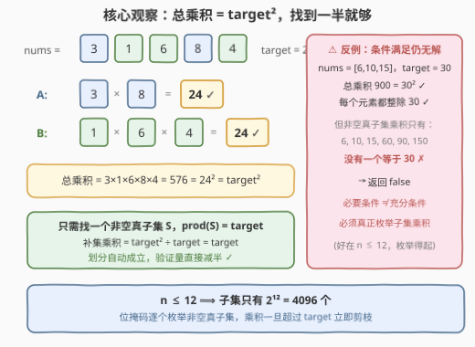
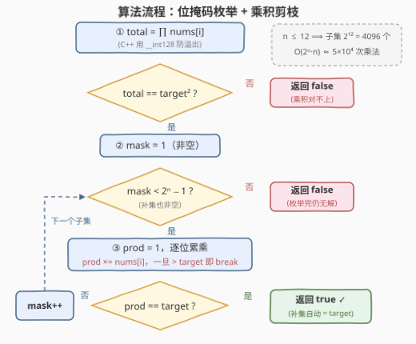

# 等积子集的划分方案

- **题目名称**：等积子集的划分方案
- **链接**：[3566. 等积子集的划分方案](https://leetcode.cn/problems/partition-array-into-two-equal-product-subsets/)
- **难度**：中等
- **标签**：位运算, 递归, 数组, 枚举

## 1. 题目概述

给定一个**正整数互不相同**的数组 `nums` 和一个整数 `target`，判断能否把 `nums` 划分成两个**非空**、**互不相交**的子集，使每个元素**恰好属于其中一个**子集，且**两个子集的元素乘积都等于 target**。存在这样的划分返回 `true`，否则返回 `false`。

**示例 1**：

```text
输入：nums = [3,1,6,8,4], target = 24
输出：true
解释：子集 [3,8] 与 [1,6,4] 的乘积均为 24。
```

**示例 2**：

```text
输入：nums = [2,5,3,7], target = 15
输出：false
解释：无法划分出两个乘积均为 15 的非空子集。
```

**约束条件**：

- $3 \le nums.length \le 12$
- $1 \le target \le 10^{15}$
- $1 \le nums[i] \le 100$，且所有元素**互不相同**

> 💡 **读题关键**：① 划分是「全覆盖」——每个元素必须落入某一边，不许剩下；② 两侧都必须**非空**；③ 数据范围两极分化：$n \le 12$ 小到「随便枚举」，而 $target \le 10^{15}$ 大到**平方会溢出 64 位整数**。本题的考点一半在枚举，一半在防溢出。

---

## 2. 解题思路

### 2.1 暴力思路：枚举每个元素的去向

每个元素要么进 A 边、要么进 B 边，共 $2^n$ 种分配方式；$n \le 12$ 时仅 $4096$ 种，逐一验证两侧乘积是否都为 `target`，复杂度 $O(2^n \cdot n)$ 完全可接受。

但直接实现有两个小坑：**A/B 对称导致重复计算**（枚举到 $S$ 和它的补集验的是同一个划分），以及**乘积极大**（最多 $100^{12} = 10^{24}$）需要大数或防溢出处理。下面用两个观察把验证量砍半、把溢出控制住。

### 2.2 核心观察：总乘积 = target²，找到一半就够



**观察一（必要条件，用于一票否决）**：若两个子集乘积都是 $target$，则全体乘积必为

$$\prod_{i} nums[i] = target \times target = target^2$$

若总乘积 $\ne target^2$，直接返回 `false`——示例 2 中 $2 \times 5 \times 3 \times 7 = 210 \ne 225$，第一关就被拦下。

**观察二（化归，验证量减半）**：在总乘积 $= target^2$ 的前提下，**只要找到一个非空真子集 $S$ 满足 $\prod_{x \in S} x = target$，其补集乘积必为 $target^2 \div target = target$**，自动合法。于是问题从「配对验证两侧」化归为「单侧找一个乘积恰为 $target$ 的子集」，天然不会把 $S$ 与补集重复计算。

> ⚠️ **必要条件 ≠ 充分条件**：`nums = [6,10,15], target = 30` 满足总乘积 $900 = 30^2$，且每个元素都整除 $30$，但它的 6 个非空真子集乘积只有 $6, 10, 15, 60, 90, 150$，没有一个等于 $30$，答案仍是 `false`。**光验条件不够，必须真枚举**——好在 $n \le 12$，枚举得起。

> ⚠️ **溢出坑（C++）**：$target \le 10^{15}$，则 $target^2 \le 10^{30}$，远超 `int64` 上限 $9.2 \times 10^{18}$；总乘积上界 $100^{12} = 10^{24}$ 同样超出。总乘积的累乘与比较用 `__int128`；而子集内累乘因「超过 $target$ 就剪枝」（见 2.3），`prod` 始终 $\le target \times 100 < 10^{17}$，`long long` 安全。

### 2.3 算法流程图



两个实现细节：

- **mask 范围 $[1,\ 2^n - 2]$**：`mask = 0` 对应空集（A 侧为空），`mask = 2^n - 1` 对应全集（B 侧为空），都违反「两个子集非空」，直接排除在枚举范围外。
- **剪枝 `prod > target` 即 break**：所有元素都是 $\ge 1$ 的正整数，**乘积单调不减**——一旦超过 $target$，继续乘剩下的元素（哪怕是 1）也不可能回到 $target$，立即放弃当前子集。

### 2.4 示例演算

**示例 1** `nums = [3,1,6,8,4], target = 24`：

- 第一步：总乘积 $3 \times 1 \times 6 \times 8 \times 4 = 576 = 24^2$ ✓ 通过必要条件；
- 第二步：枚举 mask，扫到子集 $\{3, 8\}$ 时 $prod = 3 \times 8 = 24 = target$ → 返回 `true`。补集 $\{1, 6, 4\}$ 的乘积 $= 576 \div 24 = 24$ ✓（无需再验）。

**反例** `nums = [6,10,15], target = 30`（第一步通过，第二步出局）：

| 非空真子集 | {6} | {10} | {15} | {6,10} | {6,15} | {10,15} |
|---|---|---|---|---|---|---|
| 乘积 | 6 | 10 | 15 | 60 | 90 | 150 |

没有任何乘积等于 $30$ → 返回 `false`。这正是 2.2 中「必须真枚举」的实证。

---

## 3. 参考代码

### C++

```cpp
class Solution {
  public:
    bool checkEqualPartitions(vector<int>& nums, long long target) {
        int n = nums.size();

        // 必要条件：总乘积 = target²。上界 100^12 = 1e24 超 int64，用 __int128
        __int128 total = 1;
        for (int x : nums) total *= x;
        if (total != (__int128)target * target) return false;

        int full = (1 << n) - 1;
        for (int mask = 1; mask < full; mask++) {   // [1, 2^n-2]：两侧都非空
            long long prod = 1;
            for (int i = 0; i < n; i++) {
                if (mask >> i & 1) {
                    prod *= nums[i];                // prod ≤ target·100 < 1e17，不溢出
                    if (prod > target) break;       // 正整数乘积单调不减，超过即弃
                }
            }
            if (prod == target) return true;        // 补集乘积 = total/target = target
        }
        return false;
    }
};
```

### Python

```python
class Solution:
    def checkEqualPartitions(self, nums: List[int], target: int) -> bool:
        n = len(nums)

        total = 1
        for x in nums:                              # Python 原生大数，无溢出之忧
            total *= x
        if total != target * target:                # 必要条件一票否决
            return False

        full = (1 << n) - 1
        for mask in range(1, full):                 # [1, 2^n-2]：两侧都非空
            prod = 1
            for i in range(n):
                if mask >> i & 1:
                    prod *= nums[i]
                    if prod > target:               # 超过 target 即剪枝
                        break
            if prod == target:                      # 补集乘积自动 = target
                return True
        return False
```

---

## 4. 复杂度分析

| 维度 | 复杂度 | 说明 |
|------|--------|------|
| 时间 | $O(2^n \cdot n)$ | $2^{12} \times 12 \approx 5 \times 10^4$ 次乘法；`prod > target` 剪枝与第一步否决让实际运行远快于上界 |
| 空间 | $O(1)$ | 仅若干标量（不计输入），子集由 `mask` 隐式表示 |

---

## 5. 扩展：递归写法与更大的 n

**递归枚举**（对应标签里的 Recursion）：把「元素进 A 还是进 B」写成 DFS，维护 $prod_A, prod_B$，任一侧超过 $target$ 立即回溯——与位掩码同构。$n \le 12$ 时两种写法皆可，位掩码版更短且无递归开销。

**若 $n$ 更大**（比如 $n \le 40$）：位掩码 $2^n$ 失效，思路转为**在 target 的因数上做 DP**。合法划分中每个元素必整除 $target$（否则它所在的子集乘积无法恰好等于 $target$），于是任意时刻 A 侧乘积只能是 $target$ 的因数。令 $f[i][d]$ 表示前 $i$ 个元素能否使 A 侧乘积恰为因数 $d$，转移为「第 $i$ 个进 A（$d \times nums[i]$ 仍整除 $target$）或进 B」，终态 $f[n][target]$。$10^{15}$ 以内的数因数个数至多数万，复杂度 $O(n \cdot D)$ 可行。子集和场景的同款「小枚举、大折半」思路见 1755 / 2035。

---

## 6. 面试要点

- **Q1：为什么只需验证一个子集，不用同时检查补集？**
  答：第一步已确保总乘积 $= target^2$。若子集 $S$ 乘积恰为 $target$，补集乘积 $= target^2 \div target = target$ 由除法自动成立。这既省了一半验证，也天然避免 $S$ 与补集的重复计数。
- **Q2：mask 为什么只枚举 $[1, 2^n - 2]$？**
  答：`mask = 0` 对应空集（A 侧空），`mask = 2^n - 1` 对应全集（B 侧空），都违反「两个子集非空」。枚举区间两端恰好排除这两种非法状态。
- **Q3：C++ 里哪些量会溢出？如何处理？**
  答：$target^2 \le 10^{30}$、总乘积 $\le 10^{24}$，都超 `int64`。总乘积用 `__int128` 累乘并比较；子集内 `prod` 因「超过 $target$ 即 break」被限制在 $target \times 100 < 10^{17}$，`long long` 安全。Python 原生大数无此问题。
- **Q4：剪枝「`prod > target` 即 break」为什么正确？**
  答：所有元素是 $\ge 1$ 的正整数，部分乘积单调不减。一旦超过 $target$，当前子集剩下的元素（哪怕全是 1）也不可能把乘积拉回 $target$，立即放弃当前 mask，不做无用功。
- **Q5：能否只判「总乘积 $= target^2$ 且每个元素整除 $target$」就返回？**
  答：不能。`[6,10,15], target = 30` 两条都满足，但所有非空真子集乘积 $\{6,10,15,60,90,150\}$ 均不含 $30$，答案为 `false`。必要条件只能用来剪枝加速，充分性必须靠枚举（或搜索）保证。

---

## 7. 同类练习题

- [78. 子集](https://leetcode.cn/problems/subsets/)：位掩码枚举子集的入门模板，本题逐 mask 累乘的基本功
- [416. 分割等和子集](https://leetcode.cn/problems/partition-equal-subset-sum/)：「分成两半、目标和相等」的求和版，$n$ 大时用 0-1 背包替代枚举
- [698. 划分为 K 个相等的子集](https://leetcode.cn/problems/partition-to-k-equal-sum-subsets/)：回溯 + 状态压缩记忆化，等和划分的进阶版
- [1755. 最接近目标值的子序列和](https://leetcode.cn/problems/closest-subsequence-sum/)：$n \le 40$ 时子集枚举改用折半枚举的代表作
- [2035. 将数组分成两个数组并最小化数组和的差](https://leetcode.cn/problems/partition-array-into-two-arrays-to-minimize-sum-difference/)：「均分两组」+ 折半枚举，与本题的划分结构同源
