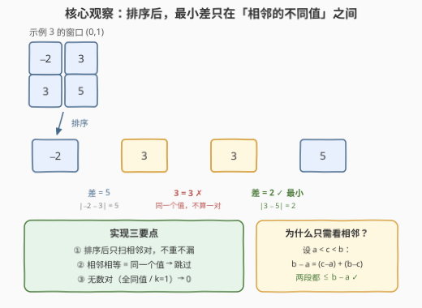
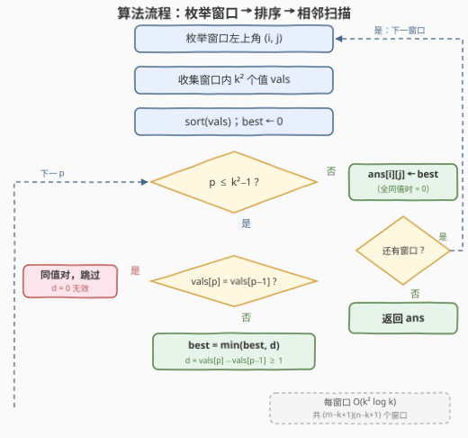

# LeetCode 子矩阵的最小绝对差 题解

## 1. 题目概述

- **标题 / 题号**：子矩阵的最小绝对差（#3567，medium）
- **链接**：https://leetcode.cn/problems/minimum-absolute-difference-in-sliding-submatrix/
- **难度**：中等
- **标签**：数组、矩阵、排序

**题意**：给你一个 $m \times n$ 的整数矩阵 `grid` 和一个整数 $k$。

对于 `grid` 中每个**连续的** $k \times k$ 子矩阵，计算其中**任意两个不同值**之间的**最小绝对差**。

返回大小为 $(m-k+1) \times (n-k+1)$ 的二维数组 `ans`，其中 `ans[i][j]` 表示以 `grid` 中坐标 $(i, j)$ 为左上角的子矩阵的最小绝对差。

> 注意：如果子矩阵中的所有元素都相同，则答案为 0。

**示例 1**：

```text
输入：grid = [[1,8],[3,-2]], k = 2
输出：[[2]]
解释：唯一的 k×k 子矩阵 [[1,8],[3,-2]] 中不同值为 [1,8,3,-2]，最小绝对差为 |1-3| = 2。
```

**示例 2**：

```text
输入：grid = [[3,-1]], k = 1
输出：[[0,0]]
解释：每个 1×1 子矩阵只有一个值，不存在不同的值对，答案为 0。
```

**示例 3**：

```text
输入：grid = [[1,-2,3],[2,3,5]], k = 2
输出：[[1,2]]
解释：窗口 (0,0) 中不同值 {1,-2,2,3} 的最小差为 |1-2|=1；
窗口 (0,1) 中两个 3 是同一个值、不算一对，最小差为 |3-5|=2。
```

**约束**：

- $1 \le m = grid.length \le 30$
- $1 \le n = grid[i].length \le 30$
- $-10^5 \le grid[i][j] \le 10^5$
- $1 \le k \le \min(m, n)$

> 💡 **读题关键**：① 「不同值」比较的是**值**而非**位置**——两个位置上的相同值差为 0 但**不合法**，切勿算进去；② 输出尺寸 $(m-k+1) \times (n-k+1)$，每个格子恰好对应一个窗口左上角；③ 约束极小（$30 \times 30$），官方 hint 也直说暴力枚举子矩阵即可，真正考察的是「排序判相邻 + 同值跳过」的实现细节。

## 2. 解题思路

### 2.1 暴力思路：枚举全部数对

枚举每个窗口左上角 $(i, j)$（共 $(m-k+1)(n-k+1)$ 个），窗口内 $k^2$ 个值两两配对，过滤掉值相同的对后取最小绝对差。单窗口 $O(k^4)$，本题数据下也能过，但配对时容易把「同值对」误算成差 0，且有更干净的做法。

### 2.2 核心观察：排序后，最小差只在「相邻的不同值」之间



把窗口内 $k^2$ 个值**排序**后，任意两个不同值的最小绝对差，一定出现在排序后**相邻**的两个**不同**值之间：

> **证明（反证）**：设最小差来自非相邻对 $a < b$，则排序意义上 $a$、$b$ 之间必夹着某个值 $c$（$a < c < b$，与两者值不同）。于是 $\min(c-a,\ b-c) \le b-a$，即存在一个**更小或相等**的相邻差——与「最小差来自非相邻对」矛盾。

于是单窗口的流程坍缩为：**收集 → 排序 → 扫一遍相邻对**，复杂度 $O(k^2 \log k)$。实现上必须处理好两个坑：

1. **相邻相等 ≠ 数对**：排序后挨着的两个相等值是**同一个值**，差 0 无效，必须跳过。示例 3 的窗口 (0,1) 就是现成反例：排序后 `[-2, 3, 3, 5]`，两个 3 不算一对，答案 2；若误算同值对会得出 0。
2. **全同值 / $k=1$**：窗口没有合法数对时答案为 0。由于值为整数且数对的两个值不同，合法差恒 $\ge 1$，所以 `best` 初始化为 0 可以**兼作「无数对」哨兵**——扫描结束仍为 0 就输出 0，与题意「全相同输出 0」无缝衔接。

### 2.3 算法流程图



### 2.4 示例演算

以示例 3 的两个窗口为例（$k = 2$，每窗口 4 个值）：

| 窗口 | 收集的值 | 排序后 | 相邻对（同值跳过） | 结果 |
|------|----------|--------|--------------------|------|
| (0,0) | 1, −2, 2, 3 | −2, 1, 2, 3 | 1−(−2)=3，**2−1=1**，3−2=1 | **1** |
| (0,1) | −2, 3, 3, 5 | −2, 3, 3, 5 | 3−(−2)=5，~~3−3 同值跳过~~，**5−3=2** | **2** |

窗口 (0,1) 若忘记跳过同值对，会错误地输出 0。

## 3. 参考代码

### C++

```cpp
class Solution {
  public:
    vector<vector<int>> minAbsDiff(vector<vector<int>>& grid, int k) {
        int m = grid.size(), n = grid[0].size();
        int R = m - k + 1, C = n - k + 1;
        vector<vector<int>> ans(R, vector<int>(C, 0));
        vector<int> vals;
        vals.reserve(k * k);
        for (int i = 0; i < R; ++i) {
            for (int j = 0; j < C; ++j) {
                vals.clear();
                for (int x = i; x < i + k; ++x)
                    for (int y = j; y < j + k; ++y)
                        vals.push_back(grid[x][y]);
                sort(vals.begin(), vals.end());
                int best = 0;               // 0 兼作「无数对」哨兵：合法差恒 >= 1
                for (int p = 1; p < (int)vals.size(); ++p) {
                    int d = vals[p] - vals[p - 1];
                    if (d != 0 && (best == 0 || d < best)) best = d;
                }
                ans[i][j] = best;
            }
        }
        return ans;
    }
};
```

### Python

```python
class Solution:
    def minAbsDiff(self, grid: List[List[int]], k: int) -> List[List[int]]:
        m, n = len(grid), len(grid[0])
        R, C = m - k + 1, n - k + 1
        ans = [[0] * C for _ in range(R)]
        for i in range(R):
            for j in range(C):
                vals = sorted(grid[x][y]
                              for x in range(i, i + k)
                              for y in range(j, j + k))
                ans[i][j] = min((b - a for a, b in zip(vals, vals[1:]) if b > a),
                                default=0)
        return ans
```

`min(..., default=0)`：生成器为空（全同值或 $k=1$）时返回 0，与题意天然一致。

## 4. 复杂度分析

| 维度 | 复杂度 | 说明 |
|------|--------|------|
| 时间复杂度 | $O\big((m{-}k{+}1)(n{-}k{+}1) \cdot k^2 \log k\big)$ | 每个窗口收集 $k^2$ 个值并排序；$m = n = 30$ 时最坏约 $5 \times 10^5$ 次基本操作 |
| 空间复杂度 | $O(k^2)$ | 排序用的临时数组（不计输出矩阵） |

## 5. 扩展：数据范围放大怎么办

若 $m, n$ 放大到 $10^5$ 级别，逐窗口重收集重排序不可行，可改**增量滑动维护**：

- 窗口向右滑动一格时，只有一列（$k$ 个值）离开、一列（$k$ 个值）进入；
- 用**有序多重集合**（C++ `multiset` / Python `SortedList`）维护当前窗口的全部**不同值**，再用一个**小根堆维护相邻差**（懒删除）：插入 $v$ 时找到前驱 $a$、后继 $b$，删去差 $b - a$、加入差 $v - a$ 与 $b - v$；删除 $v$ 时对称修复。堆顶即为当前答案，0 表示无数对；
- 每次滑动 $O(k \log k)$，整体 $O(m \cdot n \cdot k \log k)$，比逐窗排序省一个 $k$ 因子。

另一条路：值域只有 $2 \times 10^5 + 1$ 种，可按**值分桶计数**，窗口滑动时增删计数、查询最近的两个非空桶——与 [220. 存在重复元素 III](https://leetcode.cn/problems/contains-duplicate-iii/) 的桶思路同源。本题约束极小，这些优化均不必要，面试中口头提一句即可。

## 6. 面试要点

- **Q1：为什么排序后只扫相邻对就能保证不漏最优？**
  答：反证。若最优对 $a < b$ 非相邻，中间必夹值 $c$，则 $\min(c-a,\ b-c) \le b-a$，存在更小或相等的相邻差，矛盾。故最优差必在相邻的不同值之间取得。
- **Q2：「任意两个不同值」怎么落地？为什么相邻相等对不能算？**
  答：排序后若 $vals[p] = vals[p-1]$，说明两位置是**同一个值**，差 0 不合法，跳过。示例 3 窗口 (0,1) 的 `[-2,3,3,5]`：误算 (3,3) 会得 0，正确答案是 2。
- **Q3：为什么 `best` 初始化为 0 可以兼作哨兵？**
  答：合法数对的两个值不同且均为整数，差恒 $\ge 1$；若扫描结束 `best` 仍为 0，说明窗口内无合法数对（全同值或 $k=1$），而题目恰好规定此时输出 0，语义无缝衔接。
- **Q4：输出矩阵的尺寸与下标语义是什么？**
  答：$(m-k+1) \times (n-k+1)$；`ans[i][j]` 对应左上角 $(i,j)$ 的窗口，外层 $i \in [0, m-k]$、$j \in [0, n-k]$，内层访问 `grid[x][y]` 的边界为 $x < i+k$、$y < j+k$。
- **Q5：本题还有更快的做法吗？**
  答：当前约束下「收集 + 排序 + 相邻扫描」即最优解，不必过度设计。若数据范围放大，可滑动增量维护有序集合 + 相邻差堆（见第 5 节），复杂度从每窗 $O(k^2 \log k)$ 降为每步滑动 $O(k \log k)$。

## 同类练习题

| # | 题目 | 与本题的关联 |
|---|------|-------------|
| 1200 | [最小绝对差](https://leetcode.cn/problems/minimum-absolute-difference/) | 整条数组排序后扫相邻差，即本题「窗口内子步骤」的一维原型 |
| 1074 | [元素和为目标值的子矩阵数量](https://leetcode.cn/problems/number-of-submatrices-that-sum-to-target/) | 同为「枚举全部子矩阵」框架，练习二维窗口的组织方式 |
| 363 | [矩形区域不超过 K 的最大数值和](https://leetcode.cn/problems/max-sum-of-rectangle-no-larger-than-k/) | 子矩阵枚举 + 有序集合维护窗口信息，本题第 5 节扩展的进阶实战 |
| 2616 | [最小化数对的最大差值](https://leetcode.cn/problems/minimize-the-maximum-difference-of-pairs/) | 排序 + 数对差的贪心 / 二分，深化「差值与排序序」的关系 |
| 220 | [存在重复元素 III](https://leetcode.cn/problems/contains-duplicate-iii/) | 滑动窗口 + 桶 / 有序集合维护「最接近值」，即本题扩展篇的桶思路原型 |
